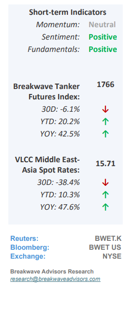
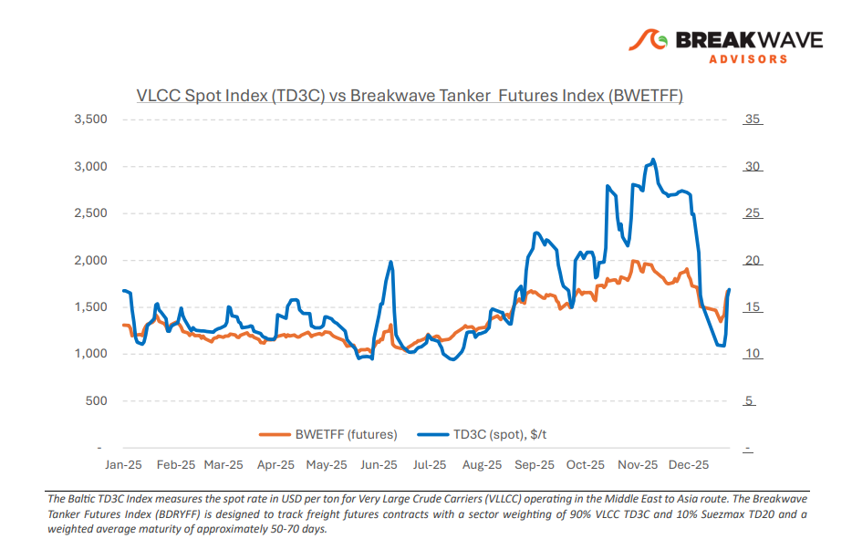
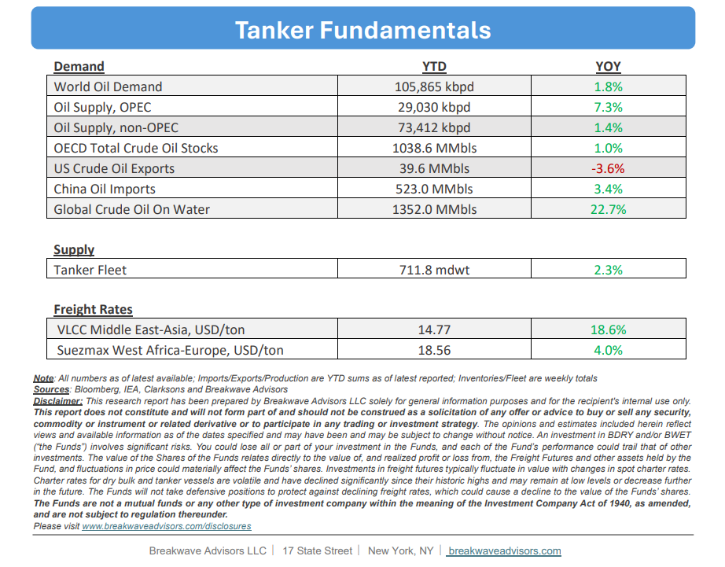

# Breakwave Bi-Weekly Tanker Report - January 13, 2026

**Date:** January 13, 2026  
**Publisher:** Breakwave Advisors | **Category:** Market Insights  
**Original URL:** [https://www.breakwaveadvisors.com/insights/1132026wetreport55447kji](https://www.breakwaveadvisors.com/insights/1132026wetreport55447kji)  

---

•**VLCC Futures Curve in Contango as Optimism Returns**– Following the stabilization observed in mid-December, the Very Large Crude Carrier (VLCC) spot market has entered the new year with a**cautious outlook**, as charterers leverage persistent oversupply and limited forward-coverage urgency to pressure freight rates. While geopolitical volatility in regions like Iran and Venezuela has buoyed optimism in the freight futures market, the immediate impact on VLCC demand remains constrained; specifically, the shift of**Venezuelan exports**toward the U.S. favors**Aframax and Suezmax**vessels, thereby reducing overall tonne-mile intensity. Consequently, a meaningful and sustained recovery in VLCC fundamentals remains contingent upon Asian refiners substituting these relatively small volumes with long-haul Middle Eastern crude, as current market dynamics continue to be defined by ample tonnage availability rather than structural demand growth.**Spot rates remain elevated but below the futures curve**where geopolitical uncertainty and hedging dynamics have now a larger influence versus the real spot market.

> **Figure 1: Στιγμιότυπο Οθόνης 2026 01 13 104706**  
> [Local Asset](file:///C:/Users/Dell/Github/Shipping/corpus/03-breakwave/insights/2026/assets/2026-01-13_1132026wetreport55447kji_img_cea3cf84ceb9ceb3cebcceb9cf8ccf84cf85_9484f304c670.png)

•**Oil Prices React to Geopolitical Uncertainty as Iran Takes Center Stage**– While a bearish sentiment regarding oil prices remains prevalent, the market remains**vulnerable**to unforeseen**geopolitical disruptions**, as demonstrated by last week’s developments. The rapidly evolving situation in Iran prompted traders to**cover opportunistic short positions**, driving prices to one-month highs. However, in the absence of tangible tightening in the physical market, sustained gains will likely require more aggressive supply interruptions, which have yet to materialize. Despite recent price action, the**underlying market appears oversupplied.**Without China’s significant strategic stockpiling efforts, there is little evidence of a true supply-demand equilibrium. Furthermore,**transitioning inventory**from production to onshore or floating storage**does not constitute authentic demand**; consequently, the market balance remains loose, posing a persistent headwind for prices. Ultimately, China continues to be the primary influence on global oil pricing, particularly as OPEC+ maintains its strategic focus on market share over price support.

•**Our Long-term View**– The tanker market is recovering from a long period of staggered rates as the growth in new vessel supply shrinks while oil demand remains elevated in line with the global economy. A historically low orderbook combined with favorable shifting trade patterns should continue to support increased spot rate volatility, which combined with the ongoing geopolitical turmoil, should sustain freight rates in the medium to long term.

> **Figure 2: Στιγμιότυπο Οθόνης 2026 01 13 104722**  
> [Local Asset](file:///C:/Users/Dell/Github/Shipping/corpus/03-breakwave/insights/2026/assets/2026-01-13_1132026wetreport55447kji_img_cea3cf84ceb9ceb3cebcceb9cf8ccf84cf85_51bb2bb4fe11.png)

> **Figure 3: Στιγμιότυπο Οθόνης 2026 01 13 104736**  
> [Local Asset](file:///C:/Users/Dell/Github/Shipping/corpus/03-breakwave/insights/2026/assets/2026-01-13_1132026wetreport55447kji_img_cea3cf84ceb9ceb3cebcceb9cf8ccf84cf85_18f352aca1c1.png)

### Subscribe:
