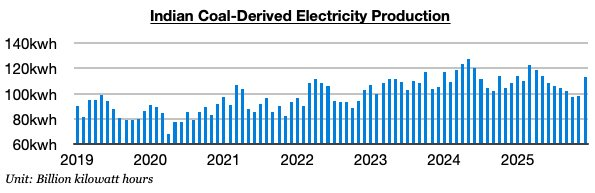

# Significant Sudden Change in India

**Date:** January 14, 2026  
**Publisher:** Breakwave Advisors | **Category:** Market Insights  
**Original URL:** [https://www.breakwaveadvisors.com/insights/2026/1/14/significant-sudden-change-in-india](https://www.breakwaveadvisors.com/insights/2026/1/14/significant-sudden-change-in-india)  

---

*By*[*Jeffrey Landsberg*](https://www.linkedin.com/in/jeffrey-landsberg-70ab957/)

With the new year now here, it remains encouraging — and not at all surprising to us — that the dry bulk market finds itself on solid footing (it also is not at all surprising that overall rates are on a seasonal decline). Capesize rates have begun this week up year-on-year by 148%, panamax rates up by 36%, supramax rates up by 16%, and handysize rates up by 18%. Overall, dry bulk fleet growth remains moderate and manageable.

The biggest change globally at the moment for the dry bulk market is that strong growth in coal-derived electricity generation has suddenly returned in India. As we discussed for our clients in Commodore Research's most recent Weekly Executive Report, the 5% year-on-year growth seen in India's coal-derived electricity generation last month has marked a drastic change from the 6% year-on-year contraction seen in November and 14% year-on-year contraction seen in October. Before last month, coal-derived generation in India had contracted on a year-on-year basis during seven of the prior ten months, which marked the**only time this decade**that such an event occurred. Now, though, significant growth has returned again. If this growth is able to continue, it would go a long way towards further supporting the dry bulk market. This is an area we will be monitoring very closely for our clients and will be continuing to publish updates. As we stressed in Commodore Research's Weekly Executive Reports reports last year, India’s coal-derived electricity contraction and coal import contraction was one of the dry bulk market’s only major sustained headwinds last year.

> **Figure 1: Chart**  
> [Local Asset](file:///C:/Users/Dell/Github/Shipping/corpus/03-breakwave/insights/2026/assets/2026-01-14_significant-sudden-change-in-india_img_chart_db94fd2780ba.jpg)

---

**Tags:** Drybulk, Coal, Capesizes  
