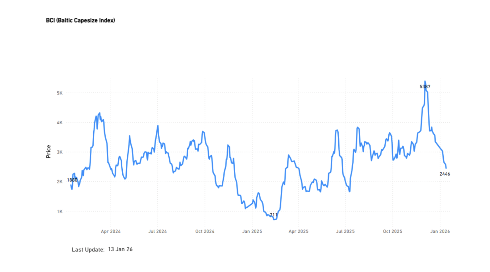
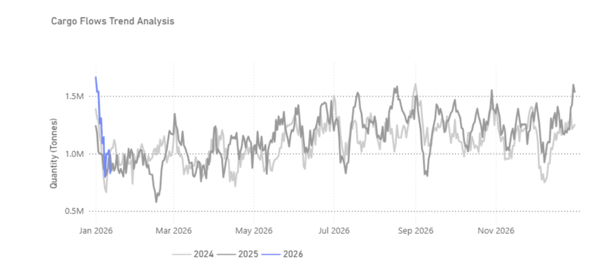
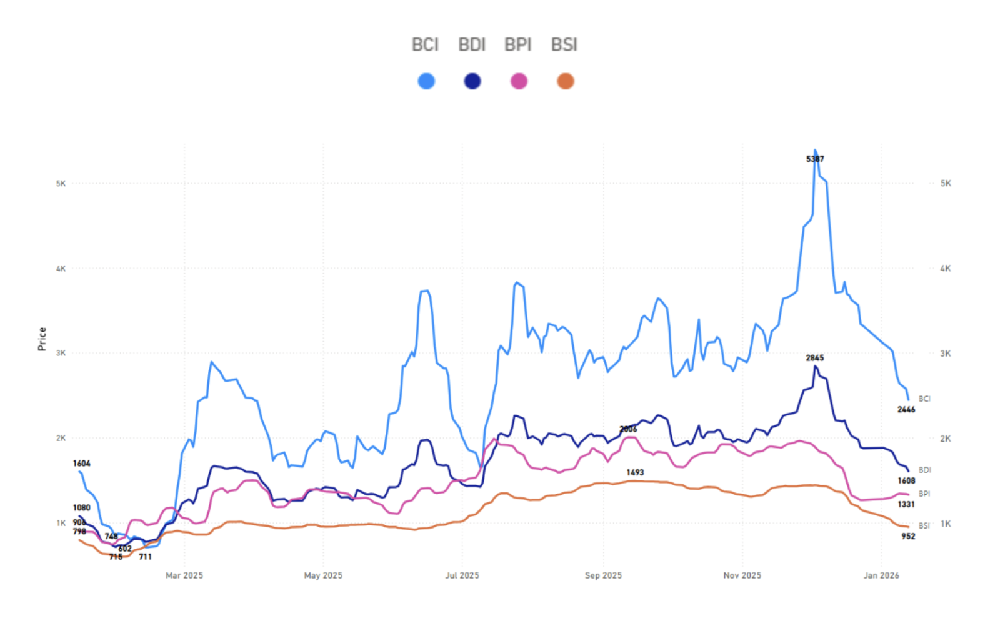
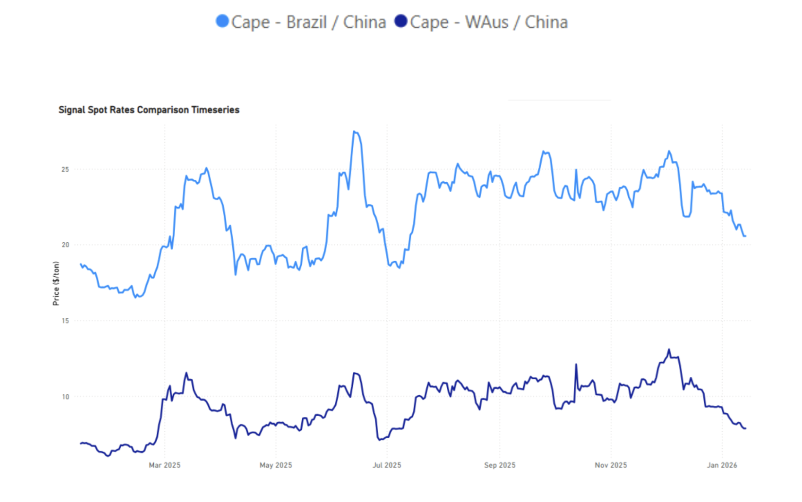
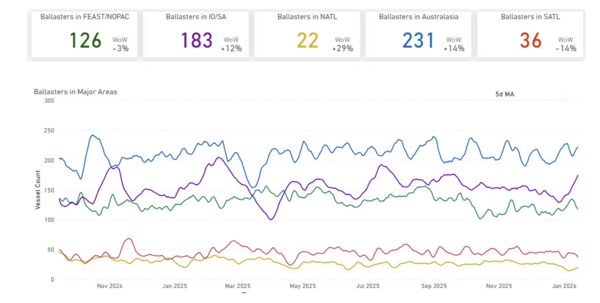

# BDI Softens at Year Start as Capesize Weakness Persists

**Date:** January 15, 2026  
**Publisher:** Breakwave Advisors | **Category:** Market Insights  
**Original URL:** [https://www.breakwaveadvisors.com/insights/2026/1/15/bdi-softens-at-year-start-as-capesize-weakness-persists](https://www.breakwaveadvisors.com/insights/2026/1/15/bdi-softens-at-year-start-as-capesize-weakness-persists)  

---

This weekly market monitor provides an analysis of the latest freight market developments. The focus is on Capesize losses, the subsequent downward adjustments in iron ore flow volumes, and the latest supply signals as indicated by ballasters.

**Chart of the Week| Daily**[**Freight**](https://go.signalocean.com/e/983831/dry-dynamic-market-prices-dry/2rrq4k/568934524/h/1BrB9nWGcHf2Hw_CjRXlPZ8V0fDWdccwSmUW-RZVnjs)**Assessments: BCI**

Sharp correction since the December peak highlights near-term pressure, though levels remain above last year (+51%)

> **Figure 1: Market Chart 1**  
> **Interactive Data & Source:** [Signal Ocean Platform](https://go.signalocean.com/e/983831/dry-dynamic-drybulkflows/2rrq4n/568934524/h/1BrB9nWGcHf2Hw_CjRXlPZ8V0fDWdccwSmUW-RZVnjs) | [Local Asset](file:///C:/Users/Dell/Github/Shipping/corpus/03-breakwave/insights/2026/assets/2026-01-15_bdi-softens-at-year-start-as-capesize-weakness-persists_img_unnamed_2435c1c78d53.png)

### Key Takeaways

- The Baltic Dry Index opens the year on weaker momentum, driven primarily by sustained pressure in the Capesize freight market.
- A pronounced correction has unfolded since the early-December peak, although losses remain contained on a year-on-year basis.
- Market sentiment is turning more supportive as expectations of Chinese policy support lift iron ore prices and improve forward demand signals.

### Market Overview

The start of the year has seen the BDI come under renewed pressure, with Capesize rates continuing to lead the downside. Following a strong rally into early December, the segment has experienced a noticeable downward correction, reflecting softer spot-fixing activity, seasonal demand headwinds, and a temporary slowdown in iron ore cargo flows.

Despite the recent weakness, the market pulse remains stronger than it was a year ago. Looking ahead, sentiment is expected to improve gradually. Iron ore prices have strengthened in recent sessions amid growing expectations that the Chinese cabinet will announce a new package of stimulus measures aimed at supporting economic growth and infrastructure activity. If confirmed, such policy support could help strengthen Capesize earnings and provide a near-term floor for the BDI as the quarter progresses.

**Brazilian Iron Ore Shipments |**Early-Year[Flows](https://go.signalocean.com/e/983831/dry-dynamic-drybulkflows/2rrq4n/568934524/h/1BrB9nWGcHf2Hw_CjRXlPZ8V0fDWdccwSmUW-RZVnjs)Turning Lower

As of 12 January, Brazilian iron ore shipments on a 7-day moving-average basis are estimated to be ~2.6% lower year-on-year versus the same early-January period in 2024. The latest 7-day average also suggests early-2026 shipments are running ~16% below early-2025 levels and ~18% below early-2024, based on Signal Ocean data.

> **Figure 2: Market Chart 2**  
> **Interactive Data & Source:** [Signal Ocean Dynamic Market Prices](https://go.signalocean.com/e/983831/dry-dynamic-market-prices-dry/2rrq4k/568934524/h/1BrB9nWGcHf2Hw_CjRXlPZ8V0fDWdccwSmUW-RZVnjs) | [Local Asset](file:///C:/Users/Dell/Github/Shipping/corpus/03-breakwave/insights/2026/assets/2026-01-15_bdi-softens-at-year-start-as-capesize-weakness-persists_img_unnamed28129_64729ed5e2bf.png)

### Freight Market Weaker

Market price trends depicted are based on Signal Ocean Assessments. For real-time updates and historical comparisons, access our Freight Market Analytics dashboard here:[Signal Ocean Freight Market Analytics](https://go.signalocean.com/e/983831/dry-dynamic-market-prices-dry/2rrq4k/568934524/h/1BrB9nWGcHf2Hw_CjRXlPZ8V0fDWdccwSmUW-RZVnjs).

[Comparison](https://go.signalocean.com/e/983831/dry-dynamic-market-prices-dry/2rrq4k/568934524/h/1BrB9nWGcHf2Hw_CjRXlPZ8V0fDWdccwSmUW-RZVnjs)

> **Figure 3: Baltic Rates**  
> **Interactive Data & Source:** [Signal Ocean Platform](https://go.signalocean.com/e/983831/ic-capes-insights-downloadable/2rrq4r/568934524/h/1BrB9nWGcHf2Hw_CjRXlPZ8V0fDWdccwSmUW-RZVnjs) | [Local Asset](file:///C:/Users/Dell/Github/Shipping/corpus/03-breakwave/insights/2026/assets/2026-01-15_bdi-softens-at-year-start-as-capesize-weakness-persists_img_unnamed28229_1369c9df4790.png)

- The recent drop in the BDI is led by a sharp correction in Capesize (BCI), whereas Panamax, Supramax, and Handysize markets have shown comparatively milder declines.

> **Figure 4: Capesize | Weaker**  
> **Interactive Data & Source:** [Signal Ocean Platform](https://go.signalocean.com/e/983831/ic-capes-insights-downloadable/2rrq4r/568934524/h/1BrB9nWGcHf2Hw_CjRXlPZ8V0fDWdccwSmUW-RZVnjs) | [Local Asset](file:///C:/Users/Dell/Github/Shipping/corpus/03-breakwave/insights/2026/assets/2026-01-15_bdi-softens-at-year-start-as-capesize-weakness-persists_img_unnamed28329_ad5923a12961.png)

- Cape freight rates on the Brazil–China and WAus–China routes have trended lower since early December, following a clear summer peak reached mid-year. The continued easing into mid-January signals a soft start to the year, with rates losing momentum during the first month of 2026.

- This early-year weakness is not unexpected. Seasonal demand typically remains subdued ahead of the Lunar New Year, with stronger freight signals more likely to emerge toward the end of the holiday period and into late Q1. At the same time, Brazilian iron ore supply is already scheduled to ramp up, supporting expectations of firmer cargo volumes later in the quarter.
- Latest estimates for Brazilian iron ore production in Q1 also point to solid output levels, This soft start to the year occurs against a backdrop of record Brazilian iron ore exports in 2025, which grew about 7.1% y/y and surpassed 400 million tonnes for the first time, and production guidance for 2026 that remains robust, with leading miners projecting similar output bands to 2025. Vale expects iron ore production in 2026 to be in the range of 335–345 million tons, reflecting output continuity and industry capacity, even as some forecasts were revised downward.

### Ballasters Overview

> **Figure 5: Capesize| Vessel Count Grows in Io / Sa**  
> **Interactive Data & Source:** [Signal Ocean Platform](https://www.thesignalgroup.com/signal-ocean-platform) | [Local Asset](file:///C:/Users/Dell/Github/Shipping/corpus/03-breakwave/insights/2026/assets/2026-01-15_bdi-softens-at-year-start-as-capesize-weakness-persists_img_unnamed28429_e9a731696d19.png)

- Ballast counts are building most notably in IO/SA, which remains the largest accumulation area at 183 vessels (+12% WoW). The Pacific is also showing increased availability, led by Australasia at 231 vessels (+14% WoW). In the Atlantic, NATL rose sharply in percentage terms (+29% WoW), while SATL declined to 36 vessels (-14% WoW). FEAST/NOPAC eased slightly to 126 vessels (-3% WoW).​​​​​​

### Iron Ore Macro & Supply-Demand Update

### China – Demand-Side Signals

- Chinese steel mills increased short-term procurement, but buying behavior remains largely hand-to-mouth, reflecting weak confidence in underlying steel demand.
- Blast furnace utilisation has improved marginally, though construction activity remains subdued, limiting upside to steel demand.
- Port iron ore inventories have declined modestly but remain at historically comfortable levels.

### Miners & Supply News

- Rio Tinto: Pilbara iron ore shipments have continued steadily, with no material supply disruptions reported.
- BHP: Australian iron ore exports have continued normally, supported by early-year Chinese buying interest.

### India

- NMDC announced January pricing adjustments reflecting domestic market conditions rather than changes in seaborne trade.
- In India’s Goa region, iron ore auction delays have again been reported, constraining local supply but with no material impact on the global market.

Data Source:[Signal Ocean Platform](https://www.thesignalgroup.com/signal-ocean-platform)

---

**Tags:** Ironore, Drybulk, Markets  
