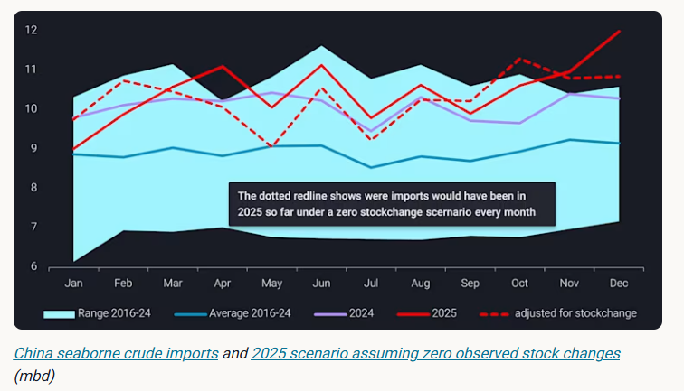
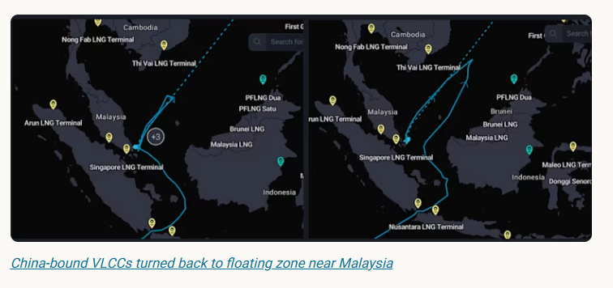
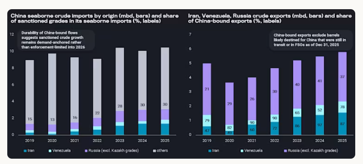

# China’s role as a pressure valve in sanctioned crude market

**Date:** January 15, 2026  
**Publisher:** Breakwave Advisors | **Category:** Market Insights  
**Original URL:** [https://www.breakwaveadvisors.com/insights/2026/1/15/chinas-role-as-a-pressure-valve-in-sanctioned-crude-market](https://www.breakwaveadvisors.com/insights/2026/1/15/chinas-role-as-a-pressure-valve-in-sanctioned-crude-market)  

---

China released a new batch of 2026 crude import quotas — what does it mean for the sanctioned crude market?

*By*[*Emma Li*](https://www.linkedin.com/in/emma-li-73003443/)

## China’s Seaborne Crude Imports Breach 12mbd for the First Time

China’s seaborne crude imports climbed to 12mbd in December 2025, marking a new record despite a not-fully-recovered domestic economy. More than 35mb (or ~1.1 mbd) of these arrivals flowed into onshore crude inventories, leaving adjusted refinery intake broadly flat month on month.

> **Figure 1: Στιγμιότυπο Οθόνης 2026 01 15 184200**  
> **Interactive Data & Source:** [Vortexa](https://www.vortexa.com//oil-gas-data-traders-analysts-data-scientists?gclid=Cj0KCQjw8_qRBhCXARIsAE2AtRZKOvMnbilZ_6_91d7huSFFy71pWLrnPwGwOHVzXsmsG-1a1mZnQw8aAt89EALw_wcB&hsa_acc=1782073842&hsa_ad=548425387665&hsa_cam=14746637662&hsa_grp=125038601902&hsa_kw=&hsa_mt=&hsa_net=adwords&hsa_src=g&hsa_tgt=dsa-1431852288425&hsa_ver=3&utm_campaign=%5BCD%5D%20-%20DSA%20-%20EMEA&utm_medium=cpc&utm_medium=ppc&utm_source=google&utm_source=adwords&utm_term=) | [Local Asset](file:///C:/Users/Dell/Github/Shipping/corpus/03-breakwave/insights/2026/assets/2026-01-15_chinas-role-as-a-pressure-valve-in-sanctioned-crude-market_img_cea3cf84ceb9ceb3cebcceb9cf8ccf84cf85_da4ffbcedccb.png)

While over 12mb of stockbuilds during December occurred in Guangdong, primarily at state-owned storage facilities linked to Sinopec Maoming and PetroChina Jieyang refineries, nearly 15mb was accumulated in Shandong. This aligns with record-high sanctioned crude imports into Shandong during November-December.

In November, China granted over 7mt of 2026 crude import quotas for use before end-2025, allowing teapot refiners to maintain strong operating rates. This came as refining margins improved sharply, driven by a collapse in prices for their key sanctioned feedstocks.

Delivered-to-Shandong differentials for Russian crude grades fell to their lowest levels since February 2023, as other Asian buyers either halted or markedly reduced purchases. As a result, China’s seaborne Russian crude imports surged above 1.5mbd in December, compared with an average of ~1.2mbd over the first eleven months of 2025.

The influx of discounted Russian barrels has crowded out competing Iranian crude, with imports slipping below 1.3mbd in December. That said, steeper Iranian discounts, tracking Russian price weakness, are likely to secure Iranian grades a continued foothold in the teapot market in the coming months.

Meanwhile, China has accelerated the discharge of Venezuelan barrels since November amid rising risks of supply disruption. November imports surged to a record ~660kbd, and December arrivals remained elevated.

However, the discharge rate has slowed since December, reflecting storage constraints for high-viscosity Venezuelan grades, particularly in Shandong, compounded by seasonally weak winter demand.

> **Figure 2: Στιγμιότυπο Οθόνης 2026 01 15 184256**  
> **Interactive Data & Source:** [Vortexa](https://www.vortexa.com//oil-gas-data-traders-analysts-data-scientists?gclid=Cj0KCQjw8_qRBhCXARIsAE2AtRZKOvMnbilZ_6_91d7huSFFy71pWLrnPwGwOHVzXsmsG-1a1mZnQw8aAt89EALw_wcB&hsa_acc=1782073842&hsa_ad=548425387665&hsa_cam=14746637662&hsa_grp=125038601902&hsa_kw=&hsa_mt=&hsa_net=adwords&hsa_src=g&hsa_tgt=dsa-1431852288425&hsa_ver=3&utm_campaign=%5BCD%5D%20-%20DSA%20-%20EMEA&utm_medium=cpc&utm_medium=ppc&utm_source=google&utm_source=adwords&utm_term=) | [Local Asset](file:///C:/Users/Dell/Github/Shipping/corpus/03-breakwave/insights/2026/assets/2026-01-15_chinas-role-as-a-pressure-valve-in-sanctioned-crude-market_img_cea3cf84ceb9ceb3cebcceb9cf8ccf84cf85_6b5246741741.png)

## Elastic Demand Meets Structural Constraints in China

China has emerged as the key destination for sanctioned crude in recent years, absorbing around 55% of global seaborne sanctioned exports since 2023.

> **Figure 3: Στιγμιότυπο Οθόνης 2026 01 15 184333**  
> **Interactive Data & Source:** [Vortexa](https://www.vortexa.com//oil-gas-data-traders-analysts-data-scientists?gclid=Cj0KCQjw8_qRBhCXARIsAE2AtRZKOvMnbilZ_6_91d7huSFFy71pWLrnPwGwOHVzXsmsG-1a1mZnQw8aAt89EALw_wcB&hsa_acc=1782073842&hsa_ad=548425387665&hsa_cam=14746637662&hsa_grp=125038601902&hsa_kw=&hsa_mt=&hsa_net=adwords&hsa_src=g&hsa_tgt=dsa-1431852288425&hsa_ver=3&utm_campaign=%5BCD%5D%20-%20DSA%20-%20EMEA&utm_medium=cpc&utm_medium=ppc&utm_source=google&utm_source=adwords&utm_term=) | [Local Asset](file:///C:/Users/Dell/Github/Shipping/corpus/03-breakwave/insights/2026/assets/2026-01-15_chinas-role-as-a-pressure-valve-in-sanctioned-crude-market_img_cea3cf84ceb9ceb3cebcceb9cf8ccf84cf85_a799841333e0.png)

Its flexible feedstock slate and ample onshore storage capacity allow the country to absorb large volumes of deeply discounted barrels. However, several structural and policy constraints continue to shape how far Chinese refiners can extend this role.

State-owned refiners remain self-constrained in their exposure to sanctioned crude, with purchases in recent years largely limited to Russian barrels. With near-term sanctions relief for Iran appearing unlikely, Iranian crude is expected to remain outside the majors’ feedstock basket and excluded from China’s national reserve programme.

State refiners also largely halted Russian seaborne purchases in late 2025 following sanctions on Rosneft and Lukoil. That said, imports from Russia and Venezuela could resume if sanctions are eased or enforcement pressure relaxes.

In contrast, teapot refiners are the most aggressive buyers of deeply discounted sanctioned feedstocks, but their appetite is primarily constrained by crude import quotas set by the Ministry of Commerce.

China released fresh crude import quotas at the start of the year for use during 2026. Unlike 2025 — an unusual year when full-year allocations were issued upfront — refiners have so far received around 132mt across the first two batches, equivalent to ~70% of annual allowances, broadly in line with pre-2024 allocation patterns.

While a third batch of 2026 quotas is expected to cover the remaining ~30% gap, an early issuance of 2027 quotas is likely if refiners demonstrate strong quota utilisation throughout 2026, providing some buffering room within the currently tight quota system.

## Supplier Outlook and Substitution Risks

Despite being sanctioned, Yulong has been allocated 14mt of crude import quotas and is likely to receive additional volumes to better align with its 20 mtpa nameplate capacity. The refinery has now fully pivoted to Russian crude to sustain full runs, injecting at least ~250kbd of incremental Russian seaborne demand into Shandong since November 2025.

Meanwhile, three former Sinochem refineries—now privatised—are expected to complete a shift from mainstream grades to sanctioned feedstocks once they receive a combined ~12mt of quotas by end-January, further reinforcing Shandong’s role as the central balancing market for sanctioned crude.

While China’s imports of distillate-rich Iranian and Russian barrels are expected to remain firm, Venezuelan supply presents greater uncertainty. Chinese buyers — primarily private, bitumen-focused refiners — would need to seek alternative feedstocks if Venezuelan flows were redirected or disrupted.

Although refiners are not in a rush to place new deals for now, given sufficient Asia-bound Venezuelan cargoes on the water and onshore inventories covering teapot demand into Q2, they may increasingly turn to Iranian heavy grades and Russian residual barrels, or mainstream heavy crudes, such as Canadian TMX, where processing economics allow.

Data Source:[Vortexa](https://www.vortexa.com//oil-gas-data-traders-analysts-data-scientists?gclid=Cj0KCQjw8_qRBhCXARIsAE2AtRZKOvMnbilZ_6_91d7huSFFy71pWLrnPwGwOHVzXsmsG-1a1mZnQw8aAt89EALw_wcB&hsa_acc=1782073842&hsa_ad=548425387665&hsa_cam=14746637662&hsa_grp=125038601902&hsa_kw=&hsa_mt=&hsa_net=adwords&hsa_src=g&hsa_tgt=dsa-1431852288425&hsa_ver=3&utm_campaign=%5BCD%5D%20-%20DSA%20-%20EMEA&utm_medium=cpc&utm_medium=ppc&utm_source=google&utm_source=adwords&utm_term=)

---

**Tags:** Crude, Markets, Geopolitics  
