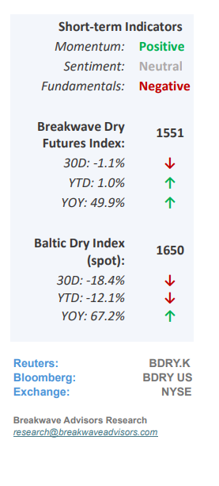
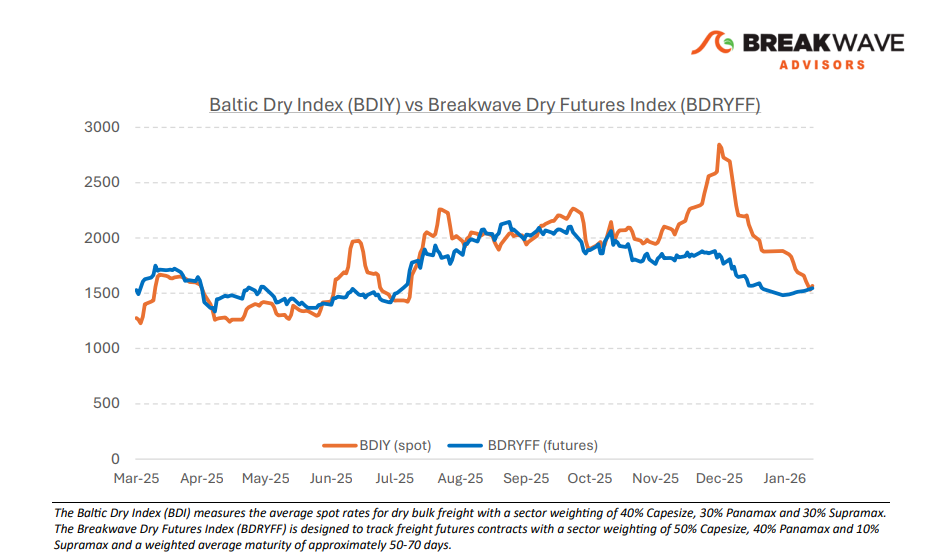
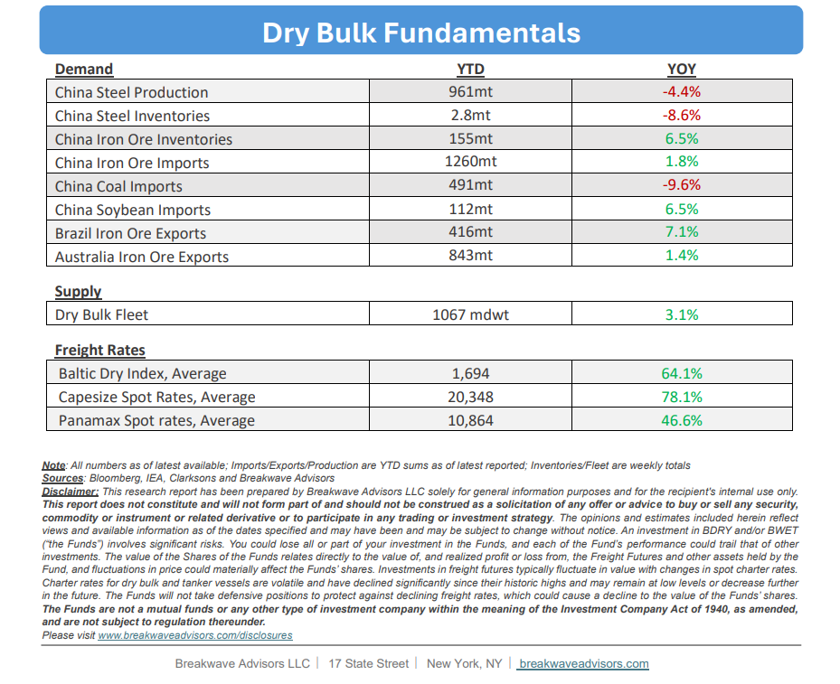

# Breakwave Bi-Weekly Dry Bulk Report - January 20, 2026

**Date:** January 20, 2026  
**Publisher:** Breakwave Advisors | **Category:** Market Insights  
**Original URL:** [https://www.breakwaveadvisors.com/insights/162026db-reportjukl47o85](https://www.breakwaveadvisors.com/insights/162026db-reportjukl47o85)  

---

•**Spot Rates Bounce as Capesize Market Finds Short-Term Bottom**– Following a dramatic**64% decline**in spot rates since early December, which saw the Capesize Index lose approximately 28,000 points, the market appears to have reached a tentative bottom. Although the futures market has**shifted into a rare contango**, with February contracts trading above spot prices, this outlook remains inherently risky, as the Index has**historically rarely bottomed in January**outside of exceptional years like 2024 when the Suez Canal disruption caused rates to spike. Furthermore, the February contract is currently trading at an unusual premium relative to spot, a**phenomenon not seen since 2016**when the index was significantly lower (~3,000) and inherited optionality would cause futures to trade at premium. We anticipate a more definitive market bottom in February at lower spot levels, with any subsequent recovery heavily contingent on the iron ore market and the resolution of weak demand and high portside inventories. Looking further ahead, 2026 Capesize futures indicate an average of 26,000, a projection that, if realized, would mark**the only time in 15 years,**excluding the unique post Covid volatility of 2021, that the Capesize market has**averaged above 23,000.**

> **Figure 1: Cea3cf84ceb9ceb3cebcceb9cf8ccf84cf85**  
> [Local Asset](file:///C:/Users/Dell/Github/Shipping/corpus/03-breakwave/insights/2026/assets/2026-01-20_162026db-reportjukl47o85_img_cea3cf84ceb9ceb3cebcceb9cf8ccf84cf85_0e463bcd3872.png)

•**Iron Ore Portside Inventories Approaching All-Time Highs**– China’s iron ore inventories are approaching a historic threshold, recently reaching approximately 155 million tons, which represents the**highest level for this time of the year**and sits**only ~5 million tons below the all-time record**established in 2018. This accumulation occurs as domestic steel production continues to weaken, with 2025 output dropping below the 1-billion-ton mark for the first time since 2019. Despite this decline in production,**China’s iron ore imports**reached 1,258 million tons last year,**a sharp 17% increase compared to 2019 volumes**. Given the lack of additional storage capacity and the persistence of iron ore prices above $100/ton, we anticipate a reduction in total imports this year. Yet, it remains unclear where such cuts will come from without a**meaningful decline in prices**which suggests that in the current market environment downside risks significantly outweigh potential rewards.

•**Our Long-term View**– The last few years have been characterized by increased geopolitical uncertainty. Going forward, we expect such events to continue to affect global trade and have a meaningful impact on effective vessel supply. Combined with the potential for a multi-year cyclical rebound in China’s economic activity following the recent economic turmoil, dry bulk shipping should experience higher volatility on top of a secular tightness driven by stable bulk commodity demand and a slower fleet growth owing to a relatively low orderbook.

> **Figure 2: Στιγμιότυπο Οθόνης 2026 01 20 090352**  
> [Local Asset](file:///C:/Users/Dell/Github/Shipping/corpus/03-breakwave/insights/2026/assets/2026-01-20_162026db-reportjukl47o85_img_cea3cf84ceb9ceb3cebcceb9cf8ccf84cf85_a7b781cea7e1.png)

> **Figure 3: Στιγμιότυπο Οθόνης 2026 01 20 131651**  
> [Local Asset](file:///C:/Users/Dell/Github/Shipping/corpus/03-breakwave/insights/2026/assets/2026-01-20_162026db-reportjukl47o85_img_cea3cf84ceb9ceb3cebcceb9cf8ccf84cf85_62f54607629f.png)

### Subscribe:
