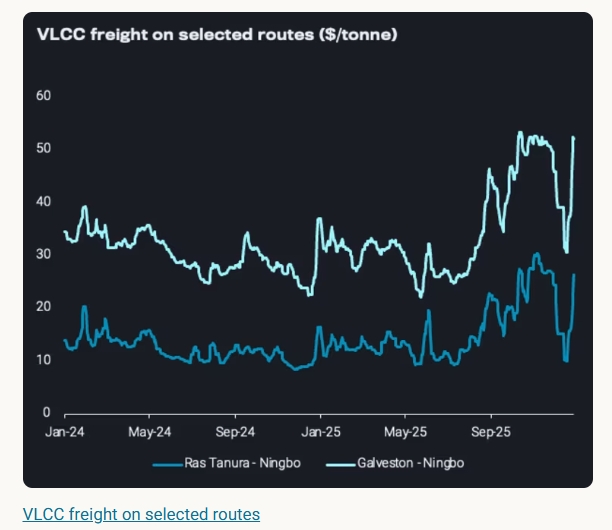
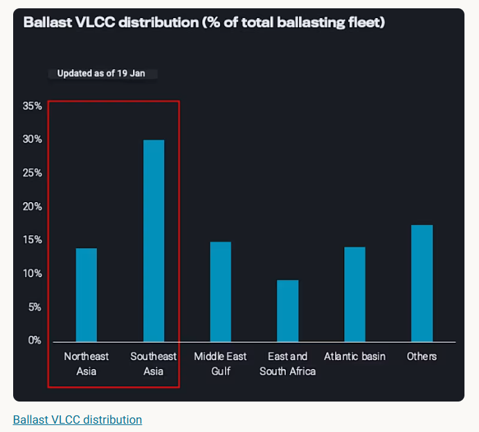

# VLCC freight surge: is the momentum short lived or sustained

**Date:** January 22, 2026  
**Publisher:** Breakwave Advisors | **Category:** Market Insights  
**Original URL:** [https://www.breakwaveadvisors.com/insights/2026/1/22/vlcc-freight-surge-is-the-momentum-short-lived-or-sustained](https://www.breakwaveadvisors.com/insights/2026/1/22/vlcc-freight-surge-is-the-momentum-short-lived-or-sustained)  

---

The VLCC market saw strong return in rates, but it's unlikely to be sustainable as the trade rebalances

By[Wanying Zhang](https://www.linkedin.com/in/wanying-zhang/)

The VLCC sector opened 2026 with a dramatic recovery in spot rates. Earnings are rapidly approaching the $100,000 per day benchmark, signaling a strong V-shaped bounce. The underlying market dynamics suggest this is more than a momentary post-holiday bounce.

> **Figure 1: Στιγμιότυπο Οθόνης 2026 01 22 134952**  
> **Interactive Data & Source:** [Analytics Vortexa](https://analytics.vortexa.com/Flows?dateRange=2024-01-01T00%3A00%3A00.000Z__2026-01-17T23%3A59%3A59.999Z&filtersEnabled=%5B%22p%22%2C%22o%22%2C%22d%22%2C%22d_r%22%2C%22v%22%2C%22intra_d%22%2C%22sts_o%22%2C%22c_o%22%2C%22w%22%5D&frequency=day&geoBreakdownOriginGlobal=shipping_region_v2&intraMovementDropdown=all&metric=bpd&movementEvent=cargo_on_water_state&page=Flows&products=%5B%2254af755a090118dcf9b0724c9a4e9f14745c26165385ffa7f1445bc768f06f11%22%5D&tabId=2f64f3da-736f-4499-8fcb-1c7434a015f3&timeSeriesChartView=seasonal&v=3) | [Local Asset](file:///C:/Users/Dell/Github/Shipping/corpus/03-breakwave/insights/2026/assets/2026-01-22_vlcc-freight-surge-is-the-momentum-short-lived-or-sustained_img_cea3cf84ceb9ceb3cebcceb9cf8ccf84cf85_e14a2f2bae6a.png)

## Anatomy of the Rate Surge

This market reaction is primarily the result of aggressive fleet consolidation. Sinokor Merchant Marine has introduced a new "supply floor" to the market by rapidly acquiring an estimated 25 to 30 mid-age vessels. This activity does more than just supporting asset values; it physically removes a substantial volume of capacity from the daily spot market. With fewer vessels available for immediate hire, the remaining independent shipowners have gained significant pricing power.

Adding to this pressure is a defensive shift by major charterers. Fearful of prolonged high rates, many are pivoting to the time charter market, booking vessels for one to three years to hedge their costs. This creates a cycle that reinforces higher rates: as vessels are removed from the spot market for long-term contracts, the list of available ships shrinks further, increasing volatility and driving immediate freight prices upward.

Geopolitics tensions continue to provide support to tanker freight. Situation in Venezuela is more likely to benefit mainstream aframax rather than VLCC. Iran related tensions remain the more meaningful pillar for sentiment, keeping owners firmer even without a major physical disruption, while a Strait of Hormuz closure still appears unlikely given the economic and security consequences.

## Is the Momentum Sustainable?

However, despite this operational tightness, the current demand trend may not be sustainable. We expect the market to rebalance as trading patterns shift back toward shorter distances, at least in the short-term. With Middle Eastern producers mostly adjusting its official selling prices lower for February and the Brent m1/m3 forward structure flipping to contango, the Middle Eastern barrels are becoming more attractive for Asian refiners. Chinese refinery runs is set to ramp up pre-Lunar New Year, however, refinery runs is set to slowdown from the 2nd half of February onwards due to the Lunar New Year holidays and seasonal maintenance in autumn. Any incremental demand that will likely be satisfied by shorter voyages originating from suppliers in the Middle East Gulf.

> **Figure 2: Στιγμιότυπο Οθόνης 2026 01 22 135001**  
> **Interactive Data & Source:** [Analytics Vortexa](https://analytics.vortexa.com/Flows?dateRange=2024-01-01T00%3A00%3A00.000Z__2026-01-17T23%3A59%3A59.999Z&filtersEnabled=%5B%22p%22%2C%22o%22%2C%22d%22%2C%22d_r%22%2C%22v%22%2C%22intra_d%22%2C%22sts_o%22%2C%22c_o%22%2C%22w%22%5D&frequency=day&geoBreakdownOriginGlobal=shipping_region_v2&intraMovementDropdown=all&metric=bpd&movementEvent=cargo_on_water_state&page=Flows&products=%5B%2254af755a090118dcf9b0724c9a4e9f14745c26165385ffa7f1445bc768f06f11%22%5D&tabId=2f64f3da-736f-4499-8fcb-1c7434a015f3&timeSeriesChartView=seasonal&v=3) | [Local Asset](file:///C:/Users/Dell/Github/Shipping/corpus/03-breakwave/insights/2026/assets/2026-01-22_vlcc-freight-surge-is-the-momentum-short-lived-or-sustained_img_cea3cf84ceb9ceb3cebcceb9cf8ccf84cf85_0c6c66c20999.png)

Vessel tracking supports this view of a pending correction. A snapshot of the fleet on January 19 revealed that out of ballasting VLCCs, close to half of them are currently located in Northeast and Southeast Asia. Given the expectation of more oil exports coming out of the Middle East, these vessels are well-positioned to handle those shorter regional voyages. As the market shifts back to these shorter routes, the overall tonne-mile demand will decrease, likely causing freight rates to slowly adjust downwards from their current highs.

The current VLCC freight market sits at a similar level as to November 2025 period, but the backdrop is notably different. In Q4 2025, the rates were well supported by[extraordinary oil on water level](https://analytics.vortexa.com/Flows?dateRange=2024-01-01T00%3A00%3A00.000Z__2026-01-17T23%3A59%3A59.999Z&filtersEnabled=%5B%22p%22%2C%22o%22%2C%22d%22%2C%22d_r%22%2C%22v%22%2C%22intra_d%22%2C%22sts_o%22%2C%22c_o%22%2C%22w%22%5D&frequency=day&geoBreakdownOriginGlobal=shipping_region_v2&intraMovementDropdown=all&metric=bpd&movementEvent=cargo_on_water_state&page=Flows&products=%5B%2254af755a090118dcf9b0724c9a4e9f14745c26165385ffa7f1445bc768f06f11%22%5D&tabId=2f64f3da-736f-4499-8fcb-1c7434a015f3&timeSeriesChartView=seasonal&v=3)and[high crude liftings](https://analytics.vortexa.com/Flows?dateRange=2024-01-01T00%3A00%3A00.000Z__2026-01-18T23%3A59%3A59.999Z&filtersEnabled=%5B%22p%22%2C%22o%22%2C%22d%22%2C%22d_r%22%2C%22intra_d%22%2C%22sts_o%22%2C%22c_o%22%2C%22v%22%2C%22w%22%5D&geoBreakdownOriginGlobal=shipping_region_v2&intraMovementDropdown=all&metric=bpd&page=Flows&products=%5B%2254af755a090118dcf9b0724c9a4e9f14745c26165385ffa7f1445bc768f06f11%22%5D&sortField=unloading_start&tabId=492ffbfe-39d5-4d3c-9e15-1b6387a6df5f&timeSeriesChartView=seasonal&timeSeriesSeasonalToggle=1&v=3). While since the new year, the fundamental support has faded as the market emerges with oil on water level settling and declining in crude liftings.

In summary, the VLCC market is currently caught between two opposing forces. On one side, fleet consolidation and long-term chartering have successfully raised the market floor, giving owners leverage. On the other hand, the shifting economics of the oil trade point toward shorter voyages. While the supply squeeze has driven rates to impressive highs, the return to standard Middle East-to-Asia trade flows will likely act as a natural brake, gradually adjust the market downward in the coming weeks.

Data Source:[Vortexa](https://www.vortexa.com//oil-gas-data-traders-analysts-data-scientists?gclid=Cj0KCQjw8_qRBhCXARIsAE2AtRZKOvMnbilZ_6_91d7huSFFy71pWLrnPwGwOHVzXsmsG-1a1mZnQw8aAt89EALw_wcB&hsa_acc=1782073842&hsa_ad=548425387665&hsa_cam=14746637662&hsa_grp=125038601902&hsa_kw=&hsa_mt=&hsa_net=adwords&hsa_src=g&hsa_tgt=dsa-1431852288425&hsa_ver=3&utm_campaign=%5BCD%5D%20-%20DSA%20-%20EMEA&utm_medium=cpc&utm_medium=ppc&utm_source=google&utm_source=adwords&utm_term=)

---

**Tags:** VLCC, Tankers, Crude  
