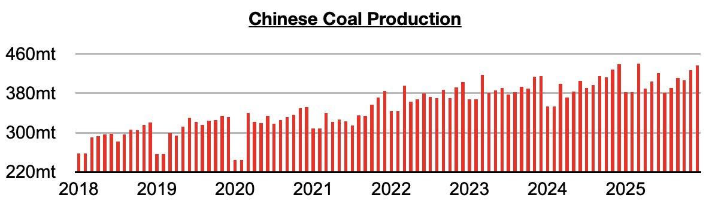
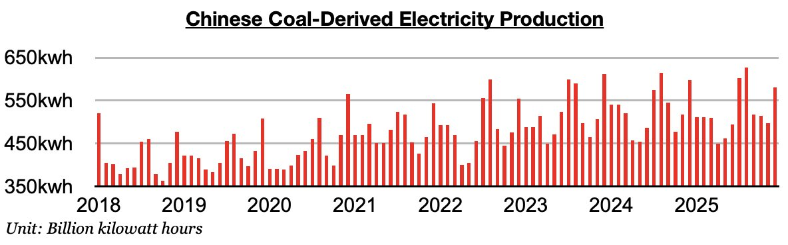

# Another Contraction in China's Coal-Derived Electricity Generation

**Date:** January 23, 2026  
**Publisher:** Breakwave Advisors | **Category:** Market Insights  
**Original URL:** [https://www.breakwaveadvisors.com/insights/2026/1/23/another-contraction-in-chinas-coal-derived-electricity-generation](https://www.breakwaveadvisors.com/insights/2026/1/23/another-contraction-in-chinas-coal-derived-electricity-generation)  

---

*By*[*Jeffrey Landsberg*](https://www.linkedin.com/in/jeffrey-landsberg-70ab957/)

As we discussed in Commodore Research's most recent Weekly China Report, China's coal output totaled 437 million tons last month. This is up month-on-month by 10.2 million tons (2%) and down year-on-year by only 1.9 million tons. China's coal output has now contracted on a year-on-year basis for six straight months. Previously, it had grown on a year-on-year basis for thirteen straight months.

> **Figure 1: Chart 1**  
> [Local Asset](file:///C:/Users/Dell/Github/Shipping/corpus/03-breakwave/insights/2026/assets/2026-01-23_another-contraction-in-chinas-coal-derived-electricity-generation_img_chart1_d068194a131b.jpg)

Coal-derived electricity generation, which makes up the bulk of China's electricity generation, totaled 581.2 billion kilowatt hours. This is up month-on-month by 84.2 billion kilowatt hours (17%) but is down year-on-year by 16.2 billion kilowatt hours (-3%). Coal-derived electricity generation again faring worse than domestic coal output is a headwind for coal import prospects and the overall dry bulk shipping market. Before the last two months, it had fared better than domestic coal output in three of the prior four months.

> **Figure 2: Chart 2**  
> [Local Asset](file:///C:/Users/Dell/Github/Shipping/corpus/03-breakwave/insights/2026/assets/2026-01-23_another-contraction-in-chinas-coal-derived-electricity-generation_img_chart2_e4657908774a.jpg)

---

**Tags:** China, Coal, Drybulk  
