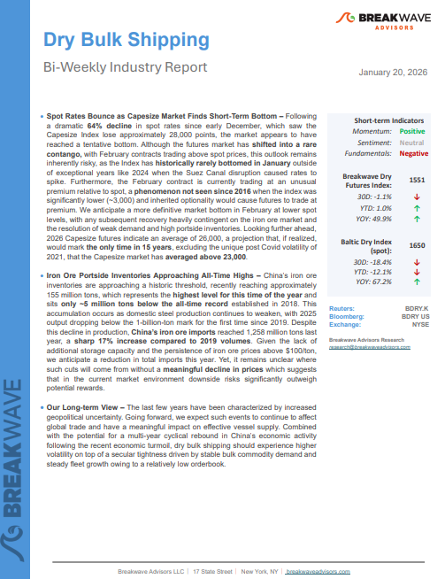
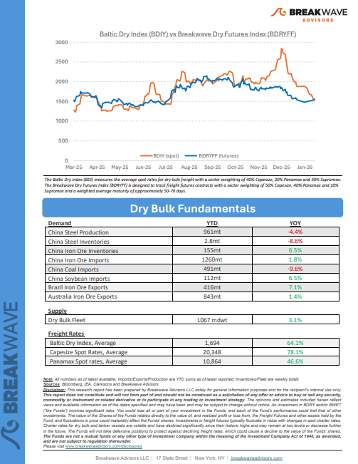
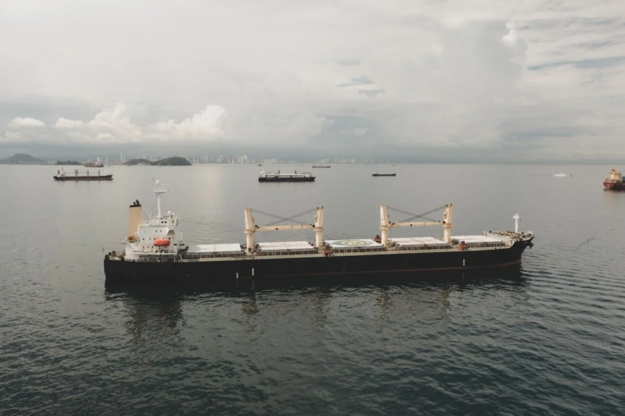
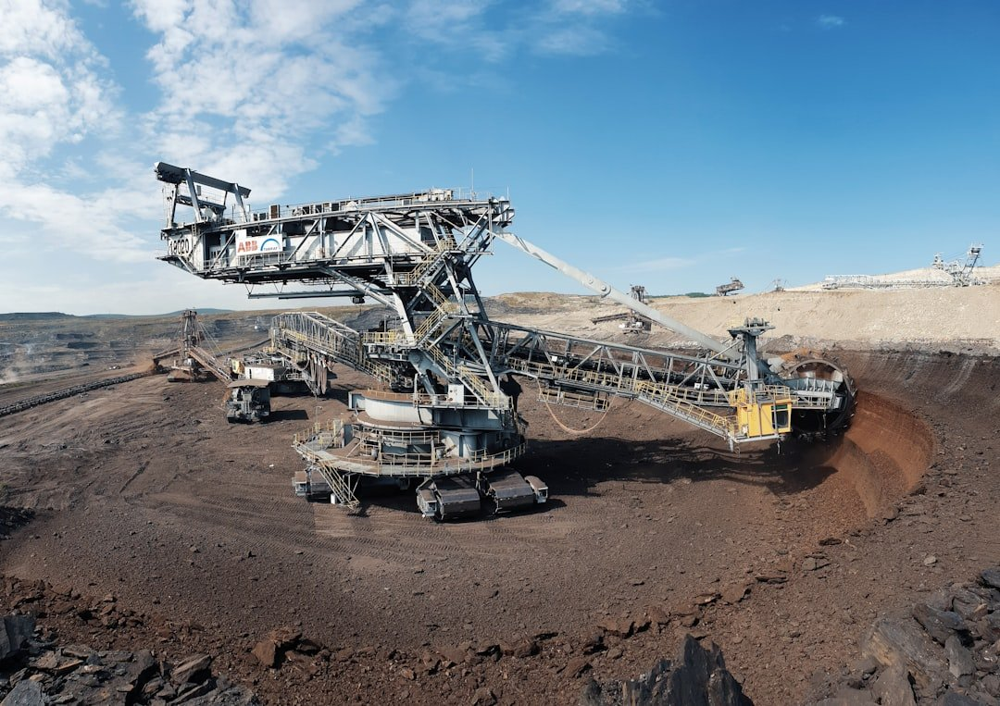
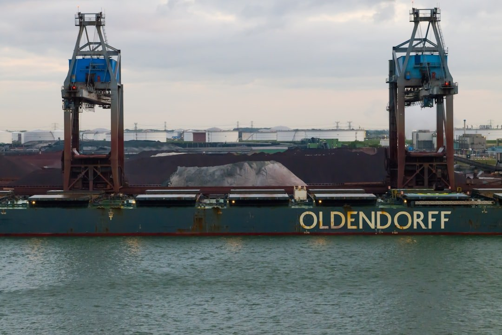
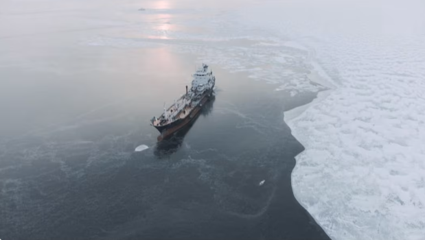

# Breakwave Weekend Read

**Date:** January 23, 2026  
**Publisher:** Breakwave Advisors | **Category:** Market Insights  
**Original URL:** [https://www.breakwaveadvisors.com/insights/2024/10/25/breakwave-weekend-read-547kk-rw7zy-awmfb-mf26k-dk29d-56ysb-x3jbe-xbwk9-dnpbr-b6jhc-l4mb2-d4l2e-f7l54](https://www.breakwaveadvisors.com/insights/2024/10/25/breakwave-weekend-read-547kk-rw7zy-awmfb-mf26k-dk29d-56ysb-x3jbe-xbwk9-dnpbr-b6jhc-l4mb2-d4l2e-f7l54)  

---

## Welcome Tobreakwave Advisorsweekend Read

***As the week comes to a close, take a moment to review the key insights from the past few days. Missed something? We've gathered all the top insights for you to catch up at your convenience.***

## Highlight of the Week

> **Figure 1: John Kartsonas**  
> *John Kartsonas, Founder and Managing partner ofBreakwave Advisors,onCrude delights?:Tanker market fundamentals remainsupportive.Click below and listen to the latestTradeWinds Wavelengthpodcast,Crude delights?,from1:03 to 5:40.*  
> **Interactive Data & Source:** [Shows Acast](https://shows.acast.com/65e16a5bcedd730017a1ff82/episodes/696a2339f0f57e95a0cc9bec?) | [Local Asset](file:///C:/Users/Dell/Github/Shipping/corpus/03-breakwave/insights/2026/assets/2026-01-23_breakwave-weekend-read-547kk-rw7zy-awmfb-mf26k-dk29d-56ysb-x3jbe-xbwk9-dnpbr-b6j_img_cea3cf84ceb9ceb3cebcceb9cf8ccf84cf85_629544b528a9.png)

[Click Here](https://shows.acast.com/65e16a5bcedd730017a1ff82/episodes/696a2339f0f57e95a0cc9bec?)

## Breakwave Shipping Report

**Spot Rates Bounce as Capesize Market Finds Short-Term Bottom**– Following a dramatic**64% decline**in spot rates since early December, which saw the Capesize Index lose approximately 28,000 points, the market appears to have reached a tentative bottom.

[Read More](https://www.breakwaveadvisors.com/insights/162026db-reportjukl47o85)

> **Figure 2: Στιγμιότυπο Οθόνης 2026 01 21 122607**  
> **Interactive Data & Source:** [Breakwave Advisors Market Insights](https://www.breakwaveadvisors.com/insights/2026/1/19/the-global-economic-landscape) | [Local Asset](file:///C:/Users/Dell/Github/Shipping/corpus/03-breakwave/insights/2026/assets/2026-01-23_breakwave-weekend-read-547kk-rw7zy-awmfb-mf26k-dk29d-56ysb-x3jbe-xbwk9-dnpbr-b6j_img_cea3cf84ceb9ceb3cebcceb9cf8ccf84cf85_4f5477478cb5.png)

> **Figure 3: Στιγμιότυπο Οθόνης 2026 01 21 122621**  
> **Interactive Data & Source:** [Breakwave Advisors Market Insights](https://www.breakwaveadvisors.com/insights/2026/1/19/the-global-economic-landscape) | [Local Asset](file:///C:/Users/Dell/Github/Shipping/corpus/03-breakwave/insights/2026/assets/2026-01-23_breakwave-weekend-read-547kk-rw7zy-awmfb-mf26k-dk29d-56ysb-x3jbe-xbwk9-dnpbr-b6j_img_cea3cf84ceb9ceb3cebcceb9cf8ccf84cf85_ed02346307c8.png)

## Insights of the Week

## The Global Economic Landscape

> **Figure 4: Στιγμιότυπο Οθόνης 2026 01 21 161709**  
> **Interactive Data & Source:** [Breakwave Advisors Market Insights](https://www.breakwaveadvisors.com/insights/2026/1/19/the-global-economic-landscape) | [Local Asset](file:///C:/Users/Dell/Github/Shipping/corpus/03-breakwave/insights/2026/assets/2026-01-23_breakwave-weekend-read-547kk-rw7zy-awmfb-mf26k-dk29d-56ysb-x3jbe-xbwk9-dnpbr-b6j_img_cea3cf84ceb9ceb3cebcceb9cf8ccf84cf85_8effd0797aed.png)

The global economic landscape has undergone a profound transformation over the past five years, shaped by a succession of disruptive forces that have altered market behaviour, redefined policy priorities, and recalibrated the trajectory of international trade.

Doric Weekly Market Insights

## Trouble in Tehran

> **Figure 5: Istock 1184092411**  
> **Interactive Data & Source:** [Breakwave Advisors Market Insights](https://www.breakwaveadvisors.com/insights/2026/1/19/trouble-in-tehran) | [Local Asset](file:///C:/Users/Dell/Github/Shipping/corpus/03-breakwave/insights/2026/assets/2026-01-23_breakwave-weekend-read-547kk-rw7zy-awmfb-mf26k-dk29d-56ysb-x3jbe-xbwk9-dnpbr-b6j_img_istock-1184092411_e59424513d5b.jpg)

Following two weeks of unrest, the oil market is again focused on Iran after a period of relative calm since last summer’s 12‑day war.

Gibson Tanker Market Report

## Market Commentary

The first half of January reminded everyone that crude tankers do not need a fresh demand miracle to re-rate, they just need the map to change.

[Read More](https://www.breakwaveadvisors.com/insights/2026/1/20/market-commentary)

Xclusiv Shipbrokers Weekly S&P Report

> **Figure 6: Unsplash Image E86goc95qb4**  
> **Interactive Data & Source:** [Breakwave Advisors Market Insights](https://www.breakwaveadvisors.com/insights/2026/1/20/big-picture-vlcc-amp-suezmax-outlook-benchmarks-align-with-our-bullish-view) | [Local Asset](file:///C:/Users/Dell/Github/Shipping/corpus/03-breakwave/insights/2026/assets/2026-01-23_breakwave-weekend-read-547kk-rw7zy-awmfb-mf26k-dk29d-56ysb-x3jbe-xbwk9-dnpbr-b6j_img_unsplash-image-e86goc95qb4_59a152ebca15.jpg)

## Big Picture: VLCC & Suezmax Outlook

> **Figure 7: Unsplash Image Fthjdjetimq**  
> **Interactive Data & Source:** [Breakwave Advisors Market Insights](https://www.breakwaveadvisors.com/insights/2026/1/20/big-picture-vlcc-amp-suezmax-outlook-benchmarks-align-with-our-bullish-view) | [Local Asset](file:///C:/Users/Dell/Github/Shipping/corpus/03-breakwave/insights/2026/assets/2026-01-23_breakwave-weekend-read-547kk-rw7zy-awmfb-mf26k-dk29d-56ysb-x3jbe-xbwk9-dnpbr-b6j_img_unsplash-image-fthjdjetimq_bd27b75e5559.jpg)

**Overview**- Based on analysts canvased at the end of December, our forecast stands out as bullish relative to ‘the pack’.

Braemar Research

## China Has Started 2026 with Two Signals That Matter for Bulk Shipping

> **Figure 8: Unsplash Image I89l1pccmco**  
> **Interactive Data & Source:** [Breakwave Advisors Market Insights](https://www.breakwaveadvisors.com/insights/2026/1/21/china-has-started-2026-with-two-signals-that-matter-for-bulk-shipping) | [Local Asset](file:///C:/Users/Dell/Github/Shipping/corpus/03-breakwave/insights/2026/assets/2026-01-23_breakwave-weekend-read-547kk-rw7zy-awmfb-mf26k-dk29d-56ysb-x3jbe-xbwk9-dnpbr-b6j_img_unsplash-image-i89l1pccmco_5e0fc1922d30.jpg)

China has started 2026 with two signals that matter for bulk shipping in different ways.

Intermodal Weekly Market Report

## Iron Ore Outlook: Simandou Supply, China Demand and Freight Trends

> **Figure 9: Unsplash Image Sy 8kuxlwbi**  
> **Interactive Data & Source:** [Breakwave Advisors Market Insights](https://www.breakwaveadvisors.com/insights/2026/1/21/iron-ore-outlook-simandou-supply-china-demand-and-freight-trends) | [Local Asset](file:///C:/Users/Dell/Github/Shipping/corpus/03-breakwave/insights/2026/assets/2026-01-23_breakwave-weekend-read-547kk-rw7zy-awmfb-mf26k-dk29d-56ysb-x3jbe-xbwk9-dnpbr-b6j_img_unsplash-image-sy-8kuxlwbi_a8c784123e7e.jpg)

In this week’s Allied Quantumsea Research, we review the evolving iron ore market landscape as 2026 begins, focusing on the widening gap between price performance and underlying fundamentals.

Allied Weekly Report

## How Long Can China Continue to Grow Its Iron Ore Stocks?

> **Figure 10: Unsplash Image Dzdgkvtbimy**  
> **Interactive Data & Source:** [Breakwave Advisors Market Insights](https://www.breakwaveadvisors.com/insights/2026/1/21/how-long-can-china-continue-to-grow-its-iron-ore-stocks) | [Local Asset](file:///C:/Users/Dell/Github/Shipping/corpus/03-breakwave/insights/2026/assets/2026-01-23_breakwave-weekend-read-547kk-rw7zy-awmfb-mf26k-dk29d-56ysb-x3jbe-xbwk9-dnpbr-b6j_img_unsplash-image-dzdgkvtbimy_d1a95299362d.jpg)

A 3% increase in global iron ore flows masks weak downstream demand..

Signal Ocean Commodity Radar

## VLCC Freight Surge: Is the Momentum Short Lived or Sustained

> **Figure 11: Στιγμιότυπο Οθόνης 2026 01 22 135013**  
> **Interactive Data & Source:** [Breakwave Advisors Market Insights](https://www.breakwaveadvisors.com/insights/2026/1/22/vlcc-freight-surge-is-the-momentum-short-lived-or-sustained) | [Local Asset](file:///C:/Users/Dell/Github/Shipping/corpus/03-breakwave/insights/2026/assets/2026-01-23_breakwave-weekend-read-547kk-rw7zy-awmfb-mf26k-dk29d-56ysb-x3jbe-xbwk9-dnpbr-b6j_img_cea3cf84ceb9ceb3cebcceb9cf8ccf84cf85_bb47d244f6b0.png)

The VLCC market saw strong return in rates, but it's unlikely to be sustainable as the trade rebalances

Vortexa Freight Weekly

## Capesize Ballasters

> **Figure 12: Στιγμιότυπο Οθόνης 2026 01 23 120117**  
> **Interactive Data & Source:** [Breakwave Advisors Market Insights](https://www.breakwaveadvisors.com/insights/2026/1/22/capesize-ballasters) | [Local Asset](file:///C:/Users/Dell/Github/Shipping/corpus/03-breakwave/insights/2026/assets/2026-01-23_breakwave-weekend-read-547kk-rw7zy-awmfb-mf26k-dk29d-56ysb-x3jbe-xbwk9-dnpbr-b6j_img_cea3cf84ceb9ceb3cebcceb9cf8ccf84cf85_482a4cd43035.png)

The Baltic Capesize Index opened the week marginally firmer, while weekly performance remains lower, indicating continued sensitivity in the freight market.

Signal Ocean Dry Weekly Market Monitor

## What Venezuela Means for Today’s VLCC Market

> **Figure 13: Στιγμιότυπο Οθόνης 2026 01 22 151238**  
> **Interactive Data & Source:** [Breakwave Advisors Market Insights](https://www.breakwaveadvisors.com/insights/2026/1/22/what-venezuela-means-for-todays-vlcc-market) | [Local Asset](file:///C:/Users/Dell/Github/Shipping/corpus/03-breakwave/insights/2026/assets/2026-01-23_breakwave-weekend-read-547kk-rw7zy-awmfb-mf26k-dk29d-56ysb-x3jbe-xbwk9-dnpbr-b6j_img_cea3cf84ceb9ceb3cebcceb9cf8ccf84cf85_7b899b3e65ed.png)

Venezuela firmly returned to the tanker market spotlight in 2025, as political developments and sanctions dynamics impacted crude flows and vessel demand.

Tankers International insight

## Another Contraction in China's Coal-Derived Electricity Generation

> **Figure 14: Unsplash Image Ot4z89tlcik**  
> **Interactive Data & Source:** [Breakwave Advisors Market Insights](https://www.breakwaveadvisors.com/insights/2026/1/23/another-contraction-in-chinas-coal-derived-electricity-generation) | [Local Asset](file:///C:/Users/Dell/Github/Shipping/corpus/03-breakwave/insights/2026/assets/2026-01-23_breakwave-weekend-read-547kk-rw7zy-awmfb-mf26k-dk29d-56ysb-x3jbe-xbwk9-dnpbr-b6j_img_unsplash-image-ot4z89tlcik_38434453d2a6.jpg)

As we discussed in Commodore Research's most recent Weekly China Report, China's coal output totaled 437 million tons last month.

From Commodore's Weekly Dry Bulk Reports

---

**Tags:** Shipping, Tankers, Drybulk  
