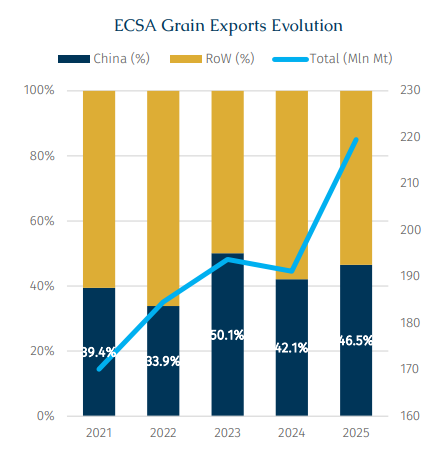
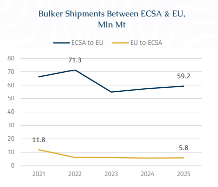
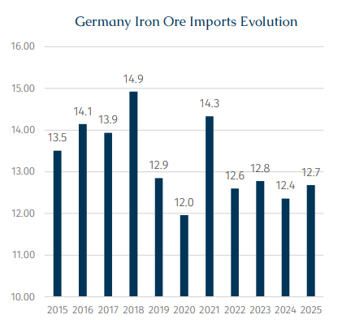

# EU-Latin America Fresh Trade Dynamics

**Date:** January 26, 2026  
**Publisher:** Breakwave Advisors | **Category:** Market Insights  
**Original URL:** [https://www.breakwaveadvisors.com/insights/2026/1/26/eu-latin-america-fresh-trade-dynamics](https://www.breakwaveadvisors.com/insights/2026/1/26/eu-latin-america-fresh-trade-dynamics)  

---

> **Figure 1: Rgb Color Brs Shipbrokers Monogram L**  
> [Local Asset](file:///C:/Users/Dell/Github/Shipping/corpus/03-breakwave/insights/2026/assets/2026-01-26_eu-latin-america-fresh-trade-dynamics_img_rgb-color-brs-shipbrokers-monogram-l_c365f35f1de5.png)

The European Union and Mercosur (a South American trade bloc) have delivered their long-sought trade pact, along with a political statement few could have imagined when talks began 25 years ago. The agreement, which awaits approval from the European Parliament, will eliminate more than 90% of tariffs on EU exports to South America. In return, the deal will gradually erase tariffs on a range of agricultural goods from South America, expanding markets for the four Mercosur nations.

On paper, at a macro level, the deal with the South American bloc of Brazil, Argentina, Uruguay and Paraguay will create a free-trade area large enough to rival the block’s decades-old North American arrangement now known as USMCA.

However, execution is unlikely to be smooth. As of writing, the European Parliament has voted to refer the deal to the European Court of Justice (ECJ) for a legal opinion, a process that could take up to two years and potentially delay full ratification. As a result, it has been reported that the agreement will likely be applied on a provisional basis as early as March.

That said, should the deal ultimately materialise, it is worth examining both the short and longer term implications for the dry bulk market.

### Immediate Implications for Dry Bulk

At first glance, for grain exporters such as Brazil and Argentina, the agreement helps to reduce overdependence on China for its grain exports. This could become important if China was to pivot back toward US corn and soybeans supplies under geopolitical pressure or scale back purchases due to economic considerations.

> **Figure 2: Στιγμιότυπο Οθόνης 2026 01 26 151505**  
> [Local Asset](file:///C:/Users/Dell/Github/Shipping/corpus/03-breakwave/insights/2026/assets/2026-01-26_eu-latin-america-fresh-trade-dynamics_img_cea3cf84ceb9ceb3cebcceb9cf8ccf84cf85_c87449ab9766.png)

According to AXSMarine data, grain loadings at ECSA ports including soybeans and corn have expanded at a healthy compound rate of 6.6% per annum between 2021 and 2025, lifting total volumes from 170 mln mt to 219.5 mln mt. As overall volumes grew, China’s share of these shipments also increased markedly.

In 2021, China alone accounted for an already disproportionate 39.4% of ECSA grain exports. By 2025, this share had risen further to 46.5%, having peaked at an extraordinary 50.1% in 2023. While this trend has been a clear win for Kamsarmax and Panamax demand from both a volume and tonmile perspective, particularly as coal trade underperformed, it presents a less optimal outcome from a diversification standpoint for Mercosur nations.

> **Figure 3: Στιγμιότυπο Οθόνης 2026 01 26 151513**  
> [Local Asset](file:///C:/Users/Dell/Github/Shipping/corpus/03-breakwave/insights/2026/assets/2026-01-26_eu-latin-america-fresh-trade-dynamics_img_cea3cf84ceb9ceb3cebcceb9cf8ccf84cf85_90ad0119891c.png)

Since peaking at 71.3 mln mt, bulker shipments from ECSA ports to the EU have dropped, with 2025 volumes easing to 59.2 mln mt. In the opposite direction, bulk carrier flows from the EU to ECSA have contracted even more sharply, effectively halving from 11.8 mln mt in 2021 to just 5.8 mln mt in 2025.

In theory, over time, this deal should support higher transatlantic volumes (between ECSA/EU) at the minor expense of fronthaul voyages (ECSA/Far East). Consequently, increased competition for geared tonnage opening in ECSA and West Africa would energize the overall demand profile of the Atlantic Basin, with the potential for greater freight spikes during seasonal export periods.

However, there is a catch. In 2026, the EU ETS for shipping reaches full compliance, covering 100% of CO₂ emissions for voyages to and from EU ports, up from 70% in 2025, while also expanding to include methane and nitrous oxide. This will materially raise freight costs.

At present, the EU Mercosur agreement does not appear to exclude vessels carrying Mercosur cargoes from carbon compliance costs. As a result, the benefits of incremental trade flows are likely to skew toward newer, more eco compliant bulkers rather than the broader legacy fleet.

The good news for charterers is on the supply side. Assuming no slippage, Ultramax newbuilding deliveries in 2026 are expected to reach around 210 units, a decade high and up from 174 units in 2025. This incoming, more fuel-efficient tonnage will be well positioned to service ECSA EU trade lanes under the tighter ETS regime.

### Subtle Mid-Term Effects for Dry Bulk

EU industries spanning automotive, machinery, chemicals, and pharmaceuticals are set to benefit from improved access to Mercosur markets. For instance, Germany, Europe’s automotive powerhouse, has been among the strongest proponents of the agreement, driven by the prospect of easier access to Latin American consumers. Currently, Mercosur tariffs remain highly restrictive, with passenger cars subject to duties of 35% and car parts facing tariffs of 14% to 28%.

The automotive sector is particularly important for Germany’s industrial base, accounting for around 28% of total domestic steel consumption, second only to construction. According to the German Association of Automobile Manufacturers (VDA), passenger car production rose by 1% y-o-y to 3.9 million units across January to November 2025. Car exports were unchanged at 3 million units, while new car registrations in the domestic market increased by 1% to 2.6 million units. Even so, this remains well below the pre-crisis peak of 3.6 million units recorded in 2019. A major headwind for the sector was the 25% tariff imposed on car imports into the US by President Donald Trump, effective from 2 April 2025, although this was partially eased in August when tariffs on EU-made cars were reduced to 15%.

Importantly, liberalisation under the EU Mercosur agreement will not be front-loaded. At Brazil’s insistence, reflecting the presence of a sizeable domestic automotive industry, tariff reductions will be phased in gradually rather than eliminated outright. Electric vehicles are expected to receive preferential treatment, an area where Europe has historically lagged.

> **Figure 4: Στιγμιότυπο Οθόνης 2026 01 26 151713**  
> [Local Asset](file:///C:/Users/Dell/Github/Shipping/corpus/03-breakwave/insights/2026/assets/2026-01-26_eu-latin-america-fresh-trade-dynamics_img_cea3cf84ceb9ceb3cebcceb9cf8ccf84cf85_747af99721f1.png)

From a dry bulk perspective, any improvement in industrial activity would be welcomed as it would support incremental steel demand. Since peaking at 14.9 mln mt in 2018, Germany’s iron ore imports (from Supramaxes to Capesizes), largely discharged at Hamburg and Bremen, have failed to register new highs and have instead fluctuated within a narrow 12.4–12.8 mln mt range over the 2022–2025 period.

Given Germany’s limited and low-grade domestic iron ore resources, its steelmakers rely on imports of higher grade material. Key suppliers include Sweden through the Kiruna and Gällivare mines, Canada via IOC, Brazil and Australia, with African producers increasingly relevant as Europe pivots toward green steelmaking. In particular, direct reduced iron processes require higher quality, lower impurity ore, reinforcing demand for premium seaborne supply.

### Long-Term Geopolitical Considerations

The deal can also be viewed as an unintended consequence of Trump-era tariffs. Negotiations between the EU and Mercosur had largely stalled after the 2019 framework agreement faced strong opposition from key EU member states. However, with US tariffs taking effect by summer 2025, pressure intensified for the EU to diversify its trade partnerships, reviving the deal’s momentum.

Coming within days of the US endeavours to Venezuelan and potential Greenland takeover, the Mercosur deal prove that EU can be a dependable partner that can act as a credible alternative to the US and China, a major selling point for South America at a time when Trump’s revival of the Monroe Doctrine. Meanwhile, Mercosur nations will no doubt use the agreement as a platform to highlight its own credibility as it pushes to diversify trade partnerships through new or expanded deals with nations like Japan, the United Arab Emirates, India and Indonesia.

---

**Tags:** Geopolitics, Drybulk, Markets  
