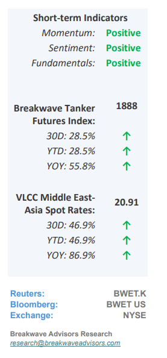
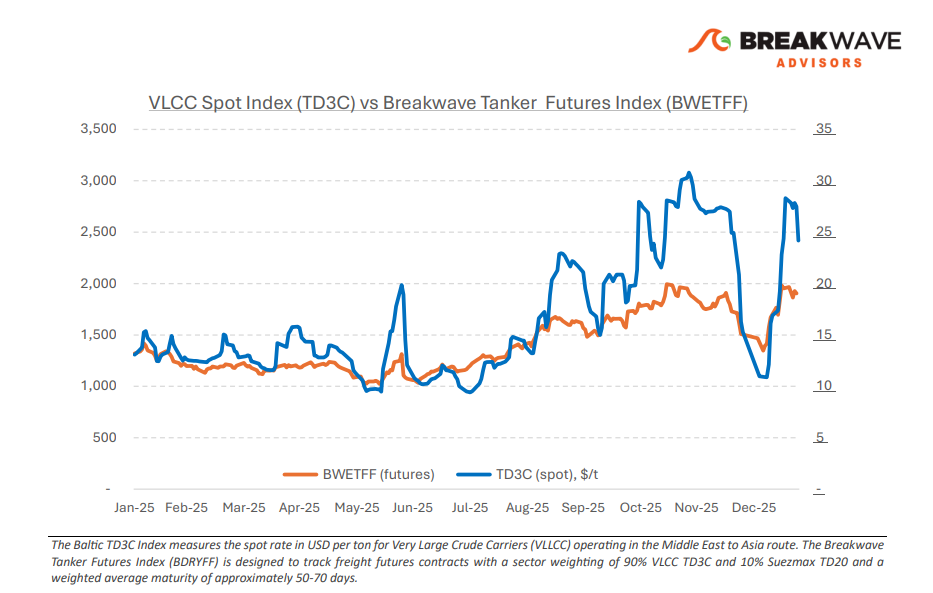
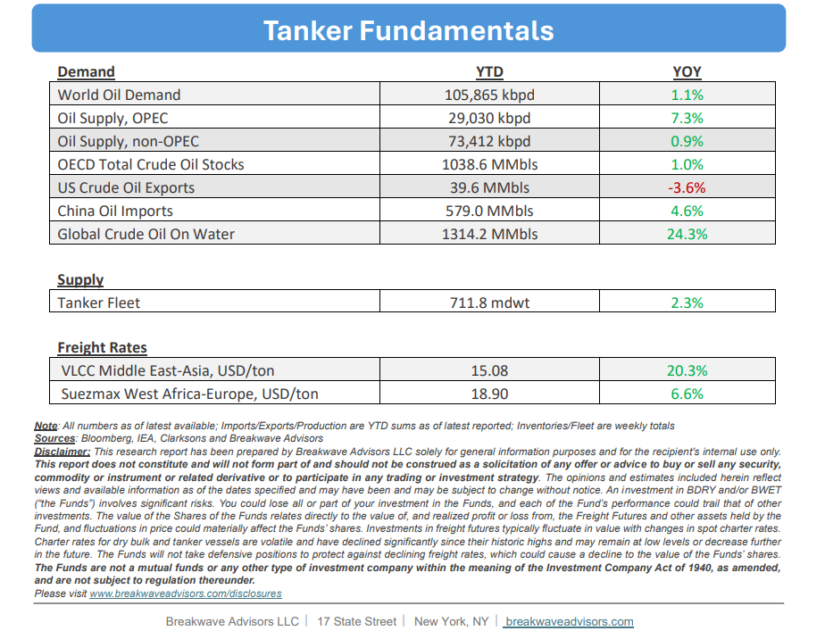

# Breakwave Bi-Weekly Tanker Report - January 27, 2026

**Date:** January 27, 2026  
**Publisher:** Breakwave Advisors | **Category:** Market Insights  
**Original URL:** [https://www.breakwaveadvisors.com/insights/12726wetreport6uu26y](https://www.breakwaveadvisors.com/insights/12726wetreport6uu26y)  

---

•– The dirty tanker market continues to trade at substantially higher year-over-year levels, with the Baltic Dirty Tanker Index currently around 90% above the same period last year. This underscores that, in aggregate, freight rates across dirty tanker routes remain well above historical norms, despite recent short-term adjustments in spot markets. Toward the end of January, market indicators point to softer momentum in VLCC spot rates, reflected in negative week-over-week movements on key benchmark routes. Notwithstanding this near-term softening, medium-term performance remains strong on a route-specific basis. On a month-over-month basis, both the Middle East Gulf–China and West Africa–China routes posted gains of roughly 60%. Longer-dated comparisons remain particularly pronounced. The Baltic Dirty Tanker Index continues to reflect these accumulated gains and has yet to materially adjust to the most recent weekly easing in VLCC spot rates. Looking ahead, market participants remain focused on macroeconomic and geopolitical factors that could shape near-term dirty freight dynamics. Uncertainty surrounding global oil prices, evolving sanctions regimes affecting Russian crude flows, and increased scrutiny of Iranian supply have influenced crude sourcing patterns. Recent indications that Indian refiners have increased procurement from Middle Eastern suppliers point to a potential reorientation of trade flows that may support VLCC utilization. However, such shifts are not inherently tonne-mile positive and could act as a moderating influence on freight momentum depending on displacement effects. Against a backdrop of fluctuating oil demand and supply expectations, these factors add uncertainty to the trajectory of the current market adjustment.

> **Figure 1: VLCC: Rates (Sentiment: Soft)**  
> [Local Asset](file:///C:/Users/Dell/Github/Shipping/corpus/03-breakwave/insights/2026/assets/2026-01-27_12726wetreport6uu26y_img_cea3cf84ceb9ceb3cebcceb9cf8ccf84cf85_9a9d88123377.png)

•**Oil Prices Stabilize above $60/bbl but near-term Points to Higher Prices**– While bearish fundamentals persist due to global supply outstripping demand (exinventory building), several catalysts suggest potential upward pressure on oil prices. The broader commodities space is currently rallying in response to a weakening USD and increased demand for real assets, a trend crude oil has yet to fully realize. Such investor appetite tailwind is compounded by elevated geopolitical uncertainty, particularly renewed potential disruption fears from Iran and the longterm supply implications in Venezuela. Furthermore, market nervousness has increased regarding potential tariffs on Canada, which remains the primary source of U.S. oil imports. Finally, while heating oil demand remains below historical averages, the recent storm in the U.S. provides additional short-term price support. All the above factors should support oil prices in the near term against a rather bearish fundamental outlook.

•**Our Long-term View**– The tanker market is recovering from a long period of staggered rates as the growth in new vessel supply shrinks while oil demand remains elevated in line with the global economy. A historically low orderbook combined with favorable shifting trade patterns should continue to support increased spot rate volatility, which combined with the ongoing geopolitical turmoil, should sustain freight rates in the medium to long term.

> **Figure 2: Στιγμιότυπο Οθόνης 2026 01 27 092745**  
> [Local Asset](file:///C:/Users/Dell/Github/Shipping/corpus/03-breakwave/insights/2026/assets/2026-01-27_12726wetreport6uu26y_img_cea3cf84ceb9ceb3cebcceb9cf8ccf84cf85_79f308c0f420.png)

> **Figure 3: Στιγμιότυπο Οθόνης 2026 01 27 115650**  
> [Local Asset](file:///C:/Users/Dell/Github/Shipping/corpus/03-breakwave/insights/2026/assets/2026-01-27_12726wetreport6uu26y_img_cea3cf84ceb9ceb3cebcceb9cf8ccf84cf85_421fbe86447b.png)

### Subscribe:
