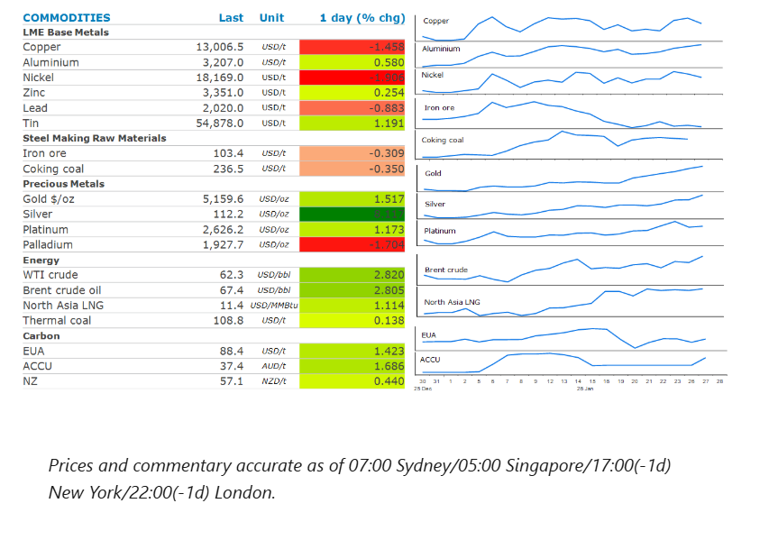
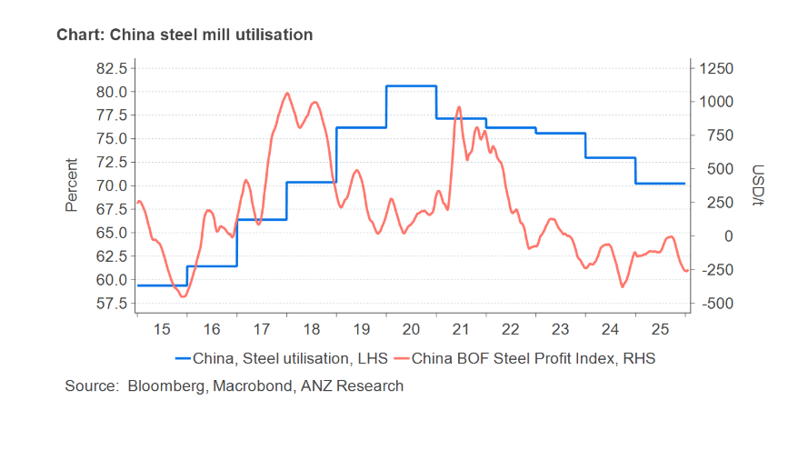

# Energy markets on edge amid supply risks

**Date:** January 28, 2026  
**Publisher:** Breakwave Advisors | **Category:** Market Insights  
**Original URL:** [https://www.breakwaveadvisors.com/insights/2026/1/28/energy-markets-on-edge-amid-supply-risks](https://www.breakwaveadvisors.com/insights/2026/1/28/energy-markets-on-edge-amid-supply-risks)  

---

Precious metals recorded gains amid strong investor interest. Energy markets remain on edge, as supply risks rose. Weaker demand weighed on metals.

*By*[*Daniel Hynes*](https://www.linkedin.com/in/dahynes/)

> **Figure 1: Στιγμιότυπο Οθόνης 2026 01 28 101338**  
> [Local Asset](file:///C:/Users/Dell/Github/Shipping/corpus/03-breakwave/insights/2026/assets/2026-01-28_energy-markets-on-edge-amid-supply-risks_img_cea3cf84ceb9ceb3cebcceb9cf8ccf84cf85_33f4e92a0cdf.png)

### Market Commentary

**Gold**pushed higher, consolidating gains above USD5,000/oz, as investors look ahead to the upcoming Fed rate decision. A pause after three consecutive cuts remains the consensus view, however data overnight provide some reasons why we don’t expect an extended pause. Silver remained well supported. Physical demand in China is a feature of the market. Prices are trading at a premium to comparable rates in London. Investors have relatively few options to invest, other than silver bars and coins. The surge in interest is also resulting in a huge inflow into global silver-backed exchange trade funds. Recorded turnover in the iShares Silver Trust ETF hit USD40bn on Monday, compared with daily trading or around USD2bn a few months ago.

**Copper**was under pressure in Asian trading, as the USD steadied. Sentiment was also impacted by signs of weakening demand. Activity in the Chinese market is slowing ahead of next month’s Lunar New Year, when inventories typically build. The strong gains in prices for most base metals has seen downstream users also pullback from purchases. This has been exacerbated by higher margins on the Shanghai Futures Exchange. Officials raised the margin requirement for aluminium and copper to 11% from 10%.

**Iron ore**futures were steady, as rising inventories were offset by renewed supply side issues. Iron ore stockpiles at Chinese ports surged to their highest level since 2022 last week, reflecting softer demand and robust supply. Inventories rose 1.2% w/w to 157.3mt, according to SteelHome data. Stockpiles have now risen for an eighth consecutive week. Vale, the Brazilian iron ore producer, said it halted operations at two mines after water mixed with sediment overflowed over the weekend. The company said the overflows have been contained and the causes of the incidents are under investigation. For the moment it has kept its 2026 production guidance unchanged, with a target of 335-345mt.

**Crude oil**prices gained as geopolitical risks rose. President Trump has dispatched naval assets to the Middle East. This has raised the prospect that he will follow through on his threat to attack Iran’s senior leadership in response to a violent crackdown on nationwide protests. Supply side issues in the US also provide some support. A winter storm in the US has disrupted refineries on the Gulf Coast and elsewhere. This comes ahead of a meeting by OPEC+ to discuss supply. Expectations are that it will stick with its current plan to keep production steady.

Traders in global**natural gas**markets remained on edge, as disruptions to US LNG exports loom. Estimated pipeline deliveries to export terminals have declined to about 10bncf/d as a winter storm disrupts local supplies. If supplies fail to recover, Asian importers may be forced to secure more cargoes in the spot market. However, the length of any disruption will determine if**North Asia LNG**prices rise. Importers entered this heating season[**relatively well stocked**](../pdfs/2026-01-28_energy-markets-on-edge-amid-supply-risks_commodity-call-squirrelling-away-gas_a1298c062e91.pdf). European gas futures eased lower on expectations that the winter storm won’t significantly hit imports. Nevertheless, the European Union’s competition chief warned against relying too much on US LNG, as the bloc looks to diversify its energy basket.

### Chart of the Day

China’s steel industry continues to suffer from overcapacity amid weak demand. Utilisation at steel mills has been failing in recent years. In 2025 it averaged 70%; however we could see some improvement this year as the government restricts new capacity and forces the closure of old mills.

> **Figure 2: Στιγμιότυπο Οθόνης 2026 01 28 101348**  
> **Interactive Data & Source:** [Linkedin](https://www.linkedin.com/newsletters/commodities-wrap-6692196755876012032/?fbclid=IwAR3kiXJqZdxmp9ZcRwBNI7FsBySI-XSC0pfPur1qzjt7OZp7PTE59Tsl1QI) | [Local Asset](file:///C:/Users/Dell/Github/Shipping/corpus/03-breakwave/insights/2026/assets/2026-01-28_energy-markets-on-edge-amid-supply-risks_img_cea3cf84ceb9ceb3cebcceb9cf8ccf84cf85_08d95f8e0d30.png)

Data source:[Commodities Wrap](https://www.linkedin.com/newsletters/commodities-wrap-6692196755876012032/?fbclid=IwAR3kiXJqZdxmp9ZcRwBNI7FsBySI-XSC0pfPur1qzjt7OZp7PTE59Tsl1QI)

---

**Tags:** Shipping, Commodities, Markets  
