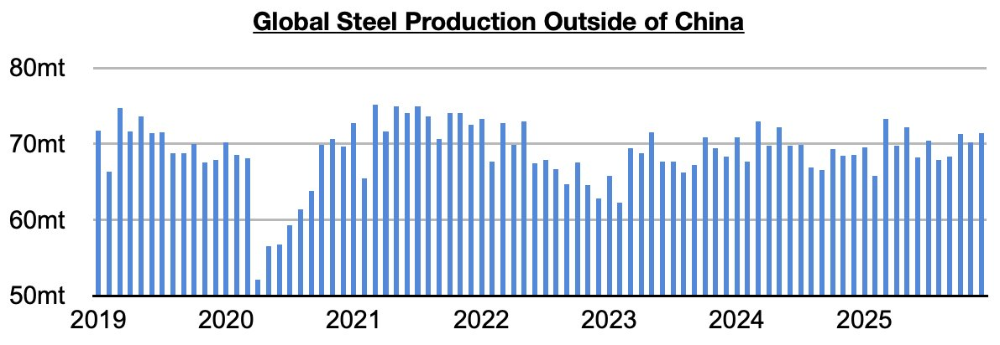
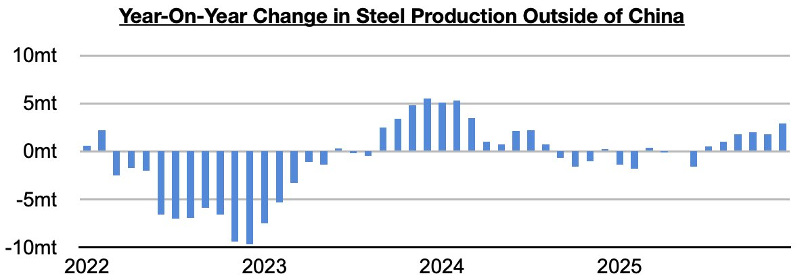
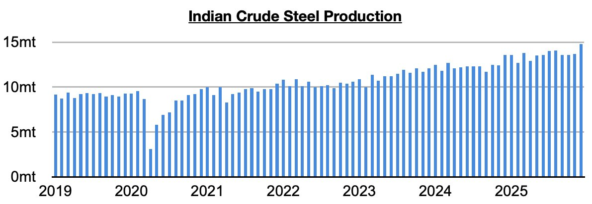

# Even Stronger Steel Production Growth Ex-China

**Date:** January 29, 2026  
**Publisher:** Breakwave Advisors | **Category:** Market Insights  
**Original URL:** [https://www.breakwaveadvisors.com/insights/2026/1/29/even-stronger-steel-production-growth-ex-china](https://www.breakwaveadvisors.com/insights/2026/1/29/even-stronger-steel-production-growth-ex-china)  

---

*By*[*Jeffrey Landsberg*](https://www.linkedin.com/in/jeffrey-landsberg-70ab957/)

As we discussed in Commodore Research's most recent Weekly Executive Report, global steel production totaled approximately 139.6 million tons in December. This is down month-on-month by 500,000 tons and is down year-on-year by 4.9 million tons (-3%). Steel production outside of China totaled approximately 71.4 million tons. This is up month-on-month by 1.2 million tons (2%) and is up year-on-year by 2.9 million tons (4%).

> **Figure 1: Chart 1**  
> [Local Asset](file:///C:/Users/Dell/Github/Shipping/corpus/03-breakwave/insights/2026/assets/2026-01-29_even-stronger-steel-production-growth-ex-china_img_chart1_0bc02de8ea9c.jpg)

Steel production ex-China has now grown on a year-on-year basis for six straight months (last month’s growth has marked the strongest seen since March 2024). Previously, it had contracted during eight of the prior ten months.

> **Figure 2: Chart 2**  
> [Local Asset](file:///C:/Users/Dell/Github/Shipping/corpus/03-breakwave/insights/2026/assets/2026-01-29_even-stronger-steel-production-growth-ex-china_img_chart2_ed9784d414fc.jpg)

Taking India out of the equation, production has grown again on a year-on-year basis as well. It grew year-on-year last month by 1.7 million tons (3%). This has also marked the strongest growth seen since March 2024. Indian steel production totaled a record 14.8 million tons last month This is up month-on-month by 1.1 million tons (8%) and is up year-on-year by 1.2 million tons (9%). India’s steel production has grown year-on-year for thirty-four straight months.

> **Figure 3: Chart 3**  
> [Local Asset](file:///C:/Users/Dell/Github/Shipping/corpus/03-breakwave/insights/2026/assets/2026-01-29_even-stronger-steel-production-growth-ex-china_img_chart3_0e62a3dbe0fe.jpg)

---

**Tags:** Ironore, China, Drybulk  
