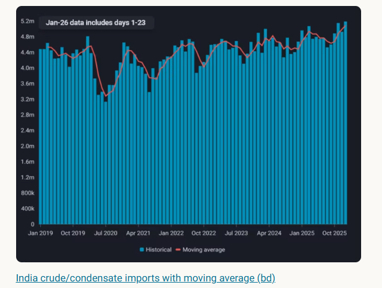
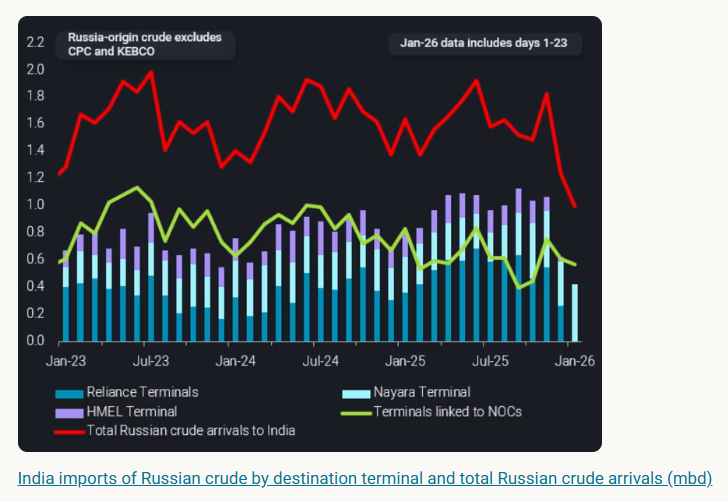
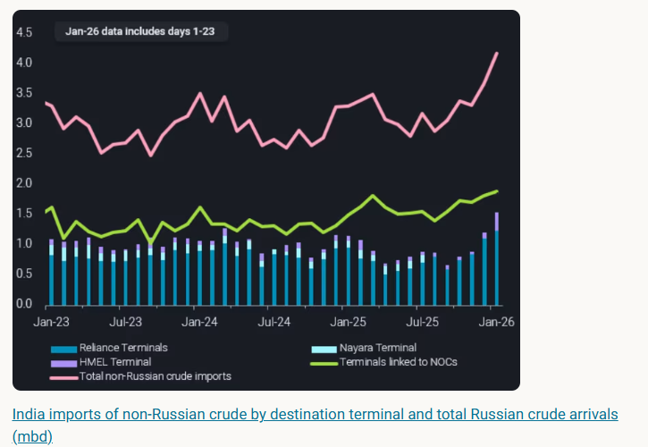
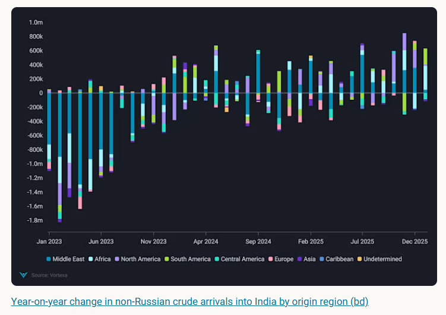

# India crude imports set to remain elevated in January

**Date:** January 29, 2026  
**Publisher:** Breakwave Advisors | **Category:** Market Insights  
**Original URL:** [https://www.breakwaveadvisors.com/insights/2026/1/29/india-crude-imports-set-to-remain-elevated-in-january](https://www.breakwaveadvisors.com/insights/2026/1/29/india-crude-imports-set-to-remain-elevated-in-january)  

---

India crude imports are approaching record levels in January as non-Russian crude arrivals surge amid a pivot from Russia-origin crude.

*By*[*Ivan Mathews*](https://www.linkedin.com/in/ivan-mathews-255689137/)

India's crude/condensate imports are on track to remain elevated for the third consecutive month and reach record levels of 5.2mbd in January. This report examines the drivers behind the recent rise in crude arrivals and provides an outlook for India's feedstock procurement strategy.

> **Figure 1: Στιγμιότυπο Οθόνης 2026 01 29 151408**  
> **Interactive Data & Source:** [Analytics Vortexa](https://analytics.vortexa.com/Flows?dateRange=2017-01-01T00%3A00%3A00.000Z__2025-12-31T23%3A59%3A59.999Z&filtersEnabled=%5B%22p%22%2C%22o%22%2C%22d%22%2C%22d_r%22%2C%22v%22%2C%22intra_d%22%2C%22sts_o%22%2C%22c_o%22%2C%22w%22%5D&frequency=year&from=%5B%2270425373a1836d6d0390dc6fef838a468717fba7776d66065a5043488f9f041b%22%5D&geoBreakdownOriginGlobal=port&metric=bpd&page=Flows&products=%5B%229256907ba7e4ed11ff03aa297a7e62e14484ce5a85c8118c7495b9120ad0e268%22%2C%22d72edbab2b5e2e249d8c216909945922a02eb017dd200f90876fee6fa180c743%22%2C%22deda35eb9ca56b54e74f0ff370423f9a8c61cf6a3796fcb18eaeeb32a8c290bb%22%5D&tabId=1ce63f28-f997-4212-9e89-5ade067a2d56&timeSeriesHiddenSeries=%5B%22seasonal_comparison_12%22%2C%22seasonal_comparison_24%22%5D&timeSeriesPercentageEnabled=1&v=3) | [Local Asset](file:///C:/Users/Dell/Github/Shipping/corpus/03-breakwave/insights/2026/assets/2026-01-29_india-crude-imports-set-to-remain-elevated-in-january_img_cea3cf84ceb9ceb3cebcceb9cf8ccf84cf85_50cbc7600434.png)

## Reliance and Hmel Reduce Intake of Russia-Origin Crude

The increase in India's total crude imports was driven by a surge in non-Russian crude arrivals, which more than offset the decline in Russia-origin crude imports. Discharges of Russian crude are set to fall further in January, extending a post‑November unwind and signaling a strategic pivot among major refiners. After a November surge amid accelerated discharges before the wind-down deadline, arrivals declined month‑on‑month in December and are expected to hit two‑year lows in January. The drop is concentrated at terminals linked to Reliance and HMEL.

[Reliance has significant exposure to international markets for transport fuel exports](https://analytics.vortexa.com/Flows?dateRange=2017-01-01T00%3A00%3A00.000Z__2025-12-31T23%3A59%3A59.999Z&filtersEnabled=%5B%22p%22%2C%22o%22%2C%22d%22%2C%22d_r%22%2C%22v%22%2C%22intra_d%22%2C%22sts_o%22%2C%22c_o%22%2C%22w%22%5D&frequency=year&from=%5B%2270425373a1836d6d0390dc6fef838a468717fba7776d66065a5043488f9f041b%22%5D&geoBreakdownOriginGlobal=port&metric=bpd&page=Flows&products=%5B%229256907ba7e4ed11ff03aa297a7e62e14484ce5a85c8118c7495b9120ad0e268%22%2C%22d72edbab2b5e2e249d8c216909945922a02eb017dd200f90876fee6fa180c743%22%2C%22deda35eb9ca56b54e74f0ff370423f9a8c61cf6a3796fcb18eaeeb32a8c290bb%22%5D&tabId=1ce63f28-f997-4212-9e89-5ade067a2d56&timeSeriesHiddenSeries=%5B%22seasonal_comparison_12%22%2C%22seasonal_comparison_24%22%5D&timeSeriesPercentageEnabled=1&v=3). While HMEL supplies refined products solely to the domestic market, any sanction penalties imposed on them could lead to a loss of non-Russian crude suppliers. Nayara Energy has been solely reliant on Russian crude after EU sanctions on the refinery in July 2025. Nayara Energy is partly owned by Rosneft and and has greater stability in crude supplies from Russia. On the other hand, HMEL is a public-private partnership between Hindustan Petroleum Corporation Limited (HPCL) and Mittal Energy Investment Pte Ltd, and could lose non-Russian crude supplies in the event of international sanctions.

> **Figure 2: Στιγμιότυπο Οθόνης 2026 01 29 151645**  
> **Interactive Data & Source:** [Analytics Vortexa](https://analytics.vortexa.com/Flows?dateRange=2023-01-01T00%3A00%3A00.000Z__2026-01-23T23%3A59%3A59.999Z&from=%5B%22b996521be9c996db3560ca234a56286ac38f798d34be229437555fab4f12a6a5%22%5D&metric=bpd&movementEvent=unloading_start&page=Flows&products=%5B%2254af755a090118dcf9b0724c9a4e9f14745c26165385ffa7f1445bc768f06f11%22%5D&productsExcluded=%5B%22bb70cf56200f5b72ba69a90bda2c6b47ba29da23945c6f1994cfd4c2ef2fe0ff%22%2C%22578b0722570521d64e6a1527e1fb88ddb1a064cc15afe1d6023d2a0b6d66be6b%22%5D&sortField=unloading_start&tabId=c2d26981-f370-4e7e-bb85-9dbe927aad6e&to=%5B%22b273376096b0b619161bf7c60dc0cf52d98ded043d70ac1e457d5503ace2288f%22%2C%22ece885a0ec8f817e0597644981f9b28a9754522ba79cfbce46afdee7c6ba2b3b%22%5D&v=3) | [Local Asset](file:///C:/Users/Dell/Github/Shipping/corpus/03-breakwave/insights/2026/assets/2026-01-29_india-crude-imports-set-to-remain-elevated-in-january_img_cea3cf84ceb9ceb3cebcceb9cf8ccf84cf85_247d34f16e74.png)

## Non-Russian Crude Imports Set to Reach Two‑year Highs

Non-Russian crude arrivals continue to rise m-o-m in January amid higher purchases by private refiners and sustained imports by NOCs. Discharges into terminals linked to Reliance and HMEL have increased from November levels, as these refiners import more mainstream oil in replacement of Russian barrels. NOCs continue to procure crude from suppliers outside Russia for diversification, so as to ensure adequate feedstock for refinery operations and reliably meet domestic fuel demand. This might also be in preparation for potential directives to reduce or completely stop imports of Russian oil in the future.

> **Figure 3: Στιγμιότυπο Οθόνης 2026 01 29 151726**  
> **Interactive Data & Source:** [Analytics Vortexa](https://analytics.vortexa.com/Flows?dateRange=2023-01-01T00%3A00%3A00.000Z__2026-01-23T23%3A59%3A59.999Z&from=%5B%22b996521be9c996db3560ca234a56286ac38f798d34be229437555fab4f12a6a5%22%5D&metric=bpd&movementEvent=unloading_start&page=Flows&products=%5B%2254af755a090118dcf9b0724c9a4e9f14745c26165385ffa7f1445bc768f06f11%22%5D&productsExcluded=%5B%22bb70cf56200f5b72ba69a90bda2c6b47ba29da23945c6f1994cfd4c2ef2fe0ff%22%2C%22578b0722570521d64e6a1527e1fb88ddb1a064cc15afe1d6023d2a0b6d66be6b%22%5D&sortField=unloading_start&tabId=c2d26981-f370-4e7e-bb85-9dbe927aad6e&to=%5B%22b273376096b0b619161bf7c60dc0cf52d98ded043d70ac1e457d5503ace2288f%22%2C%22ece885a0ec8f817e0597644981f9b28a9754522ba79cfbce46afdee7c6ba2b3b%22%5D&v=3) | [Local Asset](file:///C:/Users/Dell/Github/Shipping/corpus/03-breakwave/insights/2026/assets/2026-01-29_india-crude-imports-set-to-remain-elevated-in-january_img_cea3cf84ceb9ceb3cebcceb9cf8ccf84cf85_1c5cbd26be32.png)

India's oil ministry Petroleum Planning and Analysis Cell has been collecting weekly data on refiners' purchases of Russia and U.S. crude. This is very likely to facilitate trade negotiations after the U.S imposed 50% tariffs on India for purchasing Russian oil. Therefore, a trade deal between the U.S. and India is likely to require a reduction or complete halt in Russia-origin oil imports. Should this scenario arise, NOCs would have to comply with government directives and trim purchases of Russian oil. In fact,[MRPL has halted imports of Russia-origin crude since December](https://analytics.vortexa.com/Flows?dateRange=2023-01-01T00%3A00%3A00.000Z__2026-01-23T23%3A59%3A59.999Z&from=%5B%22b996521be9c996db3560ca234a56286ac38f798d34be229437555fab4f12a6a5%22%5D&metric=bpd&movementEvent=unloading_start&page=Flows&products=%5B%2254af755a090118dcf9b0724c9a4e9f14745c26165385ffa7f1445bc768f06f11%22%5D&productsExcluded=%5B%22bb70cf56200f5b72ba69a90bda2c6b47ba29da23945c6f1994cfd4c2ef2fe0ff%22%2C%22578b0722570521d64e6a1527e1fb88ddb1a064cc15afe1d6023d2a0b6d66be6b%22%5D&sortField=unloading_start&tabId=c2d26981-f370-4e7e-bb85-9dbe927aad6e&to=%5B%22b273376096b0b619161bf7c60dc0cf52d98ded043d70ac1e457d5503ace2288f%22%2C%22ece885a0ec8f817e0597644981f9b28a9754522ba79cfbce46afdee7c6ba2b3b%22%5D&v=3).

## Us-India Trade Deal Will Have a Major Impact on India's Crude Procurement Strategy

Discounts on Russian crude continue to widen (Argus) amid[lower imports by India and Turkey](https://analytics.vortexa.com/Flows?dateRange=2023-01-01T00%3A00%3A00.000Z__2026-01-23T23%3A59%3A59.999Z&filtersEnabled=%5B%22p%22%2C%22o%22%2C%22d%22%2C%22d_r%22%2C%22intra_d%22%2C%22sts_o%22%2C%22c_o%22%2C%22v%22%2C%22w%22%5D&from=%5B%22b996521be9c996db3560ca234a56286ac38f798d34be229437555fab4f12a6a5%22%5D&geoBreakdownOriginGlobal=shipping_region_v2&metric=bpd&movementEvent=unloading_start&page=Flows&products=%5B%2254af755a090118dcf9b0724c9a4e9f14745c26165385ffa7f1445bc768f06f11%22%5D&productsExcluded=%5B%22bb70cf56200f5b72ba69a90bda2c6b47ba29da23945c6f1994cfd4c2ef2fe0ff%22%2C%22578b0722570521d64e6a1527e1fb88ddb1a064cc15afe1d6023d2a0b6d66be6b%22%5D&sortField=unloading_start&tabId=aef240df-6e5a-48a3-aee2-205af6ae375c&timeSeriesBaselineEnd=2019-12-31T23%3A59%3A59.999Z&timeSeriesBaselineStart=2018-01-01T00%3A00%3A00.000Z&timeSeriesChartView=yearOverYear&timeSeriesHiddenSeries=%5B%22undetermined%22%5D&timeSeriesProperty=destination_country&to=%5B%2270425373a1836d6d0390dc6fef838a468717fba7776d66065a5043488f9f041b%22%2C%2269c53542ac9ee1fc4ba65a2af2da93739443a6b6918591ed820793a165b7fb1c%22%5D&v=3)and[elevated Russia-origin crude on water](https://analytics.vortexa.com/Flows?dateRange=2024-01-01T00%3A00%3A00.000Z__2026-01-23T23%3A59%3A59.999Z&filtersEnabled=%5B%22p%22%2C%22o%22%2C%22d%22%2C%22d_r%22%2C%22v%22%2C%22intra_d%22%2C%22sts_o%22%2C%22c_o%22%2C%22w%22%5D&frequency=day&from=%5B%22b996521be9c996db3560ca234a56286ac38f798d34be229437555fab4f12a6a5%22%5D&geoBreakdownDestinationGlobal=wider_shipping_region&metric=bpd&movementEvent=cargo_on_water_state&page=Flows&products=%5B%2254af755a090118dcf9b0724c9a4e9f14745c26165385ffa7f1445bc768f06f11%22%5D&productsExcluded=%5B%22bb70cf56200f5b72ba69a90bda2c6b47ba29da23945c6f1994cfd4c2ef2fe0ff%22%2C%22578b0722570521d64e6a1527e1fb88ddb1a064cc15afe1d6023d2a0b6d66be6b%22%5D&tabId=f176de05-e4e4-4f59-9ab4-004354290e6a&timeSeriesChartView=seasonal&timeSeriesProperty=destination_country×eriesMovingAvg=7d&v=3). We hear from market sources that Reliance purchased Russian crude from non-sanctioned entities and these cargoes could arrive in February or March. That said, we do not expect these volumes to be significant as Reliance would want to steer clear of secondary EU sanctions that target oil products processed from Russian crude, and its twin refineries in Jamnagar share joint import infrastructure and are generally integrated. As such, it remains to be seen whether these cargoes actually arrive in February or March.

In the event of a successful US-India trade deal, the decline in crude purchases by NOCs will outweigh any potential resumption in purchases from Reliance, leading to an overall decline Russian crude imports into India in the coming months. This, in turn, will lead to higher import demand for mainstream crude. This will result in higher arrivals of sour crude from the Middle East, U.S. and Canada, and sweet crude from South America and West Africa when the Brent-Dubai arbitrage economics are favourable.

> **Figure 4: Στιγμιότυπο Οθόνης 2026 01 29 151837**  
> **Interactive Data & Source:** [Vortexa](https://www.vortexa.com//oil-gas-data-traders-analysts-data-scientists?gclid=Cj0KCQjw8_qRBhCXARIsAE2AtRZKOvMnbilZ_6_91d7huSFFy71pWLrnPwGwOHVzXsmsG-1a1mZnQw8aAt89EALw_wcB&hsa_acc=1782073842&hsa_ad=548425387665&hsa_cam=14746637662&hsa_grp=125038601902&hsa_kw=&hsa_mt=&hsa_net=adwords&hsa_src=g&hsa_tgt=dsa-1431852288425&hsa_ver=3&utm_campaign=%5BCD%5D%20-%20DSA%20-%20EMEA&utm_medium=cpc&utm_medium=ppc&utm_source=google&utm_source=adwords&utm_term=) | [Local Asset](file:///C:/Users/Dell/Github/Shipping/corpus/03-breakwave/insights/2026/assets/2026-01-29_india-crude-imports-set-to-remain-elevated-in-january_img_cea3cf84ceb9ceb3cebcceb9cf8ccf84cf85_725c85ab5f29.png)

Data Source:[Vortexa](https://www.vortexa.com//oil-gas-data-traders-analysts-data-scientists?gclid=Cj0KCQjw8_qRBhCXARIsAE2AtRZKOvMnbilZ_6_91d7huSFFy71pWLrnPwGwOHVzXsmsG-1a1mZnQw8aAt89EALw_wcB&hsa_acc=1782073842&hsa_ad=548425387665&hsa_cam=14746637662&hsa_grp=125038601902&hsa_kw=&hsa_mt=&hsa_net=adwords&hsa_src=g&hsa_tgt=dsa-1431852288425&hsa_ver=3&utm_campaign=%5BCD%5D%20-%20DSA%20-%20EMEA&utm_medium=cpc&utm_medium=ppc&utm_source=google&utm_source=adwords&utm_term=)

---

**Tags:** Crude, Tankers, Markets  
