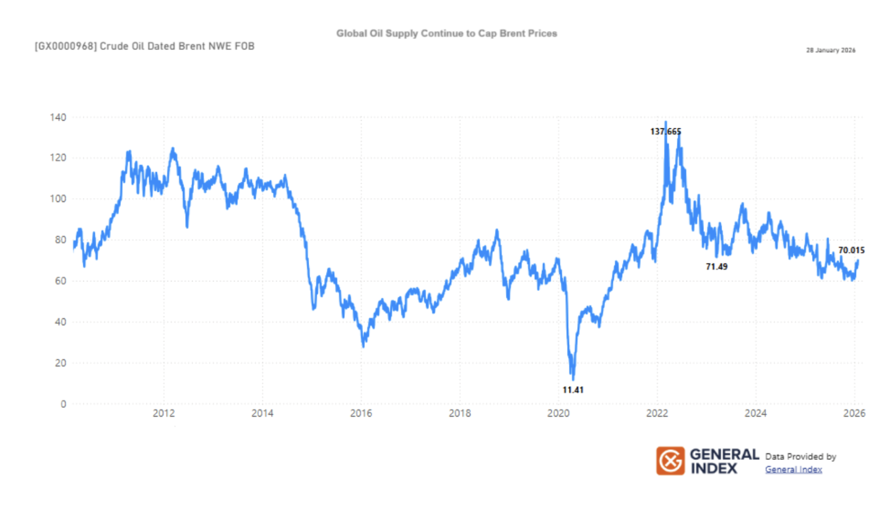
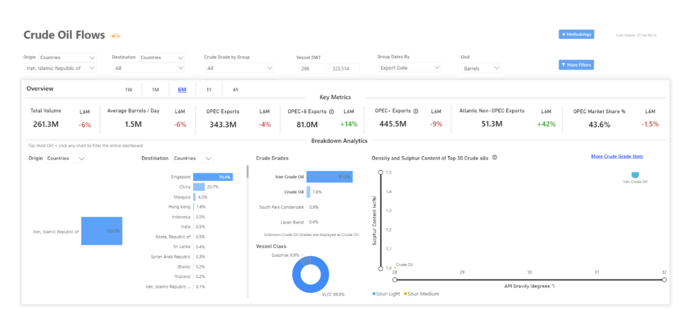
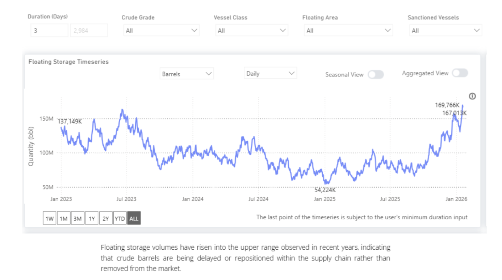

# Asia Adjusts to Shifts in Heavy Crude Availability

**Date:** January 30, 2026  
**Publisher:** Breakwave Advisors | **Category:** Market Insights  
**Original URL:** [https://www.breakwaveadvisors.com/insights/2026/1/30/asia-adjusts-to-shifts-in-heavy-crude-availability](https://www.breakwaveadvisors.com/insights/2026/1/30/asia-adjusts-to-shifts-in-heavy-crude-availability)  

---

Recent developments in oil production and export flows from Venezuela have prompted closer market attention on alternative sources of heavy and discounted crude, including supplies associated with Iran, as Asian refiners reassess sourcing strategies.

Asian refiners continue to have access to a broad set of global suppliers. That said, refiners with higher exposure to Venezuelan heavy crude face fewer substitutes with comparable quality and pricing, increasing reliance on alternative sanctioned barrels or on Middle Eastern and Russian grades that are less well suited to existing refinery configurations.

Reduced Venezuelan availability has primarily reshaped trade flows and destination patterns rather than removing a comparable volume of oil from the global market. Displaced demand has been partially met by other producers, and current production levels and inventory buffers remain sufficient to absorb near-term geopolitical uncertainty. As a result, the risk of an immediate, supply-driven tightening in global oil markets appears limited at this stage.

### 1. Production, Sanctions, and Market Signals

In early January, Iran’s crude oil production was estimated at around 3.19 million barrels per day, down marginally from November levels, based on OPEC secondary sources. The change reflects a small month-to-month variation rather than a significant shift in output capacity. While U.S. sanctions continue to constrain formal export channels, there has been no confirmed nationwide halt in Iranian crude flows.

As a result of renewed geopolitical tensions, including concerns around Iran and developments in Venezuela, oil prices strengthened noticeably through the end of January 2026. Brent crude futures have been trading around the $70 per-barrel level. Despite this upward trend, Brent has remained below the higher peaks seen earlier in the previous price cycle.

### Brent Crude Prices Remain Below Prior Cycle Peaks

*(Brent dated, 2012–2026)*

*The chart highlights episodic geopolitical volatility, with prices remaining well below prior cycle peaks.*

> **Figure 1: Market Chart 1**  
> **Interactive Data & Source:** [Signal Ocean Tanker Dynamic Crude Oil Flows](https://go.signalocean.com/e/983831/tanker-dynamic-crude-oil-flows/2rt6g9/574590971/h/KXN26pQTKEFhbzz3NDDp0edkl1HjF3QnLKMSx_E1mho) | [Local Asset](file:///C:/Users/Dell/Github/Shipping/corpus/03-breakwave/insights/2026/assets/2026-01-30_asia-adjusts-to-shifts-in-heavy-crude-availability_img_unnamed28929_a70b131462dc.png)

### 2. Asia As the Focal Point of Adjustment

Vessel-level tracking and trade-flow data indicate that[crude volumes](https://go.signalocean.com/e/983831/tanker-dynamic-crude-oil-flows/2rt6g9/574590971/h/KXN26pQTKEFhbzz3NDDp0edkl1HjF3QnLKMSx_E1mho)associated with Iran remain primarily oriented toward Asia. Reported shipments to Singapore should be interpreted as part of regional transshipment, storage, or redistribution activity rather than as final end-user demand. Month-to-date volumes are lower than December levels, reflecting short-term variability and reporting opacity rather than a confirmed disruption. Observed movements continue to be dominated by VLCC liftings and medium-to-sour grades, consistent with prevailing Asian refinery configurations.

> **Figure 2: Metrics Description: Trade-Flow and Vessel-Level Data Based On**  
> *Metrics Description: Trade-flow and vessel-level data based on reported loadings and movements over a six-month lookback period. Destinations reflect reported discharge locations and may include transshipment or storage hubs. Cargo classification by crude grade and vessel class reflects observed movements; month-to-date figures may be affected by reporting lags, discharge timing, and cargo aggregation practices.*  
> **Interactive Data & Source:** [Signal Ocean Platform](https://go.signalocean.com/e/983831/anker-dynamic-floating-storage/2rt6gd/574590971/h/KXN26pQTKEFhbzz3NDDp0edkl1HjF3QnLKMSx_E1mho) | [Local Asset](file:///C:/Users/Dell/Github/Shipping/corpus/03-breakwave/insights/2026/assets/2026-01-30_asia-adjusts-to-shifts-in-heavy-crude-availability_img_unnamed281029_77516dba1d3c.png)

Higher volumes of crude held in[floating storage](https://go.signalocean.com/e/983831/anker-dynamic-floating-storage/2rt6gd/574590971/h/KXN26pQTKEFhbzz3NDDp0edkl1HjF3QnLKMSx_E1mho)indicate that barrels are being delayed and repositioned rather than removed from circulation. Storage activity has been concentrated around Asian and Middle Eastern hubs, dominated by medium-to-sour grades and VLCCs, consistent with the rerouting of long-haul flows rather than a curtailment of liftings. There is no corresponding evidence of congestion-driven disruption in freight markets, reinforcing the view that current market adjustments are absorbing geopolitical risk within an oversupplied system, rather than reflecting conditions of physical scarcity.

> **Figure 3: Floating Storage**  
> **Interactive Data & Source:** [Signal Ocean Platform](https://www.thesignalgroup.com/signal-ocean-platform) | [Local Asset](file:///C:/Users/Dell/Github/Shipping/corpus/03-breakwave/insights/2026/assets/2026-01-30_asia-adjusts-to-shifts-in-heavy-crude-availability_img_unnamed281129_663180206369.png)

### 3. Iran vs. Venezuela - Different Channels of Market Impact

Venezuela’s impact on oil markets has been direct and destination-specific. Recent developments have reduced the flow of Venezuelan crude to Asian buyers, while exports toward the United States have continued, altering Atlantic Basin balances and limiting the availability of Venezuelan barrels for Asian refiners.

Iran’s role is emerging as different. Iranian crude continues to flow primarily toward Asia, and its increased relevance reflects substitution rather than a redirection of export routes. As Venezuelan volumes have become less available to Asian buyers, Iranian supply has taken on greater near-term importance in regional balancing, even as its reported production has edged lower.

This assessment reflects observed trade and substitution patterns rather than implying permanence or policy-driven durability in these flows.

These are therefore not parallel stories. Venezuela’s influence is expressed through shifting destinations, while Iran’s influence is expressed through how tightly the Asian market is balanced within a broadly well-supplied global system.

**4. Freight Market Exposure: Where the Sensitivity Really Lies**

So far in January, there is no clear evidence of a freight shock directly linked to developments in Iran. Liftings from the Arabian Gulf continue, and recent freight moves cannot be clearly tied to changes in Iranian export volumes. In practical terms, nothing in current fixtures or rate action points to an abrupt loss of cargoes or a sudden tightening in vessel availability.

That said, the shape of freight exposure has shifted. Reduced Venezuelan availability has already altered trade patterns, with fewer Caribbean-to-Asia movements and a greater reliance on Middle Eastern barrels to meet Asian demand. This does not remove volume from the system, but it extends average voyage lengths and concentrates demand on long-haul routes.

In this context, Iran matters less as a rerouting story and more as a reference point for Asian balances. Iranian crude continues to move primarily toward Asia, helping offset reduced Venezuelan flows. If Iranian export performance were to soften at the margin, even without broader escalation, the initial impact would likely appear in tonne-miles rather than in lost barrels, with effects most visible in VLCC demand, and to a lesser extent Suezmaxes, on Asia-oriented routes.

The reverse also holds. Any improvement in Venezuelan availability to Asia, or easing of constraints affecting Iranian-linked flows, would shorten trade distances and restore some sourcing flexibility. That would redistribute freight demand geographically, rather than materially reducing it.

For now, freight markets are not reacting to disruption, but they are carrying latent sensitivity. The key exposure lies not in outright volume loss, but in how substitution, voyage length, and timing evolve, making freight risk a function of route structure and tonne-mile intensity, rather than headline production numbers.

### Takeaways

Iran and Venezuela are influencing oil markets primarily through shifts in trade patterns rather than through sustained supply losses. Venezuelan barrels have been redirected away from Asia toward the United States, tightening regional balances and increasing reliance on alternative supply.

Within this context, Iran has assumed a larger role as a replacement source for Asian buyers rather than as a driver of new disruption. While reported Iranian production has eased, export flows have continued, with market impact showing up mainly in price sensitivity rather than physical shortages.

These adjustments are being absorbed within a globally well-supplied market, leaving conditions exposed to volatility and short-term repricing but showing limited signs of a structural supply imbalance.

Data Source:[Signal Ocean Platform](https://www.thesignalgroup.com/signal-ocean-platform)

---

**Tags:** Oil, Tankers, Crude  
