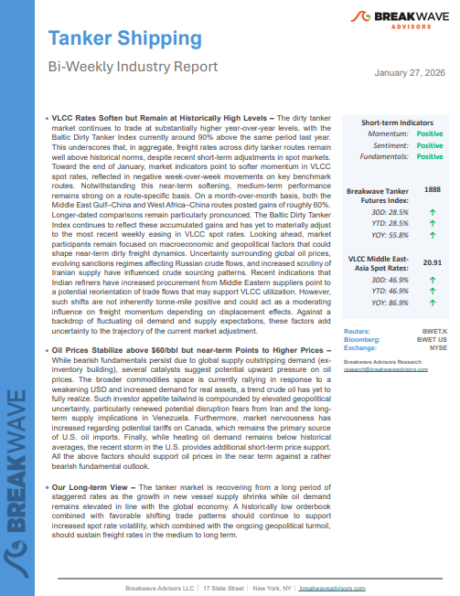
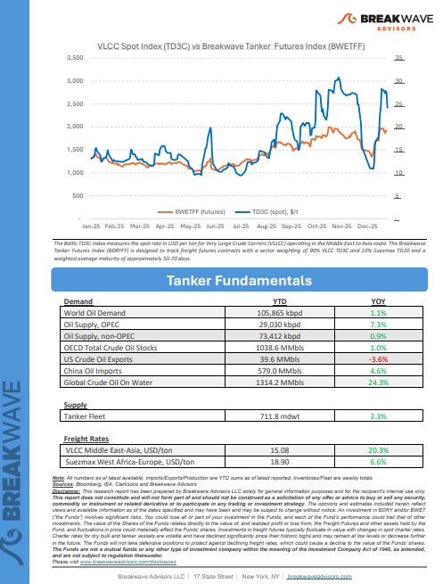
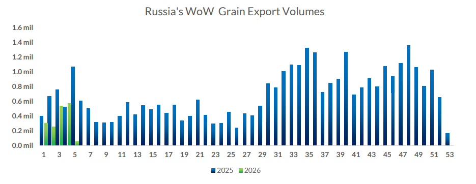
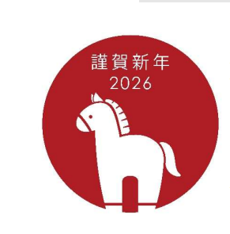

# Breakwave Weekend Read

**Date:** January 30, 2026  
**Publisher:** Breakwave Advisors | **Category:** Market Insights  
**Original URL:** [https://www.breakwaveadvisors.com/insights/2024/10/25/breakwave-weekend-read-547kk-rw7zy-awmfb-mf26k-dk29d-56ysb-x3jbe-xbwk9-dnpbr-b6jhc-l4mb2-d4l2e-f7l54-fsr59](https://www.breakwaveadvisors.com/insights/2024/10/25/breakwave-weekend-read-547kk-rw7zy-awmfb-mf26k-dk29d-56ysb-x3jbe-xbwk9-dnpbr-b6jhc-l4mb2-d4l2e-f7l54-fsr59)  

---

## Welcome Tobreakwave Advisorsweekend Read

***As the week comes to a close, take a moment to review the key insights from the past few days. Missed something? We've gathered all the top insights for you to catch up at your convenience.***

## Breakwave Shipping Report

**VLCC Rates Soften but Remain at Historically High Levels**– The dirty tanker market continues to trade at substantially higher year-over-year levels, with the Baltic Dirty Tanker Index currently around 90% above the same period last year.

[Read More](https://www.breakwaveadvisors.com/insights/12726wetreport6uu26y)

> **Figure 1: Στιγμιότυπο Οθόνης 2026 01 29 205113**  
> **Interactive Data & Source:** [Breakwave Advisors Market Insights](https://www.breakwaveadvisors.com/insights/2026/1/26/dry-bulk-market-on-a-stronger-footing) | [Local Asset](file:///C:/Users/Dell/Github/Shipping/corpus/03-breakwave/insights/2026/assets/2026-01-30_breakwave-weekend-read-547kk-rw7zy-awmfb-mf26k-dk29d-56ysb-x3jbe-xbwk9-dnpbr-b6j_img_cea3cf84ceb9ceb3cebcceb9cf8ccf84cf85_3d5ecc43b29f.png)

> **Figure 2: Στιγμιότυπο Οθόνης 2026 01 29 205124**  
> **Interactive Data & Source:** [Breakwave Advisors Market Insights](https://www.breakwaveadvisors.com/insights/2026/1/26/dry-bulk-market-on-a-stronger-footing) | [Local Asset](file:///C:/Users/Dell/Github/Shipping/corpus/03-breakwave/insights/2026/assets/2026-01-30_breakwave-weekend-read-547kk-rw7zy-awmfb-mf26k-dk29d-56ysb-x3jbe-xbwk9-dnpbr-b6j_img_cea3cf84ceb9ceb3cebcceb9cf8ccf84cf85_6f2747670c8a.png)

## Insights of the Week

## Dry Bulk Market on a Stronger Footing

> **Figure 3: Unsplash Image Oir7nyqtuec**  
> **Interactive Data & Source:** [Breakwave Advisors Market Insights](https://www.breakwaveadvisors.com/insights/2026/1/26/dry-bulk-market-on-a-stronger-footing) | [Local Asset](file:///C:/Users/Dell/Github/Shipping/corpus/03-breakwave/insights/2026/assets/2026-01-30_breakwave-weekend-read-547kk-rw7zy-awmfb-mf26k-dk29d-56ysb-x3jbe-xbwk9-dnpbr-b6j_img_unsplash-image-oir7nyqtuec_c0e085ef2e6e.jpg)

This time last year, the dry bulk market was grappling with pronounced weakness and a lack of conviction across nearly all segments.

Doric Weekly Market Insights

## Eu-Latin America Fresh Trade Dynamics

> **Figure 4: Unsplash Image L68z6ef2pea**  
> **Interactive Data & Source:** [Breakwave Advisors Market Insights](https://www.breakwaveadvisors.com/insights/2026/1/26/eu-latin-america-fresh-trade-dynamics) | [Local Asset](file:///C:/Users/Dell/Github/Shipping/corpus/03-breakwave/insights/2026/assets/2026-01-30_breakwave-weekend-read-547kk-rw7zy-awmfb-mf26k-dk29d-56ysb-x3jbe-xbwk9-dnpbr-b6j_img_unsplash-image-l68z6ef2pea_58f88056a572.jpg)

The European Union and Mercosur (a South American trade bloc) have delivered their long-sought trade pact, along with a political statement few could have imagined when talks began 25 years ago.

BRS Weekly Dry Bulk Newsletter

## Cpc Outage + Venezuela Re-Routing Lift Aframax Demand in Gulf of Mexico

Strong European demand for WTI and a rise in liftings of Venezuelan crude to US Gulf have boosted the region’s Aframax rates to the point where Suezmaxes are now more competitive.

[Read More](https://www.breakwaveadvisors.com/insights/2026/1/27/-cpc-outage-venezuela-re-routing-lift-aframax-demand-in-gulf-of-mexico)

Braemar Research

> **Figure 5: Unsplash Image Jeei5esd7cg**  
> **Interactive Data & Source:** [Breakwave Advisors Market Insights](https://www.breakwaveadvisors.com/insights/2026/1/27/capes-are-holding-up) | [Local Asset](file:///C:/Users/Dell/Github/Shipping/corpus/03-breakwave/insights/2026/assets/2026-01-30_breakwave-weekend-read-547kk-rw7zy-awmfb-mf26k-dk29d-56ysb-x3jbe-xbwk9-dnpbr-b6j_img_unsplash-image-jeei5esd7cg_4372f27b1436.jpg)

## Capes Are Holding Up

> **Figure 6: Unsplash Image Hionj4jdlz0**  
> **Interactive Data & Source:** [Breakwave Advisors Market Insights](https://www.breakwaveadvisors.com/insights/2026/1/27/capes-are-holding-up) | [Local Asset](file:///C:/Users/Dell/Github/Shipping/corpus/03-breakwave/insights/2026/assets/2026-01-30_breakwave-weekend-read-547kk-rw7zy-awmfb-mf26k-dk29d-56ysb-x3jbe-xbwk9-dnpbr-b6j_img_unsplash-image-hionj4jdlz0_3a43ed6caba9.jpg)

China’s dry bulk market usually fades into the Lunar New Year, yet the first three weeks of 2026 are doing the opposite: volumes are firmer year on year, tonne-miles are improving, and freight is refusing to “switch off”.

Xclusiv Shipbrokers Weekly Report

## Grain Trade Developments and Implications of U.s.–russia Negotiations for Black Sea Shipping

> **Figure 7: Στιγμιότυπο Οθόνης 2026 01 28 100015**  
> **Interactive Data & Source:** [Breakwave Advisors Market Insights](https://www.breakwaveadvisors.com/insights/2026/1/28/grain-trade-developments-and-implications-of-usrussia-negotiations-for-black-sea-shipping) | [Local Asset](file:///C:/Users/Dell/Github/Shipping/corpus/03-breakwave/insights/2026/assets/2026-01-30_breakwave-weekend-read-547kk-rw7zy-awmfb-mf26k-dk29d-56ysb-x3jbe-xbwk9-dnpbr-b6j_img_cea3cf84ceb9ceb3cebcceb9cf8ccf84cf85_a750807526cd.png)

This week’s Allied QuantumSea Research reviews January 2026 developments in the global grain trade, where outcomes were shaped primarily by Black Sea security and operating conditions rather than changes in agricultural supply or export infrastructure.

Allied Weekly Report

## Energy Markets on Edge Amid Supply Risks

> **Figure 8: Unsplash Image Grmwvnvssdu**  
> **Interactive Data & Source:** [Breakwave Advisors Market Insights](https://www.breakwaveadvisors.com/insights/2026/1/28/energy-markets-on-edge-amid-supply-risks) | [Local Asset](file:///C:/Users/Dell/Github/Shipping/corpus/03-breakwave/insights/2026/assets/2026-01-30_breakwave-weekend-read-547kk-rw7zy-awmfb-mf26k-dk29d-56ysb-x3jbe-xbwk9-dnpbr-b6j_img_unsplash-image-grmwvnvssdu_d8dc9a2029ab.jpg)

Precious metals recorded gains amid strong investor interest. Energy markets remain on edge, as supply risks rose. Weaker demand weighed on metals.

Commodities Wrap

## Even Stronger Steel Production Growth Ex-China

> **Figure 9: Unsplash Image Ybraukjpvmqa**  
> **Interactive Data & Source:** [Breakwave Advisors Market Insights](https://www.breakwaveadvisors.com/insights/2026/1/29/even-stronger-steel-production-growth-ex-china) | [Local Asset](file:///C:/Users/Dell/Github/Shipping/corpus/03-breakwave/insights/2026/assets/2026-01-30_breakwave-weekend-read-547kk-rw7zy-awmfb-mf26k-dk29d-56ysb-x3jbe-xbwk9-dnpbr-b6j_img_unsplash-image-ybraukjpvmqa_cc1b740f4fbf.jpg)

As we discussed in Commodore Research's most recent Weekly Executive Report, global steel production totaled approximately 139.6 million tons in December.

From Commodore's Weekly Dry Bulk Reports

## India Crude Imports Set to Remain Elevated in January

> **Figure 10: Στιγμιότυπο Οθόνης 2026 01 29 152025**  
> **Interactive Data & Source:** [Breakwave Advisors Market Insights](https://www.breakwaveadvisors.com/insights/2026/1/29/india-crude-imports-set-to-remain-elevated-in-january) | [Local Asset](file:///C:/Users/Dell/Github/Shipping/corpus/03-breakwave/insights/2026/assets/2026-01-30_breakwave-weekend-read-547kk-rw7zy-awmfb-mf26k-dk29d-56ysb-x3jbe-xbwk9-dnpbr-b6j_img_cea3cf84ceb9ceb3cebcceb9cf8ccf84cf85_4c9d61edbb8f.png)

India crude imports are approaching record levels in January as non-Russian crude arrivals surge amid a pivot from Russia-origin crude.

Vortexa Freight Weekly

## Grain Flows to China and Freight Signals

> **Figure 11: China Continues to Favour Brazilian and South American Supplies**  
> *China continues to favour Brazilian and South American supplies into early 2026*  
> **Interactive Data & Source:** [Breakwave Advisors Market Insights](https://www.breakwaveadvisors.com/insights/2026/1/30/grain-flows-to-china-and-freight-signals) | [Local Asset](file:///C:/Users/Dell/Github/Shipping/corpus/03-breakwave/insights/2026/assets/2026-01-30_breakwave-weekend-read-547kk-rw7zy-awmfb-mf26k-dk29d-56ysb-x3jbe-xbwk9-dnpbr-b6j_img_unsplash-image-pl83ct0cfce_cd0c7d5fc937.jpg)

[Read More](https://www.breakwaveadvisors.com/insights/2026/1/30/grain-flows-to-china-and-freight-signals)

Signal Ocean Dry Weekly Market Monitor

## Riding the Fire Horse (Without Getting Burned)

> **Figure 12: Στιγμιότυπο Οθόνης 2026 01 30 112951**  
> **Interactive Data & Source:** [Breakwave Advisors Market Insights](https://www.breakwaveadvisors.com/insights/2026/1/30/riding-the-fire-horse-without-getting-burned) | [Local Asset](file:///C:/Users/Dell/Github/Shipping/corpus/03-breakwave/insights/2026/assets/2026-01-30_breakwave-weekend-read-547kk-rw7zy-awmfb-mf26k-dk29d-56ysb-x3jbe-xbwk9-dnpbr-b6j_img_cea3cf84ceb9ceb3cebcceb9cf8ccf84cf85_d5b736df8512.png)

Each Lunar New Year is characterized by one of 12 animals which appear in the Chinese zodiac.

Feng Shui analysis for the**Year of the Horse**

## Asia Adjusts to Shifts in Heavy Crude Availability

> **Figure 13: Unsplash Image 7ugmtwtwery**  
> **Interactive Data & Source:** [Breakwave Advisors Market Insights](https://www.breakwaveadvisors.com/insights/2026/1/30/asia-adjusts-to-shifts-in-heavy-crude-availability) | [Local Asset](file:///C:/Users/Dell/Github/Shipping/corpus/03-breakwave/insights/2026/assets/2026-01-30_breakwave-weekend-read-547kk-rw7zy-awmfb-mf26k-dk29d-56ysb-x3jbe-xbwk9-dnpbr-b6j_img_unsplash-image-7ugmtwtwery_ccdfc02a42e5.jpg)

Recent developments in oil production and export flows from Venezuela have prompted closer market attention on alternative sources of heavy and discounted crude, including supplies associated with Iran, as Asian refiners reassess sourcing strategies.

Signal Ocean Tanker Weekly Market Monitor

---

**Tags:** Shipping, Tankers, Drybulk  
