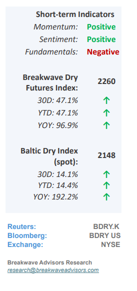
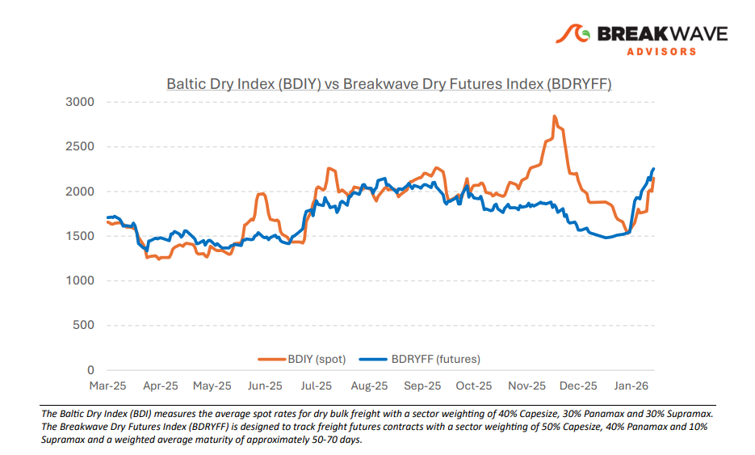
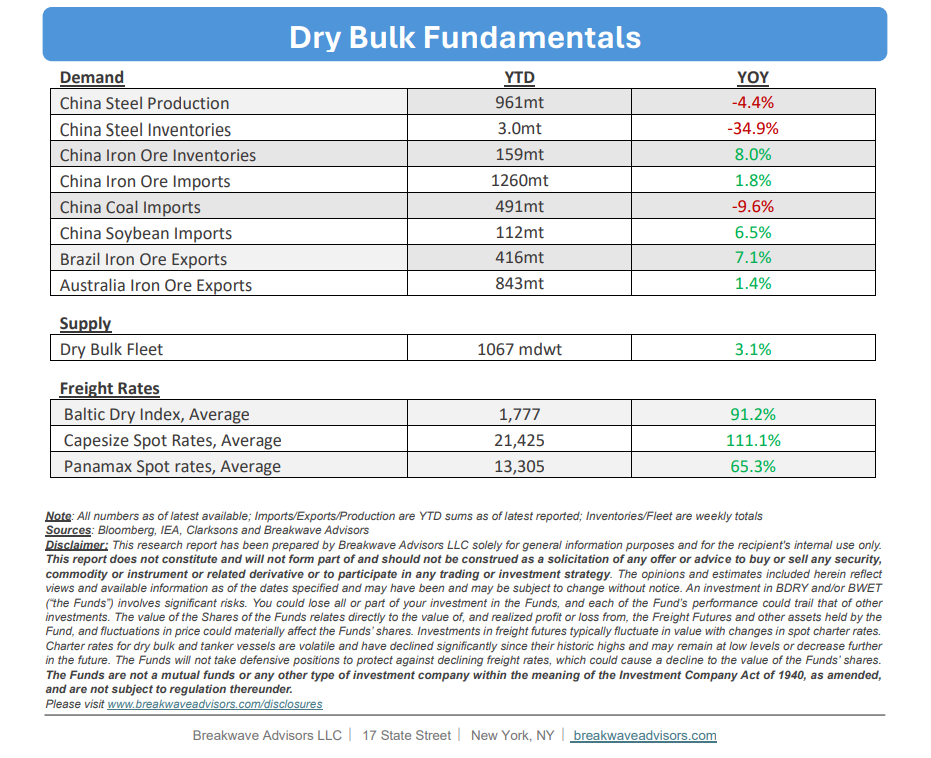

# Breakwave Bi-Weekly Dry Bulk Report - February 3, 2026

**Date:** February 03, 2026  
**Publisher:** Breakwave Advisors | **Category:** Market Insights  
**Original URL:** [https://www.breakwaveadvisors.com/insights/232026db-report2026kk98](https://www.breakwaveadvisors.com/insights/232026db-report2026kk98)  

---

•**A January for the Records**– January 2026 will be remembered as a significant positive outlier for the dry bulk market; after an anticipated seasonal weakening during the year-end period, the**Capesize market staged a dramatic reversal**with spot rates reaching nearly $30,000,**exceeding multi-year historical ranges**and significantly outpacing initial expectations. While the specific drivers of this rally are multifaceted, key factors included persistent adverse weather in the Northern Atlantic restricting vessel supply, alongside steady bauxite flows in the South Atlantic and unexpectedly robust export performance for iron ore in the Pacific Basin. In response to this spot market strength, the**futures curve has steepened**for the remainder of the year, now sitting at approximately $30,000 per day, and while the fundamental catalysts for such sustained optimism remain a subject of debate, the solid opening spot rate performance justifies a renewed outlook. Ultimately,**current pricing assumes near-perfect execution**without further volatility, but if these expectations materialize, 2026 will prove to be the strongest year for the sector in over 15 years (excluding the unique pandemic-related period).

> **Figure 1: Cea3cf84ceb9ceb3cebcceb9cf8ccf84cf85**  
> [Local Asset](file:///C:/Users/Dell/Github/Shipping/corpus/03-breakwave/insights/2026/assets/2026-02-03_232026db-report2026kk98_img_cea3cf84ceb9ceb3cebcceb9cf8ccf84cf85_382afd6e14a6.png)

•**Iron Ore Portside Inventories Just Shy of All-Time Highs –**Based on recent market trends, Chinese**portside iron ore inventories are projected to reach new record highs**within the coming weeks, a development that, coupled with the notable iron ore price stability observed over the past year, serves as a clear indicator of a**market that is oversupplied.**This lack of price volatility has removed the urgency for procurement, leading to expectations that iron ore trade growth will either stagnate or decline throughout the year. While**bauxite**shipments remain a**primary growth driver**for the dry bulk sector, supported by record export volumes from Guinea, concerns are emerging regarding China’s**ultimate processing capacity for aluminum**, the precise limits of which remain difficult to quantify. Consequently, as global metals prices experience heightened volatility elsewhere, market participants are expected to deprioritize aggressive raw product purchasing in favor of enhanced risk management strategies.

•**Our Long-term View**– The last few years have been characterized by increased geopolitical uncertainty. Going forward, we expect such events to continue to affect global trade and have a meaningful impact on effective vessel supply. Combined with the potential for a multi-year cyclical rebound in China’s economic activity following the recent economic turmoil, dry bulk shipping should experience higher volatility on top of a secular tightness driven by stable bulk commodity demand and a slower fleet growth owing to a relatively low orderbook.

> **Figure 2: Στιγμιότυπο Οθόνης 2026 02 03 085538**  
> [Local Asset](file:///C:/Users/Dell/Github/Shipping/corpus/03-breakwave/insights/2026/assets/2026-02-03_232026db-report2026kk98_img_cea3cf84ceb9ceb3cebcceb9cf8ccf84cf85_7d40d90e7283.png)

> **Figure 3: Στιγμιότυπο Οθόνης 2026 02 03 104620**  
> [Local Asset](file:///C:/Users/Dell/Github/Shipping/corpus/03-breakwave/insights/2026/assets/2026-02-03_232026db-report2026kk98_img_cea3cf84ceb9ceb3cebcceb9cf8ccf84cf85_1cb6f7af83cc.png)

### Subscribe:
