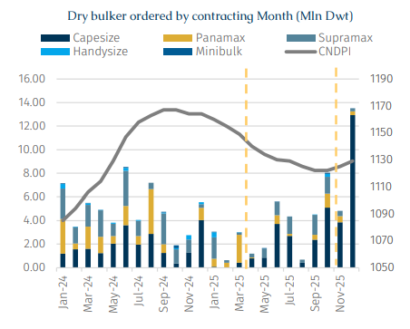
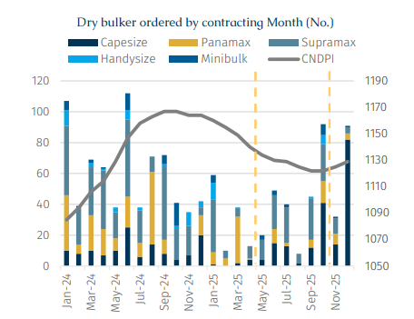
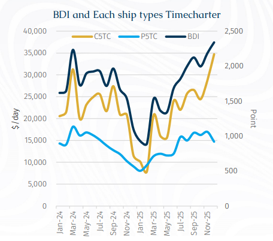
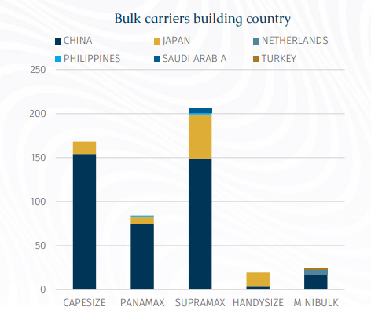

# USTR Suspension Impact on Dry Bulk Newbuilding?

**Date:** February 03, 2026  
**Publisher:** Breakwave Advisors | **Category:** Market Insights  
**Original URL:** [https://www.breakwaveadvisors.com/insights/2026/2/3/ustr-suspension-impact-on-dry-bulk-newbuilding](https://www.breakwaveadvisors.com/insights/2026/2/3/ustr-suspension-impact-on-dry-bulk-newbuilding)  

---

> **Figure 1: Rgb Color Brs Shipbrokers Monogram L**  
> [Local Asset](file:///C:/Users/Dell/Github/Shipping/corpus/03-breakwave/insights/2026/assets/2026-02-03_ustr-suspension-impact-on-dry-bulk-newbuilding_img_rgb-color-brs-shipbrokers-monogram-l_c365f35f1de5.png)

Last year the newbuilding industry, and especially orders for dry bulkers, experienced a bleak period due to the impact of the regulations targeting Chinese shipbuilding and Chinese owned and operated ships which were formulated by the Office of the United States Trade Representative (USTR).

From a timeline perspective, although the USTR formally initiated a Section 301 investigation into China’s maritime, logistics, and shipbuilding sectors in April 2024, the findings were not published until April 2025. Consequently, global bulk carrier new orders in 2024 still reached 59.6 mln Dwt, a year-on-year increase of 16%, reflecting strong willingness among shipowners to place orders midst a resilient market demand.

Data suggest that the release of proposals to impose additional fees on certain Chinese vessels proved to be the catalyst for a significant decline in new ship ordering activity in April. Accordingly, the China Newbuilding Price Index (CNDPI) weakened. Furthermore, weakness in ordering was further compounded by the overall weakness in the charter market during 1H25.

> **Figure 2: Στιγμιότυπο Οθόνης 2026 02 02 152430**  
> [Local Asset](file:///C:/Users/Dell/Github/Shipping/corpus/03-breakwave/insights/2026/assets/2026-02-03_ustr-suspension-impact-on-dry-bulk-newbuilding_img_cea3cf84ceb9ceb3cebcceb9cf8ccf84cf85_0d9c1e6228de.png)

> **Figure 3: Στιγμιότυπο Οθόνης 2026 02 02 152443**  
> [Local Asset](file:///C:/Users/Dell/Github/Shipping/corpus/03-breakwave/insights/2026/assets/2026-02-03_ustr-suspension-impact-on-dry-bulk-newbuilding_img_cea3cf84ceb9ceb3cebcceb9cf8ccf84cf85_bb11f7f87637.png)

> **Figure 4: Στιγμιότυπο Οθόνης 2026 02 02 152455**  
> [Local Asset](file:///C:/Users/Dell/Github/Shipping/corpus/03-breakwave/insights/2026/assets/2026-02-03_ustr-suspension-impact-on-dry-bulk-newbuilding_img_cea3cf84ceb9ceb3cebcceb9cf8ccf84cf85_051cd901c7e3.png)

After the initial USTR proposals were published, there were several calls for comments. However, Washington did not provide regular updates and thus the USTR proposals loomed over shipping markets for much of the year with these accentuating as the 14 October implementation date approached. Indeed, as the USTR regulations were introduced it became clear that China would introduce similar reciprocal measures on US-linked ships.

Consequently, following a meeting between the Chinese and US governments, a consensus was reached to "temporarily suspend" the measures. Subsequently, in early November, the US formally announced a one-year suspension of the relevant Section 301 restrictions, an outcome widely regarded as a direct result of high-level diplomacy.

Lat year saw 504 dry bulkers ordered for a combined 50.8 mln Dwt. This represented year-on-year declines of 15.5% in Dwt terms and 32% in vessel numbers. Notably, the number of vessels ordered fell to its lowest level in the past five years.

In the first half of 2025, sentiment in the dry bulk charter market remained sluggish, particularly early in the year when the BDI fell to a low of 892 points, hitting its lowest level in the past 26 months. This, together with the USTR uncertainty, significantly dampened shipowners' willingness to place new orders.

Despite the weakening of the CNDPI for most of last year, it eventually stabilized and rebounded in the third quarter in the wake of higher freight rates.

Notably, some yards that previously focused on bulk carriers began accepting orders for containers and tankers as they went after ships with more added value. For example, New Dayang Shipbuilding, which traditionally built 63,000 Dwt bulk carriers, started constructing feeders and MR tankers last year.

> **Figure 5: Στιγμιότυπο Οθόνης 2026 02 02 152504**  
> [Local Asset](file:///C:/Users/Dell/Github/Shipping/corpus/03-breakwave/insights/2026/assets/2026-02-03_ustr-suspension-impact-on-dry-bulk-newbuilding_img_cea3cf84ceb9ceb3cebcceb9cf8ccf84cf85_bf0ce273debc.png)

The ordering pattern for each vessel segment also differed in 2025. Capesize orders increased substantially, with their share of total newbuilding vessels rising from 18% in 2024 to 38% in 2025, while the share of other vessel classes declined across the board. Furthermore, clearly can be seen from chart, China continues to dominate the newbuilding order with an overwhelming advantage, accounting for 80% of the total number of dry bulker orders. Itself, this implies that the cheaper prices available in Chinese yards trumped the uncertainty generated from the USTR proposals.

A closer look at the April–September 2025 period reveals that newbuilding activity was heavily concentrated in the Supramax and Capesize segments. During this six-month window, Capesize orders reached 51 vessels, accounting for 27% of total Capesize orders placed during the year. Of these, only six vessels were contracted at Japanese yards, with the remainder placed at Chinese shipyards. This suggests that, aside from Chinese owners, a number of international owners did not refrain from ordering large bulkers in China despite the proposed port fees. This behavior can largely be explained by the operating profile of large vessels, which are typically backed by long-term charters that do not involve US port calls. Moreover, Capesize participation in US trades remains structurally limited. In 2025, US exports carried by Capesize vessels accounted for only 21 voyages, of which just eight vessels would have been subject to the proposed fees, implying minimal real exposure.

The Supramax segment demonstrated similar resilience. Orders placed between April and September accounted for 54.6% of the vessel type’s total annual orders, indicating that US policy measures did not materially deter ordering activity. This can be attributed in part to multiple exemption clauses embedded in the proposed sanctions framework. Vessels below 55,000 Dwt were eligible for exemptions, as were bulk carriers calling at US ports in ballast to load export cargoes such as soybeans or corn, vessels arriving from ports within 2,000 nautical miles of the US, and ships participating in the US Maritime Security Program (MSP).

In addition, smaller bulkers typically offer greater operational flexibility, shorter voyage distances, and broader cargo optionality particularly geared vessels capable of handling project and breakbulk cargoes. Many of these vessels do not regularly operate on US routes at all. According to AXSMarine data, Supramax voyages into the US amounted to 1,185 voyages in 2025, accounting for only 5.1% of global Supramax trade volumes, while exports from the US totaled approximately 1,982 voyages, or 8.6% of global volumes. This relatively limited exposure helps explain why ordering appetite remained intact.

In contrast, the broader Panamax segment (68-84,999 Dwt) faced noticeably stronger headwinds. As the backbone of global grain trades, Panamax newbuilding orders in 2025 totaled just 85 vessels, with their share of total dry bulk orders falling by nine percentage points year-on-year. During the April–September period, only 17 Panamax vessels were ordered, seven of which were contracted at shipyards in Japan and the Philippines. The remaining ten vessels were placed outside Chinese yards by non-Chinese owners, thereby avoiding potential port fees. Given that most Panamax vessels exceed 80,000 Dwt and therefore do not qualify for exemption, this segment emerged as the most directly affected by U.S. policy measures.

A breakdown of the Panamax orderbook further highlights the weakness in this segment. Mainstream Kamsarmax orders totaled only 80 vessels in 2025, representing a sharp year-on-year decline of 73%. Orders below 80,000 Dwt namely 71,000 Dwt and 79,000 Dwt vessels were largely concentrated in multipurpose or geared designs rather than standard bulk carriers. These included four 71,000 Dwt vessels ordered by Navibulgar, representing the largest bulk carriers in its fleet and all equipped with cranes, as well as 30 units of 79,000 Dwt vessels ordered by COSCO Shipping.

Overall, political frictions and policy uncertainty did exert a tangible, albeit temporary, impact on dry bulk newbuilding activity, particularly during the April–September 2025 period when ordering volumes declined visibly. However, from a broader perspective, the fundamental drivers of shipowners’ contracting decisions remain freight market performance, newbuilding prices, yard slot availability, and relative returns across vessel segments. At the same time, amid increasingly tight shipyard capacity, builders continue to prioritize higher value-added vessel types such as containers and tankers which is also influencing the trajectory of dry bulker ordering.

---

**Tags:** Drybulk, Shipping, Markets  
