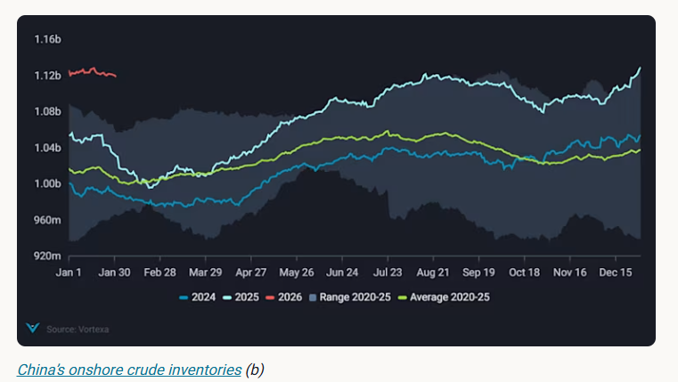
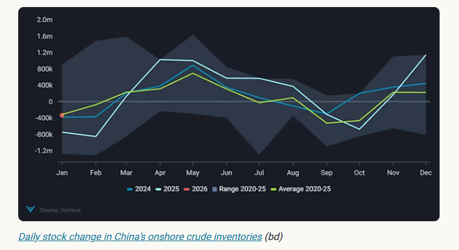
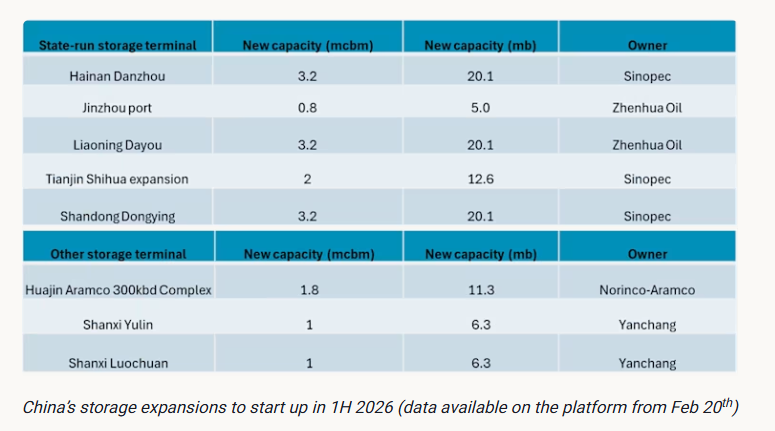

# New storage tanks to lift China’s crude stockpiling demand

**Date:** February 04, 2026  
**Publisher:** Breakwave Advisors | **Category:** Market Insights  
**Original URL:** [https://www.breakwaveadvisors.com/insights/2026/2/4/new-storage-tanks-to-lift-chinas-crude-stockpiling-demand](https://www.breakwaveadvisors.com/insights/2026/2/4/new-storage-tanks-to-lift-chinas-crude-stockpiling-demand)  

---

As China continues to expand refining and storage capacity, questions remain over how much incremental crude demand this will generate in the coming year.

*By*[*Emma Li*](https://www.linkedin.com/in/emma-li-73003443/)

[China’s seaborne crude imports](https://analytics.vortexa.com/Flows?dateRange=2023-01-01T00%3A00%3A00.000Z__2026-01-31T23%3A59%3A59.999Z&metric=bpd&movementEvent=unloading_start&page=Flows&products=%5B%2254af755a090118dcf9b0724c9a4e9f14745c26165385ffa7f1445bc768f06f11%22%5D&tabId=f1ee9c23-289c-447b-a592-0b7b8ba0ee88&timeSeriesBaselineEnd=2024-12-31T23%3A59%3A59.999Z&timeSeriesBaselineStart=2024-01-01T00%3A00%3A00.000Z&timeSeriesHiddenSeries=%5B%220bdc8aa32b8c0bed35aeaa508bf62ea8d7212d28b90cd11920c15b0b9b027ab9%22%5D&timeSeriesProperty=origin_region&timeSeriesSeasonalToggle=1&to=%5B%22b5fafce6e20de2dc307fb7e0b89978ee91a49a7b6ec6f5461daf2633f3c56674%22%5D&v=3)have eased from the December peak of over 12mbd, slipping to around 10.6mbd most recently. This level is broadly flat with the 2025 annual average, reflecting the conclusion of year-end stockpiling rather than a deterioration in underlying demand.

Refiners had accelerated imports in late 2025 to utilise remaining quotas and build inventories ahead of winter, a dynamic that has now largely played out.

Despite this near-term slowdown in imports, China’s onshore crude inventories (excluding underground storage) continued to rise through 2025, reaching a record ~1.13 billion barrels by year-end. Total stock builds amounted to around 75mb, equivalent to an average stockpiling rate of 205kbd, up roughly 40% from 148kbd in 2024.

> **Figure 1: Στιγμιότυπο Οθόνης 2026 02 04 132210**  
> **Interactive Data & Source:** [Analytics Vortexa](https://analytics.vortexa.com/Flows?dateRange=2023-01-01T00%3A00%3A00.000Z__2026-01-31T23%3A59%3A59.999Z&from=%5B%22b996521be9c996db3560ca234a56286ac38f798d34be229437555fab4f12a6a5%22%5D&metric=bpd&movementEvent=unloading_start&page=Flows&products=%5B%2254af755a090118dcf9b0724c9a4e9f14745c26165385ffa7f1445bc768f06f11%22%5D&productsExcluded=%5B%22bb70cf56200f5b72ba69a90bda2c6b47ba29da23945c6f1994cfd4c2ef2fe0ff%22%2C%22578b0722570521d64e6a1527e1fb88ddb1a064cc15afe1d6023d2a0b6d66be6b%22%5D&tabId=f1ee9c23-289c-447b-a592-0b7b8ba0ee88&timeSeriesBaselineEnd=2024-12-31T23%3A59%3A59.999Z&timeSeriesBaselineStart=2024-01-01T00%3A00%3A00.000Z&timeSeriesHiddenSeries=%5B%220bdc8aa32b8c0bed35aeaa508bf62ea8d7212d28b90cd11920c15b0b9b027ab9%22%5D&timeSeriesProperty=origin_shipping_region_v2&to=%5B%220fddbfd0d90bad306a92fcb483a19276f101a5f7f0783363f9f2a9d40c10558d%22%5D&v=3) | [Local Asset](file:///C:/Users/Dell/Github/Shipping/corpus/03-breakwave/insights/2026/assets/2026-02-04_new-storage-tanks-to-lift-chinas-crude-stockpiling-demand_img_cea3cf84ceb9ceb3cebcceb9cf8ccf84cf85_f6ec9522bbd1.png)

## Uneven Stock Build Across Tank Ownership Types

The faster pace of crude stock builds last year was largely driven by private refiners and traders, with close to 100kbd flowing into private-owned storage, particularly in Shandong. These tanks played a critical role in absorbing heavily discounted, blockade-evading sanctioned crude barrels, especially in 2H, as teapot refiners capitalised on sharp price dislocations.

Shandong’s private inventories continued to rise through January, supported by[record Russian crude arrivals](https://analytics.vortexa.com/Flows?dateRange=2023-01-01T00%3A00%3A00.000Z__2026-01-31T23%3A59%3A59.999Z&from=%5B%22b996521be9c996db3560ca234a56286ac38f798d34be229437555fab4f12a6a5%22%5D&metric=bpd&movementEvent=unloading_start&page=Flows&products=%5B%2254af755a090118dcf9b0724c9a4e9f14745c26165385ffa7f1445bc768f06f11%22%5D&productsExcluded=%5B%22bb70cf56200f5b72ba69a90bda2c6b47ba29da23945c6f1994cfd4c2ef2fe0ff%22%2C%22578b0722570521d64e6a1527e1fb88ddb1a064cc15afe1d6023d2a0b6d66be6b%22%5D&tabId=f1ee9c23-289c-447b-a592-0b7b8ba0ee88&timeSeriesBaselineEnd=2024-12-31T23%3A59%3A59.999Z&timeSeriesBaselineStart=2024-01-01T00%3A00%3A00.000Z&timeSeriesHiddenSeries=%5B%220bdc8aa32b8c0bed35aeaa508bf62ea8d7212d28b90cd11920c15b0b9b027ab9%22%5D&timeSeriesProperty=origin_shipping_region_v2&to=%5B%220fddbfd0d90bad306a92fcb483a19276f101a5f7f0783363f9f2a9d40c10558d%22%5D&v=3)in both December and January. This is notable given that teapot refiners had already accumulated substantial stocks in the final two months of 2025, after accelerating imports to fully utilise year-end crude import quotas.

In contrast,[stock builds at state-owned facilities](https://analytics.vortexa.com/OnShoreCrudeInventories?breakdownUnit=daily_change&dateRange=2022-01-01T00%3A00%3A00.000Z__2025-12-31T23%3A59%3A59.999Z&frequency=year&hiddenSeries=%5B%22total_capacity%22%5D&onshoreInventoriesLocations=%5B%22b5fafce6e20de2dc307fb7e0b89978ee91a49a7b6ec6f5461daf2633f3c56674%22%2C%220fddbfd0d90bad306a92fcb483a19276f101a5f7f0783363f9f2a9d40c10558d%22%5D&owners=%5B%220378fb82d2401de13a59bd08bb385f1a20adf21e2da07db44a946af23130f729%22%2C%22f78558ef7c9b9f162545a56b330111c274d578a2933f46ec82ee004ca4f449bd%22%2C%2283752cdf35981ccf2eb235ff37a86354de4b66e32511a822a5442a8f9a636f63%22%2C%229cc2c2bd3dd7dd76abc9c2f444f9f9982f35f1a351d7063b1b10d96b5b5ad930%22%2C%225973f00db1db3a658ee24b7e061503949b8c93d845d6f11a8c9ed059b377b3d7%22%2C%22656b4e8dc3c37a0efdd7a38c901d4f215dbcae10c19687c16de1ab8455cf127a%22%5D&page=OnShoreCrudeInventories&selectedRegion=%5B%22b5fafce6e20de2dc307fb7e0b89978ee91a49a7b6ec6f5461daf2633f3c56674%22%5D&splitSelected=corporate_entity_id&tabId=8a116b28-21cc-4e42-92d5-7004f6a63918&tankCrude=%5B%22confirmed%22%2C%22probable%22%5D&tsVisualType=table)slowed markedly year on year. State-run inventories rose by only around 110kbd through 2025, down from more than 160kbd in 2024. This deceleration reflected tightening storage constraints rather than weaker appetite, unfolding alongside a recovery in Chinese majors’ refining runs and against a backdrop of lower crude prices, with Brent averaging in the mid-$60s in 2025, compared with higher levels in 2024.

**Average utilisation at state-run tanks climbed to around 67%, with some major coastal sites breaching 90%, sharply limiting their ability to absorb incremental barrels in 2H 2025.**

Operational disruptions further compounded these constraints. The US sanction on the Rizhao Shihua terminal in October — a key gateway supplying roughly 20% of Sinopec’s ~4mbd crude import requirements — forced China’s largest refiner to rely more heavily on inventories built earlier in the year. As a result, Sinopec-controlled storage recorded a net draw of around 20kbd, even as national crude stocks continued to rise.

## New Storage and Refining Capacities on the Horizon

While China continues to pursue strategic energy security through inventory expansion, crude stock changes follow a strong seasonal pattern. Historically, stock builds are concentrated in Q2, with draws typically emerging in Q3. Refiners usually ramp up inventory accumulation between March and July to prepare for the autumn demand peak, creating a recurring window of stockpiling-driven crude demand.

> **Figure 2: Στιγμιότυπο Οθόνης 2026 02 04 132327**  
> **Interactive Data & Source:** [Vortexa](https://www.vortexa.com//oil-gas-data-traders-analysts-data-scientists?gclid=Cj0KCQjw8_qRBhCXARIsAE2AtRZKOvMnbilZ_6_91d7huSFFy71pWLrnPwGwOHVzXsmsG-1a1mZnQw8aAt89EALw_wcB&hsa_acc=1782073842&hsa_ad=548425387665&hsa_cam=14746637662&hsa_grp=125038601902&hsa_kw=&hsa_mt=&hsa_net=adwords&hsa_src=g&hsa_tgt=dsa-1431852288425&hsa_ver=3&utm_campaign=%5BCD%5D%20-%20DSA%20-%20EMEA&utm_medium=cpc&utm_medium=ppc&utm_source=google&utm_source=adwords&utm_term=) | [Local Asset](file:///C:/Users/Dell/Github/Shipping/corpus/03-breakwave/insights/2026/assets/2026-02-04_new-storage-tanks-to-lift-chinas-crude-stockpiling-demand_img_cea3cf84ceb9ceb3cebcceb9cf8ccf84cf85_175f4e2f34a3.png)

Since September last year, we have highlighted tight storage availability as a key constraint on further national crude stock builds, as many new state-owned tank sites remained under construction. That picture is now beginning to shift. Several of the storage projects we have been tracking are becoming visible on the ground, signalling that construction is nearing completion and that incremental capacity could start to enter the system in the coming months.

Most of the upcoming capacity is controlled by state-run operators, including Sinopec and Zhenhua. This implies that incremental stockpiling demand will be skewed toward sanctions-compliant, mainstream crude grades, rather than higher-risk barrels.

That said, this does not fully preclude inflows of sanctioned crude. Average utilisation at private-owned storage facilities remains relatively low, at around 50%, leaving ample spare capacity to absorb additional inflows.

Moreover, elevated geopolitical risks could encourage Iranian and Russian barrels to be moved onshore rather than kept on water, as traders seek to reduce exposure to potential transit disruptions or enforcement risks, and refiners opportunistically capture deeply discounted barrels when logistics allow.

> **Figure 3: Στιγμιότυπο Οθόνης 2026 02 04 132419**  
> **Interactive Data & Source:** [Vortexa](https://www.vortexa.com//oil-gas-data-traders-analysts-data-scientists?gclid=Cj0KCQjw8_qRBhCXARIsAE2AtRZKOvMnbilZ_6_91d7huSFFy71pWLrnPwGwOHVzXsmsG-1a1mZnQw8aAt89EALw_wcB&hsa_acc=1782073842&hsa_ad=548425387665&hsa_cam=14746637662&hsa_grp=125038601902&hsa_kw=&hsa_mt=&hsa_net=adwords&hsa_src=g&hsa_tgt=dsa-1431852288425&hsa_ver=3&utm_campaign=%5BCD%5D%20-%20DSA%20-%20EMEA&utm_medium=cpc&utm_medium=ppc&utm_source=google&utm_source=adwords&utm_term=) | [Local Asset](file:///C:/Users/Dell/Github/Shipping/corpus/03-breakwave/insights/2026/assets/2026-02-04_new-storage-tanks-to-lift-chinas-crude-stockpiling-demand_img_cea3cf84ceb9ceb3cebcceb9cf8ccf84cf85_25a18c6f2467.png)

The timing of initial oil fill remains uncertain, as storage commissioning is often tied to broader port and terminal upgrades. Tanks typically begin absorbing crude only once associated infrastructure is fully operational.

For example, the Dongying port VLCC expansion is expected to be completed around June, suggesting that new Sinopec-controlled storage at the site is unlikely to start up before mid-year, even if the tanks themselves are technically ready. Similarly, the 300kbd Huajin–Aramco Petrochemical complex is reportedly scheduled to begin trial runs in Q3, implying that refinery-linked storage intake could commence in mid-year.

Taken together, the addition of ~80 mb of new state-run storage, alongside ~24 mb of other capacity and incremental refining throughput, points to a renewed ability for China to absorb crude inventories. While stockpiling may remain uneven in early 2026, these new capacities could keep China’s crude stock builds elevated over the course of the year — particularly in 2H 2026, when both storage availability and seasonal demand conditions align more favourably.

Data Source:[Vortexa](https://www.vortexa.com//oil-gas-data-traders-analysts-data-scientists?gclid=Cj0KCQjw8_qRBhCXARIsAE2AtRZKOvMnbilZ_6_91d7huSFFy71pWLrnPwGwOHVzXsmsG-1a1mZnQw8aAt89EALw_wcB&hsa_acc=1782073842&hsa_ad=548425387665&hsa_cam=14746637662&hsa_grp=125038601902&hsa_kw=&hsa_mt=&hsa_net=adwords&hsa_src=g&hsa_tgt=dsa-1431852288425&hsa_ver=3&utm_campaign=%5BCD%5D%20-%20DSA%20-%20EMEA&utm_medium=cpc&utm_medium=ppc&utm_source=google&utm_source=adwords&utm_term=)

---

**Tags:** China, Crude, Markets  
