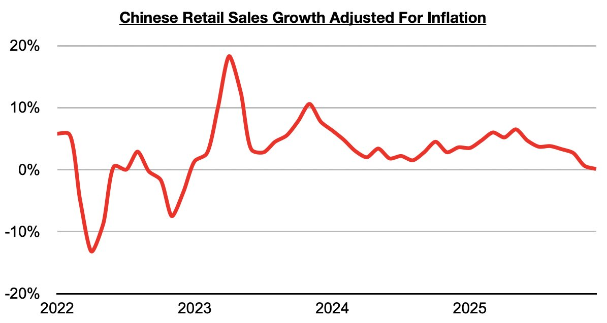

# China's Consumer Sector Remains Weak

**Date:** February 05, 2026  
**Publisher:** Breakwave Advisors | **Category:** Market Insights  
**Original URL:** [https://www.breakwaveadvisors.com/insights/2026/2/5/chinas-consumer-sector-remains-weak](https://www.breakwaveadvisors.com/insights/2026/2/5/chinas-consumer-sector-remains-weak)  

---

*By*[*Jeffrey Landsberg*](https://www.linkedin.com/in/jeffrey-landsberg-70ab957/)

As we discussed in Commodore Research's most recent Weekly China Report, China’s retail sales in December grew year-on-year by only 0.9%, which has marked another decline. Taking December’s 0.8% inflation into account, retail sales adjusted for inflation/deflation grew year-on-year by just 0.1%. This has again marked the lowest growth seen since 2022.

> **Figure 1: Chart**  
> [Local Asset](file:///C:/Users/Dell/Github/Shipping/corpus/03-breakwave/insights/2026/assets/2026-02-05_chinas-consumer-sector-remains-weak_img_chart_2de1ff4b0b33.jpg)

Overall, consumption growth in China's consumer sector continues to decline and during the last two months has been extremely concerning. China is very close to the point where consumers are buying less actual goods than they did the previous year. The industrial side continues to fare much better, however, as we have continued to discuss in Commodore Research's Weekly Executive Reports.

---

**Tags:** China, Economy, Markets  
