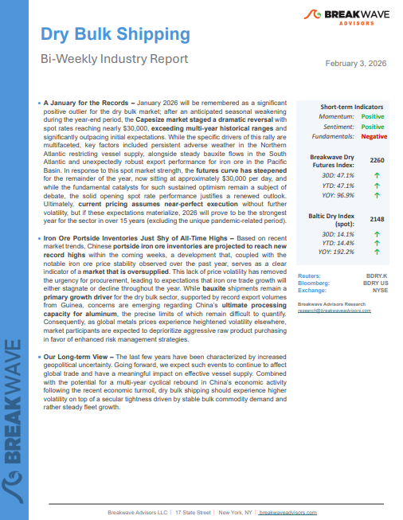
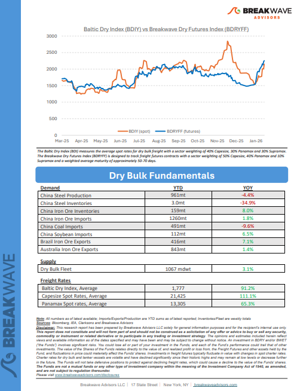

# Breakwave Weekend Read

**Date:** February 06, 2026  
**Publisher:** Breakwave Advisors | **Category:** Market Insights  
**Original URL:** [https://www.breakwaveadvisors.com/insights/2024/10/25/breakwave-weekend-read-547kk-rw7zy-awmfb-mf26k-dk29d-56ysb-x3jbe-xbwk9-dnpbr-b6jhc-l4mb2-d4l2e-f7l54-fsr59-y9ckz](https://www.breakwaveadvisors.com/insights/2024/10/25/breakwave-weekend-read-547kk-rw7zy-awmfb-mf26k-dk29d-56ysb-x3jbe-xbwk9-dnpbr-b6jhc-l4mb2-d4l2e-f7l54-fsr59-y9ckz)  

---

## Welcome Tobreakwave Advisorsweekend Read

***As the week comes to a close, take a moment to review the key insights from the past few days. Missed something? We've gathered all the top insights for you to catch up at your convenience.***

## Breakwave Shipping Report

**A January for the Records**– January 2026 will be remembered as a significant positive outlier for the dry bulk market;

[Read More](https://www.breakwaveadvisors.com/insights/232026db-report2026kk98)

> **Figure 1: Στιγμιότυπο Οθόνης 2026 02 05 124917**  
> **Interactive Data & Source:** [Breakwave Advisors Market Insights](https://www.breakwaveadvisors.com/insights/2026/2/2/china-closed-2025-with-headline-economic-growth) | [Local Asset](file:///C:/Users/Dell/Github/Shipping/corpus/03-breakwave/insights/2026/assets/2026-02-06_breakwave-weekend-read-547kk-rw7zy-awmfb-mf26k-dk29d-56ysb-x3jbe-xbwk9-dnpbr-b6j_img_cea3cf84ceb9ceb3cebcceb9cf8ccf84cf85_026dde2485ce.png)

> **Figure 2: Στιγμιότυπο Οθόνης 2026 02 05 124930**  
> **Interactive Data & Source:** [Breakwave Advisors Market Insights](https://www.breakwaveadvisors.com/insights/2026/2/2/china-closed-2025-with-headline-economic-growth) | [Local Asset](file:///C:/Users/Dell/Github/Shipping/corpus/03-breakwave/insights/2026/assets/2026-02-06_breakwave-weekend-read-547kk-rw7zy-awmfb-mf26k-dk29d-56ysb-x3jbe-xbwk9-dnpbr-b6j_img_cea3cf84ceb9ceb3cebcceb9cf8ccf84cf85_08865d41856a.png)

## Insights of the Week

## China Closed 2025 with Headline Economic Growth

> **Figure 3: Unsplash Image Ntkho6lbca**  
> **Interactive Data & Source:** [Breakwave Advisors Market Insights](https://www.breakwaveadvisors.com/insights/2026/2/2/china-closed-2025-with-headline-economic-growth) | [Local Asset](file:///C:/Users/Dell/Github/Shipping/corpus/03-breakwave/insights/2026/assets/2026-02-06_breakwave-weekend-read-547kk-rw7zy-awmfb-mf26k-dk29d-56ysb-x3jbe-xbwk9-dnpbr-b6j_img_unsplash-image-ntkho6lbca_90e259db1213.jpg)

China closed 2025 with headline economic growth broadly in line with official objectives, offering a sense of macroeconomic continuity as the country prepares to transition into the 15th Five-Year Plan period.

Doric Weekly Market Insights

## Geopolitics Before Fundamentals

> **Figure 4: Istock 485480338**  
> **Interactive Data & Source:** [Breakwave Advisors Market Insights](https://www.breakwaveadvisors.com/insights/2026/2/2/geopolitics-before-fundamentals) | [Local Asset](file:///C:/Users/Dell/Github/Shipping/corpus/03-breakwave/insights/2026/assets/2026-02-06_breakwave-weekend-read-547kk-rw7zy-awmfb-mf26k-dk29d-56ysb-x3jbe-xbwk9-dnpbr-b6j_img_istock-485480338_ce7742c70ec8.jpg)

Geopolitical developments dominated tanker markets last year, with a wave of sanctions primarily targeting Russia, secondary measures aimed at entities trading Russian and Iranian crude, the brief Israel-Iran conflict, Trump’s inauguration, US trade wars, and the US-China port-fee standoff among the key events. So far, this year is proving just as “eventful” as 2025.

Gibson Tanker Market Report

## Seaborne Coal Suffers in 2025 As China Burns Less and Produces More

Global seaborne coal flows suffered in 2025 due to significantly lower imports from China. This is a trend we expect to continue.

[Read More](https://www.breakwaveadvisors.com/insights/2026/2/3/seaborne-coal-suffers-in-2025-as-china-burns-less-and-produces-more)

Signal Ocean Commodity Radar

> **Figure 5: Unsplash Image Dqgiay0k08o**  
> **Interactive Data & Source:** [Breakwave Advisors Market Insights](https://www.breakwaveadvisors.com/insights/2026/2/3/ustr-suspension-impact-on-dry-bulk-newbuilding) | [Local Asset](file:///C:/Users/Dell/Github/Shipping/corpus/03-breakwave/insights/2026/assets/2026-02-06_breakwave-weekend-read-547kk-rw7zy-awmfb-mf26k-dk29d-56ysb-x3jbe-xbwk9-dnpbr-b6j_img_unsplash-image-dqgiay0k08o_1c46f799458b.jpg)

## Ustr Suspension Impact on Dry Bulk Newbuilding?

> **Figure 6: Unsplash Image 8d6xh203sm0**  
> **Interactive Data & Source:** [Breakwave Advisors Market Insights](https://www.breakwaveadvisors.com/insights/2026/2/3/ustr-suspension-impact-on-dry-bulk-newbuilding) | [Local Asset](file:///C:/Users/Dell/Github/Shipping/corpus/03-breakwave/insights/2026/assets/2026-02-06_breakwave-weekend-read-547kk-rw7zy-awmfb-mf26k-dk29d-56ysb-x3jbe-xbwk9-dnpbr-b6j_img_unsplash-image-8d6xh203sm0_961b7514f964.jpg)

Last year the newbuilding industry, and especially orders for dry bulkers, experienced a bleak period due to the impact of the regulations targeting Chinese shipbuilding and Chinese owned and operated ships which were formulated by the Office of the United States Trade Representative (USTR).

BRS Weekly Dry Bulk Newsletter

## China's Thermal Coal Consumption Has Recently Exceeded New Supply

> **Figure 7: Unsplash Image Kxbqf0km Dy**  
> **Interactive Data & Source:** [Breakwave Advisors Market Insights](https://www.breakwaveadvisors.com/insights/2026/2/4/chinas-thermal-coal-consumption-has-recently-exceeded-new-supply) | [Local Asset](file:///C:/Users/Dell/Github/Shipping/corpus/03-breakwave/insights/2026/assets/2026-02-06_breakwave-weekend-read-547kk-rw7zy-awmfb-mf26k-dk29d-56ysb-x3jbe-xbwk9-dnpbr-b6j_img_unsplash-image-kxbqf0km-dy_dfa178f97f7d.jpg)

As we discussed in Commodore Research's most recent Weekly Executive Report, an in-depth examination of China’s most recent thermal coal consumption data by industry (December’s data) shows that the consumption of thermal coal for power generation and heating, consumption for the production of pig iron, consumption for the production of cement, and consumption for other industrial needs all most recently contracted on a year-on-year basis

From Commodore's Weekly Dry Bulk Reports

## New Storage Tanks to Lift China’s Crude Stockpiling Demand

> **Figure 8: Στιγμιότυπο Οθόνης 2026 02 04 132540**  
> **Interactive Data & Source:** [Breakwave Advisors Market Insights](https://www.breakwaveadvisors.com/insights/2026/2/4/new-storage-tanks-to-lift-chinas-crude-stockpiling-demand) | [Local Asset](file:///C:/Users/Dell/Github/Shipping/corpus/03-breakwave/insights/2026/assets/2026-02-06_breakwave-weekend-read-547kk-rw7zy-awmfb-mf26k-dk29d-56ysb-x3jbe-xbwk9-dnpbr-b6j_img_cea3cf84ceb9ceb3cebcceb9cf8ccf84cf85_e366b0cce43e.png)

As China continues to expand refining and storage capacity, questions remain over how much incremental crude demand this will generate in the coming year.

Vortexa Freight Weekly

## Energy Realignment: India Drops Russian Crude, Secures Us Tariff Relief

> **Figure 9: Unsplash Image Euxwco5pfse**  
> **Interactive Data & Source:** [Breakwave Advisors Market Insights](https://www.breakwaveadvisors.com/insights/2026/2/4/energy-realignment-india-drops-russian-crude-secures-us-tariff-relief) | [Local Asset](file:///C:/Users/Dell/Github/Shipping/corpus/03-breakwave/insights/2026/assets/2026-02-06_breakwave-weekend-read-547kk-rw7zy-awmfb-mf26k-dk29d-56ysb-x3jbe-xbwk9-dnpbr-b6j_img_unsplash-image-euxwco5pfse_699cb97fd767.jpg)

On Monday, 2nd February 2026, U.S. President Donald Trump announced a new trade deal with India. The deal laid out how India will stop purchasing Russian crude oil and import more from the U.S., and possibly Venezuela.

Signal Ocean Market Insights

## China's Consumer Sector Remains Weak

> **Figure 10: Unsplash Image Yfdnhalbbjk**  
> **Interactive Data & Source:** [Breakwave Advisors Market Insights](https://www.breakwaveadvisors.com/insights/2026/2/5/chinas-consumer-sector-remains-weak) | [Local Asset](file:///C:/Users/Dell/Github/Shipping/corpus/03-breakwave/insights/2026/assets/2026-02-06_breakwave-weekend-read-547kk-rw7zy-awmfb-mf26k-dk29d-56ysb-x3jbe-xbwk9-dnpbr-b6j_img_unsplash-image-yfdnhalbbjk_e6e1a15ee71d.jpg)

As we discussed in Commodore Research's most recent Weekly China Report, China’s retail sales in December grew year-on-year by only 0.9%, which has marked another decline.

From Commodore's Weekly Dry Bulk Reports

## Big Picture: India-Us Trade Deal

> **Figure 11: Στιγμιότυπο Οθόνης 2026 02 05 144633**  
> **Interactive Data & Source:** [Breakwave Advisors Market Insights](https://www.breakwaveadvisors.com/insights/2026/2/5/big-picture-india-us-trade-deal) | [Local Asset](file:///C:/Users/Dell/Github/Shipping/corpus/03-breakwave/insights/2026/assets/2026-02-06_breakwave-weekend-read-547kk-rw7zy-awmfb-mf26k-dk29d-56ysb-x3jbe-xbwk9-dnpbr-b6j_img_cea3cf84ceb9ceb3cebcceb9cf8ccf84cf85_bb8086e1f077.png)

On Monday Trump cut India’s tariffs on exports to the US from 50% to 18%. Trump stated that Modi, for his part, had agreed to stop his country’s refiners buying Russian oil.

Braemar Research

## Dry Bulk Markets Stay Firm Ahead of Lunar New Year Pressure Points

> **Figure 12: Unsplash Image 3j1kq7kf6ka**  
> **Interactive Data & Source:** [Breakwave Advisors Market Insights](https://www.breakwaveadvisors.com/insights/2026/2/5/dry-bulk-markets-stay-firm-ahead-of-lunar-new-year-pressure-points) | [Local Asset](file:///C:/Users/Dell/Github/Shipping/corpus/03-breakwave/insights/2026/assets/2026-02-06_breakwave-weekend-read-547kk-rw7zy-awmfb-mf26k-dk29d-56ysb-x3jbe-xbwk9-dnpbr-b6j_img_unsplash-image-3j1kq7kf6ka_0a106d587a4e.jpg)

While the**WAUS–China**trade remains the largest by volume, the Africa–North China Capesize route has seen a larger increase in tonne-mile demand over the last year than the Brazil–China route.

Signal Ocean Dry Weekly Market Monitor

## Fresh Wave of Selling Hits Metals

> **Figure 13: Unsplash Image Cgot2jfpkim**  
> **Interactive Data & Source:** [Breakwave Advisors Market Insights](https://www.breakwaveadvisors.com/insights/2026/2/6/fresh-wave-of-selling-hits-metals) | [Local Asset](file:///C:/Users/Dell/Github/Shipping/corpus/03-breakwave/insights/2026/assets/2026-02-06_breakwave-weekend-read-547kk-rw7zy-awmfb-mf26k-dk29d-56ysb-x3jbe-xbwk9-dnpbr-b6j_img_unsplash-image-cgot2jfpkim_ef8ac67fb809.jpg)

Precious metals were hit with a fresh wave of selling, which weighed on sentiment across the metals complex. Oil fell amid easing geopolitical tensions.

Commodities Wrap

---

**Tags:** Shipping, Tankers, Drybulk  
