# Dry bulk markets stay firm ahead of Lunar New Year pressure points

**Date:** February 06, 2026  
**Publisher:** Breakwave Advisors | **Category:** Market Insights  
**Original URL:** [https://www.breakwaveadvisors.com/insights/2026/2/5/dry-bulk-markets-stay-firm-ahead-of-lunar-new-year-pressure-points](https://www.breakwaveadvisors.com/insights/2026/2/5/dry-bulk-markets-stay-firm-ahead-of-lunar-new-year-pressure-points)  

---

**Chart of the Week | Capesize**[**Tonne Miles**](https://go.signalocean.com/e/983831/dry-dynamic-timeseries-dry/2rtmsk/575752048/h/Rqll2rUdWM9d1dTs5FQ-RzQQNMY8UvyGt8LVtmzUoY8)**to China**

While the**WAUS–China**trade remains the largest by volume, the Africa–North China Capesize route has seen a larger increase in tonne-mile demand over the last year than the Brazil–China route.

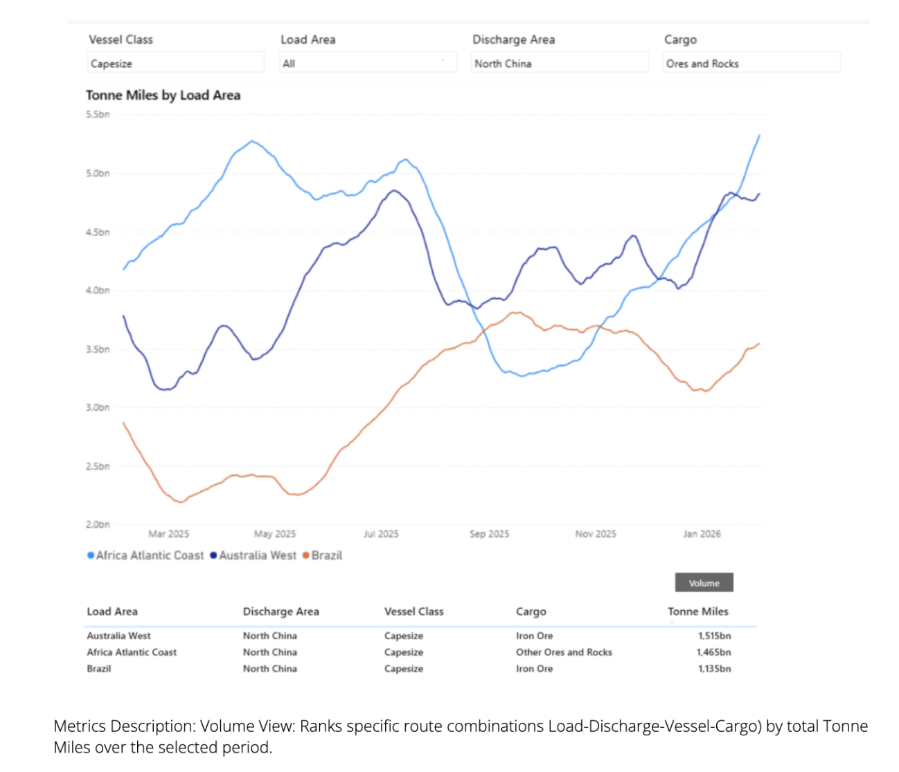

> **Figure 1: Market Chart 1**  
> **Interactive Data & Source:** [Signal Ocean Dynamic Timeseries](https://go.signalocean.com/e/983831/dry-dynamic-timeseries-dry/2rtmsk/575752048/h/Rqll2rUdWM9d1dTs5FQ-RzQQNMY8UvyGt8LVtmzUoY8) | [Local Asset](file:///C:/Users/Dell/Github/Shipping/corpus/03-breakwave/insights/2026/assets/2026-02-06_dry-bulk-markets-stay-firm-ahead-of-lunar-new-year-pressure-points_img_unnamed282329_aa923746ed6d.png)

The dry bulk freight market has demonstrated robust performance in the Atlantic and Pacific basins in the lead-up to China's Lunar New Year. This strength is evidenced by the Baltic Dry Index (BDI) surpassing 2,000 index points at the start of February 2026, marking a significant 175% annual increase.

This week's chart shows substantial growth in tonne-miles demand (available now in the[TSOP](https://go.signalocean.com/e/983831/dry-dynamic-timeseries-dry/2rtmsk/575752048/h/Rqll2rUdWM9d1dTs5FQ-RzQQNMY8UvyGt8LVtmzUoY8)), particularly on the South Africa-to-China route, which has grown by 60% since September 2025.

One big risk to the market is China’s outlook for steel demand. In early February 2026, several electric-arc furnaces were planned to undergo maintenance work that could temporarily curb[steel](https://go.signalocean.com/e/983831/ommodity-radar-spotlight-steel/2rtmsn/575752048/h/Rqll2rUdWM9d1dTs5FQ-RzQQNMY8UvyGt8LVtmzUoY8)and raw material flow.

Iron ore prices have remained under pressure, with futures in China hovering around CNY 780–790 per tonne in early February 2026, after recent declines driven by rising port inventories, ample seaborne supply, and slowing construction activity. Iron ore stocks at major Chinese ports have continued to climb as steel mills complete pre-holiday restocking and demand softens ahead of the Lunar New Year. Iron ore inventories at major Chinese port cities saw a weekly increase of 1.16%, based on Steelhome data published on January 30. Meanwhile, China’s official manufacturing PMI fell to 49.3 in January, signaling a contraction in factory activity, while the non-manufacturing sector slipped just below expansion, reinforcing concerns over near-term steel demand.

### Freight Market Overview

The Baltic Dry Index, while showing an early February dip, continued to hover above the levels observed in the two years prior.

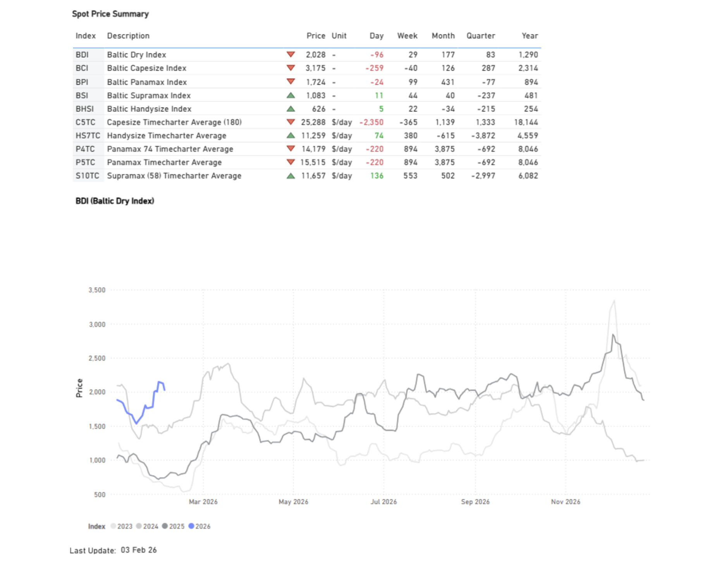

> **Figure 2: Market Chart 2**  
> **Interactive Data & Source:** [Signal Ocean Dynamic Timeseries](https://go.signalocean.com/e/983831/dry-dynamic-timeseries-dry/2rtmsk/575752048/h/Rqll2rUdWM9d1dTs5FQ-RzQQNMY8UvyGt8LVtmzUoY8) | [Local Asset](file:///C:/Users/Dell/Github/Shipping/corpus/03-breakwave/insights/2026/assets/2026-02-06_dry-bulk-markets-stay-firm-ahead-of-lunar-new-year-pressure-points_img_unnamed28929_5d49150615fd.png)

### Freight Atlantic

Capesize |**Firmer**

**C3**Tubarao–Qingdao /**C17**Saldanha Bay–Qingdao

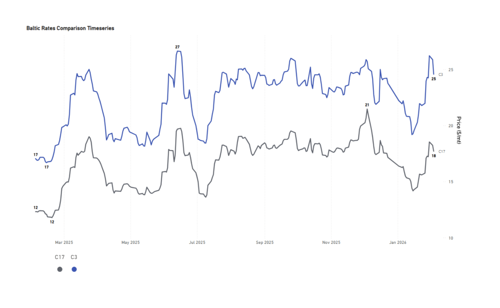

> **Figure 3: Market Chart 3**  
> **Interactive Data & Source:** [Signal Ocean Dynamic Timeseries](https://go.signalocean.com/e/983831/dry-dynamic-timeseries-dry/2rtmsk/575752048/h/Rqll2rUdWM9d1dTs5FQ-RzQQNMY8UvyGt8LVtmzUoY8) | [Local Asset](file:///C:/Users/Dell/Github/Shipping/corpus/03-breakwave/insights/2026/assets/2026-02-06_dry-bulk-markets-stay-firm-ahead-of-lunar-new-year-pressure-points_img_unnamed281029_7c9c68aa308f.png)

- The Capesize market experienced a strong rally, with the Tubarao to Qingdao rate climbing to nearly $26/ton before easing to $25/ton, yet sentiment remains 44% firmer than a year ago. An upward trend is also mirrored in the Saldanha Bay-Qingdao route, where rates have edged up to $18/ton, though the route reached a higher peak of $20/ton in early December. February’s improved sentiment provides near-term support for Capesize prospects, though uncertainty around Chinese steel demand persists.

PANAMAX |**Firmer**

**P7**USG–Qingdao grain ($/mt) /**P8**Santos–Qingdao ($/mt)

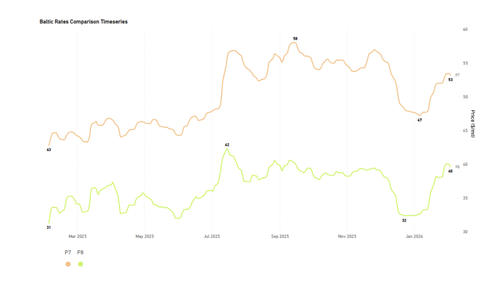

> **Figure 4: Market Chart 4**  
> **Interactive Data & Source:** [Signal Ocean Dynamic Timeseries](https://go.signalocean.com/e/983831/dry-dynamic-timeseries-dry/2rtmsk/575752048/h/Rqll2rUdWM9d1dTs5FQ-RzQQNMY8UvyGt8LVtmzUoY8) | [Local Asset](file:///C:/Users/Dell/Github/Shipping/corpus/03-breakwave/insights/2026/assets/2026-02-06_dry-bulk-markets-stay-firm-ahead-of-lunar-new-year-pressure-points_img_unnamed281129_29292625aadb.png)

- Robust Atlantic grain demand is currently bolstering Panamax rates for voyages from both the US Gulf (USG) and Santos to Qingdao. The USG-Qingdao route, in particular, saw rates with a $50/ton premium in early February, marking a 24% year-over-year increase. This favorable market momentum can be attributed in part to China's ongoing purchases of U.S. grain. Correspondingly, the Santos-Qingdao route is also experiencing substantial rate increases, nearing $40/ton.

SUPRAMAX |**Firmer**

**S4A**US Gulf trip to Skaw-Passero

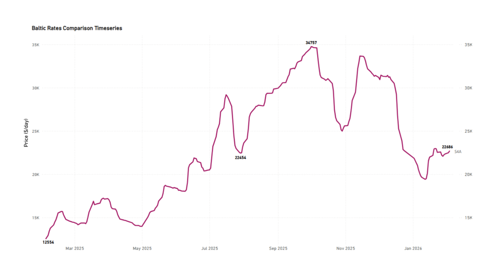

> **Figure 5: Market Chart 5**  
> **Interactive Data & Source:** [Signal Ocean Dynamic Timeseries](https://go.signalocean.com/e/983831/dry-dynamic-timeseries-dry/2rtmsk/575752048/h/Rqll2rUdWM9d1dTs5FQ-RzQQNMY8UvyGt8LVtmzUoY8) | [Local Asset](file:///C:/Users/Dell/Github/Shipping/corpus/03-breakwave/insights/2026/assets/2026-02-06_dry-bulk-markets-stay-firm-ahead-of-lunar-new-year-pressure-points_img_unnamed281229_a18ced93c0b1.png)

- The USG-to-Skaw-Passero route has seen a strong recovery, with current rates around $22.6k/day, compared to the very weak levels recorded in February of the previous year, which were as low as $13k/day.

HANDYSIZE |**Firmer**

- US Gulf trip via US Gulf or north coast of South America to Skaw-Passero

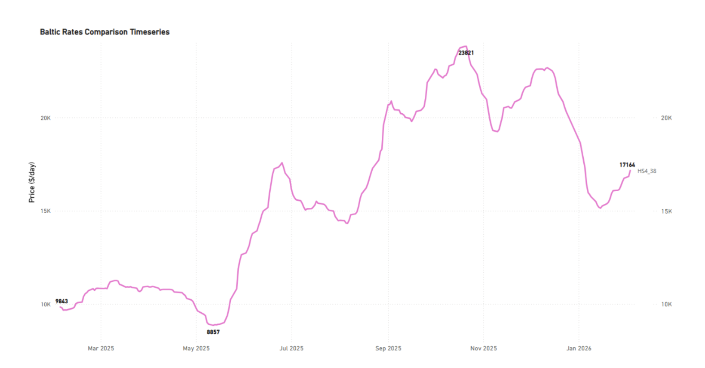

> **Figure 6: Hs438**  
> **Interactive Data & Source:** [Signal Ocean Dynamic Timeseries](https://go.signalocean.com/e/983831/dry-dynamic-timeseries-dry/2rtmsk/575752048/h/Rqll2rUdWM9d1dTs5FQ-RzQQNMY8UvyGt8LVtmzUoY8) | [Local Asset](file:///C:/Users/Dell/Github/Shipping/corpus/03-breakwave/insights/2026/assets/2026-02-06_dry-bulk-markets-stay-firm-ahead-of-lunar-new-year-pressure-points_img_unnamed281329_9ea9800d895f.png)

- Atlantic firmness is evident not only in the larger vessel size segments but also in Handysize, with the USG trip to Skaw-Passero recording a slight excess of $17k/day, up 70% year over year.

### Freight Pacific

### Capesize| C5firmer

**C5**West Australia–Qingdao

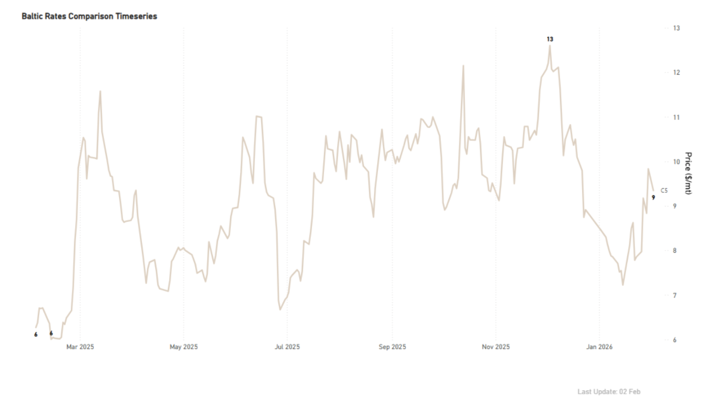

> **Figure 7: Market Chart 7**  
> **Interactive Data & Source:** [Signal Ocean Dynamic Timeseries](https://go.signalocean.com/e/983831/dry-dynamic-timeseries-dry/2rtmsk/575752048/h/Rqll2rUdWM9d1dTs5FQ-RzQQNMY8UvyGt8LVtmzUoY8) | [Local Asset](file:///C:/Users/Dell/Github/Shipping/corpus/03-breakwave/insights/2026/assets/2026-02-06_dry-bulk-markets-stay-firm-ahead-of-lunar-new-year-pressure-points_img_unnamed281429_3d772986fcff.png)

- In addition to the notable firmness in the Atlantic market, the West Australia-Qingdao rates exceeded $9/ton at the closing of January, marking a 50% increase compared to the previous year. The last high appears to be correcting to around $8.5/ton, still 35% higher than the annual average.

### Panamax | Firmer

**P3A_82**- HK-S Korea incl Taiwan, one Pacific RV

- South China, one Indonesian round voyage

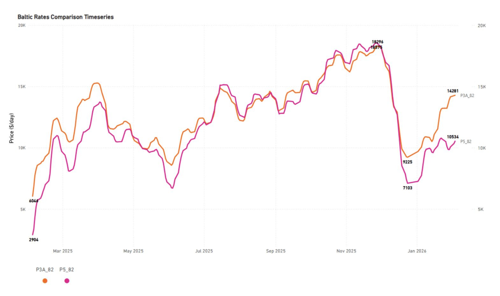

> **Figure 8: P582**  
> **Interactive Data & Source:** [Signal Ocean Dynamic Timeseries](https://go.signalocean.com/e/983831/dry-dynamic-timeseries-dry/2rtmsk/575752048/h/Rqll2rUdWM9d1dTs5FQ-RzQQNMY8UvyGt8LVtmzUoY8) | [Local Asset](file:///C:/Users/Dell/Github/Shipping/corpus/03-breakwave/insights/2026/assets/2026-02-06_dry-bulk-markets-stay-firm-ahead-of-lunar-new-year-pressure-points_img_unnamed281529_1a49aa354289.png)

- The Panamax Pacific market is currently experiencing exceptional gains, as evidenced by the P3A_82 route, which is now exceeding $14k/day. This represents a significant rebound from the very weak levels of approximately $9k/day seen before Christmas 2025.

### Supramax | Firmer

**S2**North China one Australian or Pacific round voyage

**S10**South China trip via Indonesia to South China

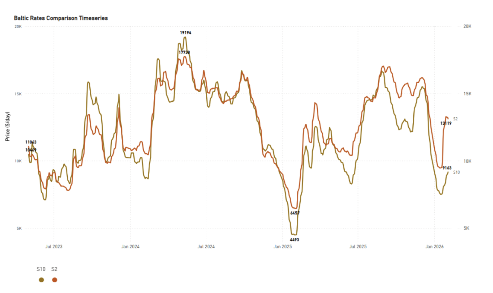

> **Figure 9: Market Chart 9**  
> **Interactive Data & Source:** [Signal Ocean Dynamic Timeseries](https://go.signalocean.com/e/983831/dry-dynamic-timeseries-dry/2rtmsk/575752048/h/Rqll2rUdWM9d1dTs5FQ-RzQQNMY8UvyGt8LVtmzUoY8) | [Local Asset](file:///C:/Users/Dell/Github/Shipping/corpus/03-breakwave/insights/2026/assets/2026-02-06_dry-bulk-markets-stay-firm-ahead-of-lunar-new-year-pressure-points_img_unnamed281629_88fe29736771.png)

The Supramax Pacific market has recorded exceptional gains on the S2 route. Levels are now around $13k/d, marking a very strong rebound and a 100% increase compared to a year ago.

### Handysize | Firmer

**HS5_38**- South East Asia trip to Singapore-Japan

**HS6_38**- North China-South Korea-Japan trip to North China-South Korea-Japan

- North China-South Korea-Japan trip to Southeast Asia

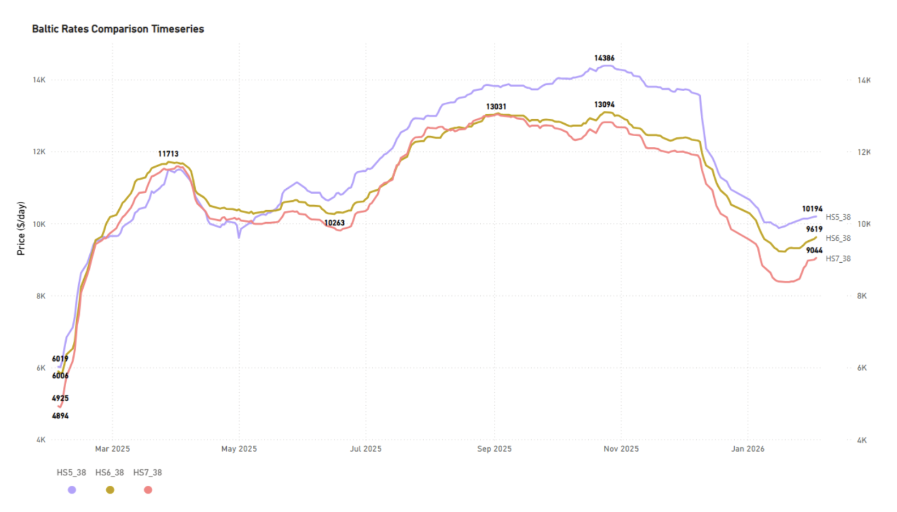

> **Figure 10: Hs738**  
> **Interactive Data & Source:** [Signal Ocean Dynamic Timeseries](https://go.signalocean.com/e/983831/dry-dynamic-timeseries-dry/2rtmsk/575752048/h/Rqll2rUdWM9d1dTs5FQ-RzQQNMY8UvyGt8LVtmzUoY8) | [Local Asset](file:///C:/Users/Dell/Github/Shipping/corpus/03-breakwave/insights/2026/assets/2026-02-06_dry-bulk-markets-stay-firm-ahead-of-lunar-new-year-pressure-points_img_unnamed281729_0645b9b8f3f8.png)

- Sustained gains are evident in the Handysize Pacific freight market. Notably, the HS5_38 route has surged above $10k/day, marking a 70% increase year-on-year.

### Ballasters Overview

Capesize |**5D**MA

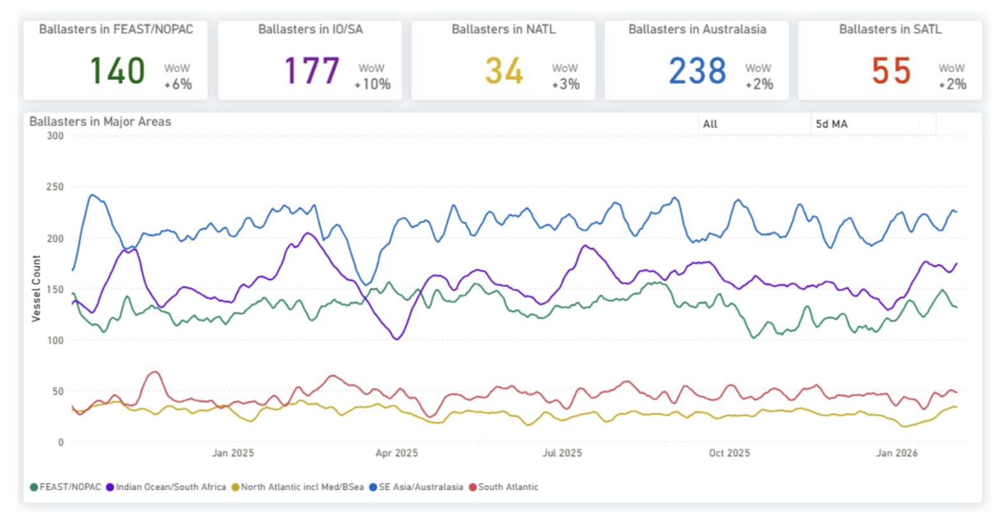

> **Figure 11: Increasing**  
> **Interactive Data & Source:** [Signal Ocean Dynamic Timeseries](https://go.signalocean.com/e/983831/dry-dynamic-timeseries-dry/2rtmsk/575752048/h/Rqll2rUdWM9d1dTs5FQ-RzQQNMY8UvyGt8LVtmzUoY8) | [Local Asset](file:///C:/Users/Dell/Github/Shipping/corpus/03-breakwave/insights/2026/assets/2026-02-06_dry-bulk-markets-stay-firm-ahead-of-lunar-new-year-pressure-points_img_unnamed281829_30aa56b46e6b.png)

- Supply pressure increased only slightly in the Atlantic, with a 2% rise in the South and a 3% rise in the North. In contrast, the Pacific is experiencing greater supply pressure, with sustained levels of around 230 in Australasia. In the Indian Ocean, the number of ballasters has notably increased by 10% on a weekly basis, now nearing 180.

Panamax |**5D**MA

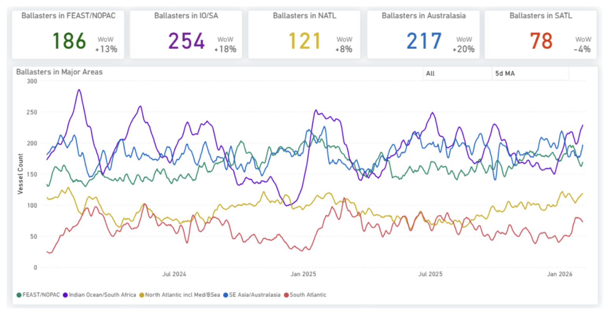

> **Figure 12: Market Chart 12**  
> **Interactive Data & Source:** [Signal Ocean Dynamic Timeseries](https://go.signalocean.com/e/983831/dry-dynamic-timeseries-dry/2rtmsk/575752048/h/Rqll2rUdWM9d1dTs5FQ-RzQQNMY8UvyGt8LVtmzUoY8) | [Local Asset](file:///C:/Users/Dell/Github/Shipping/corpus/03-breakwave/insights/2026/assets/2026-02-06_dry-bulk-markets-stay-firm-ahead-of-lunar-new-year-pressure-points_img_unnamed281929_6837bc8832c7.png)

- Supply pressure in the Indian Ocean has intensified, with current levels now surpassing 250, marking an 18% weekly increase and further underscoring the trend from the previous week. Additionally, an increase in ballasters has been noted in the North Atlantic, with figures nearing 120.

Supramax|**5D**MA

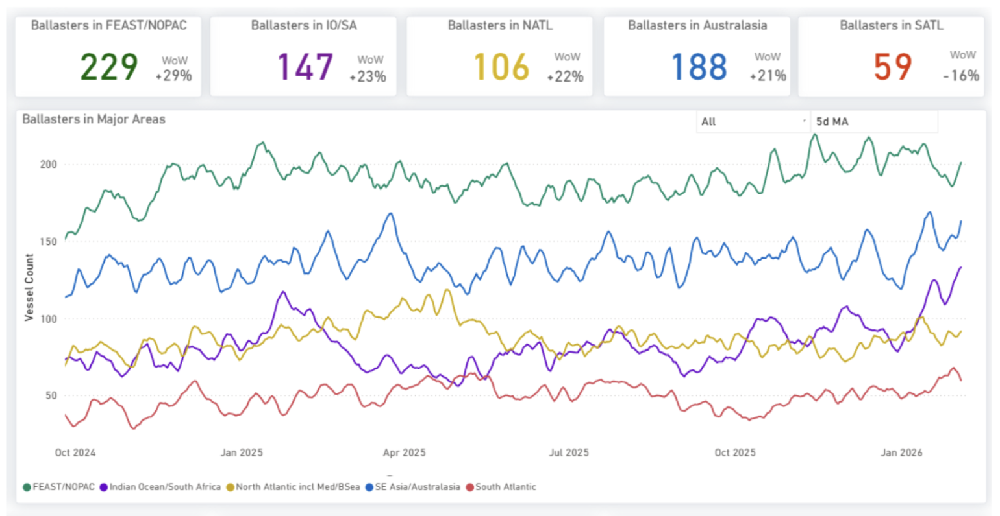

> **Figure 13: Market Chart 13**  
> **Interactive Data & Source:** [Signal Ocean Dynamic Timeseries](https://go.signalocean.com/e/983831/dry-dynamic-timeseries-dry/2rtmsk/575752048/h/Rqll2rUdWM9d1dTs5FQ-RzQQNMY8UvyGt8LVtmzUoY8) | [Local Asset](file:///C:/Users/Dell/Github/Shipping/corpus/03-breakwave/insights/2026/assets/2026-02-06_dry-bulk-markets-stay-firm-ahead-of-lunar-new-year-pressure-points_img_unnamed282029_6b4ef8a2c429.png)

- Supramax supply is showing strong signals of pressure in the Pacific and North Atlantic, while the South Atlantic recorded a 16% weekly decrease, which adds to the rate recovery we are seeing for the start of February. Supply pressure in the Far East/NOPAC held the spike of the previous week of around 229 (+29% WoW).
​​​​​​

Handysize|**5D**MA

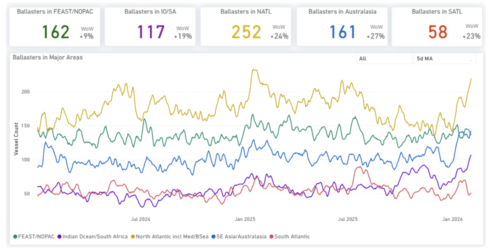

> **Figure 14: Market Chart 14**  
> **Interactive Data & Source:** [Signal Ocean Dynamic Timeseries](https://go.signalocean.com/e/983831/dry-dynamic-timeseries-dry/2rtmsk/575752048/h/Rqll2rUdWM9d1dTs5FQ-RzQQNMY8UvyGt8LVtmzUoY8) | [Local Asset](file:///C:/Users/Dell/Github/Shipping/corpus/03-breakwave/insights/2026/assets/2026-02-06_dry-bulk-markets-stay-firm-ahead-of-lunar-new-year-pressure-points_img_unnamed282129_e50919c1271b.png)

- Strong supply pressure for Handysize vessels is evident across basins, particularly in the North Atlantic, where available tonnage has risen to 252, a 24% week-on-week (WoW) increase. Increased signals are also noted in the Pacific, with Australasian indications reaching 160 (+27% WoW). Similarly, the Indian Ocean/South Africa region shows elevated numbers, currently below 120 (+19% WoW).

### Demand | Tonne Miles - Index View

Capesize | Panamax | Supramax**7D**MA**Decreasing**

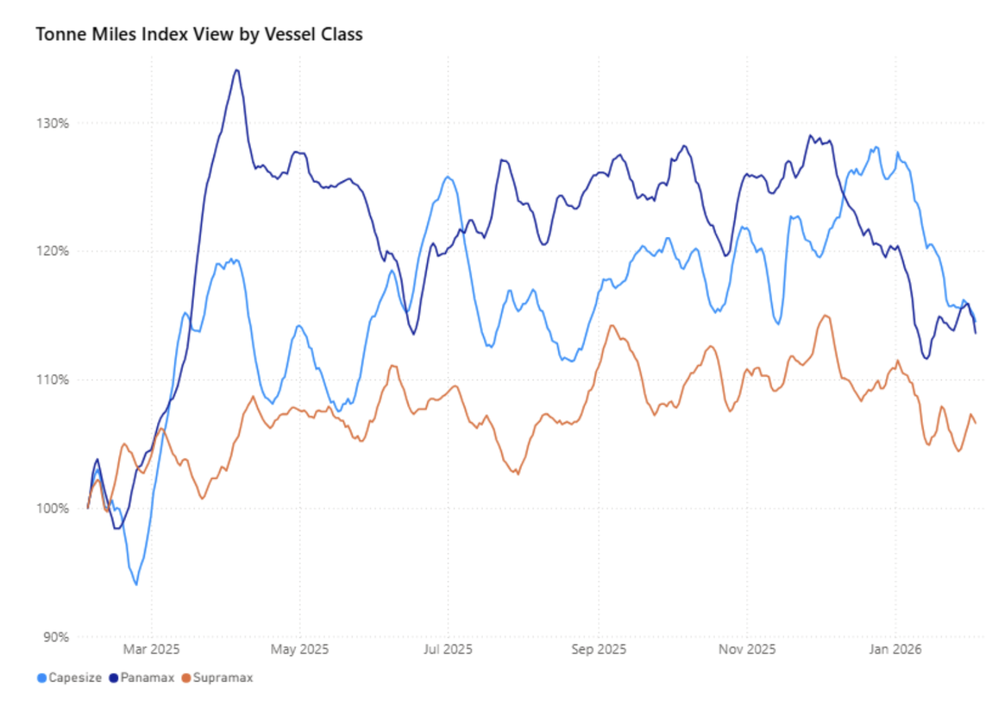

> **Figure 15: Metrics Description:index View(base 100) by Total Tonne Miles**  
> *Metrics Description:Index View(Base 100) by total Tonne Miles over the selected period. This facilitates relative performance comparisons between segments of different sizes (e.g., comparing the growth rate of Supramax vs Capesize)*  
> **Interactive Data & Source:** [Signal Ocean Dynamic Timeseries](https://go.signalocean.com/e/983831/dry-dynamic-timeseries-dry/2rtmsk/575752048/h/Rqll2rUdWM9d1dTs5FQ-RzQQNMY8UvyGt8LVtmzUoY8) | [Local Asset](file:///C:/Users/Dell/Github/Shipping/corpus/03-breakwave/insights/2026/assets/2026-02-06_dry-bulk-markets-stay-firm-ahead-of-lunar-new-year-pressure-points_img_unnamed282229_18be61ceaf61.png)

Upon reviewing the tonne-mile growth rate on a Base 100 Index View, a recent deceleration is evident across the Capesize, Panamax, and Supramax segments, despite their 7-day Moving Average (7D MA) remaining above 100%. Specifically, the growth rate for the larger vessel segments, Capesize and Panamax, has declined to the 113-114% range. It is worth noting the volatility in the Supramax growth rate, which has not yet established a definitive downward trend, with a recorded growth rate of 107%.

### Takeaway

Dry bulk freight markets remain firm across both the Atlantic and Pacific basins, and a continued strength in the Capesize segment, despite the approach of China's Lunar New Year.

Key Market Drivers:

- Strong Atlantic Capesize Rates: Elevated rates on the Tubarao-Qingdao and Saldanha Bay–Qingdao routes continue to support near-term market sentiment.
- Higher Tonne-Mile Demand: Year-on-year tonne-mile demand has increased, with African–North China routes showing stronger growth than the Brazil–China routes.

Emerging Headwinds:

- Rising Supply Pressure: Ballaster supply is increasing across most basins, particularly in the Pacific and Indian Ocean, indicating growing supply pressure.
- Decelerating Demand Growth: While tonne-mile levels remain above the long-term trend, growth is beginning to show early signs of deceleration.

Downside Risk:

- The primary downside risk for the market remains the outlook for China's steel demand.

Data Source:[Signal Ocean Platform](https://www.thesignalgroup.com/signal-ocean-platform)

---

**Tags:** Capesize, Drybulk, Markets  
