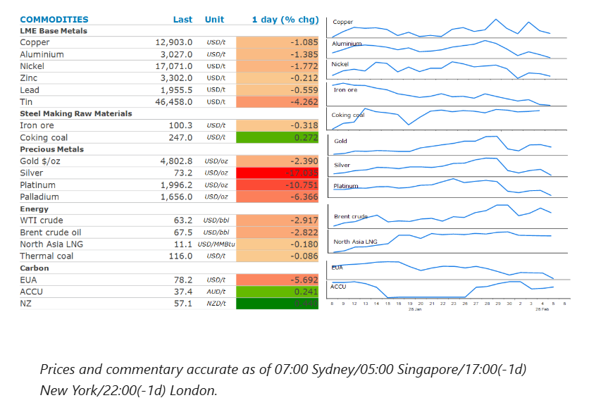
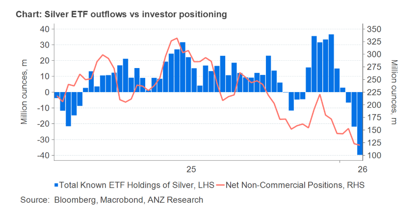

# Fresh wave of selling hits metals

**Date:** February 06, 2026  
**Publisher:** Breakwave Advisors | **Category:** Market Insights  
**Original URL:** [https://www.breakwaveadvisors.com/insights/2026/2/6/fresh-wave-of-selling-hits-metals](https://www.breakwaveadvisors.com/insights/2026/2/6/fresh-wave-of-selling-hits-metals)  

---

Precious metals were hit with a fresh wave of selling, which weighed on sentiment across the metals complex. Oil fell amid easing geopolitical tensions.

*By*[*Daniel Hynes*](https://www.linkedin.com/in/dahynes/)

> **Figure 1: Στιγμιότυπο Οθόνης 2026 02 06 125457**  
> **Interactive Data & Source:** [Linkedin](https://www.linkedin.com/newsletters/commodities-wrap-6692196755876012032/?fbclid=IwAR3kiXJqZdxmp9ZcRwBNI7FsBySI-XSC0pfPur1qzjt7OZp7PTE59Tsl1QI) | [Local Asset](file:///C:/Users/Dell/Github/Shipping/corpus/03-breakwave/insights/2026/assets/2026-02-06_fresh-wave-of-selling-hits-metals_img_cea3cf84ceb9ceb3cebcceb9cf8ccf84cf85_21ee614e264c.png)

### Market Commentary

**Copper**struggled to hold gains from earlier in the week as signs of weaker demand in China weighed on sentiment. Inventories of copper rose in London Metal Exchange warehouses in Asia. This was coupled with reports of easing in Chinese buying, with fabricators and manufacturers said to lack the appetite to chase the market higher. Daily refined copper spot trading volumes across the country totalled 25,300t on Wednesday, down from a three-month peak of 38,121t on Monday, according to Mysteel Global data. Nevertheless, the underlying fundamentals remain positive. The State Grid Corp of China announced a 35% jump in fixed asset investment to CNY30.8bn in January on ultra-high voltage grids and pumped storage power stations. Supply side issues also remain a concern. Anglo American cut its outlook for copper output from its operations to between 700-760kt in 2026, from the previously forecast range of 760-820kt. It cited issues at its flagship Collahuasi mine in Chile. In a sign that the US remains driven in its desire to shore up supply chains of critical minerals, the White House announced plans to take a stake in Glencore’s Congolese copper operations. This comes after the Trump administration hosted a critical minerals summit with 55 countries to reduce dependence on China and ensure stable access to key resources. The US pitched the use of price floors and a flood of US private equity investment, according to statements from the US Trade Representative’s office.

**Silver**fell sharply, wiping out its two-day recovery, as a fresh wave of selling hit the market. Spot silver plunged as much as 18% to fall below USD73/oz. After building up large positions in January, the market remains dominated by speculative and CTA positioning. This is despite ongoing structural tightness in the physical market. This volatility is likely to remain high until these positions have been unwound. The selloff in the gold market was a little bit more contained due to greater liquidity and less aggressive positioning by investors.

**Iron ore**prices are threatening to break below USD100/t for the first time since November 2025, amid the broader selloff across the industrial metal sector. Weaker fundamentals are also at play. Stockpiles at Chinese ports have been building in recent weeks, as the industry enters the seasonal shutdown period over the Lunar New Year. Supply has also been building. Iron ore shipments from Australia, including Port Hedland totalled 9.3mt in the week to 23 January, up from 8mt in the previous week.

**Crude oil**fell for the first time in three days amid signs of easing supply risks. Iran confirmed that it would hold negotiations with the US, allaying concerns of US military action which could threaten oil exports from the OPEC member. Iranian Foreign Minister, Abbas Araghchi, confirmed talks will be held in Oman on Friday. However, the two sides remain well apart, leaving tensions elevated. This should see the geopolitical risk premium remain in place. Traders are also following Ukraine peace talks this week. Those talks could be put on hold after Russia renewed attacks on Ukraine’s energy infrastructure this week.

**North Asia LNG**prices held steady around USD11/mmbtu as overall demand from the region remained subdued. Only pockets of buying have emerged in recent week from smaller consumers such as Thailand and Vietnam.**European natural gas**managed to eke out a small gain as weather forecasts turned colder for the second half of the month, putting further strain on tight inventories.

### Chart of the Day

Outflows from silver-backed exchange trade funds have increased significantly in recent days. However, there could be further to come. The volumes are still well below what was built in a frantic period of buying in December.

> **Figure 2: Στιγμιότυπο Οθόνης 2026 02 06 125555**  
> **Interactive Data & Source:** [Linkedin](https://www.linkedin.com/newsletters/commodities-wrap-6692196755876012032/?fbclid=IwAR3kiXJqZdxmp9ZcRwBNI7FsBySI-XSC0pfPur1qzjt7OZp7PTE59Tsl1QI) | [Local Asset](file:///C:/Users/Dell/Github/Shipping/corpus/03-breakwave/insights/2026/assets/2026-02-06_fresh-wave-of-selling-hits-metals_img_cea3cf84ceb9ceb3cebcceb9cf8ccf84cf85_6b66b4d513cf.png)

Data source:[Commodities Wrap](https://www.linkedin.com/newsletters/commodities-wrap-6692196755876012032/?fbclid=IwAR3kiXJqZdxmp9ZcRwBNI7FsBySI-XSC0pfPur1qzjt7OZp7PTE59Tsl1QI)

---

**Tags:** Shipping, Commodities, Markets  
