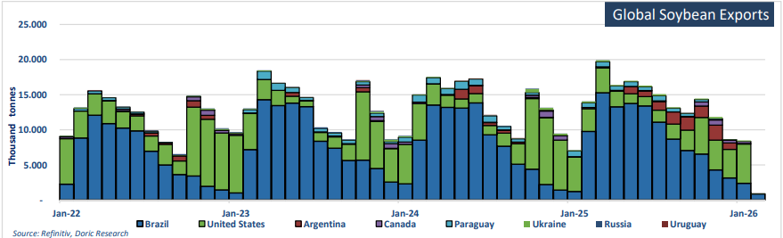

# Global soybean exports

**Date:** February 09, 2026  
**Publisher:** Breakwave Advisors | **Category:** Market Insights  
**Original URL:** [https://www.breakwaveadvisors.com/insights/2026/2/9/the-panamax-market](https://www.breakwaveadvisors.com/insights/2026/2/9/the-panamax-market)  

---

*By*[*Michalis Voutsinas*](https://www.linkedin.com/in/michalis-voutsinas-587544163/)

The Panamax market enters February shaped by two contrasting cargo narratives. South American soybeans remain a clear pillar of demand, providing visible employment and lending resilience to the segment despite emerging seasonal headwinds. In contrast, coal trades are increasingly influenced by structural changes in production and energy policy, clouding the outlook for volumes and capping upside potential. As the market approaches the Chinese New Year period, activity is expected to moderate, but the underlying trade flows remain decisive in shaping sentiment and earnings.

Soybeans remain the cornerstone of Panamax demand, with Brazil firmly established as the dominant force in the global export market. The country continues to benefit from a record production outlook, supported by favourable growing conditions and an expanded planted area, allowing exports to remain both abundant and price competitive. China remains the principal destination, absorbing the vast majority of Brazilian shipments and reinforcing the Brazil-China trade lane as the backbone of Panamax grain employment. Export values and volumes have continued to trend higher year-on-year, with December shipments alone showing a sharp increase compared to the same period last year, even as month-on-month figures softened on seasonal timing. Importantly, this moderation does not signal weakening demand but rather reflects the natural ebb and flow of the export calendar ahead of the new crop surge. Early indicators for 2026 point to another exceptionally strong start to the year. Anec’s projections suggest February soybean exports could reach 11.42 million tonnes, the highest volume ever recorded for the month, following a record January. Combined exports for the first two months of the year are expected to exceed last year’s levels by a wide margin, reinforcing the view that Brazilian soybeans will continue to dominate seaborne flows into the second quarter. For the Panamax segment, this sustained export programme has translated into steady cargo availability and consistent absorption of ballasting tonnage in ECSA, keeping the market well supported despite broader macro volatility.

Geopolitical noise has added an additional layer of complexity, particularly around the prospect of increased US soybean sales to China. While political statements have hinted at sizeable purchases, commercial realities continue to limit the scope for any meaningful shift in trade flows. Brazilian soybeans remain materially cheaper than US origin, even as currency movements have narrowed the spread, and the tariff structure continues to favour South American supply. Private Chinese crushers have shown little appetite for US cargoes, instead maintaining a strong preference for Brazilian beans. Any incremental US buying appears driven more by state-directed commitments than by market logic, suggesting limited impact on freight patterns. As a result, the core soybean narrative remains intact: Brazil continues to supply the bulk of Chinese demand, and Panamax vessels remain the natural workhorse for this trade. Beyond China, Brazil’s soybean exports have continued to diversify modestly, with steady flows into destinations such as Spain, Thailand, Pakistan, and Vietnam. While these volumes are smaller in absolute terms, they contribute to overall cargo depth and support triangulation opportunities, particularly for vessels seeking optionality beyond the main China run. Taken together, the soybean complex continues to provide a strong and relatively predictable foundation for the Panamax market.

Coal, by contrast, presents a more challenging and less supportive outlook. Recent developments in Indonesia and India highlight the growing divergence between supply-side management and demand-side realities. Indonesia has signalled a sharp reduction in coal production quotas for 2026, with approved output levels reportedly well below producers’ initial submissions. The government’s stated objective is to support prices and preserve reserves, setting a national production target significantly below last year’s actual output. If implemented and enforced, these cuts would materially constrain export availability and could reduce the volume of Indonesian coal entering the seaborne market. However, the potential tightening of Indonesian supply needs to be viewed alongside developments in India, which point in the opposite direction. India has announced an ambitious coal production target of 1.31 billion tonnes for FY 2026-27, representing a historically large increase in domestic output. State-owned producers are expected to deliver the bulk of this growth, with production targets implying doubledigit increases across key mining entities. Should these targets be realised, India’s reliance on imported coal would diminish significantly.

This shift comes at a time when growth in coal-fired power generation is already moderating, as renewable capacity continues to expand and efficiency gains reduce incremental demand. While imports will not disappear entirely, especially for higher-quality coal and specific logistical requirements, the trajectory points towards a structurally softer import profile. The interaction between Indonesian supply discipline and India’s domestic expansion introduces a downside risk to seaborne coal volumes. If Indonesian cuts are relaxed due to fiscal pressures or policy reversals, export availability could remain high in the face of weakening demand. Conversely, if cuts are enforced while Indian imports decline, the net effect would still be a smaller pool of cargoes competing for vessels. In either scenario, coal is unlikely to provide meaningful upside support to Panamax earnings in the medium term, and its role in the market appears increasingly defensive rather than growth-driven.

Against this broader backdrop, the Panamax market closed the week at $14,865 per day, down 5.2 percent week-on-week but still approximately 60 percent higher year-on-year. Activity out of ECSA has continued to underpin the market so far this year, absorbing tonnage and preventing a sharper correction despite softer conditions elsewhere. As the market approaches the Chinese New Year holidays, a more measured tone is likely to prevail, with owners and charterers alike showing greater caution. Looking ahead, the balance of risks suggests that the Panamax segment will remain increasingly reliant on agricultural flows to sustain earnings. Soybeans, led by Brazil, continue to offer visibility, volume, and competitive pricing, reinforcing their role as the primary driver of employment. Coal, meanwhile, appears set to play a diminishing role, constrained by structural shifts in production and consumption rather than short-term cyclical factors.

> **Figure 1: Στιγμιότυπο Οθόνης 2026 02 09 102414**  
> **Interactive Data & Source:** [Doric](https://www.doric.gr/) | [Local Asset](file:///C:/Users/Dell/Github/Shipping/corpus/03-breakwave/insights/2026/assets/2026-02-09_the-panamax-market_img_cea3cf84ceb9ceb3cebcceb9cf8ccf84cf85_573341c07e1b.png)

Data source:[Doric](https://www.doric.gr/)

---

**Tags:** Drybulk, Shipping, Markets  
