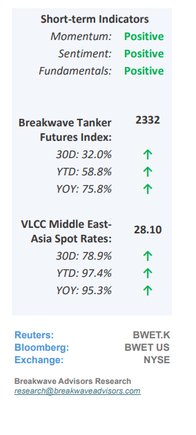
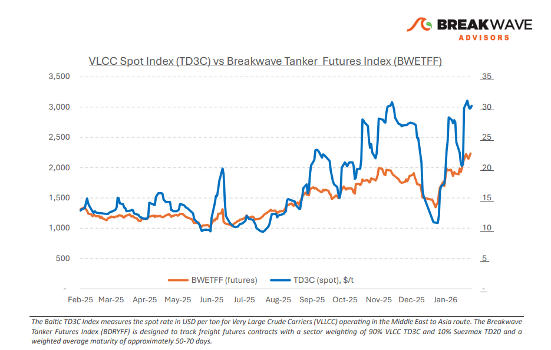
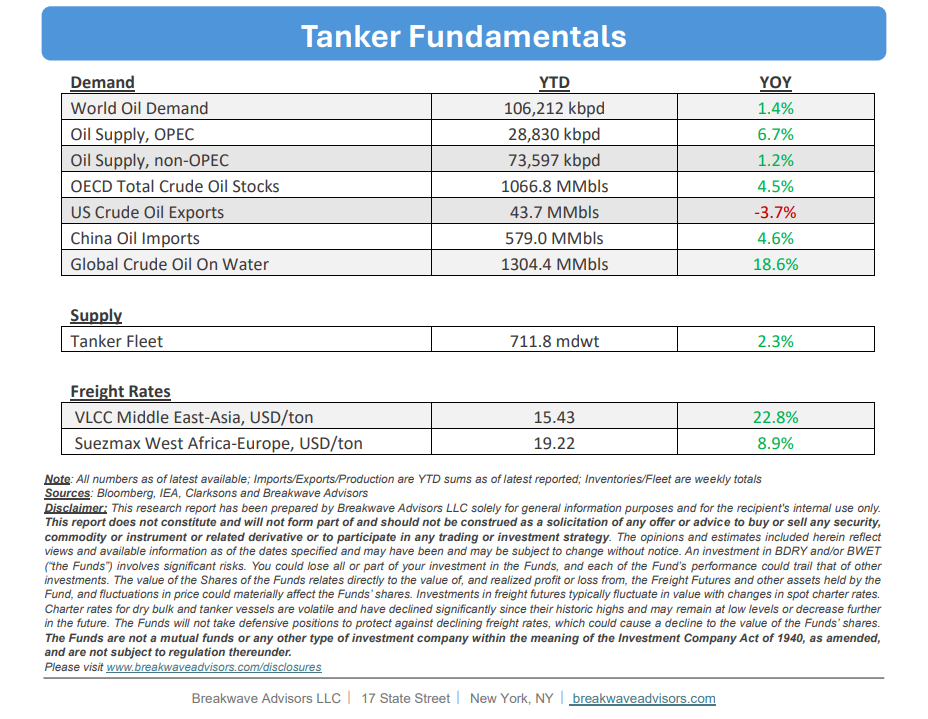

# Breakwave Bi-Weekly Tanker Report - February 10, 2026

**Date:** February 10, 2026  
**Publisher:** Breakwave Advisors | **Category:** Market Insights  
**Original URL:** [https://www.breakwaveadvisors.com/insights/2102026wetreport2026ll47](https://www.breakwaveadvisors.com/insights/2102026wetreport2026ll47)  

---

•**VLCC Rates Remain Strong, Next Leg Depends on Demand**– The sharp acceleration in VLCC freight seen**in late January appears to have peaked**for now. Nevertheless, the Baltic Dirty Tanker Index continues to trade near multi-year highs, reflecting the**strong gains**accumulated over recent months (around +90% YoY as of early February). The AG VLCC market showed softer momentum into early February. While AG–China rates edged up only modestly on the week, freight levels remain**exceptionally elevated**, with very strong month-on-month gains and rates more than doubling year-on-year. At the same time, elevated levels have**increased charterer resistance,**with some players stepping back or covering discreetly to limit further upside. Indian refiners have eased spot purchases of Russian crude, introducing**some uncertainty**around near-term Pacific flows, while Russian sellers have responded by widening price discounts to defend market share, particularly in Asia. However, a**full replacement of Russian**barrels remains**unlikely**in the short term. US crude does not provide a like-for-like alternative due to grade and refinery constraints, limiting its ability to displace heavier feedstocks. Indian buyers have also shown openness to Venezuelan crude on commercial grounds, though**volumes remain opportunistic**and price-driven rather than part of a sustained import pattern. It therefore remains uncertain whether the VLCC market is evolving toward a more Atlantic-driven structure. For now, regional VLCC supply tightness between the Arabian Gulf and West Africa remains the dominant driver of both upside and downside risk.**Softer Chinese crude import**momentum toward the end of January adds uncertainty to near-term demand visibility. Against this backdrop, freight markets appear to be consolidating at elevated levels, with recent corrections**driven more by cargo timing**than by any material weakening in underlying fundamentals.

> **Figure 1: Στιγμιότυπο Οθόνης 2026 02 10 113330**  
> [Local Asset](file:///C:/Users/Dell/Github/Shipping/corpus/03-breakwave/insights/2026/assets/2026-02-10_2102026wetreport2026ll47_img_cea3cf84ceb9ceb3cebcceb9cf8ccf84cf85_bfe204ef84e6.png)

•**Oil Prices Remian Firmly above $60/bbl, as Iran Potential Action Looms**– Once again, the oil market is holding its breath as the**potential for military action**against Iran and the uncertainty around such a development overshadows the relatively weak market fundamentals. As traditionally the weekend has bee the period of military action (at least the past few years) the “war premium” is usually inflated towards the end of the week and reduced once Monday comes. The headlines and articles around the developments are plentiful and it is**anybody’s guess**what the potential outcomes might be. The range of oil prices under different scenarios vary vastly, and thus, it is difficult to even contemplate a strategy with a decent risk reward profile. Oil is tightly correlated to inflation which also affect equity valuations. Thus, the**near-term direction**of oil prices is tight to a number of other**macro related outcomes**in the markets and should be closely followed.

•**Our Long-term View**– The tanker market is recovering from a long period of staggered rates as the growth in new vessel supply shrinks while oil demand remains elevated in line with the global economy. A historically low orderbook combined with favorable shifting trade patterns should continue to support increased spot rate volatility, which combined with the ongoing geopolitical turmoil, should sustain freight rates in the medium to long term.

> **Figure 2: Στιγμιότυπο Οθόνης 2026 02 10 093809**  
> [Local Asset](file:///C:/Users/Dell/Github/Shipping/corpus/03-breakwave/insights/2026/assets/2026-02-10_2102026wetreport2026ll47_img_cea3cf84ceb9ceb3cebcceb9cf8ccf84cf85_e6302a5471b7.png)

> **Figure 3: Στιγμιότυπο Οθόνης 2026 02 10 113342**  
> [Local Asset](file:///C:/Users/Dell/Github/Shipping/corpus/03-breakwave/insights/2026/assets/2026-02-10_2102026wetreport2026ll47_img_cea3cf84ceb9ceb3cebcceb9cf8ccf84cf85_44f9af58e8ea.png)

### Subscribe:
