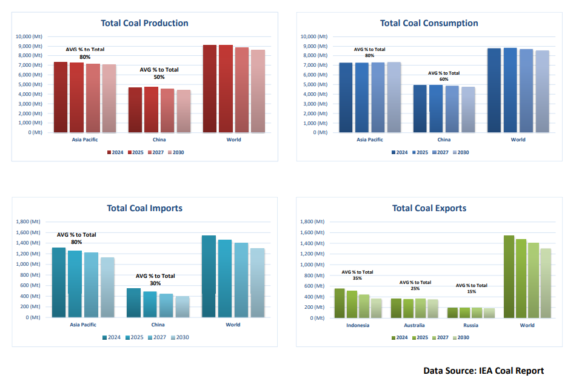

# Coal and the Freight Market: Policy Direction vs Market Reality

**Date:** February 11, 2026  
**Publisher:** Breakwave Advisors | **Category:** Market Insights  
**Original URL:** [https://www.breakwaveadvisors.com/insights/2026/2/11/coal-and-the-freight-market-policy-direction-vs-market-reality](https://www.breakwaveadvisors.com/insights/2026/2/11/coal-and-the-freight-market-policy-direction-vs-market-reality)  

---

This week’s Allied QuantumSea Research reviews one of the key challenges facing the dry bulk freight market: the growing gap between long-term energy transition objectives and the current realities of fleet supply and commodity dependence.

In last week’s analysis, we examined the evolution of the dry bulk fleet and highlighted that continued fleet growth, combined with historically low scrapping levels, remains a defining feature of the market. This backdrop means that freight performance continues to rely heavily on the steady growth of a limited number of core cargoes, most notably coal and iron ore. Against this backdrop, coal is increasingly moving from a purely commercial cargo to one shaped by policy direction and transition-related debate.

### Coal in Transition: Market Importance and Policy Context

Coal has historically provided a stable and repeatable source of demand for dry bulk shipping, supporting trade volumes across major exporting and importing regions. While overall coal consumption remains significant, seaborne coal trade softened during 2025, largely reflecting higher domestic production in key consuming countries and a moderation in import requirements rather than a sudden reduction in usage.

This shift is confirmed by the International Energy Agency’s Coal 2025 report, released in December, which notes that global coal trade declined in 2025 after several years of growth. The IEA attributes this primarily to weaker import demand from Asia, particularly China and India. Importantly, global coal consumption remained high, underscoring that the adjustment observed in 2025 reflects trade rebalancing rather than a collapse in coal use.

At the same time, coal is now firmly embedded in industry discussions of the energy transition. Recent policy-oriented commentary has raised questions around future supply growth, but these discussions remain forward-looking and conceptual.

There are currently no globally binding agreements or measures in place that would restrict existing coal production or materially alter export volumes in the near term. Today’s seaborne coal trade continues to be driven by existing mines, established infrastructure, and long -term contractual arrangements.

### Freight Market Trends: Managing Expectations

While transition-related policy discussions do not translate into immediate changes in cargo volumes, they introduce gradual and less visible risks for the freight market. As coal is increasingly framed as a declining commodity, market participants may begin to adjust behaviour at the margin, influencing investment decisions, infrastructure planning, and contracting structures. Over time, this may reduce spot market activity and limit the demand surges that have historically supported freight rate volatility.

In a market already characterised by fleet growth and limited scrapping, even modest changes in demand visibility can have an outsized impact on sentiment and earnings expectations. The risk for freight is therefore not an abrupt loss of coal volumes, but a gradual tightening of demand growth potential occurring alongside a steadily expanding fleet.

### Iron Ore Dependence and Ongoing Risk

At the same time, the dry bulk market remains highly dependent on iron ore, particularly for larger vessel employment. This reliance increases the risk of overall market concentration, as any disruption to the iron ore trade would have a disproportionate effect on freight fundamentals. Over time, this heightens sensitivity to policy, investment, or demand shifts in key iron ore producing and consuming regions.

### Conclusion

The discussion around coordinated limits on new thermal coal mine approvals reflects policy direction rather than an immediate shift in underlying market fundamentals. The more pressing challenge is balancing fleet growth with a demand environment that appears to be becoming less elastic and more policy sensitive.

Coal remains an important component of dry bulk trade, but its role is evolving. As confirmed by the IEA’s latest assessment, freight risk is shifting from outright volume loss to reduced visibility and lower trade growth momentum. Navigating this transition requires a careful distinction between long-term policy direction and short-term market reality.

> **Figure 1: Στιγμιότυπο Οθόνης 2026 02 11 133906**  
> **Interactive Data & Source:** [Allied-shipbroking](https://www.allied-shipbroking.gr/) | [Local Asset](file:///C:/Users/Dell/Github/Shipping/corpus/03-breakwave/insights/2026/assets/2026-02-11_coal-and-the-freight-market-policy-direction-vs-market-reality_img_cea3cf84ceb9ceb3cebcceb9cf8ccf84cf85_e973d5989bc5.png)

Data Source:[Allied](https://www.allied-shipbroking.gr/)

---

**Tags:** Coal, Drybulk, Markets  
