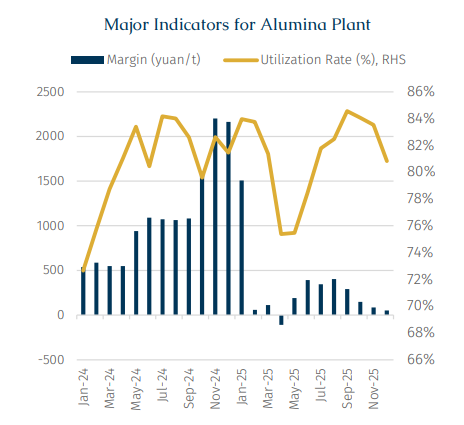
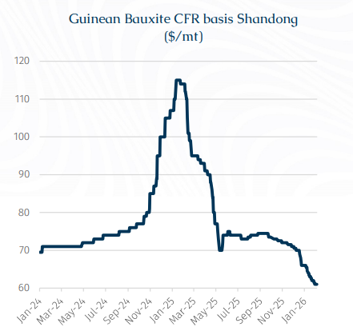
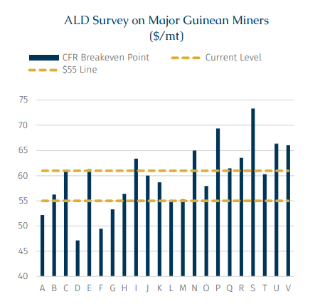

# Guinean miner to lower the long-term contract price

**Date:** February 12, 2026  
**Publisher:** Breakwave Advisors | **Category:** Market Insights  
**Original URL:** [https://www.breakwaveadvisors.com/insights/2026/2/12/guinean-miner-to-lower-the-long-term-contract-price](https://www.breakwaveadvisors.com/insights/2026/2/12/guinean-miner-to-lower-the-long-term-contract-price)  

---

> **Figure 1: Rgb Color Brs Shipbrokers Monogram L**  
> [Local Asset](file:///C:/Users/Dell/Github/Shipping/corpus/03-breakwave/insights/2026/assets/2026-02-12_guinean-miner-to-lower-the-long-term-contract-price_img_rgb-color-brs-shipbrokers-monogram-l_c365f35f1de5.png)

On January 29, a major Guinean miner reportedly lowered its 1Q26 bauxite long-term contract price from $66/mt to $62/mt. Notably, this round of long-term price adjustment occurred before the end of January, which is unusual. Unlike short-term spot fluctuations, the relaxation of long-term contract prices signals a systemic reassessment of first quarter fundamentals by both participants on the supply and demand sides. Behind this adjustment lies the reality of overcapacity in both the bauxite (raw material) and alumina (intermediate product) markets.

In terms of underlying drivers, the dual oversupply of alumina and bauxite jointly forms the foundation for the recent price decline. Alumina overcapacity primarily explains the pressure on bauxite prices, whereas bauxite overcapacity has a more direct impact on seaborne trade volumes. In China, against the backdrop of a domestic aluminium capacity cap set at 45 mln mt, alumina, as a midstream processing segment has continued to expand capacity in recent years.

> **Figure 2: Στιγμιότυπο Οθόνης 2026 02 12 174235**  
> [Local Asset](file:///C:/Users/Dell/Github/Shipping/corpus/03-breakwave/insights/2026/assets/2026-02-12_guinean-miner-to-lower-the-long-term-contract-price_img_cea3cf84ceb9ceb3cebcceb9cf8ccf84cf85_8f135263a3b8.png)

The mismatch between new capacity release and downstream demand growth has led to a persistent structural surplus. In this context, controlling raw material procurement costs has increasingly become a key lever for alumina refineries to alleviate operational pressure and hedge against margin compression.

Looking at the price evolution, bauxite spot prices have been the first to reflect the rapid deterioration of market fundamentals. In early December, spot prices hovered around $71/mt, while the first quarter long-term contract price was roughly $66/mt. As supply and demand expectations were rapidly revised downward, by the time the long-term contract price adjustment was announced, spot prices had fallen to $61/mt whereas long-term contract prices, due to slower adjustment mechanisms, remained in their previous higher range, gradually diverging from market levels. Against this backdrop miners were compelled to reduce long-term contract prices to $62/mt to restore alignment between contract and market levels, thereby simultaneously highlighting the speed at which short term market fundamentals had shifted.

> **Figure 3: Στιγμιότυπο Οθόνης 2026 02 12 174247**  
> [Local Asset](file:///C:/Users/Dell/Github/Shipping/corpus/03-breakwave/insights/2026/assets/2026-02-12_guinean-miner-to-lower-the-long-term-contract-price_img_cea3cf84ceb9ceb3cebcceb9cf8ccf84cf85_7cfc60c6d128.png)

The rapid loosening of bauxite market fundamentals has primarily been driven by an unexpectedly strong supply-side recovery in Guinea. A series of mine restarts have materially outperformed earlier expectations, significantly lifting Guinea’s effective export capacity.

Previously, Guinea’s bauxite exports were anticipated to plateau in the near term, stabilising at an annual export volume of around 180 mln mt. However, with both Nimba and Axis returning to the market, Guinea’s export potential is now expected to exceed 220 mln mt.

The upside revision is largely attributable to Nimba. Originated from the Guinean government’s decision to reclaim and restructure mining assets previously held by Guinea Alumina Corporation (GAC), a subsidiary of Emirates Global Aluminium (EGA), the idea of nationalization began in October 2024 and by July 2025, after months of tensions, the government finally terminated the mining agreement with EGA and transferred the bauxite mining lease to a newly established state-owned entity called Nimba Mining Company. Against this backdrop, Nimba completed its first shipment in November 2025 and is now expected to export around 10 mln mt of bauxite in 2026, far exceeding earlier expectations of only 1–2 mln mt.

A similar reassessment has taken place at the Axis mining area. As of late 2024, the site was expected to reach an annual output of nearly 40 mln mt. Following its mining licence being revoked in mid-May 2025, mining activities led by Shunda Mining were halted. After more than six months of negotiations, discussions were concluded in late 2025 to restart the mine. Accordingly, Shunda Mining completed its first bauxite shipment in early January, formally marking the return of the Axis mining area to the seaborne market. Exports from the area are now projected to reach around 30 mln mt this year, compared with our previous estimate of only 5–10 mln mt.

Based on ALD research, current CFR prices level are broadly approaching the industry’s breakeven level. That said, we do not expect meaningful supply curtailments in the near term, even if prices remain under pressure. In practice, mining operations tend to exhibit a high degree of short-term rigidity. The miners opt to continue to prioritise volume and cash flow generation over short-term margin optimisation, particularly in a weakening price environment. As a result, supply responses are typically delayed and non-linear. According to ALD, a more meaningful inflection point for supply discipline lies closer to $55/mt CFR. A sustained move below this level would likely begin to force higher-cost producers to reassess output levels, potentially leading to a visible reduction in seaborne supply. However, even under a weaker price environment that prompts marginal curtailments, the prevailing market view remains that breaching the 200 mln mt export threshold for Guinea in 2026 should be readily achievable.

> **Figure 4: Στιγμιότυπο Οθόνης 2026 02 12 174256**  
> [Local Asset](file:///C:/Users/Dell/Github/Shipping/corpus/03-breakwave/insights/2026/assets/2026-02-12_guinean-miner-to-lower-the-long-term-contract-price_img_cea3cf84ceb9ceb3cebcceb9cf8ccf84cf85_94bb7dcbb453.png)

From a shipping perspective, the oversupply of bauxite warrants close attention as it can influence marginal trade volumes and, by extension, marginal freight rates. However, it is not necessarily a development that the shipping market needs to be overly concerned about. Ultimately, production oversupply is a challenge primarily faced by industry participants upstream, whereas for shipping, volume remains the single most important variable.

If the current fragile balance can be maintained, namely, if miners continue to prioritise volume over price by accepting weaker pricing in exchange for sustained output, the implications for the seaborne market are, in fact, constructive. Under such a scenario, incremental bauxite supply would translate directly into higher seaborne volumes, providing a meaningful boost to Capesize demand.

While rising Guinean supply will inevitably exert price pressure across the broader bauxite market, including on higher-cost and non-mainstream producers, we believe the adjustment will be reflected more in pricing than in volumes. In our view, the bulk of incremental Guinean shipments is likely to be absorbed through higher inventory accumulation in China, thus supporting long-haul seaborne trades, particularly on the Guinea–China route. The combination of higher volumes and longer voyage distances implies a disproportionate increase in tonne-mile demand, which would further tighten the supply–demand balance in the Capesize market, tilting it increasingly towards an undersupplied regime.

---

**Tags:** Drybulk, Shipping, Markets  
