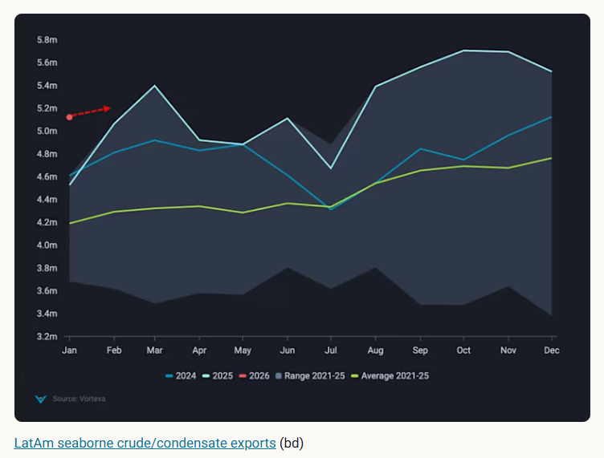
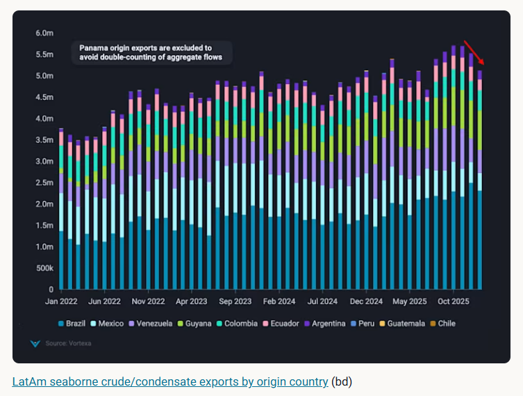
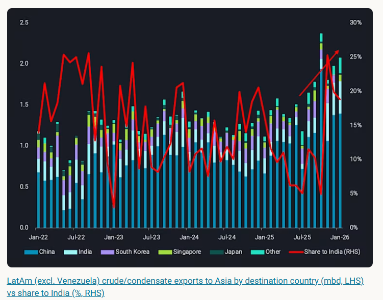

# LatAm crude exports face temporary slowdown

**Date:** February 12, 2026  
**Publisher:** Breakwave Advisors | **Category:** Market Insights  
**Original URL:** [https://www.breakwaveadvisors.com/insights/2026/2/12/latam-crude-exports-face-temporary-slowdown](https://www.breakwaveadvisors.com/insights/2026/2/12/latam-crude-exports-face-temporary-slowdown)  

---

LatAm crude exports are facing a temporary slowdown in early-2026 but we expect a rebound going forward which we explore in this insight piece.

*By*[*Rohit Rathod*](https://www.linkedin.com/in/rathodrohit/)

LatAm crude/condensate exports showed exceptional strength last year, setting seasonal highs for 10 months of the year. As new production came online in Guyana (FPSO One Guyana producing 250kbd) these exports also set a record high during 2H 2025. This momentum from 2025 seems to have run into some headwinds in 2026, with exports slowing down ~400kbd m-o-m in January. We shall look into the factors behind this and why we believe this to be temporary in this insight piece.

## Seasonal Highs Despite M-O-M Declines

> **Figure 1: Στιγμιότυπο Οθόνης 2026 02 12 101352**  
> **Interactive Data & Source:** [Analytics Vortexa](https://analytics.vortexa.com/Flows?dateRange=2024-01-01T00%3A00%3A00.000Z__2026-01-31T23%3A59%3A59.999Z&from=%5B%22eb51f8315cf769b317615f7fcbdad3ff8612baaea0e9a39d3a63550c44784658%22%2C%22bbb65b6cb13db7dca985347796498c0f4458e8982c73fbe612515a536e5277b5%22%5D&fromExcluded=%5B%22f3058bcbb026a6921bf142f93dbd9e186043df9ee300407a01b35a2d2f588580%22%5D&metric=bpd&originGlobalXFilter=%5B%22b903eceaae4690fafdc2fd76c23d1e44faf31bf0d1398078b967dcba01a11e6a%22%5D&page=Flows&products=%5B%2254af755a090118dcf9b0724c9a4e9f14745c26165385ffa7f1445bc768f06f11%22%5D&tabId=68329332-c152-4be6-b58f-86d13389a745&timeSeriesBaselineEnd=2022-12-31T23%3A59%3A59.999Z&timeSeriesBaselineStart=2022-01-01T00%3A00%3A00.000Z&timeSeriesHiddenSeries=%5B%22seasonal_comparison_24%22%5D&timeSeriesProperty=origin_country&timeSeriesSeasonalStart=2021&v=3) | [Local Asset](file:///C:/Users/Dell/Github/Shipping/corpus/03-breakwave/insights/2026/assets/2026-02-12_latam-crude-exports-face-temporary-slowdown_img_cea3cf84ceb9ceb3cebcceb9cf8ccf84cf85_b5d992be4304.png)

Even though January-2026 saw m-o-m declines as mentioned above, it did set a new seasonal high for LatAm crude exports driven by[Guyana which saw record high exports](https://analytics.vortexa.com/Flows?dateRange=2024-01-01T00%3A00%3A00.000Z__2026-01-31T23%3A59%3A59.999Z&from=%5B%22eb51f8315cf769b317615f7fcbdad3ff8612baaea0e9a39d3a63550c44784658%22%2C%22bbb65b6cb13db7dca985347796498c0f4458e8982c73fbe612515a536e5277b5%22%5D&fromExcluded=%5B%22f3058bcbb026a6921bf142f93dbd9e186043df9ee300407a01b35a2d2f588580%22%5D&metric=bpd&originGlobalXFilter=%5B%22b903eceaae4690fafdc2fd76c23d1e44faf31bf0d1398078b967dcba01a11e6a%22%5D&page=Flows&products=%5B%2254af755a090118dcf9b0724c9a4e9f14745c26165385ffa7f1445bc768f06f11%22%5D&tabId=68329332-c152-4be6-b58f-86d13389a745&timeSeriesBaselineEnd=2022-12-31T23%3A59%3A59.999Z&timeSeriesBaselineStart=2022-01-01T00%3A00%3A00.000Z&timeSeriesHiddenSeries=%5B%22seasonal_comparison_24%22%5D&timeSeriesProperty=origin_country&timeSeriesSeasonalStart=2021&v=3)and small m-o-m growth in exports from Colombia.

All other producing countries reflected a decline in exports. Largest declines came from Brazil whose exports were down 7% m-o-m mainly as exports to Asia were held back by high[VLCC freight rates](https://analytics.vortexa.com/AnywhereFreightPricing?metric=usd_per_barrel&page=AnywhereFreightPricing&routes=%5B%5B%2268faf65af1345067f11dc6723b8da32f00e304a6f33c000118fccd81947deb4e%22%2C%22ea4921c8ad4fddb5fe3e7a4f834c1aa5863e43283c73da5f02d93bbc5dba72eb%22%2C11%2C0%2Cfalse%5D%2C%5B%227f314ba0a498c36359b1c88781e94a73e19dcc9bbb030ec6b82f944a73d4da2f%22%2C%2257a5c821cdc0d9e7187ffc242cd8afd8e86e287b725c1949c65396b575cb5d1e%22%2C11%2C0%2Cfalse%5D%2C%5B%22cd8a443669ea19a3dd5428c2970ccaeb24275d7c37d8160bf92a3b4454ec545c%22%2C%220d330ce75c77cd3ef776689eeff4bf1082dcf08de3581ae95ff5a64353d7e776%22%2C11%2C0%2Cfalse%5D%2C%5B%22a07eaa030bfe925e135a3fb62ef34113ae88ee1aee64f147b52a41eca041391a%22%2C%22bad73956b63e304b3d401e633e4e251d2ffd09dd43e192e118d1b12491754a05%22%2C12%2C0%2Cfalse%5D%2C%5B%22f228b40cec6011a4ab492245623faefef7dc38176b229f3650551ab6c247cf0b%22%2C%223206494de429dd2ee31916065b1587123272628f4b9211a1209763a1faca23b2%22%2C12%2C0%2Cfalse%5D%2C%5B%2257a5c821cdc0d9e7187ffc242cd8afd8e86e287b725c1949c65396b575cb5d1e%22%2C%22b27e9bff3433ca46d087bc1cc2ac7c686cfd5b58c8f11658c3894c0ccd6742c2%22%2C12%2C0%2Cfalse%5D%2C%5B%22f228b40cec6011a4ab492245623faefef7dc38176b229f3650551ab6c247cf0b%22%2C%222d27924519f7b194e8f2a07849172891cbbaf0dd1b1a3fec7aa93597e3e782da%22%2C11%2C0%2Cfalse%5D%2C%22b7e230de-bef4-4582-9a48-daf02eaff9e2-1%22%2C%22a50b1646-b528-4829-81dd-08ff86e28526-1%22%2C%22c12796d5-b451-444b-bae2-a8031ac0df21-1%22%2C%22b862a564-54b7-4cdb-b1eb-8fbef01ac42a-1%22%2C%2266b2afb1-2bb6-4b58-a751-55f9b0f8352a-1%22%5D&routesSelected=%5B11%5D&tabId=38f474fa-bd56-49c7-8b5c-4f509a508b48&timeSeriesDateRange=12-months)and a soybean harvesting/corn planting season keeping crude barrels to domestic refineries.

Argentina is another producer where exports dropped ~100kbd m-o-m after record high exports in Q4 2025. This again was driven by high freight and draught limitations keeping Suezmaxes and Aframaxes from loading over 800kb making long-haul voyages to Asia unfeasible.

> **Figure 2: Στιγμιότυπο Οθόνης 2026 02 12 101430**  
> **Interactive Data & Source:** [Analytics Vortexa](https://analytics.vortexa.com/InsightsHubPage?articleId=5Q6C3u0g6WlBkCOoag8mmv&articleType=highlight&page=InsightsHubPage&tabId=1aee1dde-2e65-4013-872d-26928f65c905) | [Local Asset](file:///C:/Users/Dell/Github/Shipping/corpus/03-breakwave/insights/2026/assets/2026-02-12_latam-crude-exports-face-temporary-slowdown_img_cea3cf84ceb9ceb3cebcceb9cf8ccf84cf85_126edcfa18d3.png)

Ecuador crude production faced pipeline disruptions and power outages which impacted its exports in 2025 and only modest 3% y-o-y production growth is expected in 2026 as per its Finance ministry.

Mexico’s crude output has been suffering from natural declines but ramping up of the Dos Bocas Olmeca (340kbd) refinery along with high refinery runs from other refineries has kept barrels away from exports ([read more here](https://analytics.vortexa.com/InsightsHubPage?articleId=5Q6C3u0g6WlBkCOoag8mmv&articleType=highlight&page=InsightsHubPage&tabId=1aee1dde-2e65-4013-872d-26928f65c905)).

Finally, Venezuelan exports were also impacted by US actions in January which impacted outflows from the country. Since then, we have seen export licenses being issued and even US naphtha (a key diluent necessary for Venezuelan heavy-sour crude production) cargoes heading to Venezuela. This does indicate that February shall see steady growth in exports.

## Barrels Head to India As Refiners Look to Diversify

> **Figure 3: Στιγμιότυπο Οθόνης 2026 02 12 101512**  
> **Interactive Data & Source:** [Vortexa](https://www.vortexa.com//oil-gas-data-traders-analysts-data-scientists?gclid=Cj0KCQjw8_qRBhCXARIsAE2AtRZKOvMnbilZ_6_91d7huSFFy71pWLrnPwGwOHVzXsmsG-1a1mZnQw8aAt89EALw_wcB&hsa_acc=1782073842&hsa_ad=548425387665&hsa_cam=14746637662&hsa_grp=125038601902&hsa_kw=&hsa_mt=&hsa_net=adwords&hsa_src=g&hsa_tgt=dsa-1431852288425&hsa_ver=3&utm_campaign=%5BCD%5D%20-%20DSA%20-%20EMEA&utm_medium=cpc&utm_medium=ppc&utm_source=google&utm_source=adwords&utm_term=) | [Local Asset](file:///C:/Users/Dell/Github/Shipping/corpus/03-breakwave/insights/2026/assets/2026-02-12_latam-crude-exports-face-temporary-slowdown_img_cea3cf84ceb9ceb3cebcceb9cf8ccf84cf85_05dcc61776c8.png)

Even with all these issues mentioned above, LatAm crude exports to Asia crossed the 2mbd mark in 2H 2025. Asia remains the logical destination for growing production out of the region and most exports have mainly headed towards China. More recently though, we have seen an increase in the share of exports headed to India, accounting for 20-25% of all exports to Asia over recent months.

This shift is driven by Indian refiners seeking alternate supplies as they try to reduce their dependence on Russian crude. This diversification of supplies by India was already in play since late last year but it will likely accelerate now after the recently announced trade deal with the US.

Given all the factors discussed above, strong production from Guyana and Brazil along with demand pull from Asia, most likely India points towards a rebound of exports in the coming months. We already have seen Reuters news articles mentioning Indian state-owned refiners - IOCL and HPCL buying 2mb each of Venezuelan Merey cargoes. This leads us to believe this dip in January-2026 to be temporary with only high freight rates providing some headwinds going forward.

Data Source:[Vortexa](https://www.vortexa.com//oil-gas-data-traders-analysts-data-scientists?gclid=Cj0KCQjw8_qRBhCXARIsAE2AtRZKOvMnbilZ_6_91d7huSFFy71pWLrnPwGwOHVzXsmsG-1a1mZnQw8aAt89EALw_wcB&hsa_acc=1782073842&hsa_ad=548425387665&hsa_cam=14746637662&hsa_grp=125038601902&hsa_kw=&hsa_mt=&hsa_net=adwords&hsa_src=g&hsa_tgt=dsa-1431852288425&hsa_ver=3&utm_campaign=%5BCD%5D%20-%20DSA%20-%20EMEA&utm_medium=cpc&utm_medium=ppc&utm_source=google&utm_source=adwords&utm_term=)

---

**Tags:** Crude, Tankers, Shipping  
