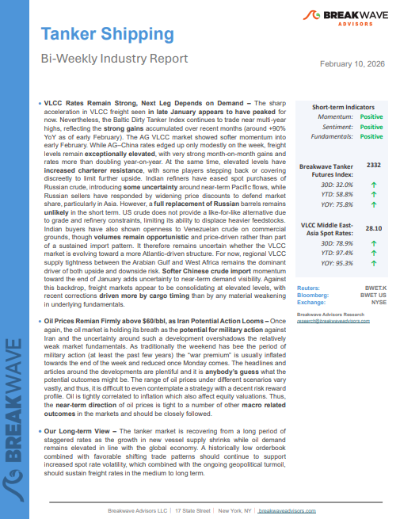
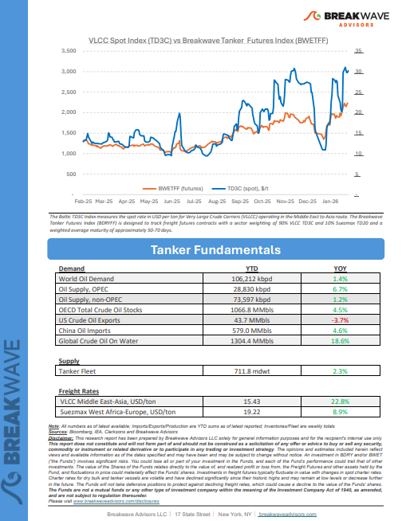

# Breakwave Weekend Read

**Date:** February 13, 2026  
**Publisher:** Breakwave Advisors | **Category:** Market Insights  
**Original URL:** [https://www.breakwaveadvisors.com/insights/2024/10/25/breakwave-weekend-read-547kk-rw7zy-awmfb-mf26k-dk29d-56ysb-x3jbe-xbwk9-dnpbr-b6jhc-l4mb2-d4l2e-f7l54-fsr59-khctl](https://www.breakwaveadvisors.com/insights/2024/10/25/breakwave-weekend-read-547kk-rw7zy-awmfb-mf26k-dk29d-56ysb-x3jbe-xbwk9-dnpbr-b6jhc-l4mb2-d4l2e-f7l54-fsr59-khctl)  

---

## Welcome Tobreakwave Advisorsweekend Read

***As the week comes to a close, take a moment to review the key insights from the past few days. Missed something? We've gathered all the top insights for you to catch up at your convenience.***

## Breakwave Shipping Report

**VLCC Rates Remain Strong, Next Leg Depends on Demand**– The sharp acceleration in VLCC freight seen**in late January appears to have peaked**for now.

[Read More](https://www.breakwaveadvisors.com/insights/2102026wetreport2026ll47)

> **Figure 1: Στιγμιότυπο Οθόνης 2026 02 13 123426**  
> **Interactive Data & Source:** [Breakwave Advisors Market Insights](https://www.breakwaveadvisors.com/insights/2026/2/9/the-panamax-market) | [Local Asset](file:///C:/Users/Dell/Github/Shipping/corpus/03-breakwave/insights/2026/assets/2026-02-13_breakwave-weekend-read-547kk-rw7zy-awmfb-mf26k-dk29d-56ysb-x3jbe-xbwk9-dnpbr-b6j_img_cea3cf84ceb9ceb3cebcceb9cf8ccf84cf85_a1f3814b3393.png)

> **Figure 2: Στιγμιότυπο Οθόνης 2026 02 13 123437**  
> **Interactive Data & Source:** [Breakwave Advisors Market Insights](https://www.breakwaveadvisors.com/insights/2026/2/9/the-panamax-market) | [Local Asset](file:///C:/Users/Dell/Github/Shipping/corpus/03-breakwave/insights/2026/assets/2026-02-13_breakwave-weekend-read-547kk-rw7zy-awmfb-mf26k-dk29d-56ysb-x3jbe-xbwk9-dnpbr-b6j_img_cea3cf84ceb9ceb3cebcceb9cf8ccf84cf85_eb7f63b259f1.png)

## Insights of the Week

## Global Soybean Exports

> **Figure 3: Pexels Fabrizio Zini 606841368 19500299**  
> **Interactive Data & Source:** [Breakwave Advisors Market Insights](https://www.breakwaveadvisors.com/insights/2026/2/9/the-panamax-market) | [Local Asset](file:///C:/Users/Dell/Github/Shipping/corpus/03-breakwave/insights/2026/assets/2026-02-13_breakwave-weekend-read-547kk-rw7zy-awmfb-mf26k-dk29d-56ysb-x3jbe-xbwk9-dnpbr-b6j_img_pexels-fabrizio-zini-606841368-19500_1771ea054d64.jpg)

The Panamax market enters February shaped by two contrasting cargo narratives.

Doric Weekly Market Insights

## Reassessing Russian Supply

> **Figure 4: Tankerrr 2 1**  
> **Interactive Data & Source:** [Breakwave Advisors Market Insights](https://www.breakwaveadvisors.com/insights/2026/2/9/reassessing-russian-supply) | [Local Asset](file:///C:/Users/Dell/Github/Shipping/corpus/03-breakwave/insights/2026/assets/2026-02-13_breakwave-weekend-read-547kk-rw7zy-awmfb-mf26k-dk29d-56ysb-x3jbe-xbwk9-dnpbr-b6j_img_tankerrr-2-1_89290ba50318.jpg)

Last week, President Trump announced that the United States and India had agreed a trade deal.

Gibson Tanker Market Report

## BDI vs BCI Ahead of the Lunar New Year

The Baltic Dry Index (BDI) recorded a sharp recovery ahead of the Lunar New Year before correcting on Friday, 6 February 2026.

[Read More](https://www.breakwaveadvisors.com/insights/2026/2/9/bdi-vs-bci-ahead-of-the-lunar-new-year)

Signal Ocean Market Insights

> **Figure 5: Unsplash Image Zhx6lfqjog0**  
> **Interactive Data & Source:** [Breakwave Advisors Market Insights](https://www.breakwaveadvisors.com/insights/2026/2/10/russian-crude-oil) | [Local Asset](file:///C:/Users/Dell/Github/Shipping/corpus/03-breakwave/insights/2026/assets/2026-02-13_breakwave-weekend-read-547kk-rw7zy-awmfb-mf26k-dk29d-56ysb-x3jbe-xbwk9-dnpbr-b6j_img_unsplash-image-zhx6lfqjog0_8a82d294c12b.jpg)

## Russian Crude Oil

> **Figure 6: Unsplash Image Vahad5kobj8**  
> **Interactive Data & Source:** [Breakwave Advisors Market Insights](https://www.breakwaveadvisors.com/insights/2026/2/10/russian-crude-oil) | [Local Asset](file:///C:/Users/Dell/Github/Shipping/corpus/03-breakwave/insights/2026/assets/2026-02-13_breakwave-weekend-read-547kk-rw7zy-awmfb-mf26k-dk29d-56ysb-x3jbe-xbwk9-dnpbr-b6j_img_unsplash-image-vahad5kobj8_80cbf782774d.jpg)

Yet more compliant tankers could go dark after EU bans maritime services for Russia crude trades

Braemar Research

## Tanker Newbuilding Activity

> **Figure 7: Unsplash Image 9tv1nhucxpm (1)**  
> **Interactive Data & Source:** [Breakwave Advisors Market Insights](https://www.breakwaveadvisors.com/insights/2026/2/10/tanker-newbuilding-activity) | [Local Asset](file:///C:/Users/Dell/Github/Shipping/corpus/03-breakwave/insights/2026/assets/2026-02-13_breakwave-weekend-read-547kk-rw7zy-awmfb-mf26k-dk29d-56ysb-x3jbe-xbwk9-dnpbr-b6j_img_unsplash-image-9tv1nhucxpm28129_c38d45363d85.jpg)

The renewed acceleration in tanker newbuilding activity has once again brought the question of oversupply to the forefront of market discussions, particularly as deliveries are set to rise sharply over the next two years.

Xclusiv Shipbrokers Weekly Report

## Libya’s Oil Sector

> **Figure 8: Unsplash Image Subrryxv8a**  
> **Interactive Data & Source:** [Breakwave Advisors Market Insights](https://www.breakwaveadvisors.com/insights/2026/2/11/libyas-oil-sector) | [Local Asset](file:///C:/Users/Dell/Github/Shipping/corpus/03-breakwave/insights/2026/assets/2026-02-13_breakwave-weekend-read-547kk-rw7zy-awmfb-mf26k-dk29d-56ysb-x3jbe-xbwk9-dnpbr-b6j_img_unsplash-image-subrryxv8a_1e50abd3ed15.jpg)

Libya’s oil sector is gaining renewed momentum in 2026, following a series of strategic developments that took place recently at the Libya Energy & Economic Summit (LEES).

Intermodal Weekly Market Report

## Coal and the Freight Market: Policy Direction vs Market Reality

> **Figure 9: Unsplash Image F8paevamk3a**  
> **Interactive Data & Source:** [Breakwave Advisors Market Insights](https://www.breakwaveadvisors.com/insights/2026/2/11/coal-and-the-freight-market-policy-direction-vs-market-reality) | [Local Asset](file:///C:/Users/Dell/Github/Shipping/corpus/03-breakwave/insights/2026/assets/2026-02-13_breakwave-weekend-read-547kk-rw7zy-awmfb-mf26k-dk29d-56ysb-x3jbe-xbwk9-dnpbr-b6j_img_unsplash-image-f8paevamk3a_a83e477a3aec.jpg)

This week’s Allied QuantumSea Research reviews one of the key challenges facing the dry bulk freight market: the growing gap between long-term energy transition objectives and the current realities of fleet supply and commodity dependence.

Allied Weekly Report

## Latam Crude Exports Face Temporary Slowdown

> **Figure 10: Στιγμιότυπο Οθόνης 2026 02 12 101124**  
> **Interactive Data & Source:** [Breakwave Advisors Market Insights](https://www.breakwaveadvisors.com/insights/2026/2/12/latam-crude-exports-face-temporary-slowdown) | [Local Asset](file:///C:/Users/Dell/Github/Shipping/corpus/03-breakwave/insights/2026/assets/2026-02-13_breakwave-weekend-read-547kk-rw7zy-awmfb-mf26k-dk29d-56ysb-x3jbe-xbwk9-dnpbr-b6j_img_cea3cf84ceb9ceb3cebcceb9cf8ccf84cf85_cee5fe3c275f.png)

LatAm crude exports are facing a temporary slowdown in early-2026 but we expect a rebound going forward which we explore in this insight piece.

Vortexa Freight Weekly

## Guinean Miner to Lower the Long-Term Contract Price

> **Figure 11: Unsplash Image Q7qz1jkjhqq**  
> **Interactive Data & Source:** [Breakwave Advisors Market Insights](https://www.breakwaveadvisors.com/insights/2026/2/12/guinean-miner-to-lower-the-long-term-contract-price) | [Local Asset](file:///C:/Users/Dell/Github/Shipping/corpus/03-breakwave/insights/2026/assets/2026-02-13_breakwave-weekend-read-547kk-rw7zy-awmfb-mf26k-dk29d-56ysb-x3jbe-xbwk9-dnpbr-b6j_img_unsplash-image-q7qz1jkjhqq_b8126f852ab9.jpg)

On January 29, a major Guinean miner reportedly lowered its 1Q26 bauxite long-term contract price from $66/mt to $62/mt.

BRS Weekly Dry Bulk Newsletter

## Tech Selloff Weighs on Risk Sentiment

> **Figure 12: Unsplash Image Ip7gfn5jqx8**  
> **Interactive Data & Source:** [Breakwave Advisors Market Insights](https://www.breakwaveadvisors.com/insights/2026/2/13/tech-selloff-weighs-on-risk-sentiment) | [Local Asset](file:///C:/Users/Dell/Github/Shipping/corpus/03-breakwave/insights/2026/assets/2026-02-13_breakwave-weekend-read-547kk-rw7zy-awmfb-mf26k-dk29d-56ysb-x3jbe-xbwk9-dnpbr-b6j_img_unsplash-image-ip7gfn5jqx8_4ab2430ca645.jpg)

A risk-off tone across markets weighed on commodity markets. Precious and industrial metals led the sell-off. Oil was also lower on lower geopolitical tensions.

Commodities Wrap

---

**Tags:** Shipping, Tankers, Drybulk  
