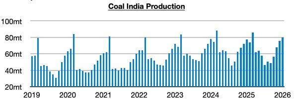
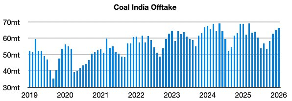
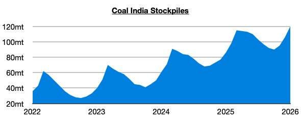

# Coal India's Stockpiles Set Record

**Date:** February 16, 2026  
**Publisher:** Breakwave Advisors | **Category:** Market Insights  
**Original URL:** [https://www.breakwaveadvisors.com/insights/2026/2/16/coal-indias-stockpiles-set-record](https://www.breakwaveadvisors.com/insights/2026/2/16/coal-indias-stockpiles-set-record)  

---

*By*[*Jeffrey Landsberg*](https://www.linkedin.com/in/jeffrey-landsberg-70ab957/)

As we discussed in Commodore Research's most recent Weekly Executive Report, Coal India (which is responsible for over 75% of India’s coal output) produced 79.8 million tons of coal last month. This is up month-on-month by 4.1 million tons (5%) and up year-on-year by 2 million tons (3%). Coal India’s production has now grown on a year-on-year basis for three straight months. Previously, it had contracted on a year-on-year basis during eight of the prior ten months. Problematic for dry bulk is that coal output fared better than India’s coal-derived electricity last month.

> **Figure 1: Chart 1**  
> [Local Asset](file:///C:/Users/Dell/Github/Shipping/corpus/03-breakwave/insights/2026/assets/2026-02-16_coal-indias-stockpiles-set-record_img_chart1_f940c2c4677a.jpg)

Offtake (the amount sent to customers) totaled 66.3 million tons, which is up month-on-month by 1.4 million tons (2%) but down year-on-year by 2.3 million tons (-3%). Offtake has now contracted on a year-on-year basis during ten of the last twelve months, and again has come in well below output.

> **Figure 2: Chart 2**  
> [Local Asset](file:///C:/Users/Dell/Github/Shipping/corpus/03-breakwave/insights/2026/assets/2026-02-16_coal-indias-stockpiles-set-record_img_chart2_283a75625e0f.jpg)

With offtake again coming in below output, India’s stockpiles have climbed even further and have set a record. They now stand at approximately 120 million tons. This is up month-on-month by 14 million tons and up year-on-year by 34 million tons (40%).

> **Figure 3: Chart 3**  
> [Local Asset](file:///C:/Users/Dell/Github/Shipping/corpus/03-breakwave/insights/2026/assets/2026-02-16_coal-indias-stockpiles-set-record_img_chart3_80e1a689a80f.jpg)

---

**Tags:** India, Coal, Energy  
