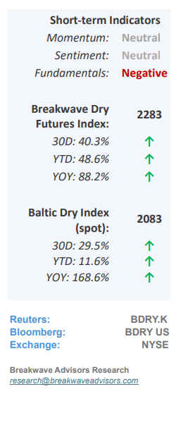
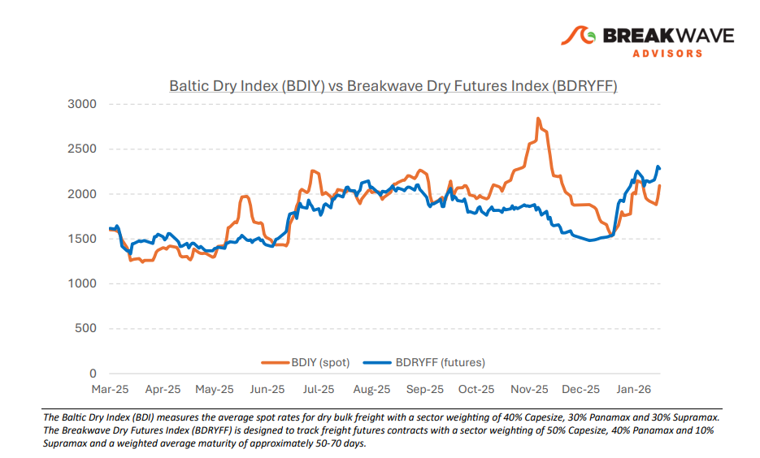
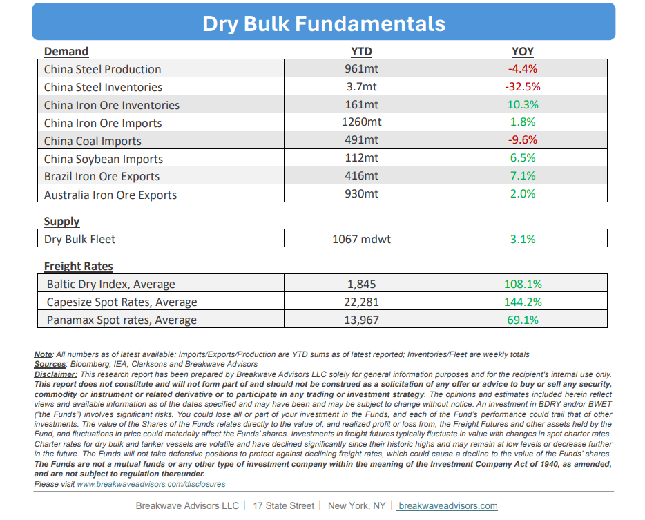

# Breakwave Bi-Weekly Dry Bulk Report - February 17, 2026

**Date:** February 17, 2026  
**Publisher:** Breakwave Advisors | **Category:** Market Insights  
**Original URL:** [https://www.breakwaveadvisors.com/insights/2172026db-report2026kk47li](https://www.breakwaveadvisors.com/insights/2172026db-report2026kk47li)  

---

•**February Curse is Broken as Capesize Rates Surge**– The recent**surge**in dry bulk spot rates has**defied the seasonal weakness**that typically characterizes the market at this time of the year.**Robust demand**across all segments has propelled spot rates to record highs for this period, subsequently driving futures to historic levels for as long as one can see. While fundamental data provides little immediate justification for this velocity, the**market’s upward trajectory**remains undisputed. This decoupling from traditional supply/demand models raises the question of whether market cyclicality has fundamentally shifted. With**commodities**entering what many perceive as a new**secular bull market**, dry bulk remains at the epicenter of such trend. While our initial projections favored a traditional February softening, current price action dictates a shift in such a stance as price remains king. From an investment perspective, we**see little merit in opposing a trend**of this magnitude, regardless of our fundamental views and despite evidence of cracks in the broader iron ore complex that historically has led to corrections in spot rates.

> **Figure 1: Cea3cf84ceb9ceb3cebcceb9cf8ccf84cf85**  
> [Local Asset](file:///C:/Users/Dell/Github/Shipping/corpus/03-breakwave/insights/2026/assets/2026-02-17_2172026db-report2026kk47li_img_cea3cf84ceb9ceb3cebcceb9cf8ccf84cf85_cbb85ff1378e.png)

•**Chinese Iron Ore Portside Inventories top 160mt for the Third Time Ever**– Iron ore stockpiles are once again approaching**record levels**against a backdrop of stagnant steel demand and rising global production. As the world’s primary consumer,**China remains the central authority**of iron ore trade and, by extension, the long-term determinant of dry bulk demand. Given the prevailing trend of declining steel production, combined with excessive inventory levels and gradually softening prices, a near-term**increase**in Chinese iron ore imports**appears unlikely**. While such environment has persisted for most of the past year, we anticipate a more definitive shift toward oversupply in the coming months. This transition is expected to trigger a market recalibration, characterized by sharper price corrections and reduced import volumes which should have a cascading impact on dry bulk demand

•**Our Long-term View**– The last few years have been characterized by increased geopolitical uncertainty. Going forward, we expect such events to continue to affect global trade and have a meaningful impact on effective vessel supply. Combined with the potential for a multi-year cyclical rebound in China’s economic activity following the recent economic turmoil, dry bulk shipping should experience higher volatility on top of a secular tightness driven by stable bulk commodity demand and a slower fleet growth owing to a relatively low orderbook.

> **Figure 2: Στιγμιότυπο Οθόνης 2026 02 17 083622**  
> [Local Asset](file:///C:/Users/Dell/Github/Shipping/corpus/03-breakwave/insights/2026/assets/2026-02-17_2172026db-report2026kk47li_img_cea3cf84ceb9ceb3cebcceb9cf8ccf84cf85_00bed06e4c03.png)

> **Figure 3: Στιγμιότυπο Οθόνης 2026 02 17 090001**  
> [Local Asset](file:///C:/Users/Dell/Github/Shipping/corpus/03-breakwave/insights/2026/assets/2026-02-17_2172026db-report2026kk47li_img_cea3cf84ceb9ceb3cebcceb9cf8ccf84cf85_05bac3ce31ce.png)

### Subscribe:
