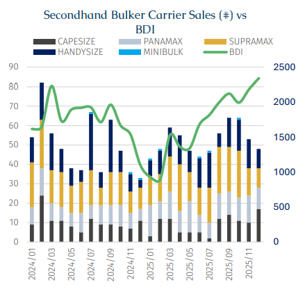
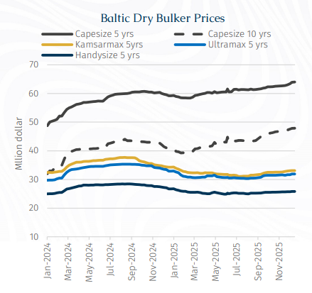
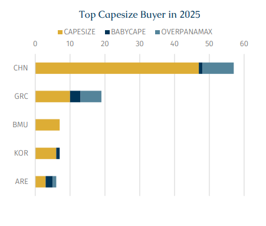
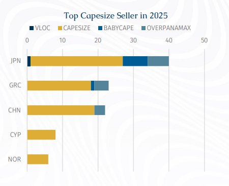

# Capesize Leads the 2025 Sale and Purchase Market

**Date:** February 18, 2026  
**Publisher:** Breakwave Advisors | **Category:** Market Insights  
**Original URL:** [https://www.breakwaveadvisors.com/insights/2026/2/18/capesize-leads-the-2025-sale-and-purchase-market](https://www.breakwaveadvisors.com/insights/2026/2/18/capesize-leads-the-2025-sale-and-purchase-market)  

---

> **Figure 1: Rgb Color Brs Shipbrokers Monogram L**  
> [Local Asset](file:///C:/Users/Dell/Github/Shipping/corpus/03-breakwave/insights/2026/assets/2026-02-18_capesize-leads-the-2025-sale-and-purchase-market_img_rgb-color-brs-shipbrokers-monogram-l_c365f35f1de5.png)

Last year, the dry bulk sale and purchase (S&P) market remained subdued reflecting the lacklustre freight market throughout the first half of the year. Accordingly, prices stayed under pressure during 1H25 but firmed in 2H25 as sentiment gradually improved and deals picked up. On a full-year basis, the total transaction volume slipped by around 5%.

As illustrated in the chart, the Baltic Dry Index (BDI) fell to a near ten-year low of just 892 points in February 2025. From April onwards, the market appetite for S&P transactions came under further downward pressure following proposals by the Office of the United States Trade Representative (USTR) to impose additional fees on China-built vessels. The uncertainty connected with this policy weighed heavily on sentiment, with transaction volumes plunging to only 44 vessels in June, levels last seen in January 2024.

Notably, during 1H25, Japanese-built units dominated S&P activity, accounting for 58% of total transactions, while China-built vessels represented only 33%. This imbalance began to normalise in 2H25, when transaction volumes for Japanese- and Chinese-built bulkers gradually converged. The key driver behind this shift was the temporary suspension of the USTR fees, which helped restore not only newbuilding but also snp confidence and facilitated a broader recovery in market activity.

> **Figure 2: Στιγμιότυπο Οθόνης 2026 02 18 103129**  
> [Local Asset](file:///C:/Users/Dell/Github/Shipping/corpus/03-breakwave/insights/2026/assets/2026-02-18_capesize-leads-the-2025-sale-and-purchase-market_img_cea3cf84ceb9ceb3cebcceb9cf8ccf84cf85_1df6f158416e.png)

From a vessel-segment perspective, although transaction numbers for Capesize and larger vessels declined by 16 units year-on-year to a total of 108 deals in 2025, market attention remained firmly focused on this segment. This largely reflected freight volatility in the Capesize market which drove movements of the Baltic Dry Index (BDI), since Capesize routes account for roughly 40% of the index weighting.

On one hand, during 2H25, average time charter earnings for C5TC surged by around 70% compared with 1H25, to average $26,713/day. This sharp improvement underpinned a strong rebound in the BDI from mid-year onwards and was accompanied by a parallel increase in Capesize S&P activity. Leading shipowners moved decisively, concluding a number of transactions. These deals were largely concentrated in older tonnage, with the majority of Capesizes sold having been built in 2011–12 and thus were not yet 15 years of age. This trend is readily explained by operational considerations: vessels reaching 15 years of age are required to undergo more regular special surveys, while certain charterers impose age limits of no more than 15 years for Australia trades and typically no more than 18 years for Brazil-bound voyages.

On the other hand, according to AXSMarine data, global seaborne bauxite trade reached a record 246.3 mln tonnes (versus 94.2 mln mt in 2015). Guinea accounted for around 73% of total exports, while Australia contributed a further 18%, together supplying over 91% of global seaborne bauxite volumes. Behind this growth lies a dominant structural driver: China’s primary aluminium production has increased sixteen-fold since 2000, accounting for nearly all global incremental demand. As aluminium output has soared, demand for bauxite and the vessels transporting it has risen in tandem. Moreover, the first bauxite shipment exported from Guinea last year involved a one-way transport distance of 920,000 tonne-miles, highlighting the long-haul nature of this trade.

Such extended voyage distances had attracted strong interest from shipowners seeking exposure to this market, resulting in a noticeable increase in Capesize acquisitions. For instance, China’s Winning International Shipping has not only placed sizeable newbuilding orders but has also acquired three Newcastlemaxes and two Capesizes in the second-hand market, of which four were Japanese-built and one was Chinese-built. The company is close to securing a double-digit orderbook for new Capesizes and has expanded its fleet capacity by approximately 1.5 mln Dwt. The absence of mandatory age restrictions on West African routes has further supported liquidity in older Capesize tonnage.

Meanwhile, some buyers returned to the second-hand market after an absence. US-based dry bulk owner Genco Shipping & Trading confirmed in last August that it had re-entered the S&P market with the acquisition of a modern Japanese-built Capesize vessel. For these shipowners, they may have smelled opportunities in the Capesize market. In addition, certain owners pursued acquisitions primarily to expand their fleet. Fujian Haitong, for example, outlined its “Hundred-Vessel Plan,” initially centered on Ultramaxes, with fleet growth driven by scale economics and a gradual extension into the Panamax and Capesize segments. The company aims to increase its owned fleet to around 100 vessels by 2028–29, targeting a mix of Ultramaxes, Panamaxes and Capesizes in a ratio of 7: 2: 1.

At the same time, other owners have focused on fleet renewal and modernisation. According to reports, the newly established joint venture Global Chartering has not only advanced its newbuilding program but also acquired a 2012-built Japanese Baby-Cape in early December, signaling a parallel strategy of fleet expansion and generational renewal.

> **Figure 3: Στιγμιότυπο Οθόνης 2026 02 18 103141**  
> [Local Asset](file:///C:/Users/Dell/Github/Shipping/corpus/03-breakwave/insights/2026/assets/2026-02-18_capesize-leads-the-2025-sale-and-purchase-market_img_cea3cf84ceb9ceb3cebcceb9cf8ccf84cf85_af2cb33db0bc.png)

As illustrated, Capesize was the only vessel segment in the second-hand market to record year-on-year price appreciation last year, while prices across others dry bulk segments declined to varying degrees from 2024 to Jun25, after which they began to edge up slightly. More specifically, five-year-old Capesize values increased by 6% y-o-y to around $61 mln, while ten-year-old units rose by approximately 7% to $43.5 mln. Prices for 15-year-old vessels edged up marginally by 0.3%, remaining broadly stable at around $27.9 mln. By comparison, CNDPI indicates that the average price of a Capesize newbuilding stood at approximately $70.9 mln last year. This highlights the clear price attractiveness of modern second-hand vessels of around five years of age, offering buyers both immediate employment potential and superior cost efficiency.

> **Figure 4: Στιγμιότυπο Οθόνης 2026 02 18 103150**  
> [Local Asset](file:///C:/Users/Dell/Github/Shipping/corpus/03-breakwave/insights/2026/assets/2026-02-18_capesize-leads-the-2025-sale-and-purchase-market_img_cea3cf84ceb9ceb3cebcceb9cf8ccf84cf85_5ca6ca5660a7.png)

> **Figure 5: Στιγμιότυπο Οθόνης 2026 02 18 103205**  
> [Local Asset](file:///C:/Users/Dell/Github/Shipping/corpus/03-breakwave/insights/2026/assets/2026-02-18_capesize-leads-the-2025-sale-and-purchase-market_img_cea3cf84ceb9ceb3cebcceb9cf8ccf84cf85_4cd75a3256ce.png)

A closer look at the buyer profile shows that Chinese owners dominated Capesize purchasing activity last year by a wide margin, with acquisition three times more ships than Greek owners, who ranked second. The average age of Capesizes sold was 15 years. Notably, among vessels acquired by Chinese buyers, Japanese-built tonnage accounted for 48% of purchases, while a similar pattern was observed among Greek owners, for whom Japanese-built vessels represented 44% of acquisitions. At the same time, Japanese owners emerged as the most active sellers of Capesizes. Market sources suggest that some Japanese owners have taken advantage of elevated asset prices to divest dry bulk tonnage. For example, Kumiai Senpaku is reportedly planning to exit the large dry bulk segment by 2026, shifting its strategic focus toward niche sectors such as asphalt carriers. According to broker information, the current price differential between 15-year-old Capesizes built in China and Japan stands at approximately USD 2.0–2.5 mln.

Despite the USTR fees being suspended until 10 November 2026, recent diplomatic developments suggest a potentially more constructive tone in Sino–US relations. Media reports that President Donald Trump has agreed to visit Beijing this April. Against this backdrop of warming bilateral exchanges, the direct impact on the shipping market could potentially remain limited.

---

**Tags:** Capesize, Shipping, Markets  
