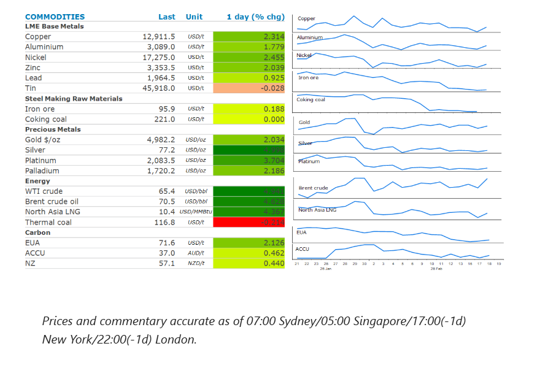
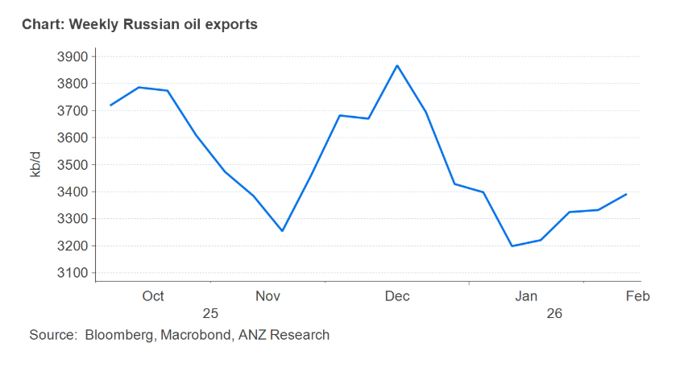

# Oil gains as Iran prepares for confrontation with US

**Date:** February 19, 2026  
**Publisher:** Breakwave Advisors | **Category:** Market Insights  
**Original URL:** [https://www.breakwaveadvisors.com/insights/2026/2/19/oil-gains-as-iran-prepares-for-confrontation-with-us](https://www.breakwaveadvisors.com/insights/2026/2/19/oil-gains-as-iran-prepares-for-confrontation-with-us)  

---

A broad risk-on sentiment has returned to commodity markets, with prices rising across the sectors. Strong US economic data have supported not only growth commodities but also precious metals.

*By*[*Daniel Hynes*](https://www.linkedin.com/in/dahynes/)

> **Figure 1: Στιγμιότυπο Οθόνης 2026 02 19 110104**  
> **Interactive Data & Source:** [Linkedin](https://www.linkedin.com/newsletters/commodities-wrap-6692196755876012032/?fbclid=IwAR3kiXJqZdxmp9ZcRwBNI7FsBySI-XSC0pfPur1qzjt7OZp7PTE59Tsl1QI) | [Local Asset](file:///C:/Users/Dell/Github/Shipping/corpus/03-breakwave/insights/2026/assets/2026-02-19_oil-gains-as-iran-prepares-for-confrontation-with-us_img_cea3cf84ceb9ceb3cebcceb9cf8ccf84cf85_30b4105eb8fe.png)

### Market Commentary

**Crude oil**prices rose on investor concerns over the final agreement between the US and Iran, which hinges on a potential nuclear deal. Iran is expected to present a comprehensive proposal within the next two weeks, while a report suggested that American military intervention could come sooner than expected. Elsewhere, President Zelenskyy has accused Russia of delaying peace talks. Operations at Russian refineries have been disrupted by Ukrainian air strikes, resulting increased crude oil exports. Russian oil production also declined towards the end of last year following attacks on oil infrastructure. A prevailing risk-on sentiment in the market helped prices to move higher.

**European natural gas**pared recent losses, as traders fear disruptions to gas flows if Iran closes the Strait of Hormuz. While forecasts of warmer weather increase the prospect of softening demand, investors are watching depleted European gas inventories which are now at 34%, their lowest since 2022. Gas flows remain steady despite production outages in Norway. Renewable power generation is picking up in Germany, with mild weather helping solar power generation, with strong winds supporting wind power generation.

**Gold**rose above USD5,000/oz amid renewed geopolitical concerns. Buyers took advantage of the price drop ahead of the release of the Federal Reserve’s meeting minutes. Strong economic data suggest a hawkish tilt, but the market will be closely watching the Fed’s stance on rates. Speculative positions are lean, and fresh longs can return as structural drivers are still in place.**Silver**prices jumped to USD78/oz. Year-to-date, 69moz of silver moved out of COMEX to other trading hubs, easing spot market tightness.

**Copper**recouped losses by gaining more than 2%, as strong economic data bolstered market sentiment. US industrial production increased in January by the most in nearly a year. Housing starts rose to a five-month high, supporting demand prospects for industrial metals.**Aluminium**traded above USD3,000/t. The US is considering changing its broad tariffs on steel and aluminium, this will see trade flows normalising.**Iron ore**fell to USD95/t in Singapore amid rising iron ore inventories and falling steel production. Steel output in China declined by over 4% to roughly 961mt last year. Domestic demand has been dented by the ongoing property crisis, but steel mills have increased exports in an effort to compensate for the downturn. On the other hand, Australia and Brazil are boosting their production, while start of the Simandou project will add to production over the years.

### Chart of the Day

Russia’s crude shipments have edged higher over the past couple of weeks, as a step-up in Ukrainian drone strikes on the country’s refineries and a halt to piped deliveries to Hungary and Slovakia likely boosting export volumes. Exports averaged 3.39mb/d in the four weeks to 15 Feb, rising for a fourth week, but were still down from the pre-Christmas peak.

> **Figure 2: Στιγμιότυπο Οθόνης 2026 02 19 110205**  
> **Interactive Data & Source:** [Linkedin](https://www.linkedin.com/newsletters/commodities-wrap-6692196755876012032/?fbclid=IwAR3kiXJqZdxmp9ZcRwBNI7FsBySI-XSC0pfPur1qzjt7OZp7PTE59Tsl1QI) | [Local Asset](file:///C:/Users/Dell/Github/Shipping/corpus/03-breakwave/insights/2026/assets/2026-02-19_oil-gains-as-iran-prepares-for-confrontation-with-us_img_cea3cf84ceb9ceb3cebcceb9cf8ccf84cf85_1ef9a817f3aa.png)

Data source:[Commodities Wrap](https://www.linkedin.com/newsletters/commodities-wrap-6692196755876012032/?fbclid=IwAR3kiXJqZdxmp9ZcRwBNI7FsBySI-XSC0pfPur1qzjt7OZp7PTE59Tsl1QI)

---

**Tags:** Shipping, Commodities, Markets  
