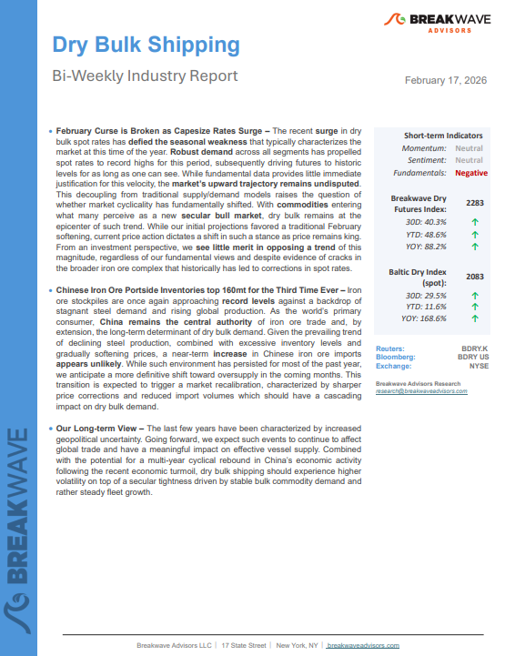
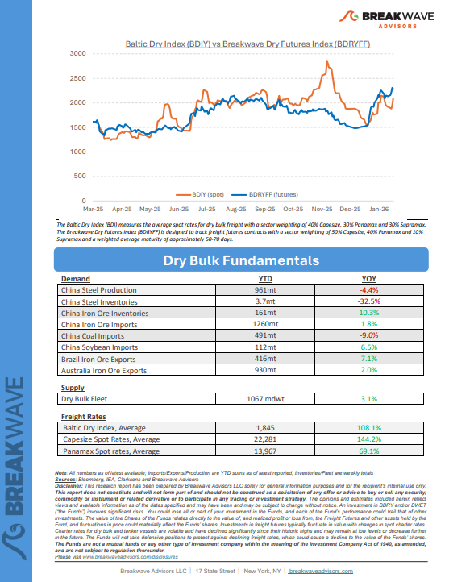
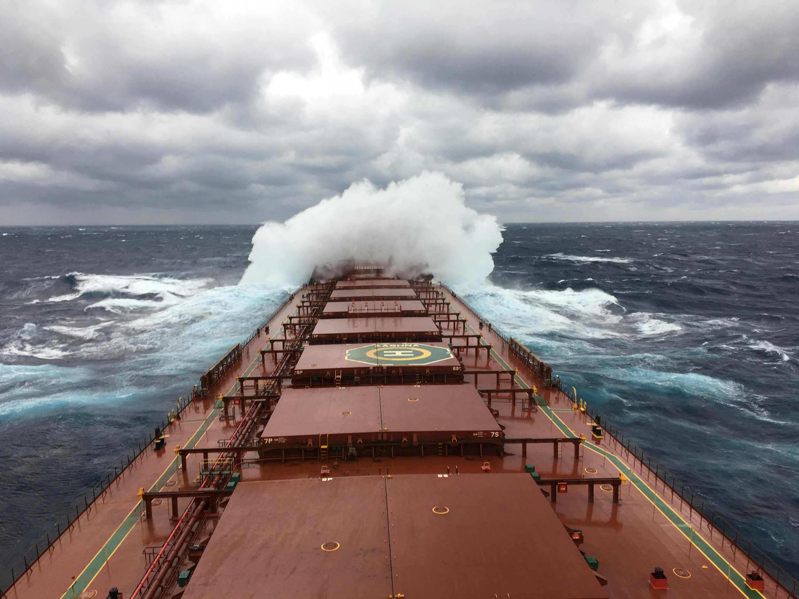
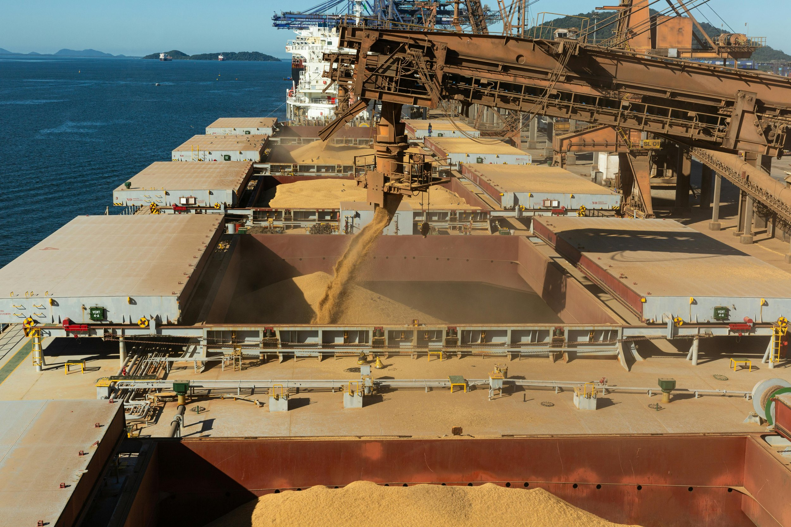
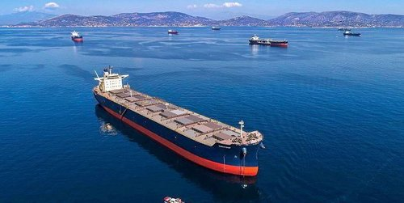
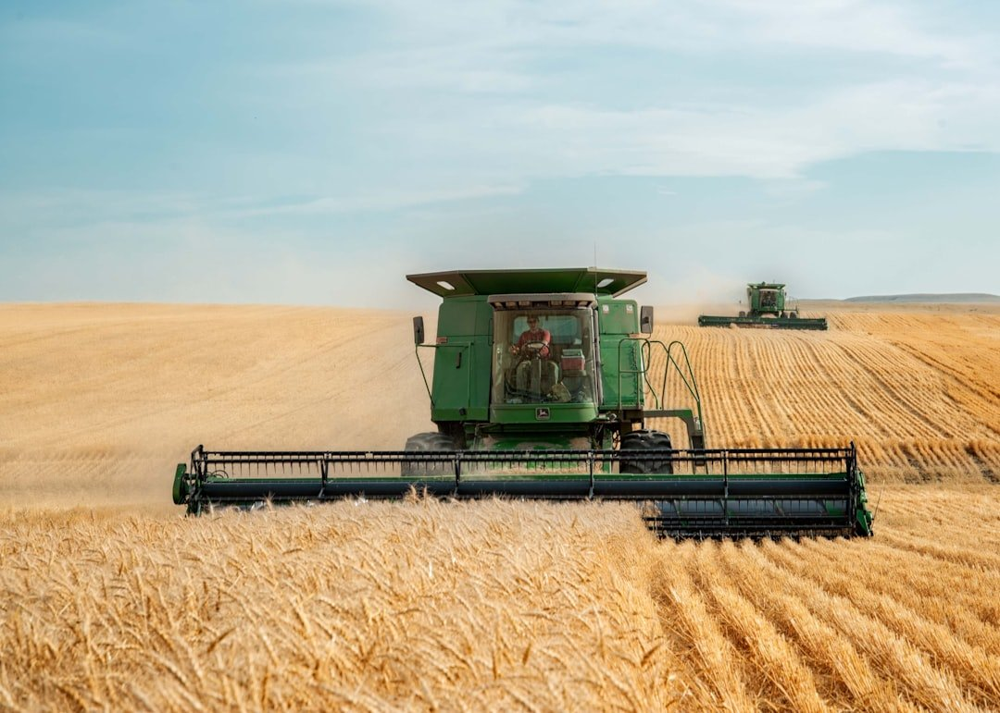

# Breakwave Weekend Read

**Date:** February 20, 2026  
**Publisher:** Breakwave Advisors | **Category:** Market Insights  
**Original URL:** [https://www.breakwaveadvisors.com/insights/2026/2/20breakwave-weekend-read-554747hhg](https://www.breakwaveadvisors.com/insights/2026/2/20breakwave-weekend-read-554747hhg)  

---

## Welcome Tobreakwave Advisorsweekend Read

***As the week comes to a close, take a moment to review the key insights from the past few days. Missed something? We've gathered all the top insights for you to catch up at your convenience.***

## Breakwave Shipping Report

**February Curse is Broken as Capesize Rates Surge**– The recent**surge**in dry bulk spot rates has**defied the seasonal weakness**that typically characterizes the market at this time of the year.

[Read More](https://www.breakwaveadvisors.com/insights/2172026db-report2026kk47li)

> **Figure 1: Στιγμιότυπο Οθόνης 2026 02 20 120730**  
> **Interactive Data & Source:** [Breakwave Advisors Market Insights](https://www.breakwaveadvisors.com/insights/2026/2/16/global-trade) | [Local Asset](file:///C:/Users/Dell/Github/Shipping/corpus/03-breakwave/insights/2026/assets/2026-02-20_20breakwave-weekend-read-554747hhg_img_cea3cf84ceb9ceb3cebcceb9cf8ccf84cf85_6f6ce42913ac.png)

> **Figure 2: Στιγμιότυπο Οθόνης 2026 02 20 120743**  
> **Interactive Data & Source:** [Breakwave Advisors Market Insights](https://www.breakwaveadvisors.com/insights/2026/2/16/global-trade) | [Local Asset](file:///C:/Users/Dell/Github/Shipping/corpus/03-breakwave/insights/2026/assets/2026-02-20_20breakwave-weekend-read-554747hhg_img_cea3cf84ceb9ceb3cebcceb9cf8ccf84cf85_2a17b815781b.png)

## Insights of the Week

## Global Trade

> **Figure 3: Unsplash Image Nxt5htlmlge**  
> **Interactive Data & Source:** [Breakwave Advisors Market Insights](https://www.breakwaveadvisors.com/insights/2026/2/16/global-trade) | [Local Asset](file:///C:/Users/Dell/Github/Shipping/corpus/03-breakwave/insights/2026/assets/2026-02-20_20breakwave-weekend-read-554747hhg_img_unsplash-image-nxt5htlmlge_4eef65c5fa2f.jpg)

In the second week of February last year, Doric’s Weekly Insight focused on the abrupt escalation in global trade tensions..

Doric Weekly Market Insights

## Crude Clampdown

> **Figure 4: Istock 1127778370**  
> **Interactive Data & Source:** [Breakwave Advisors Market Insights](https://www.breakwaveadvisors.com/insights/2026/2/16/crude-clampdown) | [Local Asset](file:///C:/Users/Dell/Github/Shipping/corpus/03-breakwave/insights/2026/assets/2026-02-20_20breakwave-weekend-read-554747hhg_img_istock-1127778370_b75e3b48971e.jpg)

The EU is considering a major change to its sanctions framework on Russian oil.

Gibson Tanker Market Report

## Coal India's Stockpiles Set Record

As we discussed in Commodore Research's most recent Weekly Executive Report, Coal India (which is responsible for over 75% of India’s coal output) produced 79.8 million tons of coal last month.

[Read More](https://www.breakwaveadvisors.com/insights/2026/2/16/coal-indias-stockpiles-set-record)

From Commodore's Weekly Dry Bulk Reports

> **Figure 5: Unsplash Image Ii0ows5abco**  
> **Interactive Data & Source:** [Breakwave Advisors Market Insights](https://www.breakwaveadvisors.com/insights/2026/2/17/china-drives-growth-in-steel-flows-as-the-rest-of-the-world-sees-a-small-contraction) | [Local Asset](file:///C:/Users/Dell/Github/Shipping/corpus/03-breakwave/insights/2026/assets/2026-02-20_20breakwave-weekend-read-554747hhg_img_unsplash-image-ii0ows5abco_3b848a3d1bf0.jpg)

## China Drives Growth in Steel Flows As the Rest of the World Sees a Small Contraction

> **Figure 6: Unsplash Image Akdd4u Ytwa**  
> **Interactive Data & Source:** [Breakwave Advisors Market Insights](https://www.breakwaveadvisors.com/insights/2026/2/17/china-drives-growth-in-steel-flows-as-the-rest-of-the-world-sees-a-small-contraction) | [Local Asset](file:///C:/Users/Dell/Github/Shipping/corpus/03-breakwave/insights/2026/assets/2026-02-20_20breakwave-weekend-read-554747hhg_img_unsplash-image-akdd4u-ytwa_a0ff05ea2e51.jpg)

Steel flows climb in 2025 as weak domestic demand in China leads to greater reliance on export markets. This trend has continued into 2026.

Signal Ocean Commodity Radar

## Should We Throw the “Higher Inflation” Towel?

> **Figure 7: Unsplash Image Wb63zqj5gne**  
> **Interactive Data & Source:** [Breakwave Advisors Market Insights](https://www.breakwaveadvisors.com/insights/2026/2/18/should-we-throw-the-higher-inflation-towel) | [Local Asset](file:///C:/Users/Dell/Github/Shipping/corpus/03-breakwave/insights/2026/assets/2026-02-20_20breakwave-weekend-read-554747hhg_img_unsplash-image-wb63zqj5gne_95b912f835bb.jpg)

Inflation is the sort of unpredictable variable that can expose even the cleverest economic minds.

Forvis Mazars Weekly Note

## Capesize Leads the 2025 Sale and Purchase Market

> **Figure 8: Pexels Vasu27 3478963**  
> **Interactive Data & Source:** [Breakwave Advisors Market Insights](https://www.breakwaveadvisors.com/insights/2026/2/18/capesize-leads-the-2025-sale-and-purchase-market) | [Local Asset](file:///C:/Users/Dell/Github/Shipping/corpus/03-breakwave/insights/2026/assets/2026-02-20_20breakwave-weekend-read-554747hhg_img_pexels-vasu27-3478963_29f31d4b43fe.jpg)

Last year, the dry bulk sale and purchase (S&P) market remained subdued reflecting the lacklustre freight market throughout the first half of the year.

BRS Weekly Dry Bulk Newsletter

## Liberia’s Iron Ore Ramp-Up Aims to Boost Capesize Demand in 2026

> **Figure 9: Pexels Fabrizio Zini 606841368 19500302**  
> **Interactive Data & Source:** [Breakwave Advisors Market Insights](https://www.breakwaveadvisors.com/insights/2026/2/18/liberias-iron-ore-ramp-up-aims-to-boost-capesize-demand-in-2026) | [Local Asset](file:///C:/Users/Dell/Github/Shipping/corpus/03-breakwave/insights/2026/assets/2026-02-20_20breakwave-weekend-read-554747hhg_img_pexels-fabrizio-zini-606841368-19500_db5775946972.jpg)

Discussions on Capesize trade growth opportunities from West Africa have focused on Guinea, thanks to soaring bauxite exports and the long-awaited start of iron ore operations from the Simandou project, from where five ore shipments have been recorded to date.

Braemar 360 Degrees

## Dry Bulk Market on a Firmer Footing

> **Figure 10: Knightship**  
> **Interactive Data & Source:** [Breakwave Advisors Market Insights](https://www.breakwaveadvisors.com/insights/2026/2/19/dry-bulk-market-on-a-firmer-footing) | [Local Asset](file:///C:/Users/Dell/Github/Shipping/corpus/03-breakwave/insights/2026/assets/2026-02-20_20breakwave-weekend-read-554747hhg_img_knightship_0d420fade627.jpg)

The dry bulk market has entered 2026 on a markedly firmer footing, with the strong finish of 2025 and the solid opening weeks of the new year translating directly into higher asset values across all size segments.

Xclusiv Shipbrokers Weekly Report

## Oil Gains As Iran Prepares for Confrontation with Us

> **Figure 11: Unsplash Image K5mptonmphm**  
> **Interactive Data & Source:** [Breakwave Advisors Market Insights](https://www.breakwaveadvisors.com/insights/2026/2/19/oil-gains-as-iran-prepares-for-confrontation-with-us) | [Local Asset](file:///C:/Users/Dell/Github/Shipping/corpus/03-breakwave/insights/2026/assets/2026-02-20_20breakwave-weekend-read-554747hhg_img_unsplash-image-k5mptonmphm_31d6d4a4a23c.jpg)

A broad risk-on sentiment has returned to commodity markets, with prices rising across the sectors. Strong US economic data have supported not only growth commodities but also precious metals.

Commodities Wrap

## China Sources Wheat From Argentina

> **Figure 12: Unsplash Image Fqoq39jj5us**  
> **Interactive Data & Source:** [Breakwave Advisors Market Insights](https://www.breakwaveadvisors.com/insights/2026/2/20/china-sources-wheat-from-argentina) | [Local Asset](file:///C:/Users/Dell/Github/Shipping/corpus/03-breakwave/insights/2026/assets/2026-02-20_20breakwave-weekend-read-554747hhg_img_unsplash-image-fqoq39jj5us_99320723348b.jpg)

Argentina begins shipping wheat to China, adding origin diversification but with limited immediate impact on vessel allocation.

Signal Ocean Dry Weekly Market Monitor

---

**Tags:** Shipping, Tankers, Drybulk  
