# China Sources Wheat from Argentina

**Date:** February 20, 2026  
**Publisher:** Breakwave Advisors | **Category:** Market Insights  
**Original URL:** [https://www.breakwaveadvisors.com/insights/2026/2/20/china-sources-wheat-from-argentina](https://www.breakwaveadvisors.com/insights/2026/2/20/china-sources-wheat-from-argentina)  

---

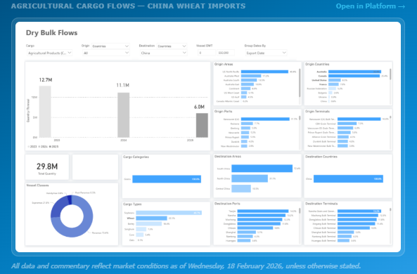

> **Figure 1: Στιγμιότυπο Οθόνης 2026 02 20 103151**  
> **Interactive Data & Source:** [Signal Ocean Platform](https://go.signalocean.com/e/983831/dry-dynamic-drybulkflows/2rvvq6/580487600/h/AZVsWWkv6kLnHVFiUIL9S0_Q39Z6-MO5SDGm3j3GUA8) | [Local Asset](file:///C:/Users/Dell/Github/Shipping/corpus/03-breakwave/insights/2026/assets/2026-02-20_china-sources-wheat-from-argentina_img_cea3cf84ceb9ceb3cebcceb9cf8ccf84cf85_f4b76c8e032a.png)

### Key Takeaways

● Argentina begins shipping wheat to China, adding origin diversification but with limited immediate impact on vessel allocation.

● Freight markets remain firm, with the BDI near 2,000 and strong year-on-year gains across most segments.

● Capesize corrects but stays elevated; Panamax remains resilient, particularly on Atlantic grain routes.

● Pacific basin supply pressure persists, especially in larger vessel classes.

● Tonne-mile growth softens for Capesize and Panamax, while smaller segments continue to outperform.

## Spotlight of the Week

### Argentina - China Wheat Corridor Emerges

China's wheat import program has historically been concentrated mostly on Canada and Australia, which together account for roughly 70% of total volumes.[**Signal Ocean Platform flow data**](https://go.signalocean.com/e/983831/dry-dynamic-drybulkflows/2rvvq6/580487600/h/AZVsWWkv6kLnHVFiUIL9S0_Q39Z6-MO5SDGm3j3GUA8)mirrors this concentration on the freight side. Approximately 70% of China-bound wheat shipments move on Panamax vessels, with around 20% carried on Supramax vessels.

[**Argentina**](https://go.signalocean.com/e/983831/irst-shipment-china-107k-tons-/2rvvq9/580487600/h/AZVsWWkv6kLnHVFiUIL9S0_Q39Z6-MO5SDGm3j3GUA8)is entering the Chinese wheat market, adding origin diversity to an otherwise concentrated supplier base. Approximately 107,000 tons are scheduled to ship in the coming weeks, marking the first cargoes following China's updated quarantine registration approvals. Of this volume, 65,000 tons are expected to load at Timbúes under COFCO's program, with two additional cargoes of 20,000 and 22,000 tons listed from Bahía Blanca under Cargill.

The timing coincides with Argentina's 2025/26 wheat harvest. Production is projected at approximately 27.5–27.8 million tons, according to the Buenos Aires Grain Exchange and USDA. Exports are forecast at around 17.5 million tons. Although China is the world's largest wheat producer, it regularly supplements its domestic supply with imports, which in recent years have ranged from roughly 6 to over 12 million tons annually.

At current volumes, Argentina's participation does not materially change the existing Panamax and Supramax percentage shares. However, if buyers adopt smaller parcel sizes or adjust scheduling, Supramax utilization could gradually increase. A key operational factor is Argentina's inland export system — most agricultural exports transit the Paraná–Paraguay waterway to the Rosario hub, where draft limitations can require partial loading at deeper-water ports.

Overall, Argentina's entry into China's wheat supplier base is unlikely to materially alter the core structure of the trade as the Panamax vessel size segment remains favored. Future shifts in the Panamax–Supramax balance will depend on river conditions, parcel-size decisions, and the scale of Argentine exports from 2026 onward.

## Freight Market Overview

Despite the Chinese New Year period, the Baltic Dry Index (BDI) showed strength, recovering to nearly 2,000 points after dipping to 1,900 points mid-last week. The index currently indicates robust momentum, showing an exceptional +160% year-on-year increase compared to the same period last year. While the Capesize segment saw a downward correction, it is still firmer than it was a week ago. C5TC earnings (BCI 180) notably fell below $25k/d, although this segment maintains an outstanding 290% upward movement on an annual percentage basis.

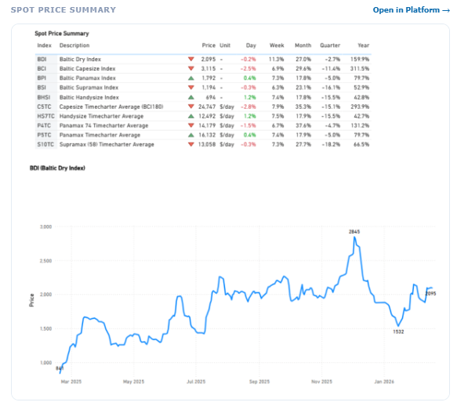

> **Figure 2: Στιγμιότυπο Οθόνης 2026 02 20 103319**  
> **Interactive Data & Source:** [Signal Ocean Platform](https://go.signalocean.com/e/983831/ry-market-monitor-week-07-2026/2rvvql/580487600/h/AZVsWWkv6kLnHVFiUIL9S0_Q39Z6-MO5SDGm3j3GUA8) | [Local Asset](file:///C:/Users/Dell/Github/Shipping/corpus/03-breakwave/insights/2026/assets/2026-02-20_china-sources-wheat-from-argentina_img_cea3cf84ceb9ceb3cebcceb9cf8ccf84cf85_f5fc6ffa2e2f.png)

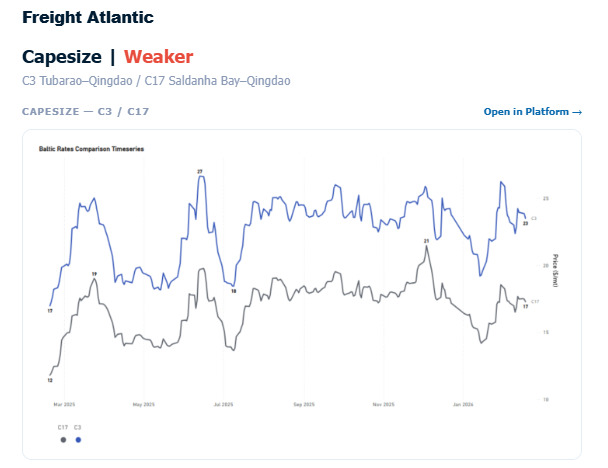

> **Figure 3: Στιγμιότυπο Οθόνης 2026 02 20 103330**  
> **Interactive Data & Source:** [Signal Ocean Platform](https://go.signalocean.com/e/983831/ry-market-monitor-week-07-2026/2rvvql/580487600/h/AZVsWWkv6kLnHVFiUIL9S0_Q39Z6-MO5SDGm3j3GUA8) | [Local Asset](file:///C:/Users/Dell/Github/Shipping/corpus/03-breakwave/insights/2026/assets/2026-02-20_china-sources-wheat-from-argentina_img_cea3cf84ceb9ceb3cebcceb9cf8ccf84cf85_940395d80957.png)

The rate for the Tubarao to Qingdao route, while dropping below $24/ton, is indicated mid-week at around $23.50/mt. This compares to the $23/ton noted in our[**last dry market monitor**](https://go.signalocean.com/e/983831/ry-market-monitor-week-07-2026/2rvvql/580487600/h/AZVsWWkv6kLnHVFiUIL9S0_Q39Z6-MO5SDGm3j3GUA8). Furthermore, the year-on-year upward trend strengthened, rising from 34% in the previous week to 38%. The Saldanha Bay–Qingdao rates held the sentiment of the previous week of around $17/mt (+46% YoY).

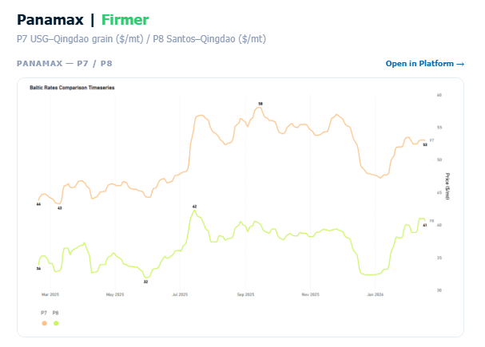

> **Figure 4: Στιγμιότυπο Οθόνης 2026 02 20 103339**  
> **Interactive Data & Source:** [Signal Ocean Dynamic Timeseries](https://go.signalocean.com/e/983831/dry-dynamic-timeseries-dry/2rvvqz/580487600/h/AZVsWWkv6kLnHVFiUIL9S0_Q39Z6-MO5SDGm3j3GUA8) | [Local Asset](file:///C:/Users/Dell/Github/Shipping/corpus/03-breakwave/insights/2026/assets/2026-02-20_china-sources-wheat-from-argentina_img_cea3cf84ceb9ceb3cebcceb9cf8ccf84cf85_0cf720df8f6f.png)

Rates for the USG–Qingdao and Santos–Qingdao routes remain firm, with both seeing an annual increase of approximately 20% from 17% in the previous week. The USG–Qingdao rate, in particular, continues to hover around a $50/ton premium, a level sustained since early February. Meanwhile, the Santos–Qingdao rate is still nearing $40/ton.

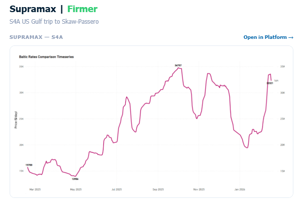

> **Figure 5: Στιγμιότυπο Οθόνης 2026 02 20 103347**  
> **Interactive Data & Source:** [Signal Ocean Dynamic Timeseries](https://go.signalocean.com/e/983831/dry-dynamic-timeseries-dry/2rvvqz/580487600/h/AZVsWWkv6kLnHVFiUIL9S0_Q39Z6-MO5SDGm3j3GUA8) | [Local Asset](file:///C:/Users/Dell/Github/Shipping/corpus/03-breakwave/insights/2026/assets/2026-02-20_china-sources-wheat-from-argentina_img_cea3cf84ceb9ceb3cebcceb9cf8ccf84cf85_eb2d56c6961e.png)

The USG-to-Skaw-Passero route recorded remarkable strength, with rates climbing above $30k/day, an increase from the $28k/day seen the previous week. This signifies an annual percentage growth exceeding 100%.

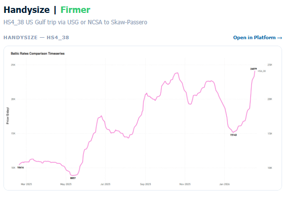

> **Figure 6: Στιγμιότυπο Οθόνης 2026 02 20 103359**  
> **Interactive Data & Source:** [Signal Ocean Dynamic Timeseries](https://go.signalocean.com/e/983831/dry-dynamic-timeseries-dry/2rvvqz/580487600/h/AZVsWWkv6kLnHVFiUIL9S0_Q39Z6-MO5SDGm3j3GUA8) | [Local Asset](file:///C:/Users/Dell/Github/Shipping/corpus/03-breakwave/insights/2026/assets/2026-02-20_china-sources-wheat-from-argentina_img_cea3cf84ceb9ceb3cebcceb9cf8ccf84cf85_bc96d4440fde.png)

USG trip to Skaw-Passero recorded levels of around $24k/d, an increase of $4k/d from the previous mid-week levels (+138% YoY).

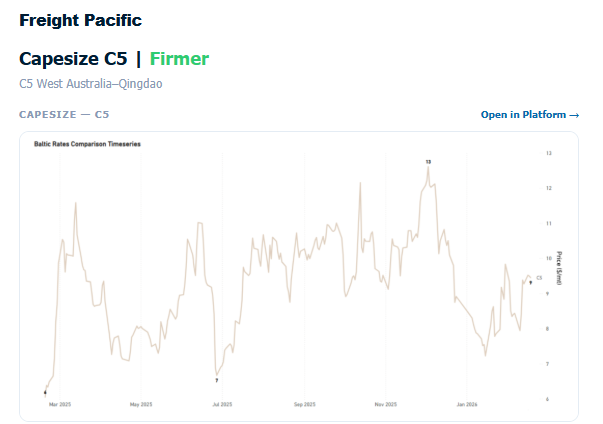

> **Figure 7: Στιγμιότυπο Οθόνης 2026 02 20 103410**  
> **Interactive Data & Source:** [Signal Ocean Dynamic Timeseries](https://go.signalocean.com/e/983831/dry-dynamic-timeseries-dry/2rvvqz/580487600/h/AZVsWWkv6kLnHVFiUIL9S0_Q39Z6-MO5SDGm3j3GUA8) | [Local Asset](file:///C:/Users/Dell/Github/Shipping/corpus/03-breakwave/insights/2026/assets/2026-02-20_china-sources-wheat-from-argentina_img_cea3cf84ceb9ceb3cebcceb9cf8ccf84cf85_4e2120ac9b35.png)

The West Australia–Qingdao rates strengthened, approaching $9.5/ton, an increase from the mid-$8/ton levels seen the prior week. This current firmer sentiment represents a 56% annual percentage rise. The key question moving forward is how this positive sentiment will develop following the conclusion of the Chinese New Year period.

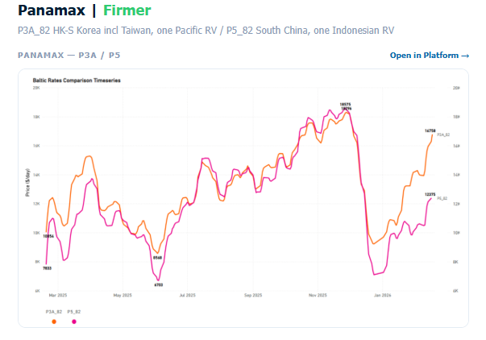

> **Figure 8: Στιγμιότυπο Οθόνης 2026 02 20 103423**  
> **Interactive Data & Source:** [Signal Ocean Dynamic Timeseries](https://go.signalocean.com/e/983831/dry-dynamic-timeseries-dry/2rvvqz/580487600/h/AZVsWWkv6kLnHVFiUIL9S0_Q39Z6-MO5SDGm3j3GUA8) | [Local Asset](file:///C:/Users/Dell/Github/Shipping/corpus/03-breakwave/insights/2026/assets/2026-02-20_china-sources-wheat-from-argentina_img_cea3cf84ceb9ceb3cebcceb9cf8ccf84cf85_a68a42f36bd8.png)

The Panamax Pacific market has maintained the substantial gains from the previous week, continuing its upward trajectory since the start of the year. Specifically, rates on the P3A_82 route have climbed above $16k/d, marking about a $7k/day increase compared to the same period last year.

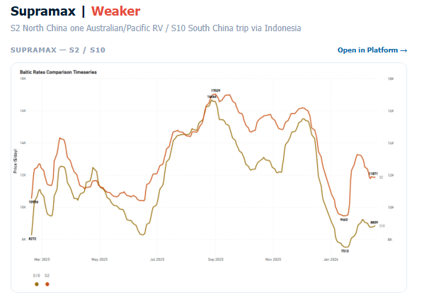

> **Figure 9: Στιγμιότυπο Οθόνης 2026 02 20 103432**  
> **Interactive Data & Source:** [Signal Ocean Dynamic Timeseries](https://go.signalocean.com/e/983831/dry-dynamic-timeseries-dry/2rvvqz/580487600/h/AZVsWWkv6kLnHVFiUIL9S0_Q39Z6-MO5SDGm3j3GUA8) | [Local Asset](file:///C:/Users/Dell/Github/Shipping/corpus/03-breakwave/insights/2026/assets/2026-02-20_china-sources-wheat-from-argentina_img_cea3cf84ceb9ceb3cebcceb9cf8ccf84cf85_8c239c0f1145.png)

The Supramax Pacific market shifted direction, moving away from an upward trend to a softening one. Despite this reversal, the S2 route maintained levels around $11.8k/d, reflecting a strong 25% monthly increase. Conversely, the S10 route rates remained subdued, hovering in the low $9k/d range, which still marks a 15% monthly gain.

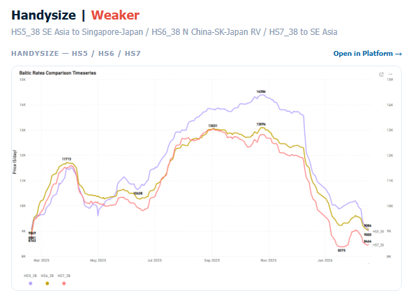

> **Figure 10: Στιγμιότυπο Οθόνης 2026 02 20 103442**  
> **Interactive Data & Source:** [Signal Ocean Dynamic Timeseries](https://go.signalocean.com/e/983831/dry-dynamic-timeseries-dry/2rvvqz/580487600/h/AZVsWWkv6kLnHVFiUIL9S0_Q39Z6-MO5SDGm3j3GUA8) | [Local Asset](file:///C:/Users/Dell/Github/Shipping/corpus/03-breakwave/insights/2026/assets/2026-02-20_china-sources-wheat-from-argentina_img_cea3cf84ceb9ceb3cebcceb9cf8ccf84cf85_bf664d715f26.png)

The Handysize Pacific freight market is still showing a weaker trend from the beginning of the year, with the HS5_38 and HS6_38 rates dropping to around $9k/day each, and HS7_38 nearly $8.5k/d.

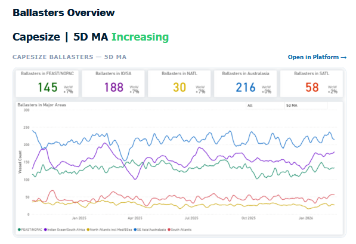

> **Figure 11: Στιγμιότυπο Οθόνης 2026 02 20 103453**  
> **Interactive Data & Source:** [Signal Ocean Dynamic Timeseries](https://go.signalocean.com/e/983831/dry-dynamic-timeseries-dry/2rvvqz/580487600/h/AZVsWWkv6kLnHVFiUIL9S0_Q39Z6-MO5SDGm3j3GUA8) | [Local Asset](file:///C:/Users/Dell/Github/Shipping/corpus/03-breakwave/insights/2026/assets/2026-02-20_china-sources-wheat-from-argentina_img_cea3cf84ceb9ceb3cebcceb9cf8ccf84cf85_583369c39b30.png)

Supply pressure in the Pacific increased, with the Far East/NOPAC region showing a continuous upward trend, reaching levels around 145. While the weekly increase was not significantly higher than the previous week, these levels remained above those recorded at the start of the year. The Indian Ocean/South Africa area also saw notable supply pressure, with a vessel count of nearly 190. Conversely, the South Atlantic region maintained relatively stable levels, with the 5DMA staying below 60 but still above January's entry.

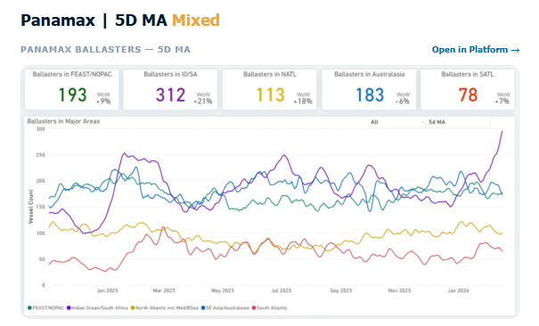

> **Figure 12: Στιγμιότυπο Οθόνης 2026 02 20 103501**  
> **Interactive Data & Source:** [Signal Ocean Dynamic Timeseries](https://go.signalocean.com/e/983831/dry-dynamic-timeseries-dry/2rvvqz/580487600/h/AZVsWWkv6kLnHVFiUIL9S0_Q39Z6-MO5SDGm3j3GUA8) | [Local Asset](file:///C:/Users/Dell/Github/Shipping/corpus/03-breakwave/insights/2026/assets/2026-02-20_china-sources-wheat-from-argentina_img_cea3cf84ceb9ceb3cebcceb9cf8ccf84cf85_7b0c94de5158.png)

The Indian Ocean saw another spike from the previous week, reaching more than 300 (+21% WoW). The vessel count of ballasters in Australasia began to show signs of a decrease, to around 180 vessels (6% down from the previous week). In the Far East/NOPAC region, levels have now surpassed 190 and remain on an upward trend. Overall, the Pacific appears more oversupplied than the Atlantic, with the South showing a tighter picture than the North, where the vessel count persists above 100.

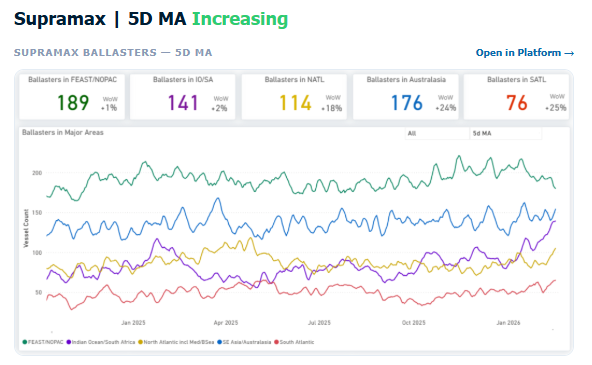

> **Figure 13: Στιγμιότυπο Οθόνης 2026 02 20 103508**  
> **Interactive Data & Source:** [Signal Ocean Dynamic Timeseries](https://go.signalocean.com/e/983831/dry-dynamic-timeseries-dry/2rvvqz/580487600/h/AZVsWWkv6kLnHVFiUIL9S0_Q39Z6-MO5SDGm3j3GUA8) | [Local Asset](file:///C:/Users/Dell/Github/Shipping/corpus/03-breakwave/insights/2026/assets/2026-02-20_china-sources-wheat-from-argentina_img_cea3cf84ceb9ceb3cebcceb9cf8ccf84cf85_6755bbabdd0c.png)

Oversupply in the Pacific persisted from the previous week, albeit with hints of a slight reduction. The vessel count in the Far East/NOPAC has now dipped below 190, a decrease from the over 200 vessels noted in preceding weeks. The number of ballasters in the Atlantic remained consistent with the previous week, with approximately 114 vessels in the North and 76 in the South.

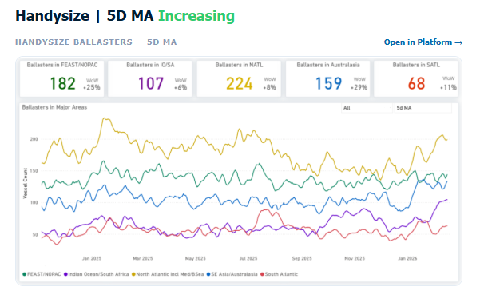

> **Figure 14: Στιγμιότυπο Οθόνης 2026 02 20 103516**  
> **Interactive Data & Source:** [Signal Ocean Dynamic Timeseries](https://go.signalocean.com/e/983831/dry-dynamic-timeseries-dry/2rvvqz/580487600/h/AZVsWWkv6kLnHVFiUIL9S0_Q39Z6-MO5SDGm3j3GUA8) | [Local Asset](file:///C:/Users/Dell/Github/Shipping/corpus/03-breakwave/insights/2026/assets/2026-02-20_china-sources-wheat-from-argentina_img_cea3cf84ceb9ceb3cebcceb9cf8ccf84cf85_49b9cf0511f2.png)

Significant supply pressure persisted for Handysize vessels across key regions. In the North Atlantic, the number of ballasters, although slightly down, remained high, standing at over 220 compared to 230 the week prior. Pressure intensified noticeably in both the Far East/NOPAC and Australasia regions. The Far East/NOPAC region now sees a ballast vessel count exceeding 180, a rise from 157 in the previous week's assessment, while Australasia's count increased to nearly 160 from approximately 150 a week ago.

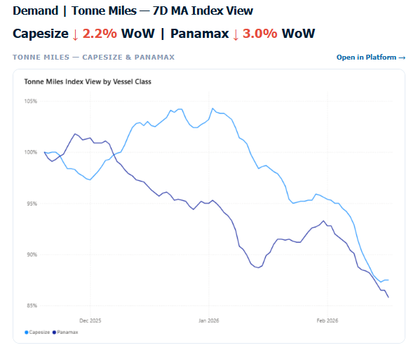

> **Figure 15: Στιγμιότυπο Οθόνης 2026 02 20 103529**  
> **Interactive Data & Source:** [Signal Ocean Dynamic Timeseries](https://go.signalocean.com/e/983831/dry-dynamic-timeseries-dry/2rvvqz/580487600/h/AZVsWWkv6kLnHVFiUIL9S0_Q39Z6-MO5SDGm3j3GUA8) | [Local Asset](file:///C:/Users/Dell/Github/Shipping/corpus/03-breakwave/insights/2026/assets/2026-02-20_china-sources-wheat-from-argentina_img_cea3cf84ceb9ceb3cebcceb9cf8ccf84cf85_7d662ed37207.png)

Upon reviewing the tonne-mile growth rate on a Base 100 Index basis, deceleration persists across the larger vessel classes. Capesize stands at 87.5 (Base 100), 12.5 points below the base period, while Panamax is at 85.8, reflecting a 14.2-point shortfall versus base.

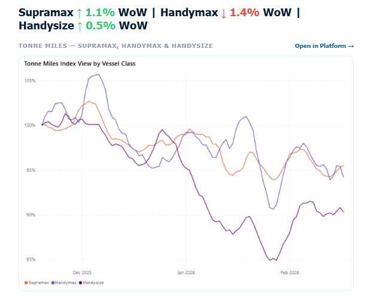

> **Figure 16: Metrics Description:index View(base 100) by Total Tonne Miles**  
> *Metrics Description:Index View(Base 100) by total Tonne Miles over the selected period. This facilitates relative performance comparisons between segments of different sizes (e.g., comparing the growth rate of Supramax vs Capesize).*  
> **Interactive Data & Source:** [Signal Ocean Dynamic Timeseries](https://go.signalocean.com/e/983831/dry-dynamic-timeseries-dry/2rvvqz/580487600/h/AZVsWWkv6kLnHVFiUIL9S0_Q39Z6-MO5SDGm3j3GUA8) | [Local Asset](file:///C:/Users/Dell/Github/Shipping/corpus/03-breakwave/insights/2026/assets/2026-02-20_china-sources-wheat-from-argentina_img_cea3cf84ceb9ceb3cebcceb9cf8ccf84cf85_cb6936c7f13e.png)

Smaller vessel segments continue to outperform the larger classes, maintaining performance ratios at or above the 90 level (Base 100). Supramax leads at 95.5, followed by Handymax at 94.2, while Handysize has also recovered above 90, reaching 90.3.

Data Source:[Signal Ocean Platform](https://www.thesignalgroup.com/signal-ocean-platform)

---

**Tags:** Capesize, Drybulk, Shipping  
