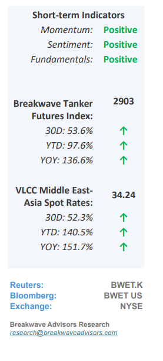
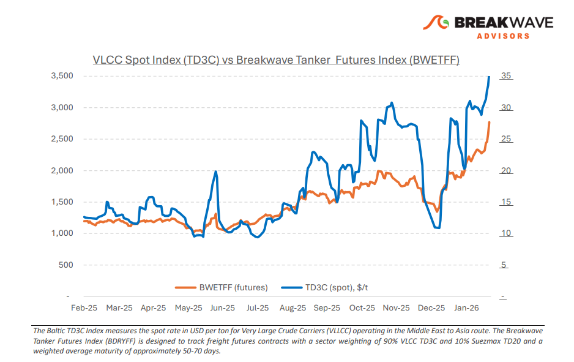
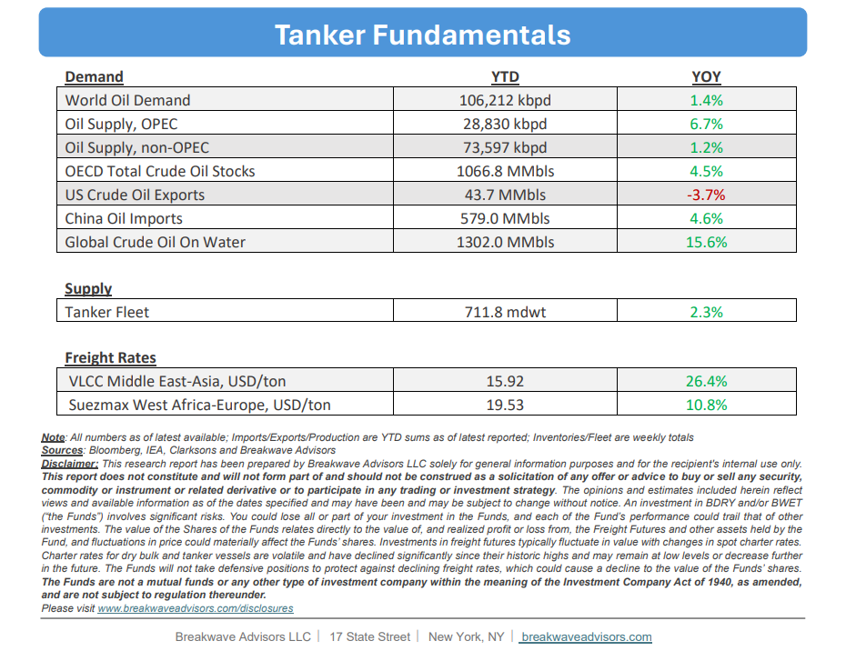

# Breakwave Bi-Weekly Tanker Report - February 24, 2026

**Date:** February 24, 2026  
**Publisher:** Breakwave Advisors | **Category:** Market Insights  
**Original URL:** [https://www.breakwaveadvisors.com/insights/2242026wetreport20264754](https://www.breakwaveadvisors.com/insights/2242026wetreport20264754)  

---

•**VLCC: Risk Rally or Structural Shift?**– Since early February, when we observed that the VLCC market appeared to be consolidating at elevated levels, freight rates have moved**decisively higher**, extending what was already an extraordinary rally that began in mid-January. What initially looked like a pause at multi-year highs has instead**developed into a renewed upward leg**, with benchmark routes firmly back in peak territory. While global refinery runs are supportive,**there has been no structural demand shift**sufficient**to justify**the speed and magnitude of the freight spike on fundamentals alone. Instead, the dominant driver remains**geopolitical risk**, particularly ongoing tensions surrounding the Strait of Hormuz, where, even in the absence of physical disruption, the risk of restricted transit through this critical chokepoint has prompted charterers to secure tonnage earlier. At the same time,**owners’ confidence has strengthened**as earnings have surged. The ongoing reported**fleet expansion initiatives by Sinokor**, aimed at increasing exposure to the spot VLCC market, is adding further fuel to the fire, as the**fear of an owner controlling a sizable****part**of the spot VLCC fleet in what used to be a fragmented market, suggests**sustained volatility and strong earnings potential for a long time**rather than a brief spike. Overall, the current setup for the VLCC sector appears to us**more structural than cyclical,**and only a significant fleet expansion, which for now is years away given shipyard availability, could provide some rebalancing, always absent to a significant global macro slowdown.

> **Figure 1: Στιγμιότυπο Οθόνης 2026 02 24 123426**  
> [Local Asset](file:///C:/Users/Dell/Github/Shipping/corpus/03-breakwave/insights/2026/assets/2026-02-24_2242026wetreport20264754_img_cea3cf84ceb9ceb3cebcceb9cf8ccf84cf85_9176101cfe04.png)

•**Oil Prices Continue to Price Further Escalation in the Middle East**– As has been the case for at least a year now, the fear of**meangiful disruption**in oil flows due to a conflict in the Middle East continues to drive oil price volatility. As the US has now amazed**considerable military assets**around the region and the headlines surrounding the ongoing negotiations between the US and Iran is a daily reoccurrence, oil traders have**priced some risk of a disruption,**but in reality, we believe there is a wide range of scenarios that are impossible to price given the importance of the region when it comes to oil flows. Fundamentals are not supportive, as most of the recent incremental flows have been directed towards storage, especially in China. As a result, the**developments**in the Middle East remain the**sole determinant of oil prices**near term, and thus, the uncertainty should persist until there is some meaningful development in the ongoing standoff.

•**Our Long-term View**– The tanker market is recovering from a long period of staggered rates as the growth in new vessel supply shrinks while oil demand remains elevated in line with the global economy. A historically low orderbook combined with favorable shifting trade patterns should continue to support increased spot rate volatility, which combined with the ongoing geopolitical turmoil, should sustain freight rates in the medium to long term.

> **Figure 2: Στιγμιότυπο Οθόνης 2026 02 24 094123**  
> [Local Asset](file:///C:/Users/Dell/Github/Shipping/corpus/03-breakwave/insights/2026/assets/2026-02-24_2242026wetreport20264754_img_cea3cf84ceb9ceb3cebcceb9cf8ccf84cf85_169664a79090.png)

> **Figure 3: Στιγμιότυπο Οθόνης 2026 02 24 123440**  
> [Local Asset](file:///C:/Users/Dell/Github/Shipping/corpus/03-breakwave/insights/2026/assets/2026-02-24_2242026wetreport20264754_img_cea3cf84ceb9ceb3cebcceb9cf8ccf84cf85_17e456ba7995.png)

### Subscribe:
