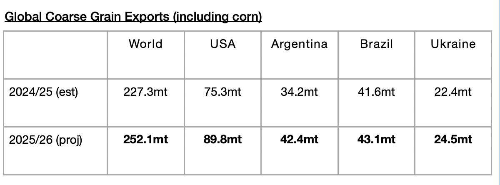

# Global Grain Export Forecast Raised Yet Again

**Date:** February 24, 2026  
**Publisher:** Breakwave Advisors | **Category:** Market Insights  
**Original URL:** [https://www.breakwaveadvisors.com/insights/2026/2/24/global-grain-export-forecast-raised-yet-again](https://www.breakwaveadvisors.com/insights/2026/2/24/global-grain-export-forecast-raised-yet-again)  

---

*By*[*Jeffrey Landsberg*](https://www.linkedin.com/in/jeffrey-landsberg-70ab957/)

The United States Department of Agriculture (USDA) has released its latest forecast for the current 2025/26 season and is now predicting that global coarse grain, wheat, soybean, and soymeal exports will total 745.7 million tons. This is 6 million tons (1%) more than was predicted in January and would mark a year-on-year increase of 40.8 million tons (6%). Significant is that the forecast has been raised yet again. As we have discussed often, we have been stressing that a return of growth in grain trade (and growth in all major dry bulk commodity trade) has been needed considering that the dry bulk fleet continues to grow by a moderate amount (we are expecting a net addition of at least another 375 vessels) this year. The growth in global grain trade should not be taken for granted. In the 2024/25 season, a year-on-year contraction of 5.5 million tons (-1%) occurred.

The USDA is forecasting that global coarse grain exports in 2025/26 will total 252.1 million tons. This would mark a year-on-year increase of 24.8 million tons (11%) from the 2024/25 season. Coarse grain exports will remain the global grain market’s largest cargo by volume. A large year-on-year increase in coarse grain exports is expected from the United States. A moderate year-on-year increase is expected from Argentina. Small year-on-year increases are expected from Ukraine and Brazil.

> **Figure 1: Chart**  
> [Local Asset](file:///C:/Users/Dell/Github/Shipping/corpus/03-breakwave/insights/2026/assets/2026-02-24_global-grain-export-forecast-raised-yet-again_img_chart_870198e8b0e9.jpg)

---

**Tags:** Drybulk, Markets, Commodities  
