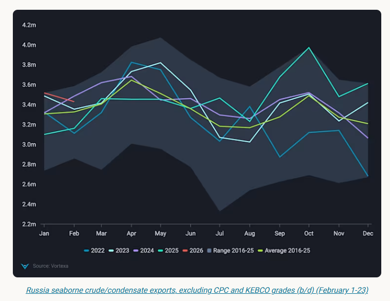
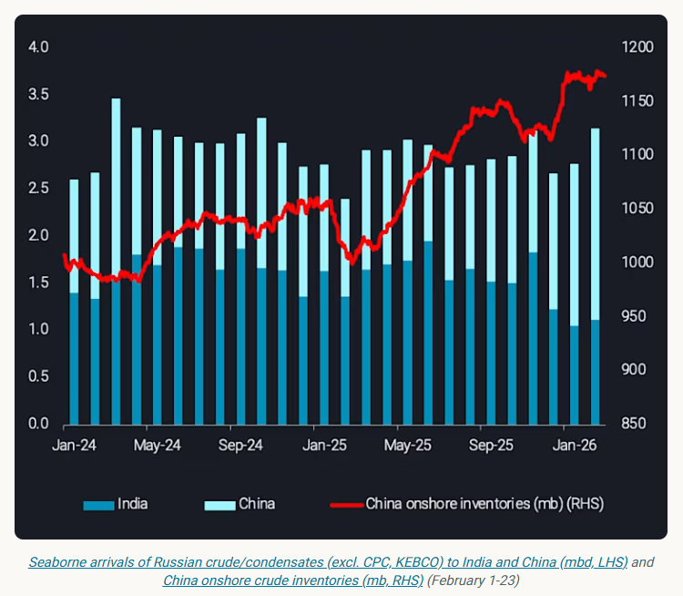

# What lies ahead for Russian oil exports?

**Date:** February 25, 2026  
**Publisher:** Breakwave Advisors | **Category:** Market Insights  
**Original URL:** [https://www.breakwaveadvisors.com/insights/2026/2/25/what-lies-ahead-for-russian-oil-exports](https://www.breakwaveadvisors.com/insights/2026/2/25/what-lies-ahead-for-russian-oil-exports)  

---

In this article we review what is the near-term outlook for Russian seaborne crude exports amid growing reliance on China as the ultimate export outlet.

*By*[*Anna Zhminko*](https://www.linkedin.com/in/anna-zhminko/)

In the wake of October 2025 Lukoil and Rosneft sanctions, Russia’s oil supply chain has come under[increasing strains](https://analytics.vortexa.com/InsightsHubPage?articleId=48V2Upx2llL93sdIInI0SC&articleType=highlight&page=InsightsHubPage&searchTerm=&tabId=d1a66096-eec5-4661-ac35-6ebf7f9fe5aa). December 2025 – January 2026[seaborne crude oil exports out of Russia](https://analytics.vortexa.com/Flows?dateRange=2022-01-01T00%3A00%3A00.000Z__2026-02-22T23%3A59%3A59.999Z&filtersEnabled=%5B%22p%22%2C%22o%22%2C%22d%22%2C%22d_r%22%2C%22v%22%2C%22intra_d%22%2C%22sts_o%22%2C%22c_o%22%2C%22w%22%2C%22sts%22%2C%22v_t%22%2C%22c%22%2C%22v_o%22%2C%22sh%22%2C%22co%22%5D&from=%5B%22b996521be9c996db3560ca234a56286ac38f798d34be229437555fab4f12a6a5%22%5D&geoBreakdownOriginGlobal=port&metric=bpd&page=Flows&products=%5B%2254af755a090118dcf9b0724c9a4e9f14745c26165385ffa7f1445bc768f06f11%22%5D&productsExcluded=%5B%22bb70cf56200f5b72ba69a90bda2c6b47ba29da23945c6f1994cfd4c2ef2fe0ff%22%2C%22578b0722570521d64e6a1527e1fb88ddb1a064cc15afe1d6023d2a0b6d66be6b%22%5D&tabId=d8180133-fa1c-4341-aeb4-622067f2084f&timeSeriesProperty=destination_country&v=3)(ex. CPC, KEBCO) averaged nearly 500kbd above the call for arrivals, following a robust export program amid growing compliance risk.

On a seasonal basis, the difference in Russia’s seaborne crude exports between December 2025 (dataset seasonal maximum) and December 2022 (respective minimum) is +1.1mbd. The two periods bear contextual similarity - the EU ban on Russian crude imports (Dec-2022) and the deadline to phase out imports from newly sanctioned producers (following in Dec-2025).

A notable differentiating factor, which underpinned sustained seaborne export programme in late 2025 despite tighter sanctions, was Russia’s established trade relationship with the East - India and China.

However**,**Russia’s ability to maintain strong crude exports may come into question if India further pivots away from Russian grades under the India-US trade talks.

> **Figure 1: Στιγμιότυπο Οθόνης 2026 02 25 135105**  
> **Interactive Data & Source:** [Analytics Vortexa](https://analytics.vortexa.com/OnShoreCrudeInventories?chartView=area&dateRange=last-24-months&frequency=day&multiSelect=1&onshoreInventoriesLocations=%5B%225e0cb0b66780a00576309aecff1b65934fc580d775bab29ac2a79397d8544e04%22%2C%220fddbfd0d90bad306a92fcb483a19276f101a5f7f0783363f9f2a9d40c10558d%22%2C%22934c47f36c16a58d68ef5e007e62a23f5f036ee3f3d1f5f85a48c572b90ad8b2%22%5D&page=OnShoreCrudeInventories&selectedRegion=%5B%220fddbfd0d90bad306a92fcb483a19276f101a5f7f0783363f9f2a9d40c10558d%22%5D&tabId=7ef7c5c7-67e6-445c-b281-c2a387d8ce43&tankCrude=%5B%22probable%22%2C%22confirmed%22%5D) | [Local Asset](file:///C:/Users/Dell/Github/Shipping/corpus/03-breakwave/insights/2026/assets/2026-02-25_what-lies-ahead-for-russian-oil-exports_img_cea3cf84ceb9ceb3cebcceb9cf8ccf84cf85_fbf70d990813.png)

## While India Reconsiders, China Remains a Steady Buyer of Russian Crude

The share of Russian oil in India’s total crude imports has been on a downward revision since last December, falling to 20% this February (~1.1mbd, days 1-24), compared to 36% in November 2025. Amid India-US trade negotiations, only the EU-sanctioned Nayara refinery continues a robust import program of Russian crude.

In contrast, share of Russian oil in China’s total seaborne crude imports rose to 18% in February, reflective of ~1.9mbd (days 1-24), compared to 11% last November. Nearly 90% of incoming Russian volumes were delivered into Shandong and fully absorbed by private refiners, as state-owned Sinopec has pulled back from Russian purchases since November. This marks a dataset high in arrivals of Russian crude into the province, supporting the climb of[Shandong onshore crude inventories](https://analytics.vortexa.com/OnShoreCrudeInventories?chartView=area&dateRange=last-24-months&frequency=day&multiSelect=1&onshoreInventoriesLocations=%5B%225e0cb0b66780a00576309aecff1b65934fc580d775bab29ac2a79397d8544e04%22%2C%220fddbfd0d90bad306a92fcb483a19276f101a5f7f0783363f9f2a9d40c10558d%22%2C%22934c47f36c16a58d68ef5e007e62a23f5f036ee3f3d1f5f85a48c572b90ad8b2%22%5D&page=OnShoreCrudeInventories&selectedRegion=%5B%220fddbfd0d90bad306a92fcb483a19276f101a5f7f0783363f9f2a9d40c10558d%22%5D&tabId=7ef7c5c7-67e6-445c-b281-c2a387d8ce43&tankCrude=%5B%22probable%22%2C%22confirmed%22%5D)to ~367mb to date, reflecting 54% tank utilisation.

Private inventories retain sufficient flexibility to absorb extra barrels, even as the majority of[China’s expected new storage capacity](https://www.vortexa.com/insights/new-tanks-to-lift-chinas-crude-demand)is state-owned and would favour mainstream crude.

> **Figure 2: Στιγμιότυπο Οθόνης 2026 02 25 135117**  
> **Interactive Data & Source:** [Analytics Vortexa](https://analytics.vortexa.com/Flows?dateRange=last-24-months&filtersEnabled=%5B%22p%22%2C%22o%22%2C%22d%22%2C%22d_r%22%2C%22v%22%2C%22intra_d%22%2C%22sts_o%22%2C%22c_o%22%2C%22w%22%2C%22sts%22%2C%22v_t%22%2C%22c%22%2C%22v_o%22%2C%22sh%22%2C%22co%22%5D&frequency=day&from=%5B%22b996521be9c996db3560ca234a56286ac38f798d34be229437555fab4f12a6a5%22%5D&geoBreakdownOriginGlobal=port&metric=bpd&movementEvent=transiting_state&page=Flows&products=%5B%2254af755a090118dcf9b0724c9a4e9f14745c26165385ffa7f1445bc768f06f11%22%5D&productsExcluded=%5B%22bb70cf56200f5b72ba69a90bda2c6b47ba29da23945c6f1994cfd4c2ef2fe0ff%22%2C%22578b0722570521d64e6a1527e1fb88ddb1a064cc15afe1d6023d2a0b6d66be6b%22%5D&shipToShipOnlyXFilter=1&tabId=d8180133-fa1c-4341-aeb4-622067f2084f&timeSeriesProperty=product_grade&v=3) | [Local Asset](file:///C:/Users/Dell/Github/Shipping/corpus/03-breakwave/insights/2026/assets/2026-02-25_what-lies-ahead-for-russian-oil-exports_img_cea3cf84ceb9ceb3cebcceb9cf8ccf84cf85_05afa3ca70c8.png)

It is not yet clear whether India will continue to scale back on imports of Russian crude further or reverse the trajectory due to a recent US Supreme Court take to reset tariffs, however, displaced volumes would most likely be diverted to China’s private refining sector.

In turn, predominant reliance on China’s private refiners subjects Russian crude to steeper discounts and prolonged clearance, pressuring vessel availability.

## The Bottom Line

The level of[Russian crude exports in transit and involved in a ship-to-ship (STS) transfer](https://analytics.vortexa.com/Flows?dateRange=last-24-months&filtersEnabled=%5B%22p%22%2C%22o%22%2C%22d%22%2C%22d_r%22%2C%22v%22%2C%22intra_d%22%2C%22sts_o%22%2C%22c_o%22%2C%22w%22%2C%22sts%22%2C%22v_t%22%2C%22c%22%2C%22v_o%22%2C%22sh%22%2C%22co%22%5D&frequency=day&from=%5B%22b996521be9c996db3560ca234a56286ac38f798d34be229437555fab4f12a6a5%22%5D&geoBreakdownOriginGlobal=port&metric=bpd&movementEvent=transiting_state&page=Flows&products=%5B%2254af755a090118dcf9b0724c9a4e9f14745c26165385ffa7f1445bc768f06f11%22%5D&productsExcluded=%5B%22bb70cf56200f5b72ba69a90bda2c6b47ba29da23945c6f1994cfd4c2ef2fe0ff%22%2C%22578b0722570521d64e6a1527e1fb88ddb1a064cc15afe1d6023d2a0b6d66be6b%22%5D&shipToShipOnlyXFilter=1&tabId=d8180133-fa1c-4341-aeb4-622067f2084f&timeSeriesProperty=product_grade&v=3)has held at dataset-high marks this January, close to 30mb. Meanwhile,[recent patterns in Russian STS operations](https://analytics.vortexa.com/InsightsHubPage?articleId=48V2Upx2llL93sdIInI0SC&articleType=highlight&page=InsightsHubPage&searchTerm=&tabId=d1a66096-eec5-4661-ac35-6ebf7f9fe5aa), with emerging transfer activity closer to Russia’s West-facing ports (South of Suez Canal) and including VLCC-class vessels, suggest a growing dependence on China as the ultimate export outlet.

The crucial questions remain:

1. Whether there is sufficient demand for Russian crude. Momentum has slightly tilted for Russia with surprisingly strong discharges into China – albeit now potentially challenged again by ample Iranian barrels – as well as hanging uncertainty about India’s crude buying patterns given the latest US Supreme Court tariff take
2. Whether the lengthening supply chain, given the aforementioned demand patterns, can be managed logistically amid rising freight costs and steeper cargo discounts

In conclusion, there appears to be little indication that Russia could be forced to cut back crude exports significantly due to sanctions. The price discounts however, remain a massive pain for the Russian economy, with Argus Media now assessing Urals discounts at $30/b at the western-loading ports.

Data Source:[Vortexa](https://www.vortexa.com//oil-gas-data-traders-analysts-data-scientists?gclid=Cj0KCQjw8_qRBhCXARIsAE2AtRZKOvMnbilZ_6_91d7huSFFy71pWLrnPwGwOHVzXsmsG-1a1mZnQw8aAt89EALw_wcB&hsa_acc=1782073842&hsa_ad=548425387665&hsa_cam=14746637662&hsa_grp=125038601902&hsa_kw=&hsa_mt=&hsa_net=adwords&hsa_src=g&hsa_tgt=dsa-1431852288425&hsa_ver=3&utm_campaign=%5BCD%5D%20-%20DSA%20-%20EMEA&utm_medium=cpc&utm_medium=ppc&utm_source=google&utm_source=adwords&utm_term=)

---

**Tags:** Crude, Tankers, Shipping  
