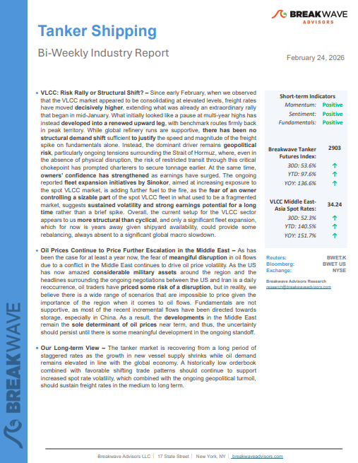
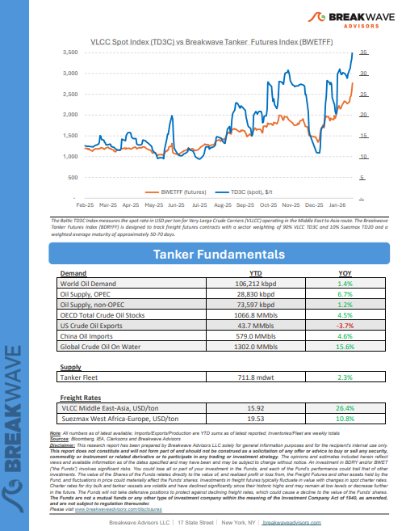

# Breakwave Weekend Read

**Date:** February 27, 2026  
**Publisher:** Breakwave Advisors | **Category:** Market Insights  
**Original URL:** [https://www.breakwaveadvisors.com/insights/2026/2/20breakwave-weekend-read-554747hhg-9tdx4](https://www.breakwaveadvisors.com/insights/2026/2/20breakwave-weekend-read-554747hhg-9tdx4)  

---

## Welcome Tobreakwave Advisorsweekend Read

***As the week comes to a close, take a moment to review the key insights from the past few days. Missed something? We've gathered all the top insights for you to catch up at your convenience.***

## Breakwave Shipping Report

**VLCC: Risk Rally or Structural Shift?**– Since early February, when we observed that the VLCC market appeared to be consolidating at elevated levels, freight rates have moved**decisively higher**, extending what was already an extraordinary rally that began in mid-January.

[Read More](https://www.breakwaveadvisors.com/insights/2242026wetreport20264754)

> **Figure 1: Στιγμιότυπο Οθόνης 2026 02 26 112125**  
> **Interactive Data & Source:** [Breakwave Advisors Market Insights](https://www.breakwaveadvisors.com/insights/2026/2/23/markets-rally-after-us-court-deems-trump-tariffs-illegal) | [Local Asset](file:///C:/Users/Dell/Github/Shipping/corpus/03-breakwave/insights/2026/assets/2026-02-27_20breakwave-weekend-read-554747hhg-9tdx4_img_cea3cf84ceb9ceb3cebcceb9cf8ccf84cf85_a3e454f0728a.png)

> **Figure 2: Στιγμιότυπο Οθόνης 2026 02 26 112144**  
> **Interactive Data & Source:** [Breakwave Advisors Market Insights](https://www.breakwaveadvisors.com/insights/2026/2/23/markets-rally-after-us-court-deems-trump-tariffs-illegal) | [Local Asset](file:///C:/Users/Dell/Github/Shipping/corpus/03-breakwave/insights/2026/assets/2026-02-27_20breakwave-weekend-read-554747hhg-9tdx4_img_cea3cf84ceb9ceb3cebcceb9cf8ccf84cf85_38c0fea97834.png)

## Insights of the Week

## Markets Rally After Us Court Deems Trump Tariffs Illegal

> **Figure 3: Στιγμιότυπο Οθόνης 2026 02 26 212756**  
> **Interactive Data & Source:** [Breakwave Advisors Market Insights](https://www.breakwaveadvisors.com/insights/2026/2/23/markets-rally-after-us-court-deems-trump-tariffs-illegal) | [Local Asset](file:///C:/Users/Dell/Github/Shipping/corpus/03-breakwave/insights/2026/assets/2026-02-27_20breakwave-weekend-read-554747hhg-9tdx4_img_cea3cf84ceb9ceb3cebcceb9cf8ccf84cf85_cfaa2dcc0fd5.png)

Rising geopolitical tensions pushed energy markets higher. Industrial metals gained after Trump’s reciprocal tariffs were deemed illegal. Precious metals also rose.

Commodities Wrap

## What’s Going on with VLCC Rates?

> **Figure 4: Στιγμιότυπο Οθόνης 2026 02 26 212923**  
> **Interactive Data & Source:** [Breakwave Advisors Market Insights](https://www.breakwaveadvisors.com/insights/2026/2/23/whats-going-on-with-vlcc-rates) | [Local Asset](file:///C:/Users/Dell/Github/Shipping/corpus/03-breakwave/insights/2026/assets/2026-02-27_20breakwave-weekend-read-554747hhg-9tdx4_img_cea3cf84ceb9ceb3cebcceb9cf8ccf84cf85_5b61fdf5d473.png)

VLCC freight rates have surged to levels not seen in years, surprising many market participants and prompting fresh debate across the tanker market.

Market intelligence suggests…

## Global Grain Export Forecast Raised Yet Again

The United States Department of Agriculture (USDA) has released its latest forecast for the current 2025/26 season and is now predicting that global coarse grain, wheat, soybean, and soymeal exports will total 745.7 million tons.

[Read More](https://www.breakwaveadvisors.com/insights/2026/2/24/global-grain-export-forecast-raised-yet-again)

From Commodore's Weekly Dry Bulk Reports

> **Figure 5: Στιγμιότυπο Οθόνης 2026 02 26 213520**  
> **Interactive Data & Source:** [Breakwave Advisors Market Insights](https://www.breakwaveadvisors.com/insights/2026/2/24/vlccs-entering-the-sinokor-era) | [Local Asset](file:///C:/Users/Dell/Github/Shipping/corpus/03-breakwave/insights/2026/assets/2026-02-27_20breakwave-weekend-read-554747hhg-9tdx4_img_cea3cf84ceb9ceb3cebcceb9cf8ccf84cf85_70c29f1e2522.png)

## Vlccs - Entering the Sinokor Era

> **Figure 6: Στιγμιότυπο Οθόνης 2026 02 26 213801**  
> **Interactive Data & Source:** [Breakwave Advisors Market Insights](https://www.breakwaveadvisors.com/insights/2026/2/24/vlccs-entering-the-sinokor-era) | [Local Asset](file:///C:/Users/Dell/Github/Shipping/corpus/03-breakwave/insights/2026/assets/2026-02-27_20breakwave-weekend-read-554747hhg-9tdx4_img_cea3cf84ceb9ceb3cebcceb9cf8ccf84cf85_d851dac76721.png)

Sinokor has positioned itself as the single largest VLCC commercial operator - a scale that materially alters the competitive structure of the segment.

A New VLCC Leader - Inside Sinokor’s Market Rise

## Market Commentary

> **Figure 7: Unsplash Image Gemrkzgh4tw**  
> **Interactive Data & Source:** [Breakwave Advisors Market Insights](https://www.breakwaveadvisors.com/insights/2026/2/25/market-commentary) | [Local Asset](file:///C:/Users/Dell/Github/Shipping/corpus/03-breakwave/insights/2026/assets/2026-02-27_20breakwave-weekend-read-554747hhg-9tdx4_img_unsplash-image-gemrkzgh4tw_f8595ceb5e1b.jpg)

From 1 Jan to 20 Feb 2026, the dry bulk S&P tape has been running at a materially stronger tempo compared to the same window of 2025.

Xclusiv Shipbrokers Weekly Report

## What Lies Ahead for Russian Oil Exports?

> **Figure 8: Στιγμιότυπο Οθόνης 2026 02 25 135147**  
> **Interactive Data & Source:** [Breakwave Advisors Market Insights](https://www.breakwaveadvisors.com/insights/2026/2/25/what-lies-ahead-for-russian-oil-exports) | [Local Asset](file:///C:/Users/Dell/Github/Shipping/corpus/03-breakwave/insights/2026/assets/2026-02-27_20breakwave-weekend-read-554747hhg-9tdx4_img_cea3cf84ceb9ceb3cebcceb9cf8ccf84cf85_d1f893c27a17.png)

In this article we review what is the near-term outlook for Russian seaborne crude exports amid growing reliance on China as the ultimate export outlet.

Vortexa Freight Weekly

## The Year of the Fire Horse

> **Figure 9: Unsplash Image 1jbyjrborvm**  
> **Interactive Data & Source:** [Breakwave Advisors Market Insights](https://www.breakwaveadvisors.com/insights/2026/2/25/the-year-of-the-fire-horse) | [Local Asset](file:///C:/Users/Dell/Github/Shipping/corpus/03-breakwave/insights/2026/assets/2026-02-27_20breakwave-weekend-read-554747hhg-9tdx4_img_unsplash-image-1jbyjrborvm_b8e959512a79.jpg)

In the Asian calendar, the transition from the Year of the Wood Dragon to the Year of the Wood Snake was traditionally associated with a shift towards reflection, intuition and gradual transformation.

Doric Weekly Market Insights

## What the Supreme Court’s Ruling Means for Businesses, and Your Portfolio

> **Figure 10: Unsplash Image U8wfirpsq7y**  
> **Interactive Data & Source:** [Breakwave Advisors Market Insights](https://www.breakwaveadvisors.com/insights/2026/2/26/what-the-supreme-courts-ruling-means-for-businesses-and-your-portfolio) | [Local Asset](file:///C:/Users/Dell/Github/Shipping/corpus/03-breakwave/insights/2026/assets/2026-02-27_20breakwave-weekend-read-554747hhg-9tdx4_img_unsplash-image-u8wfirpsq7y_73c133841d6d.jpg)

The abolition of nearly 2/3 of “Liberation day” tariffs by the US Supreme Court prompted the White House to temporarily replaced them with a 10% to 15% blanket tariff.

Forvis Mazars Weekly Note

## Outstanding Loan Growth in China Sets Another Record Low

> **Figure 11: Unsplash Image Y Hwuskt6gm**  
> **Interactive Data & Source:** [Breakwave Advisors Market Insights](https://www.breakwaveadvisors.com/insights/2026/2/26/outstanding-loan-growth-in-china-sets-another-record-low) | [Local Asset](file:///C:/Users/Dell/Github/Shipping/corpus/03-breakwave/insights/2026/assets/2026-02-27_20breakwave-weekend-read-554747hhg-9tdx4_img_unsplash-image-y-hwuskt6gm_50b90cd4652b.jpg)

As we discussed in Commodore Research's most recent Weekly China Report, the latest released data shows that outstanding loan growth in China has fallen to 6.1% which has marked yet another record low.

From Commodore's Weekly Dry Bulk Reports

## Panamax Freight View on Indonesian Thermal Coal Flows

> **Figure 12: Pexels Fabrizio Zini 606841368 19500299**  
> **Interactive Data & Source:** [Breakwave Advisors Market Insights](https://www.breakwaveadvisors.com/insights/2026/2/27/panamax-freight-view-on-indonesian-thermal-coal-flows) | [Local Asset](file:///C:/Users/Dell/Github/Shipping/corpus/03-breakwave/insights/2026/assets/2026-02-27_20breakwave-weekend-read-554747hhg-9tdx4_img_pexels-fabrizio-zini-606841368-19500_1771ea054d64.jpg)

This week's focus highlights the softening trend in**Signal Ocean Platform**data flows for Indonesian thermal coal shipments to India, particularly within the Panamax vessel segment, toward the end of February.

Signal Ocean Dry Weekly Market Monitor

---

**Tags:** Shipping, Tankers, Drybulk  
