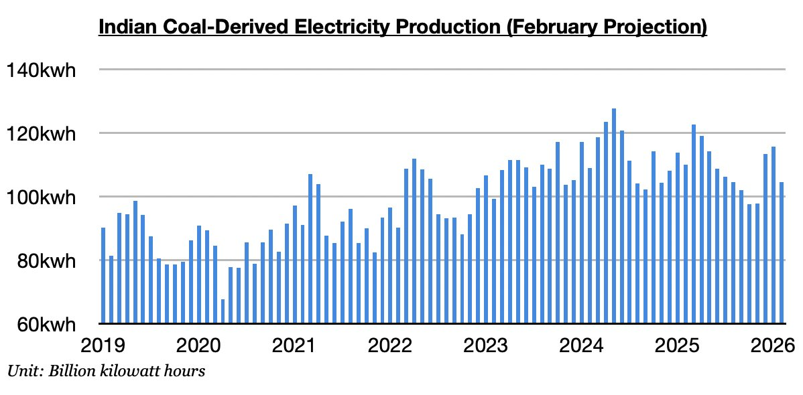

# India Becoming More Of An Issue For Dry Bulk

**Date:** March 02, 2026  
**Publisher:** Breakwave Advisors | **Category:** Market Insights  
**Original URL:** [https://www.breakwaveadvisors.com/insights/2026/3/2/india-becoming-more-of-an-issue-for-dry-bulk](https://www.breakwaveadvisors.com/insights/2026/3/2/india-becoming-more-of-an-issue-for-dry-bulk)  

---

*By*[*Jeffrey Landsberg*](https://www.linkedin.com/in/jeffrey-landsberg-70ab957/)

As we discussed in Commodore Research's most recent Weekly Executive Report, India is on pace to produce 116.7 billion kilowatt hours of electricity this month. This would mark a month-on-month decline of 11.9 billion kilowatt hours (-9%) and a year-on-year decline of 4.4 billion kilowatt hours (-4%). This would mark the seventh time in the last eleven months that India’s total electricity production has contracted on a year-on-year basis. Significant for the dry bulk market is that coal-derived electricity generation is on pace to total 104.5 billion kilowatt hours. This would mark a month-on-month decline of 11.2 billion kilowatt hours (-10%) and a year-on-year decline of 5.4 billion kilowatt hours (-5%). This would mark the eighth time in the last eleven months that India’s coal-derived electricity production has contracted on a year-on-year basis.

As we have stressed often in our Weekly Executive Reports, such a sustained contraction in India’s coal-derived electricity generation is very rare. Much warmer than usual weather has continued throughout parts of India and remains a headwind on electricity demand. Hydropower production has also continued to grow. India’s economy has also faced struggles at times recently.

> **Figure 1: Chart**  
> [Local Asset](file:///C:/Users/Dell/Github/Shipping/corpus/03-breakwave/insights/2026/assets/2026-03-02_india-becoming-more-of-an-issue-for-dry-bulk_img_chart_97718272fc89.jpg)

---

**Tags:** India, Coal, Markets  
