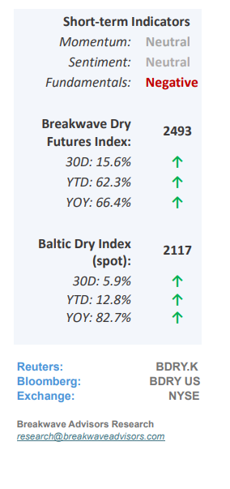
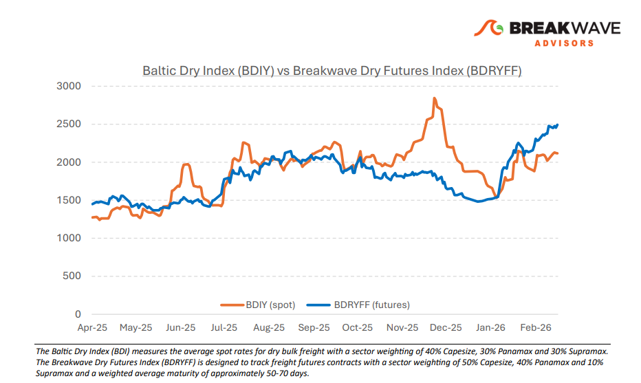
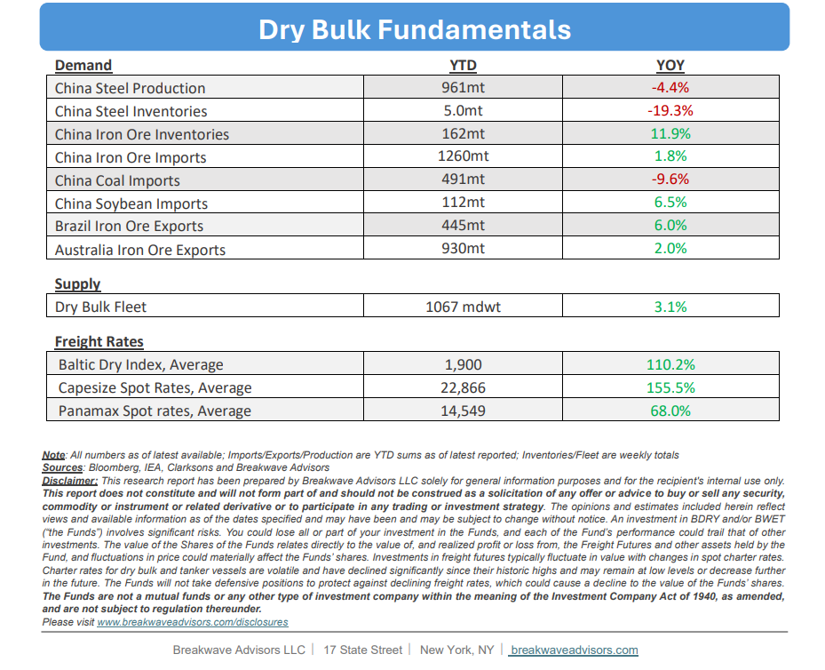

# Breakwave Bi-Weekly Dry Bulk Report - March 3, 2026

**Date:** March 03, 2026  
**Publisher:** Breakwave Advisors | **Category:** Market Insights  
**Original URL:** [https://www.breakwaveadvisors.com/insights/332026db-report2026kkji33lo](https://www.breakwaveadvisors.com/insights/332026db-report2026kkji33lo)  

---

•**Positive Sentiment Supports Rates Despite Dark Macro Clouds**– The dry bulk chartering market has finally reached a phase of**institutional maturity**where freight derivatives increasingly dictate spot market trajectory, mirroring the evolution of other global commodity markets. With daily Forward Freight Agreement (FFA) volumes now**exceeding physical transactions by several orders of magnitude**, a predominantly bullish futures curve continues to anchor physical spot rates. This is a structural shift that has especially transformed Capesize chartering over the past decade. While the broader shipping industry is experiencing**historic strength****across multiple segments**(especially tankers), this positive spillover has**suppressed dry bulk spot rate volatility**and allowed sentiment-driven futures to**decouple from immediate physical realities**that seem at best lukewarm to us. Such a development should be**welcomed**by the industry since it shows the transition of the sector to a mainstream commodity. However, such maturation also**introduces the risk**of a severe correction under particular circumstances; unlike past instances when dry bulk was isolated from broader economic headlines, should a macroeconomic shock occur,**dry bulk's correlation with broader commodities will likely intensify,**thus exposing the vulnerability of the underlying frail supply/demand balance. Despite weakening fundamentals, characterized by declining Chinese steel production, record-high iron ore inventories, and sluggish coal imports, the prevailing freight rate trend remains dominant. Consequently,**the current divergence between bullish sentiment and lackluster physical demand will likely persist**or maybe even intensify further until an external shock forces a market recalibration.

> **Figure 1: Cea3cf84ceb9ceb3cebcceb9cf8ccf84cf85**  
> [Local Asset](file:///C:/Users/Dell/Github/Shipping/corpus/03-breakwave/insights/2026/assets/2026-03-03_332026db-report2026kkji33lo_img_cea3cf84ceb9ceb3cebcceb9cf8ccf84cf85_537325339f49.png)

•**Ample Iron Ore in China Amid Weakening Steel Sector Demand**– Iron ore stockpiles in China have now reached a record 162 million tonnes, eclipsing the previous peak established in 2018. Despite this surplus and generally sluggish steel demand,**prices remain resilient,**hovering just below the $100/mt mark, stabilized by the centralized procurement strategies of the China Mineral Resources Group (CMRG). Much like its strategic management and increase of crude oil reserves, China’s continued**aggressive acquisition of iron ore**despite high inventories remains an enigma; however, this activity has so far provided a significant tailwind for the dry bulk shipping sector. While current iron ore prices may seem excessive relative to the cooling domestic steel market, CMRG’s oversight provides a stabilizing mechanism capable of maintaining price equilibrium for both domestic mills and global mining operators.

•**Our Long-term View**– The last few years have been characterized by increased geopolitical uncertainty. Going forward, we expect such events to continue to affect global trade and have a meaningful impact on effective vessel supply. Combined with the potential for a multi-year cyclical rebound in China’s economic activity following the recent economic turmoil, dry bulk shipping should experience higher volatility on top of a secular tightness driven by stable bulk commodity demand and a slower fleet growth owing to a relatively low orderbook.

> **Figure 2: Στιγμιότυπο Οθόνης 2026 03 03 091727**  
> [Local Asset](file:///C:/Users/Dell/Github/Shipping/corpus/03-breakwave/insights/2026/assets/2026-03-03_332026db-report2026kkji33lo_img_cea3cf84ceb9ceb3cebcceb9cf8ccf84cf85_be059116559e.png)

> **Figure 3: Στιγμιότυπο Οθόνης 2026 03 03 101058**  
> [Local Asset](file:///C:/Users/Dell/Github/Shipping/corpus/03-breakwave/insights/2026/assets/2026-03-03_332026db-report2026kkji33lo_img_cea3cf84ceb9ceb3cebcceb9cf8ccf84cf85_3a23a7ec169a.png)

### Subscribe:
