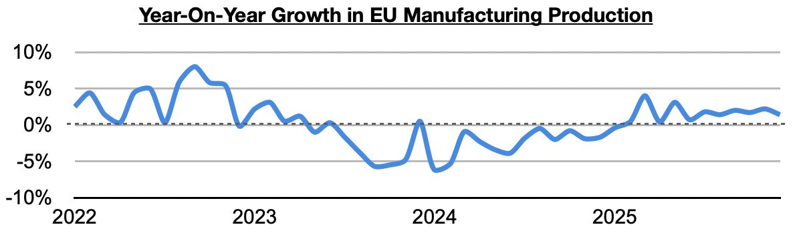
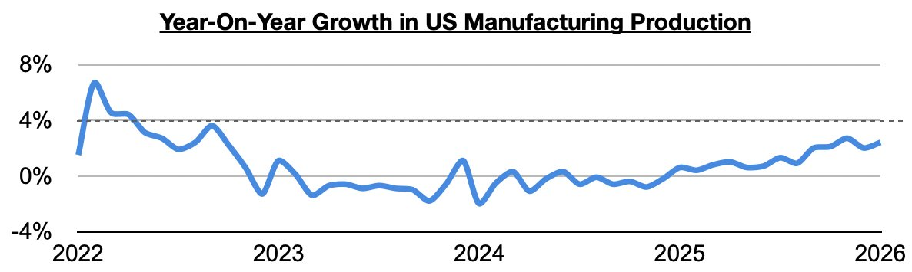
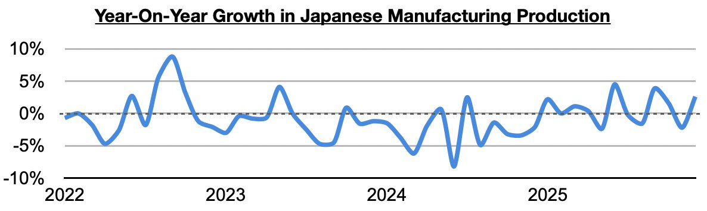

# Ongoing Global Industrial Improvement

**Date:** March 05, 2026  
**Publisher:** Breakwave Advisors | **Category:** Market Insights  
**Original URL:** [https://www.breakwaveadvisors.com/insights/2026/3/5/ongoing-global-industrial-improvement](https://www.breakwaveadvisors.com/insights/2026/3/5/ongoing-global-industrial-improvement)  

---

*By*[*Jeffrey Landsberg*](https://www.linkedin.com/in/jeffrey-landsberg-70ab957/)

As we have discussed at length in Commodore Research's Weekly Executive Reports, there were large portions of 2024 and 2025 with sustained industrial weakness in the global economy -- but we continue to stress that this year there remains significant improvement, with several major economies continuing to enjoy year-on-year growth in manufacturing production (**manufacturing specifically refers to using raw materials to create finished products and is the largest component of overall industrial production**). In addition to manufacturing continuing to enjoy long periods of year-on-year growth in China, India, and Russia (all have seen at least thirty-five straight months with sustained year-on-year growth) — Europe and the United States have more recently been enjoying sustained growth, and in Japan there are green shoots of a sustained recovery.

In the European Union, manufacturing production has now grown on a year-on-year basis for eleven straight months. Previously, it had contracted on a year-on-year basis for thirteen straight months.

> **Figure 1: Chart 1**  
> [Local Asset](file:///C:/Users/Dell/Github/Shipping/corpus/03-breakwave/insights/2026/assets/2026-03-05_ongoing-global-industrial-improvement_img_chart1_78e63f00074e.jpg)

In the United States, manufacturing production has grown on a year-on-year basis for thirteen straight months. Previously, it had contracted on a year-on-year basis during nineteen of the prior twenty-two months.

> **Figure 2: Chart 2**  
> [Local Asset](file:///C:/Users/Dell/Github/Shipping/corpus/03-breakwave/insights/2026/assets/2026-03-05_ongoing-global-industrial-improvement_img_chart2_d155832bb189.jpg)

In Japan, manufacturing production has grown on a year-on-year basis during three of the last four months. It previously had contracted on a year-on-year basis during three of the prior four months.

> **Figure 3: Chart 3**  
> [Local Asset](file:///C:/Users/Dell/Github/Shipping/corpus/03-breakwave/insights/2026/assets/2026-03-05_ongoing-global-industrial-improvement_img_chart3_b303441c9fe0.jpg)

A key theme in Commodore Research's Weekly Executive Reports has been that nations have been turning more inwards to boost their own production, and that individual demand for industrial commodities has continued to strengthen. Heightened war risk and global instability on their own also continue to lead to nations focusing more on importing and stockpiling commodities.

---

**Tags:** Commodities, Markets, Economies  
