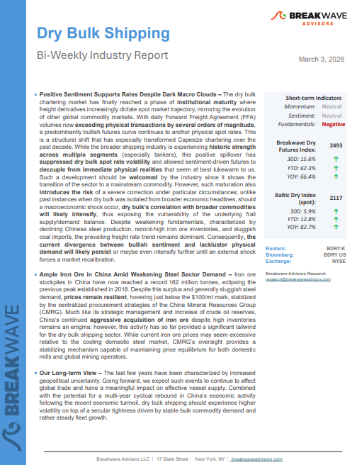
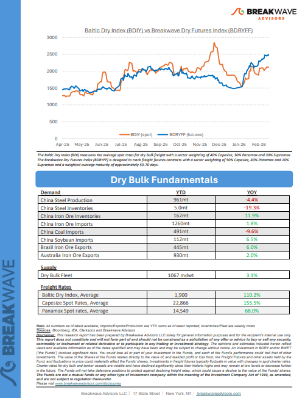
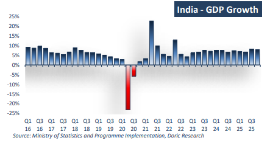
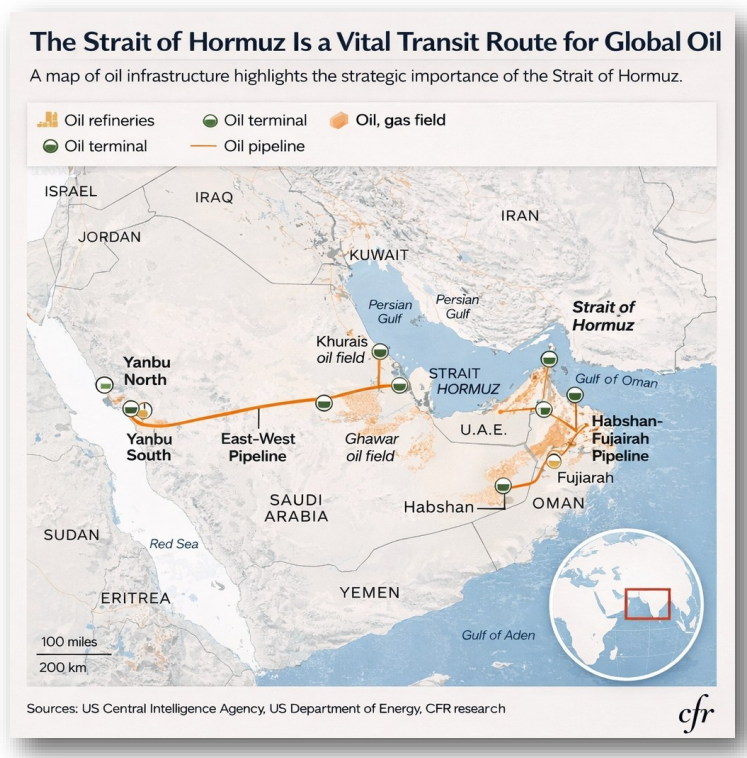
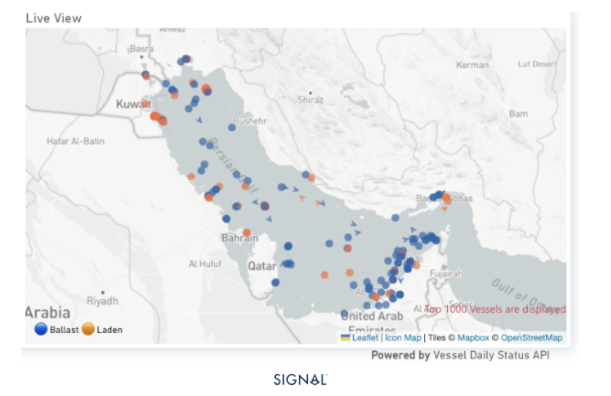

# Breakwave Weekend Read

**Date:** March 06, 2026  
**Publisher:** Breakwave Advisors | **Category:** Market Insights  
**Original URL:** [https://www.breakwaveadvisors.com/insights/2026/2/20breakwave-weekend-read-554747hhg-9tdx4-86gjc](https://www.breakwaveadvisors.com/insights/2026/2/20breakwave-weekend-read-554747hhg-9tdx4-86gjc)  

---

## Welcome Tobreakwave Advisorsweekend Read

***As the week comes to a close, take a moment to review the key insights from the past few days. Missed something? We've gathered all the top insights for you to catch up at your convenience.***

## Breakwave Shipping Report

**Positive Sentiment Supports Rates Despite Dark Macro Clouds**– The dry bulk chartering market has finally reached a phase of**institutional maturity**where freight derivatives increasingly dictate spot market trajectory, mirroring the evolution of other global commodity markets.

[Read More](https://www.breakwaveadvisors.com/insights/332026db-report2026kkji33lo)

> **Figure 1: Στιγμιότυπο Οθόνης 2026 03 06 091340**  
> **Interactive Data & Source:** [Breakwave Advisors Market Insights](https://www.breakwaveadvisors.com/insights/2026/3/2/india-confirming-its-position-as-the-fastest-growing-major-economy) | [Local Asset](file:///C:/Users/Dell/Github/Shipping/corpus/03-breakwave/insights/2026/assets/2026-03-06_20breakwave-weekend-read-554747hhg-9tdx4-86gjc_img_cea3cf84ceb9ceb3cebcceb9cf8ccf84cf85_c9c11b0ea9e3.png)

> **Figure 2: Στιγμιότυπο Οθόνης 2026 03 06 091353**  
> **Interactive Data & Source:** [Breakwave Advisors Market Insights](https://www.breakwaveadvisors.com/insights/2026/3/2/india-confirming-its-position-as-the-fastest-growing-major-economy) | [Local Asset](file:///C:/Users/Dell/Github/Shipping/corpus/03-breakwave/insights/2026/assets/2026-03-06_20breakwave-weekend-read-554747hhg-9tdx4-86gjc_img_cea3cf84ceb9ceb3cebcceb9cf8ccf84cf85_bcf81e3763cd.png)

## Insights of the Week

## India Confirming Its Position As the Fastest-Growing Major Economy

> **Figure 3: Στιγμιότυπο Οθόνης 2026 03 02 120946**  
> **Interactive Data & Source:** [Breakwave Advisors Market Insights](https://www.breakwaveadvisors.com/insights/2026/3/2/india-confirming-its-position-as-the-fastest-growing-major-economy) | [Local Asset](file:///C:/Users/Dell/Github/Shipping/corpus/03-breakwave/insights/2026/assets/2026-03-06_20breakwave-weekend-read-554747hhg-9tdx4-86gjc_img_cea3cf84ceb9ceb3cebcceb9cf8ccf84cf85_a24265192709.png)

Two years ago, Doric Weekly Insight opened on a distinctly euphoric note, observing that the dry bulk market had concluded February at 2,111 points – a level last recorded during the same trading window in 2010.

Doric Weekly Market Insights

## VLCC Second-Hand Prices at Decade Highs

> **Figure 4: Στιγμιότυπο Οθόνης 2026 03 06 092811**  
> **Interactive Data & Source:** [Breakwave Advisors Market Insights](https://www.breakwaveadvisors.com/insights/2026/3/2/vlcc-second-hand-prices-at-decade-highs) | [Local Asset](file:///C:/Users/Dell/Github/Shipping/corpus/03-breakwave/insights/2026/assets/2026-03-06_20breakwave-weekend-read-554747hhg-9tdx4-86gjc_img_cea3cf84ceb9ceb3cebcceb9cf8ccf84cf85_e9b551a68add.png)

VLCC asset prices at decade highs: 5Y units >$120m (+17% YoY); 10Y units >$100m (+20% YoY).

Signal Ocean Tanker Weekly Market Monitor

## India Becoming More of an Issue for Dry Bulk

As we discussed in Commodore Research's most recent Weekly Executive Report, India is on pace to produce 116.7 billion kilowatt hours of electricity this month.

[Read More](https://www.breakwaveadvisors.com/insights/2026/3/2/india-becoming-more-of-an-issue-for-dry-bulk)

From Commodore's Weekly Dry Bulk Reports

> **Figure 5: Unsplash Image Gdlemsusoy0**  
> **Interactive Data & Source:** [Breakwave Advisors Market Insights](https://www.breakwaveadvisors.com/insights/2026/3/3/strong-tanker-market) | [Local Asset](file:///C:/Users/Dell/Github/Shipping/corpus/03-breakwave/insights/2026/assets/2026-03-06_20breakwave-weekend-read-554747hhg-9tdx4-86gjc_img_unsplash-image-gdlemsusoy0_a4b116067c03.jpg)

## Strong Tanker Market

> **Figure 6: Pexels Irfansimsar 32237794**  
> **Interactive Data & Source:** [Breakwave Advisors Market Insights](https://www.breakwaveadvisors.com/insights/2026/3/3/strong-tanker-market) | [Local Asset](file:///C:/Users/Dell/Github/Shipping/corpus/03-breakwave/insights/2026/assets/2026-03-06_20breakwave-weekend-read-554747hhg-9tdx4-86gjc_img_pexels-irfansimsar-32237794_db192a8b3bc9.jpg)

The crude tanker tape has shifted from strong to structurally tight in a matter of weeks.

Xclusiv Shipbrokers Weekly Report

## India Likely to Maintain Russian Oil Purchases

> **Figure 7: Στιγμιότυπο Οθόνης 2026 03 03 124611**  
> **Interactive Data & Source:** [Breakwave Advisors Market Insights](https://www.breakwaveadvisors.com/insights/2026/3/3/india-likely-to-maintain-russian-oil-purchases) | [Local Asset](file:///C:/Users/Dell/Github/Shipping/corpus/03-breakwave/insights/2026/assets/2026-03-06_20breakwave-weekend-read-554747hhg-9tdx4-86gjc_img_cea3cf84ceb9ceb3cebcceb9cf8ccf84cf85_cb28f295440d.png)

Russian oil arrivals to India to sustain amid new tariffs from the US and current Middle East conflict. This will lower demand for mainstream crude.

Vortexa Freight Weekly

## Iran–u.s. Escalation | Strait of Hormuz Risk

> **Figure 8: Στιγμιότυπο Οθόνης 2026 03 04 142316**  
> **Interactive Data & Source:** [Breakwave Advisors Market Insights](https://www.breakwaveadvisors.com/insights/2026/3/4/iranus-escalation-strait-of-hormuz-risk) | [Local Asset](file:///C:/Users/Dell/Github/Shipping/corpus/03-breakwave/insights/2026/assets/2026-03-06_20breakwave-weekend-read-554747hhg-9tdx4-86gjc_img_cea3cf84ceb9ceb3cebcceb9cf8ccf84cf85_4a81ad66636b.png)

As of 3 March 2026: Transit counts, casualty figures, and insurance notices are time-sensitive and subject to rapid revision.

Allied Weekly Report

## The Tanker Market at the Epicentre of the Disruption

> **Figure 9: Στιγμιότυπο Οθόνης 2026 03 04 155428**  
> **Interactive Data & Source:** [Breakwave Advisors Market Insights](https://www.breakwaveadvisors.com/insights/2026/3/4/the-tanker-market-at-the-epicentre-of-the-disruption) | [Local Asset](file:///C:/Users/Dell/Github/Shipping/corpus/03-breakwave/insights/2026/assets/2026-03-06_20breakwave-weekend-read-554747hhg-9tdx4-86gjc_img_cea3cf84ceb9ceb3cebcceb9cf8ccf84cf85_ab016221c025.png)

The latest escalation in the Gulf has triggered one of the most extreme short-term reactions the tanker market has seen in years.

Intermodal Weekly Market Report

## China Stays Hungry for Iron Ore As Simandou Ramps-Up

> **Figure 10: Στιγμιότυπο Οθόνης 2026 03 06 094852**  
> **Interactive Data & Source:** [Breakwave Advisors Market Insights](https://www.breakwaveadvisors.com/insights/2026/3/5/china-stays-hungry-for-iron-ore-as-simandou-ramps-up) | [Local Asset](file:///C:/Users/Dell/Github/Shipping/corpus/03-breakwave/insights/2026/assets/2026-03-06_20breakwave-weekend-read-554747hhg-9tdx4-86gjc_img_cea3cf84ceb9ceb3cebcceb9cf8ccf84cf85_c3533396eb2b.png)

China continues to fill its iron ore stocks as Simandou export starts to climb, and the wet season in Brazil limits export growth

Signal Ocean Commodity Radar

## Ongoing Global Industrial Improvement

> **Figure 11: Unsplash Image Yldnvwsno5k**  
> **Interactive Data & Source:** [Breakwave Advisors Market Insights](https://www.breakwaveadvisors.com/insights/2026/3/5/ongoing-global-industrial-improvement) | [Local Asset](file:///C:/Users/Dell/Github/Shipping/corpus/03-breakwave/insights/2026/assets/2026-03-06_20breakwave-weekend-read-554747hhg-9tdx4-86gjc_img_unsplash-image-yldnvwsno5k_f515ec15a93f.jpg)

As we have discussed at length in Commodore Research's Weekly Executive Reports, there were large portions of 2024 and 2025 with sustained industrial weakness in the global economy

From Commodore's Weekly Dry Bulk Reports

## Iran- Usa/israel Conflict Impact on Bulk

> **Figure 12: Market Chart 12**  
> **Interactive Data & Source:** [Breakwave Advisors Market Insights](https://www.breakwaveadvisors.com/insights/2026/3/5/iran-usaisrael-conflict-impact-on-bulk) | [Local Asset](file:///C:/Users/Dell/Github/Shipping/corpus/03-breakwave/insights/2026/assets/2026-03-06_20breakwave-weekend-read-554747hhg-9tdx4-86gjc_img_unnamed28229_36766792b712.png)

The Strait of Hormuz is the most important waypoint for vessels destined for the Arabian Gulf, as the largest discharge ports are located on the western side.

Signal Ocean Market Insights

## Strait of Hormuz Alternatives for Crude Exports

> **Figure 13: Στιγμιότυπο Οθόνης 2026 03 06 095530**  
> **Interactive Data & Source:** [Breakwave Advisors Market Insights](https://www.breakwaveadvisors.com/insights/2026/3/6/strait-of-hormuz-alternatives-for-crude-exports) | [Local Asset](file:///C:/Users/Dell/Github/Shipping/corpus/03-breakwave/insights/2026/assets/2026-03-06_20breakwave-weekend-read-554747hhg-9tdx4-86gjc_img_cea3cf84ceb9ceb3cebcceb9cf8ccf84cf85_51083e050d52.png)

As crude flows through Hormuz are almost at a standstill, we try to explore what are the alternatives and how realistic it is to divert flows to them

Vortexa Freight Weekly

## Strait of Hormuz | From Vital Energy Chokepoint to Pressure Point

> **Figure 14: Unsplash Image Ebissanu3iw**  
> **Interactive Data & Source:** [Breakwave Advisors Market Insights](https://www.breakwaveadvisors.com/insights/2026/3/6/strait-of-hormuz-from-vital-energy-chokepoint-to-pressure-point) | [Local Asset](file:///C:/Users/Dell/Github/Shipping/corpus/03-breakwave/insights/2026/assets/2026-03-06_20breakwave-weekend-read-554747hhg-9tdx4-86gjc_img_unsplash-image-ebissanu3iw_746af1d689f3.jpg)

The sustained tensions since Saturday continue to diminish the prospects for de-escalation.

Signal Ocean Market Insights

---

**Tags:** Shipping, Tankers, Drybulk  
