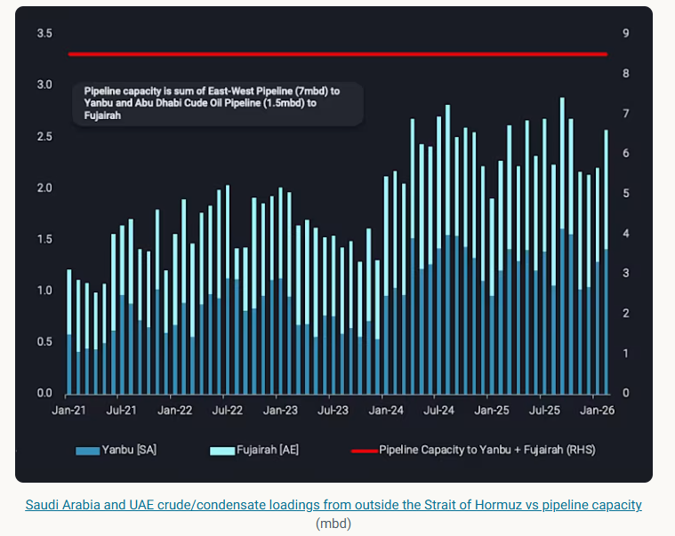
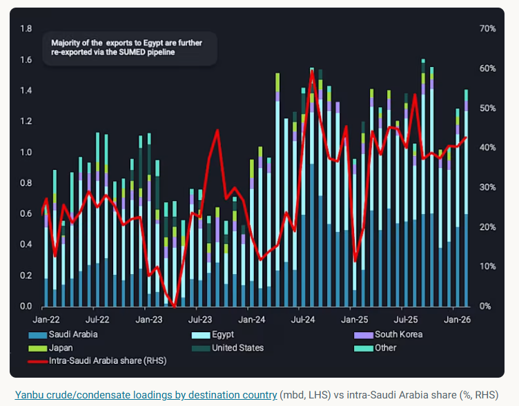
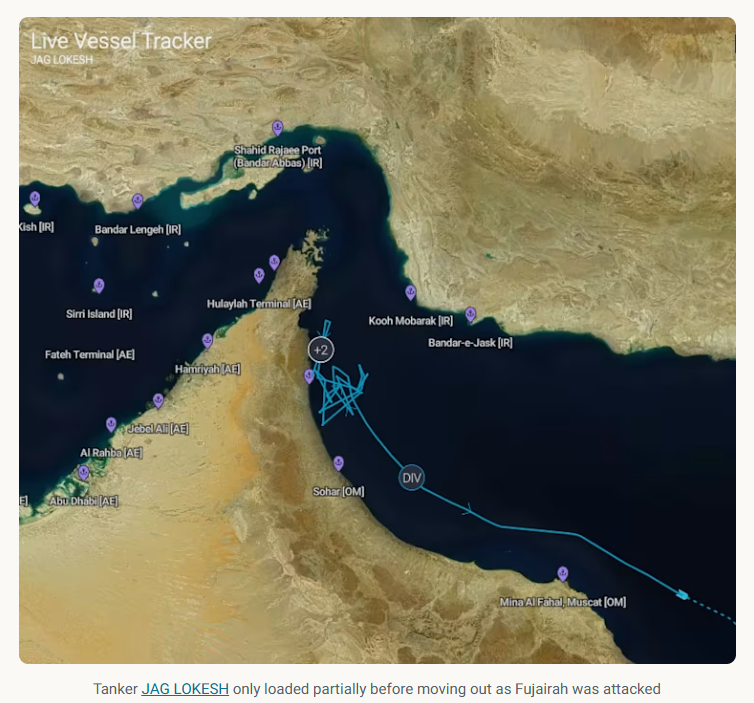

# Strait of Hormuz alternatives for crude exports

**Date:** March 06, 2026  
**Publisher:** Breakwave Advisors | **Category:** Market Insights  
**Original URL:** [https://www.breakwaveadvisors.com/insights/2026/3/6/strait-of-hormuz-alternatives-for-crude-exports](https://www.breakwaveadvisors.com/insights/2026/3/6/strait-of-hormuz-alternatives-for-crude-exports)  

---

As crude flows through Hormuz are almost at a standstill, we try to explore what are the alternatives and how realistic it is to divert flows to them

*By*[*Rohit Rathod*](https://www.linkedin.com/in/rathodrohit/)

As conflict erupted in the Middle East Gulf over the weekend and transits via the Strait of Hormuz ceased, a lot has been discussed about the potential impact on crude oil transiting this crucial chokepoint. As flows through the strait are almost at a standstill, the fate of ~16mbd of[crude exports out of the Middle East Gulf](https://analytics.vortexa.com/Flows?dateRange=2021-01-01T00%3A00%3A00.000Z__2026-02-28T23%3A59%3A59.999Z&filtersEnabled=%5B%22p%22%2C%22o%22%2C%22d%22%2C%22d_r%22%2C%22v%22%2C%22intra_d%22%2C%22sts_o%22%2C%22c_o%22%2C%22w%22%5D&from=%5B%229fa4354c24b3c7a2b0d40f870a1f57da4907bd816f130033f994ee9dcfdf08d1%22%2C%226253047d839a51684f2ab6e3a4fa9956f582c73dfbbb276ebcd51ee01697b024%22%2C%2267b544ca515fca465c8d5086dba55909bce0935a107ca92abceae703a50cbf89%22%2C%22f2ac0b4ca7b0e481ec41197ddbd37f6c60251f369ed74872691988bed8a07e0a%22%2C%229696ffdf07d6591f6f2ba711d0972e17838250e5585c2de2db6917765973ae0a%22%2C%22e6ac4ef9f6171a6473679fda36014b1bdea85469c80c0250bf2dbe86ab4a5935%22%2C%2290f285f8fb15c8bc72a43d25cea803491cc0fd0e97567cff577a2cfa56cde6f8%22%2C%223704f46c84d24f8b0a329e5511012cf59757759eeb09080c127c8a386b6d8435%22%5D&fromExcluded=%5B%227a6c33d12fafc563a5cc818575c873493f5478427b74a141f62752829a2f4abd%22%2C%229000d0a3461cc534d83c4867c1ba16fac6f6dc274704aa8495e03e97c98ff08d%22%2C%221962c148046bbdba9fc5abf58e4fdbb0d4bb3fbffea15c8a3d6b3eaf449bbeb4%22%2C%220ced332f89b3d695f13c69c3e0e9c4c0270789ed92923ae379ee50c3d735fa1d%22%2C%2270b573d3729a5a27c768f4caf3fd9932ea216192bd41e1967f28944141026f62%22%5D&geoBreakdownDestinationGlobal=wider_shipping_region&metric=bpd&page=Flows&products=%5B%2254af755a090118dcf9b0724c9a4e9f14745c26165385ffa7f1445bc768f06f11%22%5D&productsExcluded=%5B%22f95529fb0524a95783a8f3a2dad1463bfcc610b789bffd91ed16b233b77bf86c%22%5D&sortDirection=asc&sortField=vessel_name&tabId=178ae033-806c-4654-ae93-46244be896e8&timeSeriesProperty=origin_country&to=%5B%221962c148046bbdba9fc5abf58e4fdbb0d4bb3fbffea15c8a3d6b3eaf449bbeb4%22%2C%220ced332f89b3d695f13c69c3e0e9c4c0270789ed92923ae379ee50c3d735fa1d%22%2C%2270b573d3729a5a27c768f4caf3fd9932ea216192bd41e1967f28944141026f62%22%2C%227a6c33d12fafc563a5cc818575c873493f5478427b74a141f62752829a2f4abd%22%2C%229000d0a3461cc534d83c4867c1ba16fac6f6dc274704aa8495e03e97c98ff08d%22%2C%2267be333ea46a3cd312e207b05e2c5c4502a9353e39ec81642a93e3b23cc3c10a%22%2C%22715b6aab56723cb55c3ddbdc12a2851b379919010f119cf98765d4debbdb793d%22%2C%22869ab3d28136025484ecb4235eed83d0eacef3129d0ac4cf8b23afdab847fd6f%22%5D&toExcluded=%5B%223704f46c84d24f8b0a329e5511012cf59757759eeb09080c127c8a386b6d8435%22%2C%229fa4354c24b3c7a2b0d40f870a1f57da4907bd816f130033f994ee9dcfdf08d1%22%2C%226253047d839a51684f2ab6e3a4fa9956f582c73dfbbb276ebcd51ee01697b024%22%2C%2267b544ca515fca465c8d5086dba55909bce0935a107ca92abceae703a50cbf89%22%2C%2290f285f8fb15c8bc72a43d25cea803491cc0fd0e97567cff577a2cfa56cde6f8%22%2C%22e6ac4ef9f6171a6473679fda36014b1bdea85469c80c0250bf2dbe86ab4a5935%22%2C%22f2ac0b4ca7b0e481ec41197ddbd37f6c60251f369ed74872691988bed8a07e0a%22%2C%229696ffdf07d6591f6f2ba711d0972e17838250e5585c2de2db6917765973ae0a%22%5D&v=3)remains uncertain. With this insight we try to explore what options are available and how realistic it is to divert crude exports through these alternatives.

> **Figure 1: Στιγμιότυπο Οθόνης 2026 03 06 095802**  
> **Interactive Data & Source:** [Analytics Vortexa](https://analytics.vortexa.com/Flows?dateRange=2021-01-01T00%3A00%3A00.000Z__2026-02-28T23%3A59%3A59.999Z&destinationGlobalXFilter=%5B%22e6955a2c59dc90833986fe0894cf6718dddaa7816bb51bc955cdd3eb4470e554%22%5D&filtersEnabled=%5B%22p%22%2C%22o%22%2C%22d%22%2C%22d_r%22%2C%22v%22%2C%22intra_d%22%2C%22sts_o%22%2C%22c_o%22%2C%22w%22%2C%22v_i%22%2C%22sts%22%2C%22hd%22%5D&from=%5B%22b7da62c9c1704ba9c0a96d74a4bb7dea0b2e0507a062ce9a4ee4885b5331d3ef%22%5D&geoBreakdownDestinationGlobal=region&intraMovementDropdown=all&metric=bpd&page=Flows&products=%5B%2254af755a090118dcf9b0724c9a4e9f14745c26165385ffa7f1445bc768f06f11%22%5D&tabId=b622ebc7-7f9f-4d60-8e8c-f2bac6a30c72&timeSeriesBaselineEnd=2024-04-01T10%3A59%3A59.999Z&timeSeriesBaselineStart=2023-01-01T10%3A59%3A59.999Z&timeSeriesHiddenSeries=%5B%22bb70cf56200f5b72ba69a90bda2c6b47ba29da23945c6f1994cfd4c2ef2fe0ff%22%2C%22edb67ef340d7898df010249d0c83731d415edbb3824eb28d8d4d0cdc58b9c5b1%22%5D&timeSeriesProperty=destination_region&v=3) | [Local Asset](file:///C:/Users/Dell/Github/Shipping/corpus/03-breakwave/insights/2026/assets/2026-03-06_strait-of-hormuz-alternatives-for-crude-exports_img_cea3cf84ceb9ceb3cebcceb9cf8ccf84cf85_8c13429a2ced.png)

Let’s start with the first and the largest alternative - rerouting Saudi Arabia’s crude exports from the Middle East Gulf to the Red Sea port of Yanbu via the East-West pipeline which on paper has the capacity to move ~7mbd of crude towards the Red Sea.

Historically, loadings out of Yanbu have remained much much lower with Feb-26 loadings coming in at ~1.4mbd. The pipeline also brings crude to the ~400kbd Saudi Aramco Mobil Refinery (SAMREF), the ~400kbd Yanbu Aramco Sinopec Refining Company (YSREF) refinery and the ~240kbd Aramco Yanbu Refinery located in Yanbu, which makes up about ~1mbd of the pipeline capacity. Then there’s also the question about how much can the terminals at Yanbu load, with some estimates putting this capacity at ~3mbd.

> **Figure 2: Στιγμιότυπο Οθόνης 2026 03 06 095856**  
> **Interactive Data & Source:** [Analytics Vortexa](https://analytics.vortexa.com/Flows?dateRange=2021-01-01T00%3A00%3A00.000Z__2026-02-28T23%3A59%3A59.999Z&destinationGlobalXFilter=%5B%22e6955a2c59dc90833986fe0894cf6718dddaa7816bb51bc955cdd3eb4470e554%22%5D&filtersEnabled=%5B%22p%22%2C%22o%22%2C%22d%22%2C%22d_r%22%2C%22v%22%2C%22intra_d%22%2C%22sts_o%22%2C%22c_o%22%2C%22w%22%2C%22v_i%22%2C%22sts%22%2C%22hd%22%5D&from=%5B%22b7da62c9c1704ba9c0a96d74a4bb7dea0b2e0507a062ce9a4ee4885b5331d3ef%22%5D&geoBreakdownDestinationGlobal=region&intraMovementDropdown=all&metric=bpd&page=Flows&products=%5B%2254af755a090118dcf9b0724c9a4e9f14745c26165385ffa7f1445bc768f06f11%22%5D&tabId=b622ebc7-7f9f-4d60-8e8c-f2bac6a30c72&timeSeriesBaselineEnd=2024-04-01T10%3A59%3A59.999Z&timeSeriesBaselineStart=2023-01-01T10%3A59%3A59.999Z&timeSeriesHiddenSeries=%5B%22bb70cf56200f5b72ba69a90bda2c6b47ba29da23945c6f1994cfd4c2ef2fe0ff%22%2C%22edb67ef340d7898df010249d0c83731d415edbb3824eb28d8d4d0cdc58b9c5b1%22%5D&timeSeriesProperty=destination_region&v=3) | [Local Asset](file:///C:/Users/Dell/Github/Shipping/corpus/03-breakwave/insights/2026/assets/2026-03-06_strait-of-hormuz-alternatives-for-crude-exports_img_cea3cf84ceb9ceb3cebcceb9cf8ccf84cf85_1e6da9298de0.png)

Looking at the crude loadings out of Yanbu, around 40% of these loadings end up in Saudi Arabia itself and given the current market dynamics could easily be redirected to exports. From a realistic perspective, this alternative only serves the buyers in Europe and North America via the Suez Canal or Sumed pipeline.

[Saudi crude exports to Asia out of the Red Sea](https://analytics.vortexa.com/Flows?dateRange=2021-01-01T00%3A00%3A00.000Z__2026-02-28T23%3A59%3A59.999Z&destinationGlobalXFilter=%5B%22e6955a2c59dc90833986fe0894cf6718dddaa7816bb51bc955cdd3eb4470e554%22%5D&filtersEnabled=%5B%22p%22%2C%22o%22%2C%22d%22%2C%22d_r%22%2C%22v%22%2C%22intra_d%22%2C%22sts_o%22%2C%22c_o%22%2C%22w%22%2C%22v_i%22%2C%22sts%22%2C%22hd%22%5D&from=%5B%22b7da62c9c1704ba9c0a96d74a4bb7dea0b2e0507a062ce9a4ee4885b5331d3ef%22%5D&geoBreakdownDestinationGlobal=region&intraMovementDropdown=all&metric=bpd&page=Flows&products=%5B%2254af755a090118dcf9b0724c9a4e9f14745c26165385ffa7f1445bc768f06f11%22%5D&tabId=b622ebc7-7f9f-4d60-8e8c-f2bac6a30c72&timeSeriesBaselineEnd=2024-04-01T10%3A59%3A59.999Z&timeSeriesBaselineStart=2023-01-01T10%3A59%3A59.999Z&timeSeriesHiddenSeries=%5B%22bb70cf56200f5b72ba69a90bda2c6b47ba29da23945c6f1994cfd4c2ef2fe0ff%22%2C%22edb67ef340d7898df010249d0c83731d415edbb3824eb28d8d4d0cdc58b9c5b1%22%5D&timeSeriesProperty=destination_region&v=3)have been pretty stable, averaging about ~100kbd or around two VLCCs a month. Also,[Yanbu exports have mainly consisted of Arab Light crude](https://analytics.vortexa.com/Flows?dateRange=2021-01-01T00%3A00%3A00.000Z__2026-02-28T23%3A59%3A59.999Z&filtersEnabled=%5B%22p%22%2C%22o%22%2C%22d%22%2C%22d_r%22%2C%22v%22%2C%22intra_d%22%2C%22sts_o%22%2C%22c_o%22%2C%22w%22%2C%22v_i%22%2C%22sts%22%2C%22hd%22%5D&from=%5B%22566d8842586412c83641e2277d198ed93179c352f462baccc252c9c31eb8a214%22%5D&geoBreakdownOriginGlobal=port&intraMovementDropdown=all&metric=bpd&page=Flows&products=%5B%2254af755a090118dcf9b0724c9a4e9f14745c26165385ffa7f1445bc768f06f11%22%5D&tabId=a70b91ad-b287-4983-b802-03cb969fa3f9&timeSeriesBaselineEnd=2024-04-01T10%3A59%3A59.999Z&timeSeriesBaselineStart=2023-01-01T10%3A59%3A59.999Z&timeSeriesHiddenSeries=%5B%22bb70cf56200f5b72ba69a90bda2c6b47ba29da23945c6f1994cfd4c2ef2fe0ff%22%2C%22edb67ef340d7898df010249d0c83731d415edbb3824eb28d8d4d0cdc58b9c5b1%22%5D&timeSeriesProperty=product_grade&v=3)whereas Asian buyers have preferred heavier Arab grades but the pipeline can also handle heavier grades.

As transiting the Hormuz has been more and more difficult and uncertain, Aramco has offered the option to load from Yanbu to Asian buyers (Argus). What also remains uncertain is the route to Asia via Bab-el-Mandeb which is also at risk since the Houthis have also announced resumption of their attacks.

The next alternative is the Abu Dhabi Crude Oil Pipeline (ADCOP), a ~1.5mbd pipeline from the onshore Habshan field to the port city of Fujairah.[Loadings out of Fujairah](https://analytics.vortexa.com/Flows?dateRange=2021-01-01T00%3A00%3A00.000Z__2026-02-28T23%3A59%3A59.999Z&filtersEnabled=%5B%22p%22%2C%22o%22%2C%22d%22%2C%22d_r%22%2C%22v%22%2C%22intra_d%22%2C%22sts_o%22%2C%22c_o%22%2C%22w%22%2C%22v_i%22%2C%22sts%22%2C%22hd%22%5D&from=%5B%229000d0a3461cc534d83c4867c1ba16fac6f6dc274704aa8495e03e97c98ff08d%22%5D&geoBreakdownOriginGlobal=port&intraMovementDropdown=all&metric=bpd&page=Flows&products=%5B%2254af755a090118dcf9b0724c9a4e9f14745c26165385ffa7f1445bc768f06f11%22%5D&tabId=a70b91ad-b287-4983-b802-03cb969fa3f9&timeSeriesBaselineEnd=2024-04-01T10%3A59%3A59.999Z&timeSeriesBaselineStart=2023-01-01T10%3A59%3A59.999Z&timeSeriesHiddenSeries=%5B%22bb70cf56200f5b72ba69a90bda2c6b47ba29da23945c6f1994cfd4c2ef2fe0ff%22%2C%22edb67ef340d7898df010249d0c83731d415edbb3824eb28d8d4d0cdc58b9c5b1%22%5D&timeSeriesProperty=destination_country&v=3)have averaged ~1.1mbd in 2025 and have remained above ~1mbd so far in 2026. Given, the 100kbd Vitol FRCL refinery in Fujairah is also served by this pipeline, the actual capacity to ramp up loadings out of Fujairah remain limited.

It is important to note that this pipeline and the port of Fujairah with all the storage facilities are close to the strait and as of Tuesday, they have been hit by drones. Storage operators have already suspended operations and we have also seen a drop in[loadings out of Fujairah](https://analytics.vortexa.com/Flows?dateRange=2025-01-01T00%3A00%3A00.000Z__2026-03-04T23%3A59%3A59.999Z&filtersEnabled=%5B%22p%22%2C%22o%22%2C%22d%22%2C%22d_r%22%2C%22v%22%2C%22intra_d%22%2C%22sts_o%22%2C%22c_o%22%2C%22w%22%2C%22v_i%22%2C%22sts%22%2C%22hd%22%5D&frequency=week&from=%5B%229000d0a3461cc534d83c4867c1ba16fac6f6dc274704aa8495e03e97c98ff08d%22%5D&geoBreakdownOriginGlobal=port&intraMovementDropdown=all&page=Flows&products=%5B%2254af755a090118dcf9b0724c9a4e9f14745c26165385ffa7f1445bc768f06f11%22%5D&tabId=e1eb4b6d-c011-4b3f-b328-4bd9e6423baa&timeSeriesBaselineEnd=2024-04-01T10%3A59%3A59.999Z&timeSeriesBaselineStart=2023-01-01T10%3A59%3A59.999Z&timeSeriesHiddenSeries=%5B%22bb70cf56200f5b72ba69a90bda2c6b47ba29da23945c6f1994cfd4c2ef2fe0ff%22%2C%22edb67ef340d7898df010249d0c83731d415edbb3824eb28d8d4d0cdc58b9c5b1%22%5D&v=3). We have already observed a tanker load partially before moving out as storage facilities were attacked and if operations remain suspended for longer, Fujairah no longer remains a viable alternative.

> **Figure 3: Στιγμιότυπο Οθόνης 2026 03 06 095958**  
> **Interactive Data & Source:** [Analytics Vortexa](https://analytics.vortexa.com/Flows?dateRange=2021-01-01T00%3A00%3A00.000Z__2026-02-28T23%3A59%3A59.999Z&filtersEnabled=%5B%22p%22%2C%22o%22%2C%22d%22%2C%22d_r%22%2C%22v%22%2C%22intra_d%22%2C%22sts_o%22%2C%22c_o%22%2C%22w%22%2C%22v_i%22%2C%22sts%22%2C%22hd%22%5D&from=%5B%220ced332f89b3d695f13c69c3e0e9c4c0270789ed92923ae379ee50c3d735fa1d%22%2C%22417b516c3aff4397a3e6e5fe96aef211deca0e3c33af81d6700d26957b6d532e%22%5D&geoBreakdownOriginGlobal=port&intraMovementDropdown=all&metric=bpd&page=Flows&products=%5B%2254af755a090118dcf9b0724c9a4e9f14745c26165385ffa7f1445bc768f06f11%22%5D&tabId=a70b91ad-b287-4983-b802-03cb969fa3f9&timeSeriesBaselineEnd=2024-04-01T10%3A59%3A59.999Z&timeSeriesBaselineStart=2023-01-01T10%3A59%3A59.999Z&timeSeriesHiddenSeries=%5B%22bb70cf56200f5b72ba69a90bda2c6b47ba29da23945c6f1994cfd4c2ef2fe0ff%22%2C%22edb67ef340d7898df010249d0c83731d415edbb3824eb28d8d4d0cdc58b9c5b1%22%5D&timeSeriesProperty=destination_country&v=3) | [Local Asset](file:///C:/Users/Dell/Github/Shipping/corpus/03-breakwave/insights/2026/assets/2026-03-06_strait-of-hormuz-alternatives-for-crude-exports_img_cea3cf84ceb9ceb3cebcceb9cf8ccf84cf85_96fd64d182d1.png)

On the Iranian side, the alternatives are actually not yet ready. There is the Gorreh-Jask pipeline is operational since 2021, carrying ~300kbd of crude initially from Goreh in Bushehr Province to Bandar-e-Jask outside the strait of Hormuz with eventual capacity expected to reach ~1mbd (no confirmation of this having been achieved as of 2026). Jask was supposed to reduce the reliance on Kharg Island by bypassing the Strait of Hormuz but on the eve of the conflict,[crude loadings from Jask](https://analytics.vortexa.com/Flows?dateRange=2021-01-01T00%3A00%3A00.000Z__2026-02-28T23%3A59%3A59.999Z&filtersEnabled=%5B%22p%22%2C%22o%22%2C%22d%22%2C%22d_r%22%2C%22v%22%2C%22intra_d%22%2C%22sts_o%22%2C%22c_o%22%2C%22w%22%2C%22v_i%22%2C%22sts%22%2C%22hd%22%5D&from=%5B%220ced332f89b3d695f13c69c3e0e9c4c0270789ed92923ae379ee50c3d735fa1d%22%2C%22417b516c3aff4397a3e6e5fe96aef211deca0e3c33af81d6700d26957b6d532e%22%5D&geoBreakdownOriginGlobal=port&intraMovementDropdown=all&metric=bpd&page=Flows&products=%5B%2254af755a090118dcf9b0724c9a4e9f14745c26165385ffa7f1445bc768f06f11%22%5D&tabId=a70b91ad-b287-4983-b802-03cb969fa3f9&timeSeriesBaselineEnd=2024-04-01T10%3A59%3A59.999Z&timeSeriesBaselineStart=2023-01-01T10%3A59%3A59.999Z&timeSeriesHiddenSeries=%5B%22bb70cf56200f5b72ba69a90bda2c6b47ba29da23945c6f1994cfd4c2ef2fe0ff%22%2C%22edb67ef340d7898df010249d0c83731d415edbb3824eb28d8d4d0cdc58b9c5b1%22%5D&timeSeriesProperty=destination_country&v=3)have remained sporadic, again suggesting that the facilities might not be ready.

There is still uncertainty around how long this conflict will continue, but we should expect flows to redirect and see increased crude exports out of Yanbu as well as Fujairah to a small extent as buyers try to secure barrels. What remains to be seen is the impact this will have on vessel tonne-miles in a scenario where vessels heading to Asia from Yanbu will have to go through the Suez Canal and around the Cape of Good Hope (due to the Houthi threat) with already high freight rates.

Data Source:[Vortexa](https://www.vortexa.com//oil-gas-data-traders-analysts-data-scientists?gclid=Cj0KCQjw8_qRBhCXARIsAE2AtRZKOvMnbilZ_6_91d7huSFFy71pWLrnPwGwOHVzXsmsG-1a1mZnQw8aAt89EALw_wcB&hsa_acc=1782073842&hsa_ad=548425387665&hsa_cam=14746637662&hsa_grp=125038601902&hsa_kw=&hsa_mt=&hsa_net=adwords&hsa_src=g&hsa_tgt=dsa-1431852288425&hsa_ver=3&utm_campaign=%5BCD%5D%20-%20DSA%20-%20EMEA&utm_medium=cpc&utm_medium=ppc&utm_source=google&utm_source=adwords&utm_term=)

---

**Tags:** Crude, Tankers, Markets  
