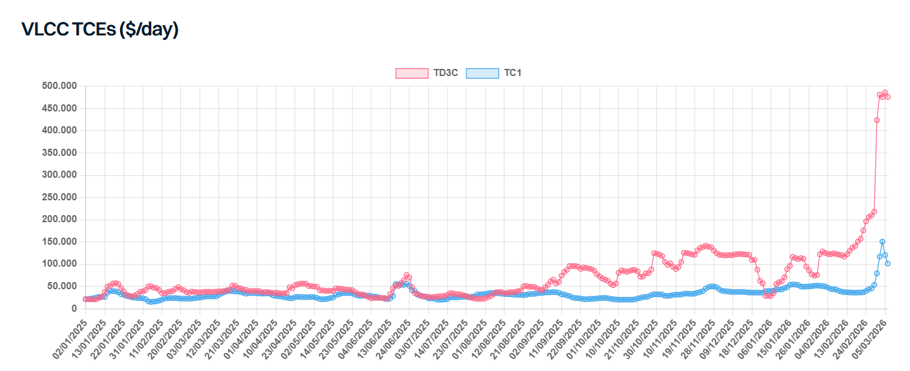

# Middle East Mayhem

**Date:** March 09, 2026  
**Publisher:** Breakwave Advisors | **Category:** Market Insights  
**Original URL:** [https://www.breakwaveadvisors.com/insights/2026/3/9/middle-east-mayhem](https://www.breakwaveadvisors.com/insights/2026/3/9/middle-east-mayhem)  

---

> **Figure 1: Istock 1250195413 500x333**  
> **Interactive Data & Source:** [Gibsons Co](https://www.gibsons.co.uk/market-reports) | [Local Asset](file:///C:/Users/Dell/Github/Shipping/corpus/03-breakwave/insights/2026/assets/2026-03-09_middle-east-mayhem_img_istock-1250195413-500x333_f55c3a1f1139.jpg)

The first week of the US-Israel military campaign against Iran has drawn to a close, but what happens in the weeks to come remains extremely uncertain. The war has triggered a global energy shipping crisis of epic proportions, with cascading effects across oil markets, tanker freight, and petrochemical supply chains.

The most critical issue is the inability for ships to safely transit the Straits of Hormuz, and until this issue is resolved, commodity trade in and out of the Middle East Gulf remains paralysed. Trump has announced a plan for the US to provide affordable insurance and escorts through the region, though this may take weeks to materialise and is not guaranteed to succeed. The conflict is also unlikely to blow over any time soon; US Central Command has since requested resources to sustain operations for at least 100 days, signalling this is far from a short-term engagement. The crisis continues to spill over across the region with Azerbaijan subject to a drone attack.

Oil producers in the region are in a bind. Iraq has been forced to shut in 1.5mbd of production, with other regional producers facing a similar fate as storage tanks fill up. Refiners in the region are also cutting production, both due to drone and missile strikes, but also a lack of offtake. Ras Tanura (550kbd) suspended operations following several attacks, as did the Sitra (405kbd) refinery. Plants across Kuwait are trimming output, whilst oil storage facilities in Duqm (Oman), Fujairah and Musaffah (UAE) have also been hit. In Asia, run cuts and export bans also threaten regional CPP trade. China and Thailand have instructed their refiners to cease exports with the former being the third largest regional exporter. One Indian refiner halted gasoline exports in March/April. In Korea, another refiner was looking to buy back scheduled exports, whilst other major economies were considering similar moves. Petrochemical producers across Asia and the Middle East have declared force majeure.

Governments are yet to announce major releases from strategic reserves (SPRs), though the US has authorised India to import Russian oil already on the water, even if delivered by sanctioned ships. If the situation does not soon improve, SPR releases may be inevitable. With supplies of feedstocks and finished products looking extremely tight, commodity prices have surged. Jet fuel prices have surged globally with Singapore spot prices hitting a record on Thursday and are trading over 108% higher on the week. Gasoil prices have surged to levels not since 2022. Crude price increases have been more modest but are still up around 25% on the week to levels not seen in nearly 2 years.

The combined effect has pushed freight rates across many routes to record levels. Earlier in the week, the VLCC spot rate TD3C surged 83% in a single day, yet many of these rates are “theoretical” with few if any fixtures reported. Some benchmarks have started to correct already, with steeper declines possible next week if volumes cannot be restored. Western markets perhaps represent the real levels of freight on offer, yet as more vessels divert to this region, the supply/demand balance could also weigh on freight rates here.

> **Figure 2: Στιγμιότυπο Οθόνης 2026 03 09 095714**  
> **Interactive Data & Source:** [Gibsons Co](https://www.gibsons.co.uk/market-reports) | [Local Asset](file:///C:/Users/Dell/Github/Shipping/corpus/03-breakwave/insights/2026/assets/2026-03-09_middle-east-mayhem_img_cea3cf84ceb9ceb3cebcceb9cf8ccf84cf85_0c872dea8083.png)

Data source:[Gibson Shipbrokers](https://www.gibsons.co.uk/market-reports)

---

**Tags:** Crude, Markets, Shipping  
