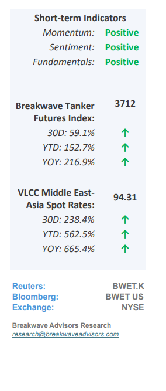
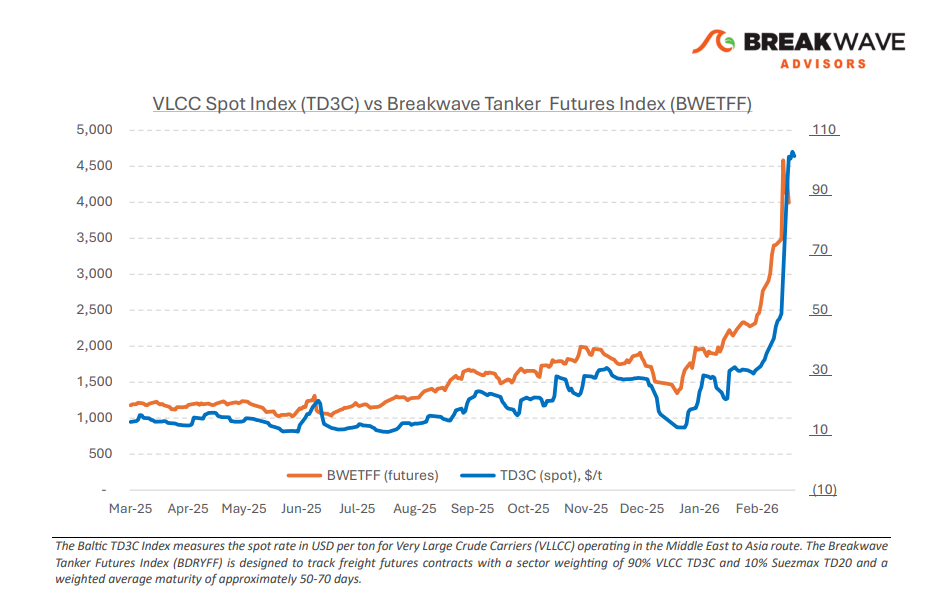
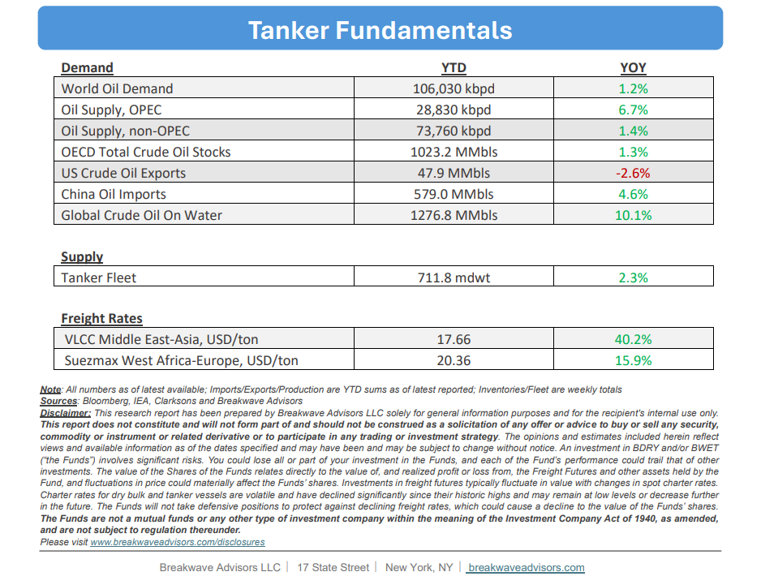

# Breakwave Bi-Weekly Tanker Report - March 10, 2026

**Date:** March 10, 2026  
**Publisher:** Breakwave Advisors | **Category:** Market Insights  
**Original URL:** [https://www.breakwaveadvisors.com/insights/3102026wetreport2026kmarll5](https://www.breakwaveadvisors.com/insights/3102026wetreport2026kmarll5)  

---

•**VLCC Rates Explode Higher as the Worst-Case Scenario becomes Reality**– The global oil market is**currently experiencing an unprecedented disruption**in supply flows. As Iran maintains strategic control over the Straits of Hormuz, exports from the Arabian Gulf have reached a**virtual standstill.**Historically, freight benchmarks have adapted to geopolitical and structural shifts. During the "Tanker War" (1980–1989), the Middle East Gulf–Japan route was the primary industry standard. By the early 2000s, the surge in Chinese demand shifted the focus to the Middle East Gulf–China route, specifically the TD3C Ras Tanura–Ningbo assessment. The current crisis, however, is**prompting a shift in market focus**toward the Atlantic Basin. Should Arabian Gulf disruptions persist, U.S. Gulf exports are expected to gain significant prominence. Currently,**daily tanker transits**have dwindled to**negligible levels,**reflecting extreme operational caution among shipowners, charterers, and insurers. This volatility is further compounded by a**sharp rise in marine war-risk insurance**premiums, adding substantial cost and complexity to regional voyages. Market stability now depends heavily on diplomatic and military developments between the U.S., Israel, and Iran, as the**tanker market remains dictated by the trajectory of the ongoing conflict.**

> **Figure 1: Στιγμιότυπο Οθόνης 2026 03 10 113653**  
> [Local Asset](file:///C:/Users/Dell/Github/Shipping/corpus/03-breakwave/insights/2026/assets/2026-03-10_3102026wetreport2026kmarll5_img_cea3cf84ceb9ceb3cebcceb9cf8ccf84cf85_1f42fbe0ff6b.png)

•**Panic Bid in Oil Send Prices Over $100 Despite Swollen Inventories**– The most significant Middle East conflict in a generation has triggered a massive surge in oil prices, driven primarily by**panic-buying**in financial markets following the ongoing disruption in the Strait of Hormuz. While the market is currently pricing in a major shortage, a closer examination suggests that**global inventories of more than 10 billion barrels**are sufficient to manage several months of disruption, as these strategic reserves are designed specifically to mitigate such shocks. Consequently, we view current price levels as excessive; the combination of high inventory levels, emerging demand destruction, and the eventual resumption of Persian Gulf exports (even weeks out)**will likely lead to a market correction**as sharp as the initial rally. However, we also understand the rationale behind the rally as during such uncertain times**buying first/asking questions later**is the default strategy of investors given the momentous importance that energy prices play in the global macroeconomic landscape.

•**Our Long-term View**– The tanker market is recovering from a long period of staggered rates as the growth in new vessel supply shrinks while oil demand remains elevated in line with the global economy. A historically low orderbook combined with favorable shifting trade patterns should continue to support increased spot rate volatility, which combined with the ongoing geopolitical turmoil, should sustain freight rates in the medium to long term.

> **Figure 2: Στιγμιότυπο Οθόνης 2026 03 10 085025**  
> [Local Asset](file:///C:/Users/Dell/Github/Shipping/corpus/03-breakwave/insights/2026/assets/2026-03-10_3102026wetreport2026kmarll5_img_cea3cf84ceb9ceb3cebcceb9cf8ccf84cf85_8647fea8e42b.png)

> **Figure 3: Στιγμιότυπο Οθόνης 2026 03 10 113707**  
> [Local Asset](file:///C:/Users/Dell/Github/Shipping/corpus/03-breakwave/insights/2026/assets/2026-03-10_3102026wetreport2026kmarll5_img_cea3cf84ceb9ceb3cebcceb9cf8ccf84cf85_1973a956ea2f.png)

### Subscribe:
