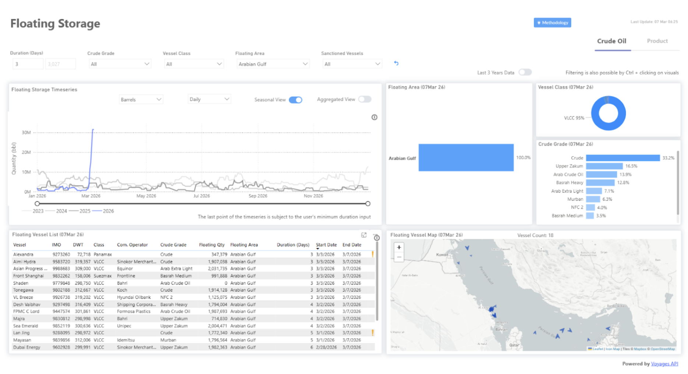
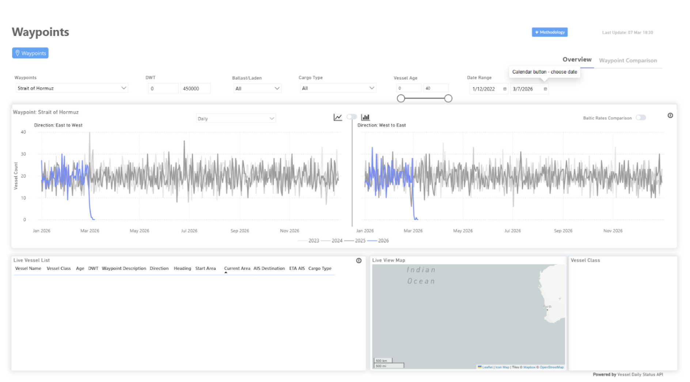
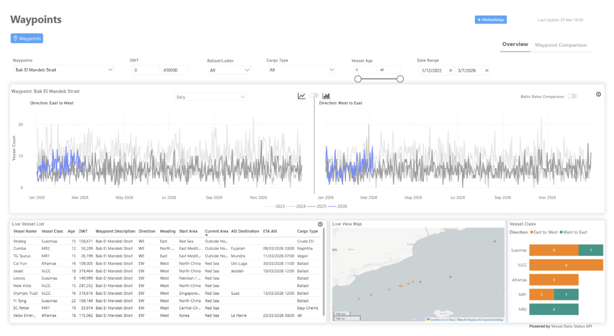

# Strait of Hormuz Spotlight

**Date:** March 10, 2026  
**Publisher:** Breakwave Advisors | **Category:** Market Insights  
**Original URL:** [https://www.breakwaveadvisors.com/insights/2026/3/10/strait-of-hormuz-spotlight](https://www.breakwaveadvisors.com/insights/2026/3/10/strait-of-hormuz-spotlight)  

---

Commercial tanker transits near zero, floating storage rising, war-risk premiums climbing.

> **Figure 1: Market Chart 1**  
> **Interactive Data & Source:** [Signal Ocean Platform](https://go.signalocean.com/e/983831/nker-dynamic-waypoints-tankers/2rxckh/584073833/h/S6ZxPXESRmZLUBLVXDH9FXuvOZkLCmOKBA2uV0Ur_58) | [Local Asset](file:///C:/Users/Dell/Github/Shipping/corpus/03-breakwave/insights/2026/assets/2026-03-10_strait-of-hormuz-spotlight_img_unnamed_4f9ef0724327.png)

### Strait of Hormuz Disruption

- Commercial tanker transits near zero in recent observation windows
- Growing floating storage in Gulf anchorages
- Rising war-risk insurance premiums

A sharp decline in tanker transits through the Strait of Hormuz and rising floating storage in the Gulf signal a shift toward risk-managed energy transport rather than normal market operations. Recent AIS data now indicates that commercial tanker traffic has effectively reached a near-standstill, with most vessels remaining anchored in the Gulf while operators assess security and insurance risks.

Current indicators, including waypoint activity and vessel transit patterns, provide the basis for the disruption scenarios examined below.

### Scenario Matrix

## Eight Scenarios for the Hormuz Disruption

### Scenario 1: De Facto Restriction of Transit with Rising Floating Storage

### Probability: Very High — Already Developing

The most immediate development appears to be a near-standstill in commercial tanker movements rather than a complete halt in traffic. Shipowners and charterers are assessing operational risks more carefully, and some departures are being delayed until freight economics justify the voyage.

Floating storage is becoming part of this adjustment. Tankers that would normally depart shortly after loading are, in some cases, remaining offshore while operators evaluate routing options and market conditions. Several vessels have already been damaged or threatened by drone and missile activity in the region, reinforcing shipowners' reluctance to transit the strait.

Navigation through the corridor remains open, but activity may continue at reduced levels as shipping companies adapt to the prevailing security and insurance environment. At this stage, the situation reflects a commercial response to uncertainty rather than any formal restriction on transit.

### Scenario 2: A Two-Route Export Structure

### Probability: High

If the disruption persists, producers increasingly rely on a combination of pipeline exports and selective maritime shipments. Pipeline infrastructure that bypasses the strait gains strategic importance, particularly in Saudi Arabia and the United Arab Emirates, where crude can reach ports outside the narrow passage. These routes provide partial relief but cannot handle the full volume normally exported from the Gulf.

As a result, some tanker movements continue, although typically under tighter scheduling and higher risk premiums.

### Scenario 3: Security-Led Stabilization of Tanker Movements

### Probability: Medium–high

If the slowdown begins to affect supply flows, maritime security operations in the region could expand. The United States Navy already maintains a significant presence in the Gulf and can monitor tanker traffic and support safe navigation if required.

Policy discussions have already begun around naval escort missions and temporary insurance backstops designed to restore confidence among shipowners. In practical terms, this could allow tanker movements to resume gradually, although under conditions where maritime security plays a more visible role in supporting the continuity of trade routes.

> **Figure 2: Market Chart 2**  
> **Interactive Data & Source:** [Signal Ocean Platform](https://go.signalocean.com/e/983831/nker-dynamic-waypoints-tankers/2rxckh/584073833/h/S6ZxPXESRmZLUBLVXDH9FXuvOZkLCmOKBA2uV0Ur_58) | [Local Asset](file:///C:/Users/Dell/Github/Shipping/corpus/03-breakwave/insights/2026/assets/2026-03-10_strait-of-hormuz-spotlight_img_unnamed28129_f38dba846a57.png)

### Scenario 4: Market Shock and Temporary Pricing Power

### Probability: High

The current disruption to tanker movements in the Gulf is already being reflected in oil market pricing, with AIS tracking showing virtually no commercial tanker transits during several recent observation periods, indicating that shipowners are avoiding the corridor despite the absence of an official closure.

A useful historical comparison can be found in the tanker attacks of the 1980s, when disruptions to Gulf shipping contributed to sharp swings in freight markets. Today, AIS data provides near-real-time visibility into tanker movements and can quickly indicate when commercial traffic through critical routes is slowing or changing patterns, although coverage is not always complete.

### Scenario 5: Quiet Operational Coordination

### Probability: Medium–high

During maritime disruptions, it is common to see quiet coordination among exporters, shipping companies, insurers, and governments. This coordination usually focuses on maintaining trade rather than announcing formal agreements. Producers such as Saudi Arabia and the United Arab Emirates have a strong incentive to keep exports flowing, while maritime powers like the United States provide security support.

### Scenario 6: China's Potential Diplomatic Involvement

### Probability: Medium

As the largest buyer of Gulf crude, China has a strong interest in preventing prolonged disruption. Rather than deploying military power in the region, Beijing is more likely to act through diplomacy and economic engagement — discussions with producers, consultations with importers such as India, or mediation efforts aimed at keeping energy flows stable. So far, the evidence points to diplomatic influence rather than a formal coalition.

> **Figure 3: Market Chart 3**  
> **Interactive Data & Source:** [Signal Ocean Platform](https://go.signalocean.com/e/983831/nker-dynamic-waypoints-tankers/2rxckh/584073833/h/S6ZxPXESRmZLUBLVXDH9FXuvOZkLCmOKBA2uV0Ur_58) | [Local Asset](file:///C:/Users/Dell/Github/Shipping/corpus/03-breakwave/insights/2026/assets/2026-03-10_strait-of-hormuz-spotlight_img_unnamed28229_51578c911c33.png)

### Scenario 7: Expansion of the Maritime Crisis

### Probability: Medium

The most serious escalation scenario would involve sustained disruption in the Gulf combined with instability spreading beyond the region into the Red Sea corridor. Instability linked to Houthi attacks has already increased security risks in the Bab el-Mandeb Strait. While the strait remains open, attacks on commercial vessels and the resulting security operations have already disrupted traffic and caused many ships to reroute away from the Suez Canal corridor.

A further escalation — sustained attacks, mining of shipping lanes, or broader regional instability — could significantly affect transit through Bab el-Mandeb, forcing more vessels to divert around the Cape of Good Hope and increasing transit times, costs, and pressure on global supply chains.

### Scenario 8: Disruption to Bunker Fuel Supply in the Arabian Gulf

### Probability: Low–medium

Escalating regional tensions could affect marine fuel supply infrastructure in the Arabian Gulf. A fire at Fujairah disrupted bunker operations after debris from an intercepted drone caused a blaze in the port's oil industry zone, while a separate drone strike damaged a fuel storage tank at Duqm Port. If tanker traffic through Hormuz remains constrained, bunker demand patterns could shift further toward Asian hubs as vessels reroute or delay departures from Gulf ports.

Major bunkering hubs including Singapore, Colombo, and ports in India have seen increased demand as vessels adjust fueling strategies. In Europe, the Northwest European bunkering region centred on Rotterdam, Antwerp, and Amsterdam has experienced tighter supply conditions and higher fuel premiums, while Mediterranean ports such as Gibraltar have also seen increased activity.

### Overall Reading of the Situation

The situation remains highly uncertain, and it is difficult to determine which of the above scenarios may unfold next. Several of them remain possible under the current unstable security and geopolitical conditions. At this stage, the most critical issues are the ability to maintain safe passage for vessels, the exposure of the marine insurance market, and the role that both China and the United States may play in securing shipping routes.

In the near term, energy transport may increasingly rely on a combination of maritime shipments and pipeline exports. Saudi Arabia's pipeline network could help maintain exports while naval forces, particularly from the United States, continue to protect key sea lanes.

Regional diplomacy could also influence how the situation develops. If Oman increases pressure and builds support among other regional actors, it could help create conditions for de-escalation and potentially shorten the duration of the current disruption.**What to watch now:**AIS[**tanker**](https://go.signalocean.com/e/983831/nker-dynamic-waypoints-tankers/2rxckh/584073833/h/S6ZxPXESRmZLUBLVXDH9FXuvOZkLCmOKBA2uV0Ur_58)transit data and[**floating storage**](https://go.signalocean.com/e/983831/anker-dynamic-floating-storage/2rxckd/584073833/h/S6ZxPXESRmZLUBLVXDH9FXuvOZkLCmOKBA2uV0Ur_58)levels offer the clearest signals of how the situation is evolving.

Data Source:[Signal Ocean Platform](https://www.thesignalgroup.com/signal-ocean-platform)

---

**Tags:** Crude, Shipping, Tankers  
