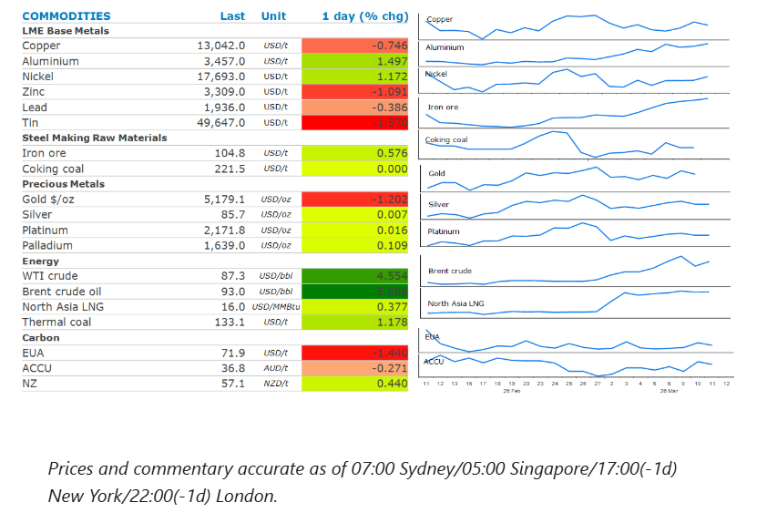
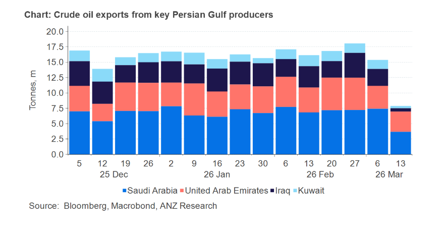

# Oil gains as length Middle East conflict looms

**Date:** March 12, 2026  
**Publisher:** Breakwave Advisors | **Category:** Market Insights  
**Original URL:** [https://www.breakwaveadvisors.com/insights/2026/3/12/oil-gains-as-length-middle-east-conflict-looms](https://www.breakwaveadvisors.com/insights/2026/3/12/oil-gains-as-length-middle-east-conflict-looms)  

---

Energy markets pushed higher despite plans to release emergency supplies of oil. Precious metal prices declined amid inflationary concerns. Industrial metals prices were mixed amid supply concerns.

*By*[*Daniel Hynes*](https://www.linkedin.com/in/dahynes/)

> **Figure 1: Στιγμιότυπο Οθόνης 2026 03 12 105208**  
> **Interactive Data & Source:** [Linkedin](https://www.linkedin.com/newsletters/commodities-wrap-6692196755876012032/?fbclid=IwAR3kiXJqZdxmp9ZcRwBNI7FsBySI-XSC0pfPur1qzjt7OZp7PTE59Tsl1QI) | [Local Asset](file:///C:/Users/Dell/Github/Shipping/corpus/03-breakwave/insights/2026/assets/2026-03-12_oil-gains-as-length-middle-east-conflict-looms_img_cea3cf84ceb9ceb3cebcceb9cf8ccf84cf85_0c80ad3dc8bf.png)

### Market Commentary

**Crude oil**prices pushed higher as President Trump increased pressure on Iran. He warned that the US could strike even more targets in Iran “if we want”. This followed comments earlier in the week that the operation could end soon. Expectations of additional Russian oil hitting the market were also squashed. The European Union called for the continued enforcement of the price cap on Russia’s oil. Trump has already waived some oil-related sanctions, which has seen an increased number of oil tankers with Russian crude head to India, according to ship tracking data. The current price cap on Russian seaborne crude oil is approximately USD44.10/bbl.

This offset news that the IEA is coordinating a release of oil from the strategic reserves of its members. It suggested this release could be as large as 400mbbl – the largest in its history. A meeting of G7 leaders will discuss the stockpile release separately, but they have, in principle, said they will support such “proactive measures”. Prime Minister Takaichi said Japan will release oil from its strategic reserve, as soon as 16 March. The IEA has said its 32 members hold more than 1,200mbbl, which includes the US strategic petroleum reserve. Another 600mbbl of industry stocks are under government obligation. The pace and duration of the release will be key. The dribbling of oil will do little to offset the millions of barrels that are being lost due to the effective closure of the Strait of Hormuz. The waterway carries approximately 20mb/d. The maximum drawdown capability of the US Strategic Petroleum Reserve is 4.4mb/d, and it takes 13 days for the oil to reach the open market after a presidential decision.

**Global gas**prices also rose, as suppliers announced further disruptions. LNG exporters, including Shell Plc, are declaring force majeure on customers across Asia due to the shutdown of the world’s biggest export plant in Qatar. A smaller LNG export plant in Abu Dhabi is also unable to ship cargoes. Omani trading house, OQ, has also declared force majeure to its customers in Bangladesh. This saw Asian LNG prices push to USD19/MMBtu. That’s almost double where it was before the US attacked Iran in late February. India is one of the more vulnerable countries, as it took about half of its LNG from Qatar last year. European gas futures gained amid the prospect of its region’s buyers having to fight hard for available cargoes. At least nine shipments that were initially heading to Europe have changed course to Asia since the beginning of the Middle East conflict, according to ship tracking data. This is exacerbating concerns, as hotter weather in Southeast Asia is forecast.

**Aluminium**extended gains on concerns over supply disruptions. The Middle East conflict has prompted production cuts at key aluminium smelters in the region, which account for approximately 9% of global supply. Rio Tinto offered to supply metal at a premium of USD350/t to Japanese buyers for Q2 shipments, according to a Bloomberg report. This would be the highest since 2015. Orders to withdraw metal from LME warehouses have risen sharply, driven by requests from Asia.

**Gold**dipped below USD5,200/oz after the release of the February inflation data. While it met expectations, forward looking inflationary concerns proved stronger, edging the USD up and denting the appeal of precious metals.

### Chart of the Day

Exports from key oil producers in the Middle East are drying up quickly. The four biggest suppliers have seen their exports fall to 7.6mb/d in the week ending 12 March. This is down from 15.1mb/d in the previous week. Reports of three vessels being hit by suspected projectiles in the Strait of Hormuz will do nothing to improve the reluctance of shipping companies to send tankers through this key waterway.

> **Figure 2: Στιγμιότυπο Οθόνης 2026 03 12 105215**  
> **Interactive Data & Source:** [Linkedin](https://www.linkedin.com/newsletters/commodities-wrap-6692196755876012032/?fbclid=IwAR3kiXJqZdxmp9ZcRwBNI7FsBySI-XSC0pfPur1qzjt7OZp7PTE59Tsl1QI) | [Local Asset](file:///C:/Users/Dell/Github/Shipping/corpus/03-breakwave/insights/2026/assets/2026-03-12_oil-gains-as-length-middle-east-conflict-looms_img_cea3cf84ceb9ceb3cebcceb9cf8ccf84cf85_ca3e7b069e21.png)

Data source:[Commodities Wrap](https://www.linkedin.com/newsletters/commodities-wrap-6692196755876012032/?fbclid=IwAR3kiXJqZdxmp9ZcRwBNI7FsBySI-XSC0pfPur1qzjt7OZp7PTE59Tsl1QI)

---

**Tags:** Shipping, Commodities, Markets  
