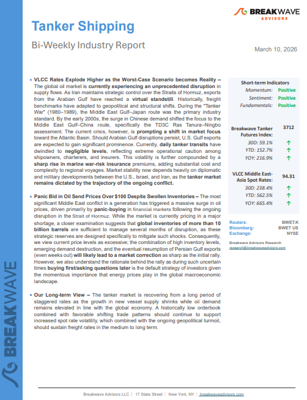
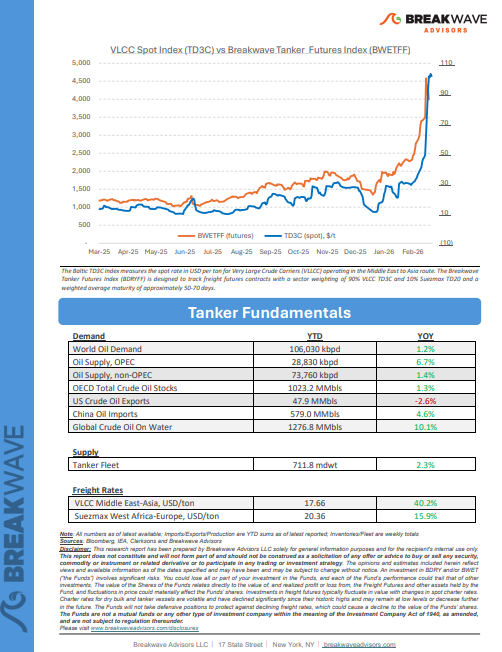
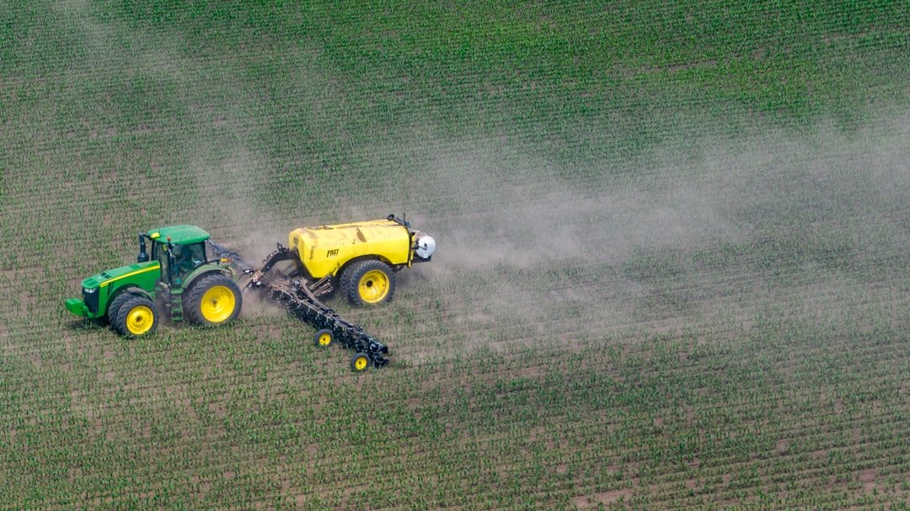
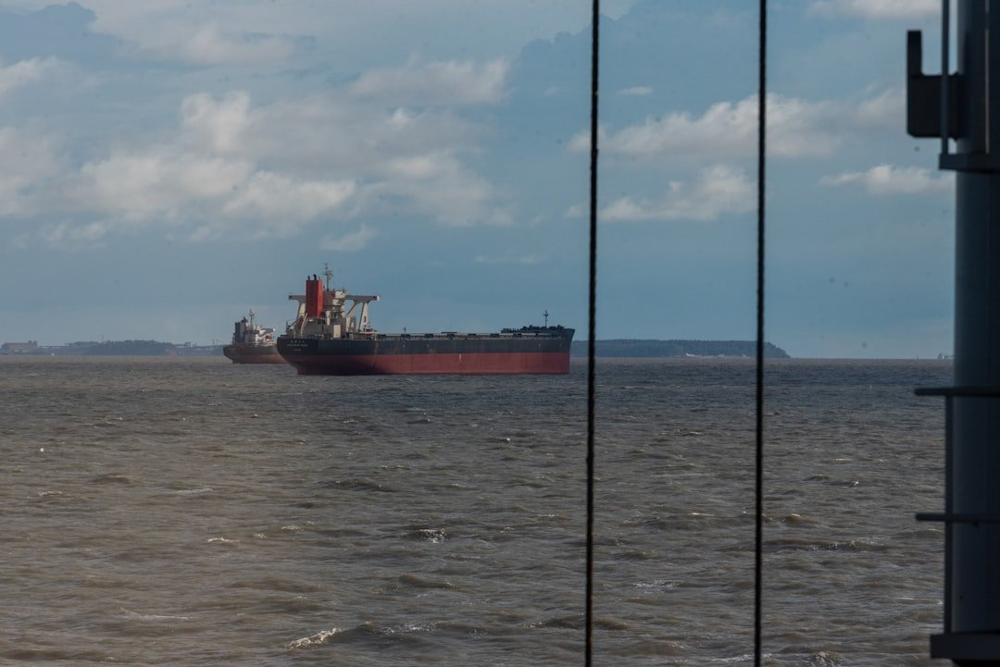
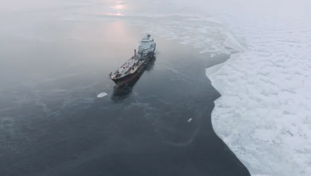

# Breakwave Weekend Read

**Date:** March 13, 2026  
**Publisher:** Breakwave Advisors | **Category:** Market Insights  
**Original URL:** [https://www.breakwaveadvisors.com/insights/2026/2/20breakwave-weekend-read-554747hhg-9tdx4-kh5nf](https://www.breakwaveadvisors.com/insights/2026/2/20breakwave-weekend-read-554747hhg-9tdx4-kh5nf)  

---

## Welcome Tobreakwave Advisorsweekend Read

***As the week comes to a close, take a moment to review the key insights from the past few days. Missed something? We've gathered all the top insights for you to catch up at your convenience.***

## Breakwave Shipping Report

**VLCC Rates Explode Higher as the Worst-Case Scenario becomes Reality**– The global oil market is**currently experiencing an unprecedented disruption**in supply flows.

[Read More](https://www.breakwaveadvisors.com/insights/3102026wetreport2026kmarll5)

> **Figure 1: Στιγμιότυπο Οθόνης 2026 03 11 164633**  
> **Interactive Data & Source:** [Breakwave Advisors Market Insights](https://www.breakwaveadvisors.com/insights/2026/3/9/escalating-geopolitical-tensions-dominated-global-markets) | [Local Asset](file:///C:/Users/Dell/Github/Shipping/corpus/03-breakwave/insights/2026/assets/2026-03-13_20breakwave-weekend-read-554747hhg-9tdx4-kh5nf_img_cea3cf84ceb9ceb3cebcceb9cf8ccf84cf85_e221f5a522d6.png)

> **Figure 2: Στιγμιότυπο Οθόνης 2026 03 11 164642**  
> **Interactive Data & Source:** [Breakwave Advisors Market Insights](https://www.breakwaveadvisors.com/insights/2026/3/9/escalating-geopolitical-tensions-dominated-global-markets) | [Local Asset](file:///C:/Users/Dell/Github/Shipping/corpus/03-breakwave/insights/2026/assets/2026-03-13_20breakwave-weekend-read-554747hhg-9tdx4-kh5nf_img_cea3cf84ceb9ceb3cebcceb9cf8ccf84cf85_7b31de38a16d.png)

## Insights of the Week

## Escalating Geopolitical Tensions Dominated Global Markets

> **Figure 3: Unsplash Image Zura5urmfd8**  
> **Interactive Data & Source:** [Breakwave Advisors Market Insights](https://www.breakwaveadvisors.com/insights/2026/3/9/escalating-geopolitical-tensions-dominated-global-markets) | [Local Asset](file:///C:/Users/Dell/Github/Shipping/corpus/03-breakwave/insights/2026/assets/2026-03-13_20breakwave-weekend-read-554747hhg-9tdx4-kh5nf_img_unsplash-image-zura5urmfd8_31be5768a21e.jpg)

Escalating geopolitical tensions dominated global markets this week following coordinated military strikes by the U.S. and Israel against Iran.

Doric Weekly Market Insights

## Middle East Mayhem

> **Figure 4: Istock 1250195413 500x333**  
> **Interactive Data & Source:** [Breakwave Advisors Market Insights](https://www.breakwaveadvisors.com/insights/2026/3/9/middle-east-mayhem) | [Local Asset](file:///C:/Users/Dell/Github/Shipping/corpus/03-breakwave/insights/2026/assets/2026-03-13_20breakwave-weekend-read-554747hhg-9tdx4-kh5nf_img_istock-1250195413-500x333_f55c3a1f1139.jpg)

The first week of the US-Israel military campaign against Iran has drawn to a close, but what happens in the weeks to come remains extremely uncertain.

Gibson Tanker Market Report

## Strait of Hormuz Spotlight

Commercial tanker transits near zero, floating storage rising, war-risk premiums climbing.

[Read More](https://www.breakwaveadvisors.com/insights/2026/3/10/strait-of-hormuz-spotlight)

Signal Ocean Market Insights

> **Figure 5: Στιγμιότυπο Οθόνης 2026 03 13 141809**  
> **Interactive Data & Source:** [Breakwave Advisors Market Insights](https://www.breakwaveadvisors.com/insights/2026/3/10/the-usisrael-confrontation-with-iran-has-moved-from-a-high-risk-backdrop-to-an-operational-shipping-event) | [Local Asset](file:///C:/Users/Dell/Github/Shipping/corpus/03-breakwave/insights/2026/assets/2026-03-13_20breakwave-weekend-read-554747hhg-9tdx4-kh5nf_img_cea3cf84ceb9ceb3cebcceb9cf8ccf84cf85_0ce4237c4025.png)

## The Us–israel Confrontation with Iran Has Moved From a High-Risk Backdrop to an Operational Shipping Event

> **Figure 6: Unsplash Image Wywtykqqp6i**  
> **Interactive Data & Source:** [Breakwave Advisors Market Insights](https://www.breakwaveadvisors.com/insights/2026/3/10/the-usisrael-confrontation-with-iran-has-moved-from-a-high-risk-backdrop-to-an-operational-shipping-event) | [Local Asset](file:///C:/Users/Dell/Github/Shipping/corpus/03-breakwave/insights/2026/assets/2026-03-13_20breakwave-weekend-read-554747hhg-9tdx4-kh5nf_img_unsplash-image-wywtykqqp6i_a2f34a13355d.jpg)

Since late February, the US–Israel confrontation with Iran has moved from a high-risk backdrop to an operational shipping event, with Hormuz transits have not been “formally” closed in a legal sense,

Xclusiv Shipbrokers Weekly Report

## The Iran War Is Spilling Over to Other Countries and Financial Markets. Should We Be Worried?

> **Figure 7: Unsplash Image Opru2cne0pw**  
> **Interactive Data & Source:** [Breakwave Advisors Market Insights](https://www.breakwaveadvisors.com/insights/2026/3/10/the-iran-war-is-spilling-over-to-other-countries-and-financial-markets-should-we-be-worried) | [Local Asset](file:///C:/Users/Dell/Github/Shipping/corpus/03-breakwave/insights/2026/assets/2026-03-13_20breakwave-weekend-read-554747hhg-9tdx4-kh5nf_img_unsplash-image-opru2cne0pw_8ee11b83a398.jpg)

Our House View: Oil prices are rising at the quickest pace since the 1980s. Still, we see the Iran War as a major disruption, but well in line with our 3D themes..

Forvis Mazars Weekly Note

## Hormuz Crisis Shakes Tanker Markets

> **Figure 8: Unsplash Image Tj1bqbycsem**  
> **Interactive Data & Source:** [Breakwave Advisors Market Insights](https://www.breakwaveadvisors.com/insights/2026/3/11/hormuz-crisis-shakes-tanker-markets) | [Local Asset](file:///C:/Users/Dell/Github/Shipping/corpus/03-breakwave/insights/2026/assets/2026-03-13_20breakwave-weekend-read-554747hhg-9tdx4-kh5nf_img_unsplash-image-tj1bqbycsem_fb82788cb09c.jpg)

The recent escalation between the United States and Iran has quickly become one of the most disruptive geopolitical events for global shipping in recent years.

Novisea

## Coal Demand Could Be Supported by War in the Arabian Gulf

> **Figure 9: Unsplash Image Mzeajv141ds**  
> **Interactive Data & Source:** [Breakwave Advisors Market Insights](https://www.breakwaveadvisors.com/insights/2026/3/11/coal-demand-could-be-supported-by-war-in-the-arabian-gulf) | [Local Asset](file:///C:/Users/Dell/Github/Shipping/corpus/03-breakwave/insights/2026/assets/2026-03-13_20breakwave-weekend-read-554747hhg-9tdx4-kh5nf_img_unsplash-image-mzeajv141ds_ddd5fa9c136f.jpg)

Reduced coal demand in China and lower production quotas in Indonesia have weighed on seaborne coal flows.

Signal Ocean Commodity Radar

## Hormuz Disruption and the Emerging Fertiliser Shock

> **Figure 10: Unsplash Image Qm6zolf7glo**  
> **Interactive Data & Source:** [Breakwave Advisors Market Insights](https://www.breakwaveadvisors.com/insights/2026/3/11/hormuz-disruption-and-the-emerging-fertiliser-shock) | [Local Asset](file:///C:/Users/Dell/Github/Shipping/corpus/03-breakwave/insights/2026/assets/2026-03-13_20breakwave-weekend-read-554747hhg-9tdx4-kh5nf_img_unsplash-image-qm6zolf7glo_4336b060f661.jpg)

Following our previous weekly analysis focused on the oil segment, this report examines the potential implications of current Middle East disruptions for the agriculture sector and the dry bulk shipping market.

Allied Weekly Report

## Oil Gains As Length Middle East Conflict Looms

> **Figure 11: Pexels Kayden Moore 2665681 11718060**  
> **Interactive Data & Source:** [Breakwave Advisors Market Insights](https://www.breakwaveadvisors.com/insights/2026/3/12/oil-gains-as-length-middle-east-conflict-looms) | [Local Asset](file:///C:/Users/Dell/Github/Shipping/corpus/03-breakwave/insights/2026/assets/2026-03-13_20breakwave-weekend-read-554747hhg-9tdx4-kh5nf_img_pexels-kayden-moore-2665681-11718060_d904fddc6191.jpg)

Energy markets pushed higher despite plans to release emergency supplies of oil. Precious metal prices declined amid inflationary concerns.

Commodities Wrap

## Sudden Jump in Chinese Thermal Coal Import Demand

> **Figure 12: Unsplash Image Ebesfbw8q4i**  
> **Interactive Data & Source:** [Breakwave Advisors Market Insights](https://www.breakwaveadvisors.com/insights/2026/3/13/sudden-jump-in-chinese-thermal-coal-import-demand) | [Local Asset](file:///C:/Users/Dell/Github/Shipping/corpus/03-breakwave/insights/2026/assets/2026-03-13_20breakwave-weekend-read-554747hhg-9tdx4-kh5nf_img_unsplash-image-ebesfbw8q4i_98ff448447cb.jpg)

Overall dry bulk rates rose last week, with only capesize rates coming under pressure.

From Commodore's Weekly Dry Bulk Reports

## Yanbu Draws Wider VLCC Participation As Freight Rates Spike

> **Figure 13: Στιγμιότυπο Οθόνης 2026 03 13 124234**  
> **Interactive Data & Source:** [Breakwave Advisors Market Insights](https://www.breakwaveadvisors.com/insights/2026/3/13/yanbu-draws-wider-vlcc-participation-as-freight-rates-spike) | [Local Asset](file:///C:/Users/Dell/Github/Shipping/corpus/03-breakwave/insights/2026/assets/2026-03-13_20breakwave-weekend-read-554747hhg-9tdx4-kh5nf_img_cea3cf84ceb9ceb3cebcceb9cf8ccf84cf85_b22981016276.png)

Yanbu emerges as a key VLCC export hub as Aramco diversions boost liftings, widen participation and drive freight premiums to Asia.

Vortexa Freight Weekly

---

**Tags:** Shipping, Tankers, Drybulk  
