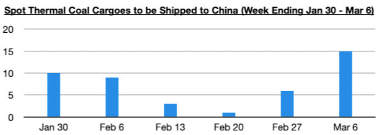

# Sudden Jump in Chinese Thermal Coal Import Demand

**Date:** March 13, 2026  
**Publisher:** Breakwave Advisors | **Category:** Market Insights  
**Original URL:** [https://www.breakwaveadvisors.com/insights/2026/3/13/sudden-jump-in-chinese-thermal-coal-import-demand](https://www.breakwaveadvisors.com/insights/2026/3/13/sudden-jump-in-chinese-thermal-coal-import-demand)  

---

*By*[*Jeffrey Landsberg*](https://www.linkedin.com/in/jeffrey-landsberg-70ab957/)

Overall dry bulk rates rose last week, with only capesize rates coming under pressure. Capesize rates remain at healthy levels, however, along with all rates. In the spot market, coal and grain cargo volume were again particularly strong. New, too, is that Chinese thermal spot coal cargo volume surged, coming in at the highest volume seen this decade. As we have discussed often in Commodore Research's Weekly Executive Reports, war and global instability lead to nations focusing much more on importing and stocking commodities. Last week saw China clearly shift to buying much more thermal coal, even as their stockpiles remain robust. Oil and all energy prices are rising, and demand for thermal coal is improving.

> **Figure 1: Στιγμιότυπο Οθόνης 2026 03 13 111349**  
> [Local Asset](file:///C:/Users/Dell/Github/Shipping/corpus/03-breakwave/insights/2026/assets/2026-03-13_sudden-jump-in-chinese-thermal-coal-import-demand_img_cea3cf84ceb9ceb3cebcceb9cf8ccf84cf85_76d5b01ab969.png)

---

**Tags:** Coal, China, Commodities  
