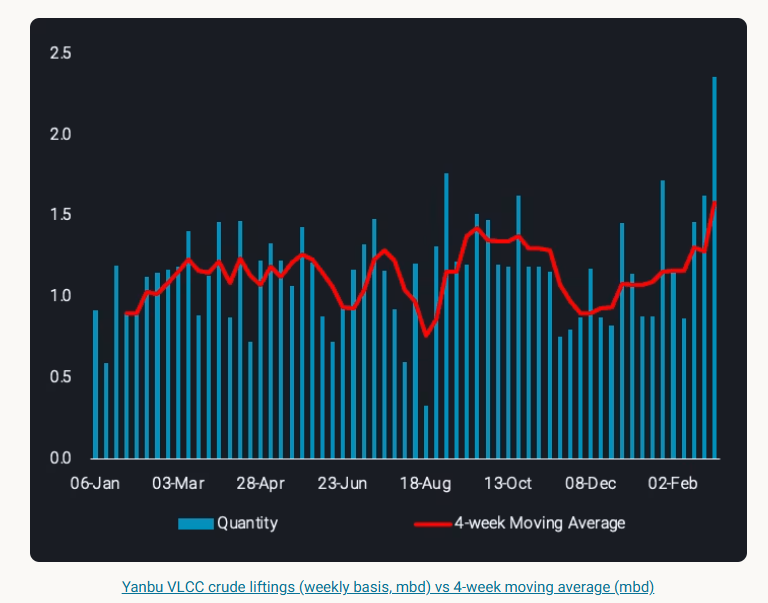
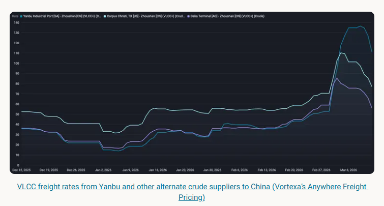

# Yanbu draws wider VLCC participation as freight rates spike

**Date:** March 13, 2026  
**Publisher:** Breakwave Advisors | **Category:** Market Insights  
**Original URL:** [https://www.breakwaveadvisors.com/insights/2026/3/13/yanbu-draws-wider-vlcc-participation-as-freight-rates-spike](https://www.breakwaveadvisors.com/insights/2026/3/13/yanbu-draws-wider-vlcc-participation-as-freight-rates-spike)  

---

Yanbu emerges as a key VLCC export hub as Aramco diversions boost liftings, widen participation and drive freight premiums to Asia

*By*[*George Morris*](https://www.linkedin.com/in/george-d-morris/)

## Participation in Yanbu VLCC Loadings Is Broadening Across Freight

In March, Saudi Aramco began diverting crude exports to Yanbu as the East-West pipeline approaches full operating capacity (7mbd, industry sources). The shift is designed to keep barrels moving while the[Strait of Hormuz remains heavily constrained](https://analytics.vortexa.com/InsightsHubPage?articleId=5GvvjOleMMfSXdNhxDFxdc&articleType=highlight&page=InsightsHubPage&searchTerm=&tabId=ecc93418-36e2-437e-b372-21e07db74316), but Yanbu’s loading limit of 4.5mbd (Argus) is well beyond Vortexa’s observed[historical peak monthly export rate of 1.5mbd in April 2020](https://analytics.vortexa.com/Flows?dateRange=2016-01-01T00%3A00%3A00.000Z__2026-03-10T23%3A59%3A59.999Z&from=%5B%22566d8842586412c83641e2277d198ed93179c352f462baccc252c9c31eb8a214%22%5D&metric=bpd&page=Flows&products=%5B%2254af755a090118dcf9b0724c9a4e9f14745c26165385ffa7f1445bc768f06f11%22%5D&tabId=ebb7de8f-cc51-43ac-a82c-8bf76f7124cc&v=3). This means it can only partially offset the lost ~13.4mbd of crude from the MEG.[Weekly VLCC liftings of crude](https://analytics.vortexa.com/Flows?dateRange=2016-01-06T00%3A00%3A00.000Z__2026-03-08T23%3A59%3A59.999Z&frequency=week&from=%5B%22566d8842586412c83641e2277d198ed93179c352f462baccc252c9c31eb8a214%22%5D&intraMovementDropdown=all&metric=bpd&page=Flows&products=%5B%2254af755a090118dcf9b0724c9a4e9f14745c26165385ffa7f1445bc768f06f11%22%5D&tabId=0caaeb34-5d68-4bcb-a931-b3010f0bbc00&timeSeriesBaselineEnd=2025-12-31T23%3A59%3A59.999Z&timeSeriesBaselineStart=2020-01-01T00%3A00%3A00.000Z×eriesMovingAvg=4w&v=3&vesselClasses=%5B%22oil_vlcc%22%5D)from Yanbu increased 740kbd w-o-w for the week commencing March 2, pushing the 4-week moving average to a dataset high.

> **Figure 1: Στιγμιότυπο Οθόνης 2026 03 13 124405**  
> **Interactive Data & Source:** [Analytics Vortexa](https://analytics.vortexa.com/VoyageCalculatorPage?page=VoyageCalculatorPage&routes=%5B%7B%22legs%22%3A%5B%7B%22ETA%22%3A%222026-03-12T15%3A38%3A06.765Z%22%2C%22ETD%22%3A%222026-03-12T15%3A38%3A06.765Z%22%2C%22speed%22%3A13%2C%22origin%22%3A%22fd23a82b21d2131804b351a6239f869f2fe795fcb7764cd1edf579ddcde5ed54%22%2C%22status%22%3A%22vessel_status_laden_known%22%2C%22isWaypoint%22%3Afalse%2C%22destination%22%3A%22b3966d858aaebac787fc42dc4a47d92d5d638d5ea277864ac4f46e23d9fe2c33%22%7D%5D%2C%22selected%22%3Afalse%2C%22vesselClass%22%3A%22oil_vlcc%22%2C%22departureTime%22%3A%222026-03-12T15%3A38%3A06.765Z%22%7D%2C%7B%22legs%22%3A%5B%7B%22ETA%22%3A%222026-03-12T15%3A36%3A02.833Z%22%2C%22ETD%22%3A%222026-03-12T15%3A36%3A02.833Z%22%2C%22speed%22%3A13%2C%22origin%22%3A%221c4edbaca4fc489efdf16d18065b2319b47310753e7606d788cf7d771046f4dd%22%2C%22status%22%3A%22vessel_status_ballast%22%2C%22isWaypoint%22%3Afalse%2C%22destination%22%3A%22d10056e8bf4109ebf0370c511953f046ff75552b3dc6ed788fcb4d5ea6b71d3f%22%7D%2C%7B%22ETA%22%3A%222026-04-06T10%3A20%3A08.241Z%22%2C%22ETD%22%3A%222026-04-06T10%3A20%3A08.241Z%22%2C%22speed%22%3A13%2C%22origin%22%3A%22d10056e8bf4109ebf0370c511953f046ff75552b3dc6ed788fcb4d5ea6b71d3f%22%2C%22status%22%3A%22vessel_status_ballast%22%2C%22isWaypoint%22%3Atrue%2C%22destination%22%3A%222dbf316be2e6049b35d7ffa169e1d65a47e4c9e8dd25bbda0c6ba387f9251aae%22%7D%2C%7B%22ETA%22%3A%222026-04-23T08%3A29%3A56.388Z%22%2C%22ETD%22%3A%222026-04-23T08%3A29%3A56.388Z%22%2C%22speed%22%3A13%2C%22origin%22%3A%222dbf316be2e6049b35d7ffa169e1d65a47e4c9e8dd25bbda0c6ba387f9251aae%22%2C%22status%22%3A%22vessel_status_ballast%22%2C%22isWaypoint%22%3Atrue%2C%22destination%22%3A%22b3966d858aaebac787fc42dc4a47d92d5d638d5ea277864ac4f46e23d9fe2c33%22%7D%5D%2C%22selected%22%3Afalse%2C%22vesselClass%22%3A%22oil_vlcc%22%2C%22departureTime%22%3A%222026-03-12T15%3A36%3A02.833Z%22%7D%2C%7B%22legs%22%3A%5B%7B%22ETA%22%3A%222026-03-05T06%3A53%3A44.830Z%22%2C%22ETD%22%3A%222026-03-05T06%3A53%3A44.830Z%22%2C%22speed%22%3A13%2C%22origin%22%3A%22b23bb5a020b542dbc144435705de4fd83de67be18e6f12fdd52e7ebdc9495ed6%22%2C%22status%22%3A%22vessel_status_laden_known%22%2C%22isWaypoint%22%3Afalse%2C%22destination%22%3A%2234810d4a19fdf3d1de110ee44732bc8671179c28426b6a29f8585fed8bffec35%22%7D%2C%7B%22ETA%22%3A%222026-03-07T11%3A21%3A55.538Z%22%2C%22ETD%22%3A%222026-03-07T11%3A21%3A55.538Z%22%2C%22speed%22%3A13%2C%22origin%22%3A%2234810d4a19fdf3d1de110ee44732bc8671179c28426b6a29f8585fed8bffec35%22%2C%22status%22%3A%22vessel_status_laden_known%22%2C%22isWaypoint%22%3Atrue%2C%22destination%22%3A%22b3966d858aaebac787fc42dc4a47d92d5d638d5ea277864ac4f46e23d9fe2c33%22%7D%5D%2C%22selected%22%3Afalse%2C%22vesselClass%22%3A%22oil_vlcc%22%2C%22departureTime%22%3A%222026-03-05T06%3A53%3A44.830Z%22%7D%5D&tabId=c179261b-824e-483c-b205-55bef34a28ee) | [Local Asset](file:///C:/Users/Dell/Github/Shipping/corpus/03-breakwave/insights/2026/assets/2026-03-13_yanbu-draws-wider-vlcc-participation-as-freight-rates-spike_img_cea3cf84ceb9ceb3cebcceb9cf8ccf84cf85_753af2f5064e.png)

Across the first 12 days of March, we tracked 13 VLCC loadings from Yanbu, all controlled by state‑aligned carriers. That concentration likely reflects the early phase of the diversion, when Yanbu was still ramping up and Aramco prioritised its own tonnage while capacity remained tight. Elevated security concerns in the Red Sea may also have kept more risk‑averse owners away, particularly given the threat environment linked to the regional conflict.

For the remainder of March, we expect 31 additional VLCC loadings, and the participation mix looks very different. State‑aligned controllers still account for the largest share at around 55%, but the balance has shifted meaningfully. A quarter of expected liftings now sit with NOC‑adjacent buyers and refiners – groups that are less risk‑averse than Western listed owners but still operate with clear compliance and insurance constraints. Their presence suggests the route is now viewed as operationally manageable.

Pools/trading houses and private operators account for a combined 16% of the forward program, adding further diversity to the pool. The most notable change, however, is the re‑entry of mainstream VLCC controllers (2 VLCC liftings). These owners are typically the first to step back when risk rises and the last to return, so their participation signals that the market sees Yanbu as a viable alternative to Hormuz rather than a high‑risk contingency lift.

Overall, Yanbu loadings have broadened well beyond the tight state‑aligned circle seen earlier in the disruption. The mix now spans NOCs, regional refiners, commercial pools, trading houses, opaque operators and mainstream listed owners. That shift points to both increased capacity and a market that is more comfortable with the operational and security profile of the Red Sea route.

## Yanbu-Asia VLCC Voyages Command Strong Freight Premiums

VLCC liftings from Yanbu to Asia are trading at a premium to alternate barrel supply sources, namely US Gulf Coast and West Africa. Reflecting the strength in preference for sour MEG barrels for Asian refiners, and both the increased demand and the current dislocation in Middle East export logistics.

The[Yanbu-China voyage](https://analytics.vortexa.com/VoyageCalculatorPage?page=VoyageCalculatorPage&routes=%5B%7B%22legs%22%3A%5B%7B%22ETA%22%3A%222026-03-12T15%3A38%3A06.765Z%22%2C%22ETD%22%3A%222026-03-12T15%3A38%3A06.765Z%22%2C%22speed%22%3A13%2C%22origin%22%3A%22fd23a82b21d2131804b351a6239f869f2fe795fcb7764cd1edf579ddcde5ed54%22%2C%22status%22%3A%22vessel_status_laden_known%22%2C%22isWaypoint%22%3Afalse%2C%22destination%22%3A%22b3966d858aaebac787fc42dc4a47d92d5d638d5ea277864ac4f46e23d9fe2c33%22%7D%5D%2C%22selected%22%3Afalse%2C%22vesselClass%22%3A%22oil_vlcc%22%2C%22departureTime%22%3A%222026-03-12T15%3A38%3A06.765Z%22%7D%2C%7B%22legs%22%3A%5B%7B%22ETA%22%3A%222026-03-12T15%3A36%3A02.833Z%22%2C%22ETD%22%3A%222026-03-12T15%3A36%3A02.833Z%22%2C%22speed%22%3A13%2C%22origin%22%3A%221c4edbaca4fc489efdf16d18065b2319b47310753e7606d788cf7d771046f4dd%22%2C%22status%22%3A%22vessel_status_ballast%22%2C%22isWaypoint%22%3Afalse%2C%22destination%22%3A%22d10056e8bf4109ebf0370c511953f046ff75552b3dc6ed788fcb4d5ea6b71d3f%22%7D%2C%7B%22ETA%22%3A%222026-04-06T10%3A20%3A08.241Z%22%2C%22ETD%22%3A%222026-04-06T10%3A20%3A08.241Z%22%2C%22speed%22%3A13%2C%22origin%22%3A%22d10056e8bf4109ebf0370c511953f046ff75552b3dc6ed788fcb4d5ea6b71d3f%22%2C%22status%22%3A%22vessel_status_ballast%22%2C%22isWaypoint%22%3Atrue%2C%22destination%22%3A%222dbf316be2e6049b35d7ffa169e1d65a47e4c9e8dd25bbda0c6ba387f9251aae%22%7D%2C%7B%22ETA%22%3A%222026-04-23T08%3A29%3A56.388Z%22%2C%22ETD%22%3A%222026-04-23T08%3A29%3A56.388Z%22%2C%22speed%22%3A13%2C%22origin%22%3A%222dbf316be2e6049b35d7ffa169e1d65a47e4c9e8dd25bbda0c6ba387f9251aae%22%2C%22status%22%3A%22vessel_status_ballast%22%2C%22isWaypoint%22%3Atrue%2C%22destination%22%3A%22b3966d858aaebac787fc42dc4a47d92d5d638d5ea277864ac4f46e23d9fe2c33%22%7D%5D%2C%22selected%22%3Afalse%2C%22vesselClass%22%3A%22oil_vlcc%22%2C%22departureTime%22%3A%222026-03-12T15%3A36%3A02.833Z%22%7D%2C%7B%22legs%22%3A%5B%7B%22ETA%22%3A%222026-03-05T06%3A53%3A44.830Z%22%2C%22ETD%22%3A%222026-03-05T06%3A53%3A44.830Z%22%2C%22speed%22%3A13%2C%22origin%22%3A%22b23bb5a020b542dbc144435705de4fd83de67be18e6f12fdd52e7ebdc9495ed6%22%2C%22status%22%3A%22vessel_status_laden_known%22%2C%22isWaypoint%22%3Afalse%2C%22destination%22%3A%2234810d4a19fdf3d1de110ee44732bc8671179c28426b6a29f8585fed8bffec35%22%7D%2C%7B%22ETA%22%3A%222026-03-07T11%3A21%3A55.538Z%22%2C%22ETD%22%3A%222026-03-07T11%3A21%3A55.538Z%22%2C%22speed%22%3A13%2C%22origin%22%3A%2234810d4a19fdf3d1de110ee44732bc8671179c28426b6a29f8585fed8bffec35%22%2C%22status%22%3A%22vessel_status_laden_known%22%2C%22isWaypoint%22%3Atrue%2C%22destination%22%3A%22b3966d858aaebac787fc42dc4a47d92d5d638d5ea277864ac4f46e23d9fe2c33%22%7D%5D%2C%22selected%22%3Afalse%2C%22vesselClass%22%3A%22oil_vlcc%22%2C%22departureTime%22%3A%222026-03-05T06%3A53%3A44.830Z%22%7D%5D&tabId=c179261b-824e-483c-b205-55bef34a28ee)is roughly 30% shorter than WAf-China routes, and 60% shorter than USGC-China. Despite this, spot charter rates from Yanbu are at a premium to alternate routes, potentially due to increased vessel supply repositioning from MEG ([USGC only](https://analytics.vortexa.com/VoyagesFlows?dateRange=2026-01-05T00%3A00%3A00.000Z__2026-03-08T23%3A59%3A59.999Z&metric=t&page=VoyagesFlows&tabId=c1e38a1c-212c-4fb5-a12e-904a91bf267e&timeSeriesBreakdown=destination-shipping-region-v2&timeSeriesFrequency=week&to=%5B%224e79eb8e84d26f5c3c0006283bc1aa52c170b58d667be9848e136afea91a57e9%22%5D&tsAnalysisSeasonalEnabled=0&vesselClasses=%5B%22oil_vlcc%22%5D&voyageStatus=%5B%22ballast%22%5D)). From March 1-12, VLCC rates on USGC-China climbed ~20% compared to 12% for WAf-China. These rates highlight the significant additional demand for Yanbu-lifting vessels, which pushed this route higher in comparison, reaching ~$127/t on March 12, a**140%**increase from March 1. ([Vortexa’s Anywhere Freight Pricing](https://analytics.vortexa.com/AnywhereFreightPricing?page=AnywhereFreightPricing&routes=%5B%5B%2268faf65af1345067f11dc6723b8da32f00e304a6f33c000118fccd81947deb4e%22%2C%22ea4921c8ad4fddb5fe3e7a4f834c1aa5863e43283c73da5f02d93bbc5dba72eb%22%2C11%2C0%2Cfalse%5D%2C%5B%227f314ba0a498c36359b1c88781e94a73e19dcc9bbb030ec6b82f944a73d4da2f%22%2C%2257a5c821cdc0d9e7187ffc242cd8afd8e86e287b725c1949c65396b575cb5d1e%22%2C11%2C0%2Cfalse%5D%2C%5B%22cd8a443669ea19a3dd5428c2970ccaeb24275d7c37d8160bf92a3b4454ec545c%22%2C%220d330ce75c77cd3ef776689eeff4bf1082dcf08de3581ae95ff5a64353d7e776%22%2C11%2C0%2Cfalse%5D%2C%5B%22a07eaa030bfe925e135a3fb62ef34113ae88ee1aee64f147b52a41eca041391a%22%2C%22bad73956b63e304b3d401e633e4e251d2ffd09dd43e192e118d1b12491754a05%22%2C12%2C0%2Cfalse%5D%2C%5B%22f228b40cec6011a4ab492245623faefef7dc38176b229f3650551ab6c247cf0b%22%2C%223206494de429dd2ee31916065b1587123272628f4b9211a1209763a1faca23b2%22%2C12%2C0%2Cfalse%5D%2C%5B%221b79e18416d358d7e07b978abcab3f17e2ca75085a6d70ce1811cf4eaeaea886%22%2C%221a309979aacce1fad7b5ebd86a687c0ec6e8c9795de6d73b1198bcbd8197ae50%22%2C13%2C1%2Cfalse%5D%2C%5B%229000d0a3461cc534d83c4867c1ba16fac6f6dc274704aa8495e03e97c98ff08d%22%2C%221b79e18416d358d7e07b978abcab3f17e2ca75085a6d70ce1811cf4eaeaea886%22%2C14%2C1%2Cfalse%5D%2C%5B%222741574a7b4535b866f152c6df6abd494fbfbe9bc15c667d0e374750907efc16%22%2C%229000d0a3461cc534d83c4867c1ba16fac6f6dc274704aa8495e03e97c98ff08d%22%2C11%2C1%2Cfalse%5D%2C%5B%220722ab14f7bdb32485654292090e43724dc75f4984a33dc80ba1d95803d3cd39%22%2C%224952adc3c79f83c3560f65797ce9cf849fe3a9ad3fddc3cd7a0085aeaa3193a8%22%2C11%2C1%2Cfalse%5D%2C%5B%22930710fe69eafadfdd226c4a9ea9eedf771a2d935b8faee92ff622cbcae7cb06%22%2C%2257a5c821cdc0d9e7187ffc242cd8afd8e86e287b725c1949c65396b575cb5d1e%22%2C13%2C2%2Cfalse%5D%2C%5B%2200723089c249c618c5a2c720875eb358b1e884b1e5501648b5bfee9e88d1df7e%22%2C%22b3966d858aaebac787fc42dc4a47d92d5d638d5ea277864ac4f46e23d9fe2c33%22%2C15%2C2%2Cfalse%5D%2C%5B%221c4edbaca4fc489efdf16d18065b2319b47310753e7606d788cf7d771046f4dd%22%2C%2268faf65af1345067f11dc6723b8da32f00e304a6f33c000118fccd81947deb4e%22%2C14%2C2%2Cfalse%5D%2C%221da2f962-9418-49e6-b7cc-d9593dbfd0a4-1%22%2C%229557b5cf-98fc-47ed-a4e2-1806dc13bf25-1%22%2C%229dcaaddf-636f-4ee1-ae45-5d6c5c1b5a79-1%22%2C%2208981233-d8c0-4c8d-bf45-91d791f79d3c-1%22%5D&routesSelected=%5B12%2C14%2C15%5D&tabId=95f3eac8-87c7-4767-b127-f8a0f6c3575b))

On a 280kt VLCC, that translates to Yanbu liftings being $12 million more expensive than USGC and $17 million more than WAf on a per‑voyage basis. Spot chart rates support this, the Baltic Exchange reported VLCC Kalamos set a record last Friday (March 6) at $770,000/day, loading at Yanbu for India’s west coast.

In short, Yanbu-Asia is currently the most expensive mainstream VLCC trade in the market, with daily returns sitting in the high‑hundreds‑of‑thousands and voyage economics reflecting both scarcity and elevated operational risk.

> **Figure 2: Στιγμιότυπο Οθόνης 2026 03 13 124443**  
> **Interactive Data & Source:** [Vortexa](https://www.vortexa.com//oil-gas-data-traders-analysts-data-scientists?gclid=Cj0KCQjw8_qRBhCXARIsAE2AtRZKOvMnbilZ_6_91d7huSFFy71pWLrnPwGwOHVzXsmsG-1a1mZnQw8aAt89EALw_wcB&hsa_acc=1782073842&hsa_ad=548425387665&hsa_cam=14746637662&hsa_grp=125038601902&hsa_kw=&hsa_mt=&hsa_net=adwords&hsa_src=g&hsa_tgt=dsa-1431852288425&hsa_ver=3&utm_campaign=%5BCD%5D%20-%20DSA%20-%20EMEA&utm_medium=cpc&utm_medium=ppc&utm_source=google&utm_source=adwords&utm_term=) | [Local Asset](file:///C:/Users/Dell/Github/Shipping/corpus/03-breakwave/insights/2026/assets/2026-03-13_yanbu-draws-wider-vlcc-participation-as-freight-rates-spike_img_cea3cf84ceb9ceb3cebcceb9cf8ccf84cf85_857f0714c046.png)

Data Source:[Vortexa](https://www.vortexa.com//oil-gas-data-traders-analysts-data-scientists?gclid=Cj0KCQjw8_qRBhCXARIsAE2AtRZKOvMnbilZ_6_91d7huSFFy71pWLrnPwGwOHVzXsmsG-1a1mZnQw8aAt89EALw_wcB&hsa_acc=1782073842&hsa_ad=548425387665&hsa_cam=14746637662&hsa_grp=125038601902&hsa_kw=&hsa_mt=&hsa_net=adwords&hsa_src=g&hsa_tgt=dsa-1431852288425&hsa_ver=3&utm_campaign=%5BCD%5D%20-%20DSA%20-%20EMEA&utm_medium=cpc&utm_medium=ppc&utm_source=google&utm_source=adwords&utm_term=)

---

**Tags:** Crude, Tankers, Markets  
